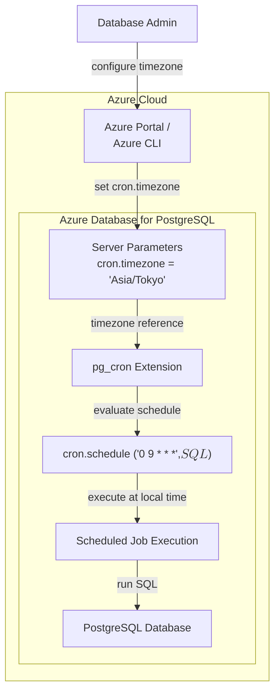

# Azure Database for PostgreSQL: pg_cron のカスタムタイムゾーンサポート (cron.timezone)

**リリース日**: 2026-03-25

**サービス**: Azure Database for PostgreSQL

**機能**: Custom time zone support for pg_cron via cron.timezone

**ステータス**: Launched (GA)

[このアップデートのインフォグラフィックを見る](https://takech9203.github.io/azure-news-summary/20260325-postgresql-pg-cron-timezone.html)

## 概要

Microsoft は、Azure Database for PostgreSQL において、pg_cron 拡張機能の `cron.timezone` サーバーパラメータを変更可能にする機能の一般提供 (GA) を発表した。pg_cron はデータベース内でスケジュールジョブを実行するための PostgreSQL 拡張機能であり、従来 `cron.timezone` パラメータは GMT 固定の読み取り専用であったが、本アップデートによりユーザーが任意のタイムゾーンに変更できるようになった。

`cron.timezone` パラメータは、pg_cron がスケジュールされたジョブを評価する際に使用するタイムゾーンを制御する。このパラメータを構成することにより、スケジュールジョブをローカルタイムゾーンに基づいて実行することが可能となり、グローバルに分散したワークロードにおけるジョブスケジューリングの柔軟性が大幅に向上する。

**アップデート前の課題**

- `cron.timezone` パラメータが GMT 固定の読み取り専用であり、変更が不可能だった
- cron スケジュールを GMT 基準で計算する必要があり、ローカルタイムゾーンとの変換が煩雑だった
- 夏時間 (DST) を採用するリージョンでは、年に 2 回 cron スケジュールの調整が必要になる場合があった

**アップデート後の改善**

- `cron.timezone` パラメータを任意のタイムゾーンに設定可能
- ローカルタイムゾーンに基づいたスケジュールジョブの実行が可能
- ビジネス時間帯に合わせたジョブスケジューリングが直感的に設定可能

## アーキテクチャ図



pg_cron は `cron.timezone` パラメータで指定されたタイムゾーンに基づいてスケジュールを評価し、ローカル時刻でジョブを実行する。管理者は Azure Portal または Azure CLI からタイムゾーンを変更できる。

## サービスアップデートの詳細

### 主要機能

1. **cron.timezone パラメータの変更サポート**
   - サーバーパラメータとして `cron.timezone` を任意のタイムゾーン (IANA タイムゾーン名) に設定可能
   - 従来の GMT 固定から、ユーザーのビジネス要件に合わせたタイムゾーンに変更可能

2. **ローカルタイムゾーン基準のジョブスケジューリング**
   - pg_cron がスケジュールを評価する際、設定されたタイムゾーンを基準に実行タイミングを判定
   - cron 式 (例: `0 9 * * *`) がローカル時刻の午前 9 時として解釈される

## 技術仕様

| 項目 | 詳細 |
|------|------|
| パラメータ名 | `cron.timezone` |
| カテゴリ | Customized Options |
| データ型 | enumeration |
| デフォルト値 | `GMT` |
| パラメータ種別 | 変更可能 (本アップデートにより読み取り専用から変更) |
| 関連パラメータ | `cron.database_name` (デフォルト: postgres)、`cron.max_running_jobs` (デフォルト: 32) |

## 設定方法

### 前提条件

1. Azure Database for PostgreSQL Flexible Server インスタンスが作成済みであること
2. pg_cron 拡張機能が `azure.extensions` パラメータで許可リストに追加されていること
3. pg_cron 拡張機能が `shared_preload_libraries` に追加されていること

### Azure CLI

```bash
# pg_cron を許可リストに追加
az postgres flexible-server parameter set \
    --resource-group <ResourceGroupName> \
    --server-name <ServerName> \
    --name azure.extensions \
    --value pg_cron

# cron.timezone パラメータを変更
az postgres flexible-server parameter set \
    --resource-group <ResourceGroupName> \
    --server-name <ServerName> \
    --name cron.timezone \
    --value "Asia/Tokyo"
```

### Azure Portal

1. Azure Portal で Azure Database for PostgreSQL Flexible Server インスタンスを選択
2. **設定** セクションから **サーバーパラメーター** を選択
3. 検索フィルターで `cron.timezone` を検索
4. ドロップダウンから目的のタイムゾーンを選択
5. **保存** をクリック

## メリット

### ビジネス面

- ビジネス時間帯に合わせたメンテナンスジョブやレポート生成のスケジューリングが容易
- グローバル展開しているアプリケーションにおいて、各リージョンのローカル時間に合わせたジョブ管理が可能
- GMT との時差計算が不要になり、スケジュール設定ミスのリスクが低減

### 技術面

- cron 式がローカルタイムゾーンで直感的に記述可能
- 夏時間 (DST) の変更に応じた手動調整が不要 (タイムゾーン設定で自動対応)
- 既存の pg_cron ジョブの cron 式を変更する必要なく、タイムゾーン変更のみで対応可能

## デメリット・制約事項

- パラメータ変更後、既存のスケジュール済みジョブの実行タイミングが変わるため、移行時には注意が必要
- サーバー全体で単一のタイムゾーン設定となるため、異なるタイムゾーンのジョブを混在させる場合は cron 式側での調整が必要
- `cron.timezone` はサーバーパラメータであるため、変更にはサーバーの再起動が必要となる場合がある

## ユースケース

### ユースケース 1: 日本時間でのデータ集計ジョブ

**シナリオ**: 日本のビジネス向けに Azure Database for PostgreSQL を運用しており、毎日午前 2 時 (JST) にデータ集計ジョブを実行したい場合。

**実装例**:

```sql
-- cron.timezone を Asia/Tokyo に設定済みの場合
SELECT cron.schedule(
    'daily-aggregation',
    '0 2 * * *',
    $$DELETE FROM temp_data WHERE created_at < now() - interval '30 days'$$
);
```

**効果**: GMT 基準での逆算 (JST 02:00 = GMT 17:00 前日) が不要となり、直感的な時刻指定でジョブをスケジュールできる。

### ユースケース 2: 欧州ビジネス時間帯でのレポート生成

**シナリオ**: 欧州のユーザー向けに、毎朝ヨーロッパ中央時間 (CET) の午前 8 時にレポートを自動生成したい場合。

**実装例**:

```sql
-- cron.timezone を Europe/Berlin に設定済みの場合
SELECT cron.schedule(
    'morning-report',
    '0 8 * * 1-5',
    $$INSERT INTO reports (report_date, data) SELECT current_date, generate_report()$$
);
```

**効果**: 夏時間 (CEST) と冬時間 (CET) の切り替わりに関わらず、常にローカルの午前 8 時にジョブが実行される。

## 料金

pg_cron 拡張機能および `cron.timezone` パラメータの利用に対する追加料金は発生しない。Azure Database for PostgreSQL Flexible Server の通常の料金体系 (コンピューティング、ストレージ、バックアップ) が適用される。

## 関連サービス・機能

- **[pg_cron 拡張機能](https://github.com/citusdata/pg_cron)**: PostgreSQL 内でスケジュールジョブを管理するための拡張機能。本アップデートの対象
- **[Azure Database for PostgreSQL サーバーパラメータ](https://learn.microsoft.com/azure/postgresql/flexible-server/concepts-server-parameters)**: サーバーパラメータの管理と構成に関するドキュメント
- **[Azure Automation](https://learn.microsoft.com/azure/automation/overview)**: データベース外部でのスケジュールタスク管理が必要な場合の代替ソリューション

## 参考リンク

- [インフォグラフィック](https://takech9203.github.io/azure-news-summary/20260325-postgresql-pg-cron-timezone.html)
- [公式アップデート情報](https://azure.microsoft.com/updates?id=558870)
- [pg_cron GitHub リポジトリ](https://github.com/citusdata/pg_cron)
- [Microsoft Learn - Azure Database for PostgreSQL サーバーパラメータ (cron.timezone)](https://learn.microsoft.com/azure/postgresql/flexible-server/server-parameters-table-customized-options)
- [Microsoft Learn - 拡張機能の許可リスト設定](https://learn.microsoft.com/azure/postgresql/extensions/how-to-allow-extensions)

## まとめ

Azure Database for PostgreSQL における `cron.timezone` パラメータのカスタマイズサポートは、pg_cron を利用したスケジュールジョブの運用を大幅に改善するアップデートである。従来 GMT 固定であったタイムゾーン設定が変更可能になったことで、ローカルタイムゾーンに基づく直感的なジョブスケジューリングが実現された。

特に、日本やヨーロッパなど GMT と大きな時差があるリージョンでデータベースを運用しているユーザーにとっては、cron 式の記述が直感的になり、設定ミスのリスクが低減される実用的な改善である。pg_cron を利用中のユーザーは、サーバーパラメータの `cron.timezone` をビジネス要件に合わせたタイムゾーンに変更することを推奨する。

---

**タグ**: #Azure #PostgreSQL #AzureDatabaseForPostgreSQL #pgcron #cron #timezone #FlexibleServer #GA #Databases
