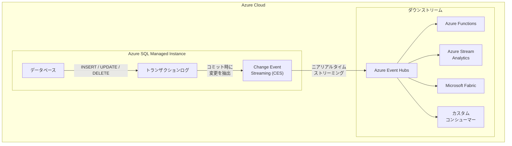

# Azure SQL Managed Instance: Change Event Streaming (CES) パブリックプレビュー

**リリース日**: 2026-03-25

**サービス**: Azure SQL Managed Instance

**機能**: Change Event Streaming (CES)

**ステータス**: Launched (GA)

[このアップデートのインフォグラフィックを見る](https://takech9203.github.io/azure-news-summary/20260325-sql-managed-instance-change-event-streaming.html)

## 概要

Azure SQL Managed Instance において、行レベルのデータ変更 (INSERT、UPDATE、DELETE) を Azure Event Hubs にニアリアルタイムでストリーミングできる Change Event Streaming (CES) 機能がパブリックプレビューとして発表された。

CES は、SQL がトランザクションのコミット時に変更をパブリッシュする仕組みで、従来の変更データキャプチャ (CDC) やポーリングベースのアプローチと比較して、レイテンシを大幅に削減しつつ、データベースへの負荷を最小限に抑える。これにより、データベースの変更をイベント駆動型のアーキテクチャに効率的に統合することが可能となる。

**アップデート前の課題**

- データベースの変更をダウンストリームシステムに伝搬するには、CDC テーブルへのポーリングや独自のトリガーベースの仕組みが必要だった
- ポーリング方式ではレイテンシが高く、リアルタイム性の要件を満たすことが困難だった
- 外部の Change Data Capture ツール (Debezium 等) の導入・運用には追加の管理コストが発生していた
- データベースのトランザクションログからの変更抽出は、パフォーマンスへの影響が懸念されていた

**アップデート後の改善**

- トランザクションコミット時に自動的に変更イベントが Azure Event Hubs にパブリッシュされ、低レイテンシでの変更伝搬が実現する
- マネージドサービスとして提供されるため、外部ツールの導入・運用が不要になる
- Azure Event Hubs を介して、Azure Functions、Azure Stream Analytics、Microsoft Fabric など多様なダウンストリームサービスとの統合が容易になる
- SQL エンジンに組み込まれた機能のため、データベースへの追加負荷が最小化される

## アーキテクチャ図

この図は、Azure SQL Managed Instance のデータベースで発生した行レベルの変更が、トランザクションのコミットをトリガーとして CES により Azure Event Hubs にストリーミングされ、各種ダウンストリームサービスで消費される流れを示している。

## サービスアップデートの詳細

### 主要機能

1. **行レベルの変更ストリーミング**
   - INSERT、UPDATE、DELETE の各操作をイベントとして Azure Event Hubs にストリーミングする
   - トランザクションのコミット時に変更がパブリッシュされるため、一貫性のある変更通知が保証される

2. **ニアリアルタイムの低レイテンシ配信**
   - トランザクションログからの変更抽出がコミット時に行われるため、従来のポーリング方式と比較して大幅にレイテンシが低減される

3. **Azure Event Hubs との統合**
   - イベントの配信先として Azure Event Hubs を使用し、Event Hubs のスケーラビリティとパーティショニング機能を活用可能
   - Event Hubs を介した多様なダウンストリームサービスとの接続が可能

4. **データベース負荷の最小化**
   - SQL エンジンに組み込まれたネイティブ機能であり、外部エージェントやポーリングプロセスが不要
   - データベースのパフォーマンスへの影響を最小限に抑えた設計

## 技術仕様

| 項目 | 詳細 |
|------|------|
| 機能名 | Change Event Streaming (CES) |
| ステータス | パブリックプレビュー |
| 対象サービス | Azure SQL Managed Instance |
| イベント配信先 | Azure Event Hubs |
| 対象操作 | INSERT, UPDATE, DELETE |
| 配信タイミング | トランザクションコミット時 |
| カテゴリ | Databases, Hybrid + multicloud |

## メリット

### ビジネス面

- イベント駆動型アーキテクチャへの移行が容易になり、リアルタイムデータ活用の幅が広がる
- 外部 CDC ツールの導入・管理コストを削減できる
- データパイプラインのレイテンシ低減により、ビジネスインテリジェンスやオペレーショナル分析の即時性が向上する

### 技術面

- マネージドサービスとして提供されるため、インフラストラクチャの運用負荷が軽減される
- Azure Event Hubs のエコシステム (Azure Functions, Stream Analytics, Fabric 等) との統合が容易
- トランザクションの一貫性が保証された変更イベントの配信が実現する
- ポーリング不要のプッシュ型アーキテクチャにより、不要なリソース消費が削減される

## デメリット・制約事項

- パブリックプレビュー段階であり、プロダクション環境での利用は推奨されない
- イベント配信先は Azure Event Hubs に限定される (直接的な他サービスへのストリーミングは不可)
- Event Hubs の料金が別途発生する
- プレビュー期間中は機能の変更や制約の追加が行われる可能性がある

## ユースケース

### ユースケース 1: リアルタイムデータ同期

**シナリオ**: Azure SQL Managed Instance のマスターデータの変更を、Microsoft Fabric のデータウェアハウスや分析基盤にニアリアルタイムで反映したい。

**効果**: CES を利用することで、バッチ処理ベースの ETL パイプラインでは実現できなかった低レイテンシのデータ同期が可能となり、分析データの鮮度が大幅に向上する。

### ユースケース 2: イベント駆動型の業務プロセス自動化

**シナリオ**: 受注テーブルへの INSERT をトリガーとして、在庫管理システムへの通知や顧客への確認メール送信を自動的に実行したい。

**効果**: CES と Azure Functions を組み合わせることで、データベースの変更をトリガーとした業務プロセスの自動化がシンプルなアーキテクチャで実現できる。

### ユースケース 3: 監査とコンプライアンス

**シナリオ**: 規制要件に基づき、特定テーブルへの全変更操作を外部の監査ログストアにリアルタイムで記録する必要がある。

**効果**: CES により行レベルの変更がイベントとしてストリーミングされるため、包括的な監査証跡をニアリアルタイムで構築できる。

## 関連サービス・機能

- **Azure Event Hubs**: CES の変更イベントの配信先となるメッセージングサービス。大規模なイベントストリームの取り込みと処理を実現する
- **Azure SQL Database**: 同じ SQL ファミリーのサービス。今後 CES が Azure SQL Database にも拡張される可能性がある
- **Change Data Capture (CDC)**: SQL Server / Azure SQL の既存の変更データキャプチャ機能。CES はこれを補完するストリーミング指向のアプローチを提供する
- **Microsoft Fabric**: CES からのイベントを活用したリアルタイム分析基盤として統合可能

## 参考リンク

- [インフォグラフィック](https://takech9203.github.io/azure-news-summary/20260325-sql-managed-instance-change-event-streaming.html)
- [公式アップデート情報](https://azure.microsoft.com/updates?id=558884)

## まとめ

Azure SQL Managed Instance の Change Event Streaming (CES) は、データベースの行レベル変更をニアリアルタイムで Azure Event Hubs にストリーミングするネイティブ機能であり、イベント駆動型アーキテクチャの構築を大幅に簡素化する。従来の CDC やポーリングベースのアプローチと比較して、低レイテンシかつ低負荷での変更データ配信が実現される。

Solutions Architect への推奨アクションとして、パブリックプレビュー段階である現時点では、まず非本番環境で CES の動作を検証し、レイテンシ特性やイベントフォーマットを把握することを推奨する。特にリアルタイムデータ同期やイベント駆動型の業務プロセス自動化のユースケースがある環境では、GA に向けた評価を早期に開始することが望ましい。

---

**タグ**: #Azure #SQLManagedInstance #ChangeEventStreaming #CES #EventHubs #CDC #RealTimeData #PublicPreview
