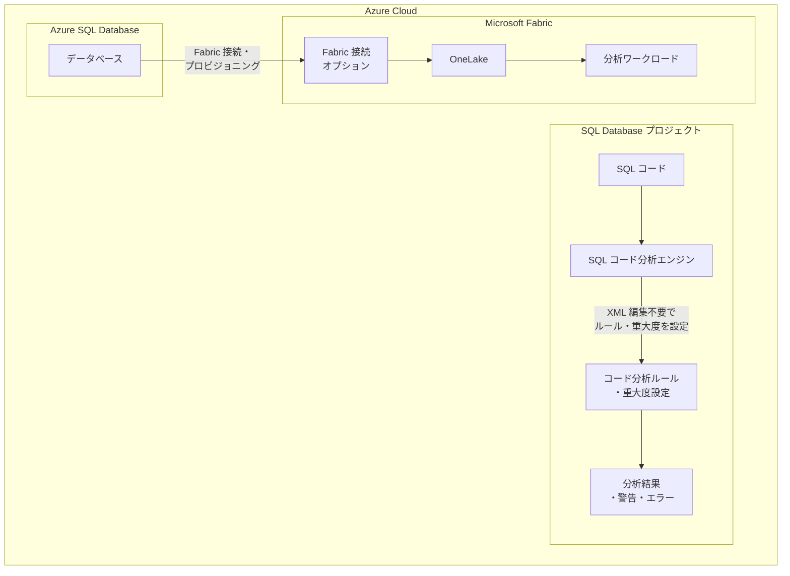

# Azure SQL Database: 2026 年 3 月下旬のアップデート

**リリース日**: 2026-03-26

**サービス**: Azure SQL Database

**機能**: SQL コード分析ルール設定の改善、Fabric 接続・プロビジョニングオプション

**ステータス**: Launched (GA)

[このアップデートのインフォグラフィックを見る](https://takech9203.github.io/azure-news-summary/20260326-sql-late-march-updates.html)

## 概要

2026 年 3 月下旬に Azure SQL に対して複数のアップデートと機能強化が一般提供 (GA) として発表された。主な更新内容は、SQL データベースプロジェクトにおける組み込みの SQL コード分析ルールおよび重大度設定をプロジェクト XML を編集することなく構成できる機能と、Microsoft Fabric との接続・プロビジョニングオプションの提供である。

これらのアップデートにより、SQL 開発者のコード品質管理ワークフローが簡素化されるとともに、Azure SQL Database と Microsoft Fabric 間の統合がより容易になる。

**アップデート前の課題**

- SQL コード分析ルールや重大度設定を変更するには、プロジェクト XML ファイルを直接編集する必要があり、設定ミスやメンテナンスの煩雑さが課題だった
- Azure SQL Database と Microsoft Fabric の接続には、個別の設定手順が必要であった

**アップデート後の改善**

- 組み込みの SQL コード分析ルールおよび重大度設定を、プロジェクト XML を編集せずに構成可能になった
- Fabric 接続・プロビジョニングオプションにより、Azure SQL 環境と Microsoft Fabric 機能をより簡単に接続できるようになった

## アーキテクチャ図

この図は、SQL コード分析ルールの設定簡素化と、Azure SQL Database から Microsoft Fabric への接続・プロビジョニングオプションの 2 つの主要アップデートの構成を示している。

## サービスアップデートの詳細

### 主要機能

1. **SQL コード分析ルール・重大度設定の GUI 構成**
   - SQL データベースプロジェクトにおいて、組み込みの SQL コード分析ルールおよび重大度レベルをプロジェクト XML を直接編集することなく構成できるようになった
   - これにより、開発者はコード品質基準の管理をより直感的かつ効率的に行うことが可能となる
   - XML 編集に伴う設定ミスのリスクが軽減される

2. **Fabric 接続・プロビジョニングオプション**
   - Azure SQL 環境から Microsoft Fabric への接続・プロビジョニングオプションが提供された
   - Microsoft Fabric の SQL database は Azure SQL Database と同じ SQL Database Engine を基盤としており、OneLake への自動データレプリケーション機能により分析ワークロードとの統合が実現される
   - Fabric との統合により、データエンジニアリング、データサイエンス、Power BI レポートなど多様な分析シナリオが利用可能になる

## 技術仕様

| 項目 | 詳細 |
|------|------|
| アップデート名 | Azure SQL updates for late-March 2026 |
| ステータス | 一般提供 (GA) |
| 対象サービス | Azure SQL Database |
| リリース日 | 2026-03-26 |
| カテゴリ | Databases, Hybrid + multicloud, Features |

## メリット

### ビジネス面

- SQL コード分析ルールの設定簡素化により、開発チームの生産性が向上する
- Fabric 統合オプションにより、既存の Azure SQL Database データを分析基盤で迅速に活用できるようになる
- XML 手動編集の排除により、設定ミスに起因するデプロイ失敗のリスクが低減される

### 技術面

- プロジェクト XML を直接編集する必要がなくなり、コード品質管理のワークフローが簡素化される
- Microsoft Fabric との接続・プロビジョニングが標準オプションとして提供されることで、OLTP データと分析ワークロードの統合が容易になる
- OneLake への自動レプリケーションにより、分析用データの準備にかかる手間が削減される

## デメリット・制約事項

- RSS フィードから取得可能な情報が限定的であり、各機能の詳細な構成手順や制約については公式ドキュメントの確認が必要
- Fabric 接続を利用するには、Microsoft Fabric のキャパシティが別途必要となる

## ユースケース

### ユースケース 1: SQL データベースプロジェクトの品質管理強化

**シナリオ**: 大規模な SQL データベースプロジェクトで、チーム全体のコーディング標準を統一し、コード品質ルールの重大度をプロジェクト要件に合わせてカスタマイズしたい。

**効果**: XML 編集なしでルールと重大度を構成できるため、開発者全員が統一されたコード品質基準を容易に適用でき、レビュープロセスの効率化とコード品質の向上が期待できる。

### ユースケース 2: Azure SQL Database データの Fabric 分析基盤への統合

**シナリオ**: 運用中の Azure SQL Database のトランザクションデータを Microsoft Fabric の分析基盤に統合し、Power BI によるリアルタイムレポートやデータサイエンスワークロードに活用したい。

**効果**: Fabric 接続・プロビジョニングオプションにより、Azure SQL Database から OneLake へのデータレプリケーションが簡素化され、OLTP ワークロードに影響を与えずに分析基盤との統合が実現できる。

## 関連サービス・機能

- **Microsoft Fabric SQL database**: Azure SQL Database と同じ SQL Database Engine を基盤とし、Fabric ワークスペース内でトランザクショナルデータベースを提供するサービス
- **OneLake**: Microsoft Fabric の統合データレイク。Azure SQL Database のデータが自動的にレプリケーションされ、分析ワークロードで利用可能になる
- **SQL Database Projects**: SQL データベースの開発・デプロイを管理するプロジェクト形式。今回のアップデートでコード分析ルールの設定が改善された
- **Azure SQL Managed Instance**: Azure SQL ファミリーの別サービス。類似のアップデートが今後適用される可能性がある

## 参考リンク

- [インフォグラフィック](https://takech9203.github.io/azure-news-summary/20260326-sql-late-march-updates.html)
- [公式アップデート情報](https://azure.microsoft.com/updates?id=558879)
- [Azure SQL Database の新機能 (What's new)](https://learn.microsoft.com/en-us/azure/azure-sql/database/doc-changes-updates-release-notes-whats-new?view=azuresql)
- [Microsoft Fabric SQL database 概要](https://learn.microsoft.com/en-us/fabric/database/sql/overview)

## まとめ

2026 年 3 月下旬の Azure SQL アップデートでは、SQL コード分析ルール・重大度設定のプロジェクト XML 編集不要な構成と、Microsoft Fabric 接続・プロビジョニングオプションの 2 つの機能強化が一般提供となった。前者は SQL 開発者のコード品質管理ワークフローを簡素化し、後者は Azure SQL Database と Microsoft Fabric 分析基盤の統合を容易にする。

Solutions Architect への推奨アクションとして、SQL データベースプロジェクトを使用している環境では、コード分析ルールの構成方法を XML 直接編集から新しい設定方式に移行することを推奨する。また、Azure SQL Database のデータを分析ワークロードに活用するニーズがある場合は、Fabric 接続オプションの評価を開始し、OneLake を介したデータ統合のアーキテクチャを検討することが望ましい。

---

**タグ**: #Azure #AzureSQLDatabase #SQLCodeAnalysis #MicrosoftFabric #OneLake #DatabaseDevOps #GA
