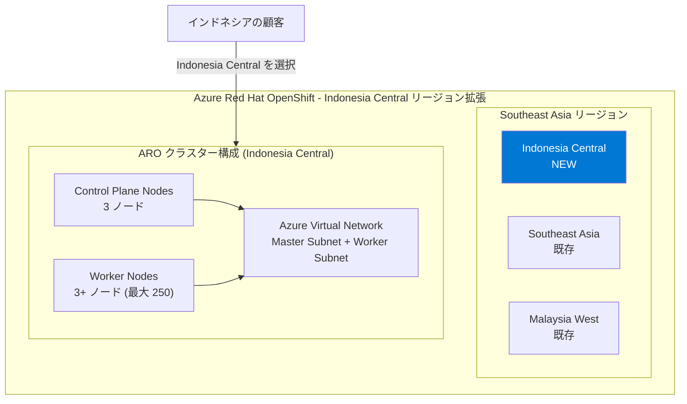

# Azure Red Hat OpenShift: Indonesia Central リージョンで一般提供開始

**リリース日**: 2026-03-30

**サービス**: Azure Red Hat OpenShift

**機能**: Indonesia Central リージョンでの一般提供 (GA)

**ステータス**: Launched (GA)

[このアップデートのインフォグラフィックを見る](https://takech9203.github.io/azure-news-summary/20260330-aro-indonesia-central.html)

## 概要

Azure Red Hat OpenShift (ARO) が、新たに Indonesia Central リージョンで一般提供 (GA) を開始した。これにより、インドネシアおよび東南アジア地域における ARO のリージョン可用性がさらに強化され、ミッションクリティカルな OpenShift ワークロードを Azure 上で実行する顧客にとって、より近接したリージョンの選択肢が追加された。

Azure Red Hat OpenShift は、Red Hat と Microsoft が共同でエンジニアリング・運用・サポートを行うフルマネージドの OpenShift サービスである。シングルテナントで高可用性の Kubernetes クラスターを Azure 上に提供し、コントロールプレーン、インフラストラクチャノード、アプリケーションノードのパッチ適用・更新・監視を Red Hat と Microsoft が代行する。今回のリージョン拡張により、データレジデンシー要件を持つインドネシアの顧客が、自国内のリージョンで ARO クラスターを運用できるようになる。

**アップデート前の課題**

- インドネシアの顧客は ARO を利用するために地理的に離れたリージョン（例: Southeast Asia）にクラスターをデプロイする必要があり、レイテンシが高くなる場合があった
- インドネシア国内のデータレジデンシー要件やコンプライアンス規制への対応が困難だった
- 東南アジア地域でのディザスタリカバリ構成において、インドネシア国内のリージョン選択肢がなかった

**アップデート後の改善**

- Indonesia Central でのローカルデプロイが可能となり、インドネシア国内のエンドユーザーへのレイテンシが大幅に低減される
- インドネシアのデータレジデンシー要件に準拠した ARO クラスター運用が可能になった
- 東南アジア地域でのマルチリージョン構成やディザスタリカバリの選択肢が拡大した

## アーキテクチャ図

この図は、今回新たに追加された Indonesia Central リージョンと、東南アジア地域の既存リージョンとの関係を示している。各リージョンで ARO クラスターは Control Plane ノードと Worker ノード、専用の Virtual Network で構成される。

## サービスアップデートの詳細

### 主要機能

1. **Indonesia Central リージョンでの一般提供 (GA)**
   - インドネシア国内で初の ARO 提供リージョン
   - ミッションクリティカルな OpenShift ワークロードのローカル実行が可能に

2. **フルマネージドの OpenShift サービス**
   - Red Hat と Microsoft による共同エンジニアリング・運用・サポート
   - コントロールプレーン、インフラストラクチャノード、アプリケーションノードのパッチ適用・更新・監視を代行
   - 仮想マシンの手動運用やパッチ適用が不要

3. **エンタープライズグレードの Kubernetes 環境**
   - シングルテナント・高可用性クラスター
   - Microsoft Entra ID との統合認証
   - Kubernetes RBAC によるアクセス制御

## 技術仕様

| 項目 | 詳細 |
|------|------|
| サービス種別 | フルマネージド OpenShift (Kubernetes) |
| 最小コア数 | 44 コア（ブートストラップ 8 + Control Plane 24 + Worker 12） |
| 運用時コア数 | 36 コア（ブートストラップ削除後） |
| 最大 Worker ノード数 | 250 ノード |
| デフォルト Master VM サイズ | Standard D8s_v5 |
| デフォルト Worker VM サイズ | Standard D4s_v5 |
| SLA | 99.95% |
| クラスター作成時間 | 約 45 分 |
| 認証統合 | Microsoft Entra ID |
| ネットワーク要件 | 仮想ネットワークに 2 つの空サブネット（Master 用、Worker 用） |

## メリット

### ビジネス面

- **データレジデンシー要件への対応**: インドネシア国内でデータを処理・保存できるため、現地のデータ保護規制への準拠が容易になる
- **レイテンシの低減による UX 向上**: インドネシア国内の顧客やエンドユーザーに対して低レイテンシのサービス提供が可能になり、ビジネスアプリケーションの応答性が向上する
- **東南アジア市場への展開促進**: インドネシアは東南アジア最大の経済圏であり、コンテナベースのアプリケーションをこの成長市場に迅速にデプロイできる

### 技術面

- **マルチリージョン構成の拡充**: Southeast Asia や Malaysia West との組み合わせにより、東南アジア地域でのディザスタリカバリやマルチリージョンデプロイメントの選択肢が増加する
- **フルマネージドのインフラ運用**: コントロールプレーンの運用・保守を Red Hat と Microsoft に委任でき、アプリケーション開発に集中できる
- **Azure サービスとの統合**: Indonesia Central でも Microsoft Entra ID、Azure Monitor、Azure Container Registry など、Azure のエコシステムと統合された OpenShift 環境を利用できる

## デメリット・制約事項

- 新リージョンでは ARO で利用可能な VM サイズが既存リージョンと比較して制限される場合がある。デプロイ前に利用可能なバージョンと VM サイズを確認すること
- 最小 44 コアの vCPU クォータが必要であり、新規サブスクリプションではクォータ増加申請が必要になる場合がある
- クラスター作成に約 45 分を要する
- 新リージョンの料金は既存リージョンと異なる場合がある

## 料金

Azure Red Hat OpenShift はコンポーネントベースの課金モデルを採用しており、クラスターリソース（コンピューティング、ネットワーク、ストレージ）は実際の使用量に基づいて課金される。

| 項目 | 説明 |
|------|------|
| Control Plane ノード | Azure Virtual Machines の標準 Linux VM 料金（OpenShift ライセンス込み） |
| Worker ノード | Linux VM 料金 + OpenShift ライセンス料 |
| 購入オプション | 従量課金制、またはリザーブドインスタンス |

※ 料金はリージョンにより異なる場合がある。Indonesia Central の正確な料金は [Azure Red Hat OpenShift 料金ページ](https://azure.microsoft.com/pricing/details/openshift/) を参照。別途 Red Hat との契約は不要で、Azure の課金に含まれる。

## 利用可能リージョン

今回のアップデートにより、以下のリージョンが新たに追加された。

| リージョン | 地域 | ステータス |
|----------|------|----------|
| Indonesia Central | 東南アジア | **新規追加** |

ARO が利用可能な全リージョンの一覧は [Azure リージョン別利用可能サービス](https://azure.microsoft.com/global-infrastructure/services/?products=openshift) を参照。

## 関連サービス・機能

- **Azure Kubernetes Service (AKS)**: Azure のマネージド Kubernetes サービス。ARO は OpenShift ベースの Kubernetes サービスであり、Red Hat エコシステムとの統合が必要な場合に適している
- **Azure Container Registry (ACR)**: ARO クラスターと統合可能なコンテナイメージレジストリ
- **Microsoft Entra ID**: ARO クラスターの認証基盤として統合。RBAC と組み合わせたアクセス制御を提供
- **Azure Monitor**: ARO クラスターの監視とログ収集。Container Insights によるコンテナワークロードの可視化が可能
- **Azure Virtual Network**: ARO クラスターのネットワーク基盤。Master サブネットと Worker サブネットの 2 つの空サブネットが必要

## 参考リンク

- [インフォグラフィック](https://takech9203.github.io/azure-news-summary/20260330-aro-indonesia-central.html)
- [公式アップデート情報](https://azure.microsoft.com/updates?id=559552)
- [Microsoft Learn - Azure Red Hat OpenShift ドキュメント](https://learn.microsoft.com/en-us/azure/openshift/)
- [Microsoft Learn - Azure Red Hat OpenShift の概要](https://learn.microsoft.com/en-us/azure/openshift/intro-openshift)
- [Microsoft Learn - ARO クラスターの作成](https://learn.microsoft.com/en-us/azure/openshift/create-cluster)
- [料金ページ](https://azure.microsoft.com/pricing/details/openshift/)
- [Azure Red Hat OpenShift SLA](https://azure.microsoft.com/support/legal/sla/openshift/v1_0/)
- [リージョン別利用可能サービス](https://azure.microsoft.com/global-infrastructure/services/?products=openshift)

## まとめ

Azure Red Hat OpenShift の Indonesia Central リージョンへの拡張は、東南アジア最大の経済圏であるインドネシアにおけるエンタープライズ Kubernetes ワークロードのデプロイ選択肢を広げる重要なアップデートである。特にデータレジデンシー要件を持つインドネシアの顧客にとって、自国リージョンでフルマネージドの OpenShift 環境を利用できるようになった意義は大きい。

Solutions Architect への推奨アクション:

1. **リージョン選定の見直し**: インドネシアおよび東南アジア地域のワークロードについて、Indonesia Central リージョンの利用を検討する。特にレイテンシ要件やデータレジデンシー要件がある場合は優先的に評価すること
2. **クォータの事前確認**: Indonesia Central での ARO デプロイに必要な vCPU クォータ（最小 44 コア）を事前に確認し、必要に応じて増加申請を行う
3. **DR 構成の再評価**: 既存の ARO クラスターに対するディザスタリカバリ戦略を見直し、Indonesia Central をセカンダリサイトとして活用できるか検討する
4. **料金の確認**: Indonesia Central リージョンの料金体系を確認し、既存リージョンとのコスト比較を行う

---

**タグ**: #AzureRedHatOpenShift #Containers #Kubernetes #OpenShift #RegionalExpansion #IndonesiaCentral #SoutheastAsia #GA #OpenSource
