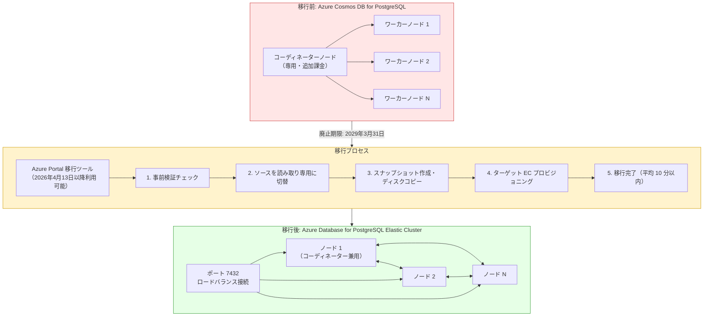

# Azure Cosmos DB for PostgreSQL: 2029 年 3 月 31 日での廃止と Azure Database for PostgreSQL Elastic Cluster への移行

**リリース日**: 2026-03-30

**サービス**: Azure Cosmos DB for PostgreSQL

**機能**: サービス廃止と Azure Database for PostgreSQL Elastic Cluster への移行

**ステータス**: Retirement

[このアップデートのインフォグラフィックを見る](https://takech9203.github.io/azure-news-summary/20260330-cosmosdb-postgresql-retirement.html)

## 概要

Azure Cosmos DB for PostgreSQL は 2029 年 3 月 31 日に廃止される。ユーザーはその日までに Azure Database for PostgreSQL Elastic Cluster へ移行する必要がある。Azure Database for PostgreSQL Elastic Cluster は、同等の分散 PostgreSQL 機能を提供する後継サービスであり、Citus 拡張機能をベースとした水平スケーリング機能をそのまま利用できる。

**アップデート前の課題**

- Azure Cosmos DB for PostgreSQL は今後新機能の追加が限定的となり、廃止パスに入っている
- 専用コーディネーターノードに追加コストが発生する料金モデル
- クエリアクセスがコーディネーターノードに限定される
- PostgreSQL の最新バージョン（17/18）がサポートされない

**アップデート後の改善**

- Azure Database for PostgreSQL Elastic Cluster は Flexible Server 上に構築され、継続的な投資と機能強化が行われる
- 専用コーディネーターノードの追加料金が不要となり、コスト構造がシンプルになる
- 任意のノードからクエリを実行可能となり、運用の柔軟性が向上する
- PostgreSQL 17/18 を含む最新バージョンがサポートされる

## アーキテクチャ図

上図は、Azure Cosmos DB for PostgreSQL から Azure Database for PostgreSQL Elastic Cluster への移行パスを示している。移行前のアーキテクチャでは専用コーディネーターノードが必要だったが、移行後は全ノードが対等に接続され、ポート 7432 を使用したロードバランス接続も可能となる。

## サービスアップデートの詳細

### 廃止タイムライン

| 日付 | イベント |
|------|---------|
| 2026 年 3 月 30 日 | 廃止アナウンス |
| 2026 年 4 月 13 日 | Azure Portal に移行ツールとリマインダーポップアップが利用可能に |
| 2029 年 3 月 31 日 | Azure Cosmos DB for PostgreSQL の廃止日 |

### 移行先の選択

| ワークロードタイプ | 推奨移行先 |
|-------------------|-----------|
| PostgreSQL ワークロード | Azure Database for PostgreSQL Elastic Cluster |
| NoSQL ワークロード | Azure Cosmos DB for NoSQL |

### Elastic Cluster の主な優位点

- **専用コーディネーター不要**: 別途課金されるコーディネーターノードが不要となり、ベースラインコストを削減
- **任意ノードからのクエリ実行**: すべてのノードからクエリアクセスが可能で、運用の柔軟性が向上
- **最新 PostgreSQL バージョン対応**: PostgreSQL 17/18 をサポート
- **Flexible Server 基盤**: バックアップ、監視、メンテナンス制御など Flexible Server の運用モデルを継承
- **Managed Identity / Microsoft Entra ID 認証**: エンタープライズ ID 管理との統合が強化
- **PgBouncer サポート**: 接続プーリングが利用可能
- **最大接続数の向上**: ノードあたり最大 3,000 接続（従来は最大 2,500）

## 技術仕様

### 機能パリティ比較

| 機能 | Cosmos DB for PostgreSQL | Elastic Cluster |
|------|------------------------|-----------------|
| ベース技術 | PostgreSQL + Citus | PostgreSQL + Citus |
| シャーディングモデル | 行ベース、スキーマベース | 行ベース、スキーマベース（パリティ） |
| 水平スケーリング | ワーカーノード追加・リバランス | ワーカーノード追加・リバランス（パリティ） |
| 高可用性 | ゾーン冗長オプション | クラスター対応 HA（パリティ） |
| 読み取りレプリカ | あり | あり（パリティ） |
| 専用コーディネーター | あり（追加課金） | なし（Elastic 優位） |
| 任意ノードからクエリ | 不可 | 可能（Elastic 優位） |
| 最大 vCore/ノード | 96 | 96（将来 192 予定） |
| PostgreSQL 17/18 | 非対応 | 対応（Elastic 優位） |
| Managed Identity | 非対応 | 対応（Elastic 優位） |
| PgBouncer | 非対応 | 対応（Elastic 優位） |
| ノードあたり最大接続数 | 最大 2,500 | 最大 3,000（Elastic 優位） |

### SKU マッピング

移行時のコンピューティング SKU は以下のようにマッピングされる。

| 移行元エディション | 移行元 vCores | 移行先 SKU | 移行先ティア |
|-------------------|-------------|-----------|-------------|
| BurstableMemoryOptimized | 1 | Standard_B2s | Burstable |
| BurstableGeneralPurpose | 2 | Standard_B2s | Burstable |
| GeneralPurpose | 2-96 | Standard_D2ds_v5 - D96ds_v5 | GeneralPurpose |
| MemoryOptimized | 2-96 | Standard_E2ds_v5 - E96ds_v5 | MemoryOptimized |

移行後はほぼゼロダウンタイムでスケールアップ・ダウンが可能。

## 設定方法

### 移行手順

移行は Azure Portal から専用ツールを使用して実行する（2026 年 4 月 13 日以降利用可能）。

1. Azure Portal で Azure Cosmos DB for PostgreSQL クラスターページを開く
2. 「移行」タブから移行を開始する
3. ポータルが事前検証チェックを実行する
4. チェックに合格すると、ターゲット Elastic Cluster がプロビジョニングされる
5. ソースクラスターが読み取り専用に切り替わり、スナップショットが作成される（マルチノードの場合はノードごとに 1 つ）
6. スナップショットからデータディスクが作成され、ターゲットのプライマリデータドライブとして設定される
7. 差分ファイル（拡張機能、設定、証明書、WAL ログなど）がコピーされる
8. 移行完了後、ユーザー設定（カスタム設定、HA 設定）が適用される
9. 新しい接続文字列に切り替える（Private Endpoint が必要な場合は再作成する）

### 移行時間の目安

- エンドツーエンドの移行は通常 **10 分以内** に完了する
- 書き込みロック（読み取り専用）ウィンドウは平均 **5-8 分** 程度
- 標準のメンテナンスウィンドウ内での実行が可能

### 推奨アクション

1. 現在の Azure Cosmos DB for PostgreSQL クラスターの構成とワークロードを確認する
2. 2026 年 4 月 13 日以降に利用可能となる移行ツールを使用して移行を計画する
3. 2029 年 3 月 31 日の廃止日までに移行を完了する
4. 移行後の接続文字列を更新する

## メリット

### ビジネス面

- 専用コーディネーターノードの追加課金が不要となり、ベースラインコストを削減できる
- より柔軟なコンピューティングティア（Burstable、General Purpose、Memory Optimized）の選択が可能
- 継続的な機能投資が行われるサービスへの移行により、将来的なサポートリスクを回避できる

### 技術面

- PostgreSQL 17/18 のサポートにより、最新のセキュリティ更新やパフォーマンス改善を早期に活用できる
- 任意のノードからクエリを実行可能で、ツーリングやトラブルシューティングの柔軟性が向上する
- Managed Identity と Microsoft Entra ID 認証により、シークレット管理が簡素化される
- PgBouncer による接続プーリングが利用可能
- Flexible Server の運用モデル（バックアップ、監視、メンテナンス制御）を継承

## デメリット・制約事項

- 移行中は一時的に書き込みロック（読み取り専用）ウィンドウが発生する（平均 5-8 分）
- Private Endpoint を使用している場合は移行後に再作成が必要
- 一部の拡張機能（例: クラスターモードでの TimescaleDB）はサポートされない場合がある
- 計画的フェイルオーバーは GA 後に対応予定（現時点では未対応）
- Storage autogrow は GA 後に対応予定
- Premium SSD v2（80K IOPS/ノード）は GA 後に対応予定
- ノードの削除はリバランスによるデータ移動のみで、ノード自体の自動デプロビジョニングは行われない
- Virtual Network は両サービスとも非対応

## 料金

### Elastic Cluster の料金体系

| カテゴリ | 料金 |
|---------|------|
| Memory Optimized | $0.125/vCore 時間（専用コーディネーター追加料金なし） |
| General Purpose | $0.09/vCore 時間 |
| ストレージ | $0.115/GB 月 |

従来の Azure Cosmos DB for PostgreSQL では、Memory Optimized がノードあたり $0.1425/vCore 時間に加え、コーディネーター追加料金（$0.44/時間）または $0.11/vCore 時間が別途必要だった。Elastic Cluster では専用コーディネーターの追加課金が不要なため、特にコーディネーターノードのコストが大きかったケースで費用削減が見込まれる。

## 利用可能リージョン

Azure Cosmos DB for PostgreSQL は 30 以上の Azure リージョンで利用可能だった。主なリージョンには以下が含まれる。

- East US、East US 2、West US、West US 2、West US 3
- Central US、South Central US、North Central US、West Central US
- Canada Central、Canada East
- North Europe、West Europe
- UK South
- France Central、Germany West Central、Switzerland North
- Japan East、Japan West
- East Asia、Southeast Asia
- Australia East、Central India
- Brazil South、Korea Central、Sweden Central

Elastic Cluster の利用可能リージョンについては、Azure Database for PostgreSQL Elastic Cluster の公式ドキュメントを参照のこと。

## 関連サービス・機能

- **Azure Database for PostgreSQL Flexible Server**: Elastic Cluster の基盤となるサービス。単一ノードの PostgreSQL ワークロードに最適
- **Citus 拡張機能**: Elastic Cluster で使用されるオープンソースの水平スケーリング拡張機能
- **Azure Cosmos DB for NoSQL**: NoSQL ワークロードの場合の代替移行先。99.999% の可用性 SLA、即時オートスケール、マルチリージョン自動フェイルオーバーを提供
- **PgBouncer**: Elastic Cluster で利用可能な接続プーリング機能

## 参考リンク

- [インフォグラフィック](https://takech9203.github.io/azure-news-summary/20260330-cosmosdb-postgresql-retirement.html)
- [公式アップデート情報](https://azure.microsoft.com/updates?id=556085)
- [Azure Cosmos DB for PostgreSQL から Elastic Cluster への移行ガイド](https://learn.microsoft.com/en-us/azure/cosmos-db/postgresql/migrate-postgresql-elastic-cluster)
- [Azure Database for PostgreSQL Elastic Cluster の概要](https://learn.microsoft.com/en-us/azure/postgresql/elastic-clusters/concepts-elastic-clusters)
- [Azure Cosmos DB for PostgreSQL リージョン一覧](https://learn.microsoft.com/en-us/azure/cosmos-db/postgresql/resources-regions)

## まとめ

Azure Cosmos DB for PostgreSQL は 2029 年 3 月 31 日に廃止される。後継サービスである Azure Database for PostgreSQL Elastic Cluster は、同じ Citus 拡張機能をベースとした分散 PostgreSQL 機能を提供しつつ、専用コーディネーターノードの追加課金不要、任意ノードからのクエリ実行、PostgreSQL 17/18 対応、Managed Identity サポートなど、多くの面で優位性がある。移行ツールは 2026 年 4 月 13 日から Azure Portal で利用可能となり、エンドツーエンドで通常 10 分以内に移行が完了する。既存ユーザーは早期に移行計画を策定し、廃止日までの移行完了を推奨する。

---

**タグ**: #Azure #CosmosDB #PostgreSQL #ElasticCluster #Retirement #Migration #Citus #分散データベース #FlexibleServer
