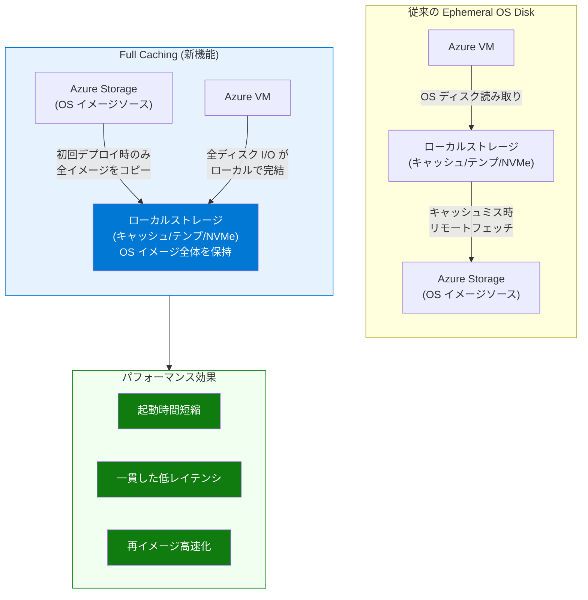

# Azure Virtual Machines: Ephemeral OS Disk with Full Caching がパブリックプレビュー開始

**リリース日**: 2026-03-30

**サービス**: Azure Virtual Machines / Virtual Machine Scale Sets

**機能**: Ephemeral OS Disk with Full Caching

**ステータス**: パブリックプレビュー

[このアップデートのインフォグラフィックを見る](https://takech9203.github.io/azure-news-summary/20260330-ephemeral-os-disk-full-caching.html)

## 概要

Ephemeral OS Disk with Full Caching が Azure VM および VMSS 向けにパブリックプレビューとして提供開始された。この機能は、OS ディスクイメージ全体を VM のローカルストレージ (キャッシュディスク、リソースディスク) にキャッシュすることで、OS ディスクのパフォーマンスを大幅に高速化・安定化させるものである。

従来の Ephemeral OS Disk では、キャッシュディスクやテンプディスク、NVMe ディスクに OS ディスクを配置していたが、Full Caching ではイメージ全体をローカルストレージにキャッシュすることで、初回読み取り時のリモートストレージへのアクセスを排除し、一貫した高パフォーマンスを実現する。

**アップデート前の課題**

- 従来の Ephemeral OS Disk では、OS イメージの初回読み取り時にリモートの Azure Storage からデータを取得する必要があり、初期起動時やコールドリード時にレイテンシが発生していた
- VM の再イメージやスケールセットのスケールアウト時に、OS ディスクデータのフェッチに時間がかかるケースがあった
- ステートレスワークロードにおいて、VM のデプロイ時間や再イメージ時間の短縮が求められていた

**アップデート後の改善**

- OS ディスクイメージ全体がローカル VM ストレージにキャッシュされるため、初回読み取りを含むすべてのディスクアクセスが高速化される
- VM の起動時間および再イメージ時間がさらに短縮される
- リモートストレージへの依存が排除され、一貫した低レイテンシの OS ディスクパフォーマンスが実現される

## アーキテクチャ図

この図は、従来の Ephemeral OS Disk と Full Caching の動作の違いを示している。従来方式ではキャッシュミス時にリモートの Azure Storage からデータを取得する必要があったが、Full Caching では OS イメージ全体がローカルストレージに保持されるため、すべてのディスク I/O がローカルで完結する。

## サービスアップデートの詳細

### 主要機能

1. **OS ディスクイメージの完全キャッシュ**
   - OS ディスクイメージ全体をローカル VM ストレージ (キャッシュディスクまたはリソースディスク) にキャッシュ
   - 初回読み取り時のリモートストレージアクセスを排除し、一貫した高パフォーマンスを提供

2. **VM/VMSS 両方で利用可能**
   - 個別の仮想マシン (VM) および仮想マシンスケールセット (VMSS) の両方で利用可能
   - スケールアウト時のインスタンス起動速度の向上が期待される

3. **既存の Ephemeral OS Disk の拡張**
   - 従来の Ephemeral OS Disk の配置オプション (キャッシュディスク配置、テンプディスク配置、NVMe ディスク配置) と連携
   - ステートレスワークロードに最適化された設計を維持

## 技術仕様

| 項目 | 詳細 |
|------|------|
| ステータス | パブリックプレビュー |
| 対象リソース | Azure VM、Azure VMSS |
| キャッシュ方式 | OS ディスクイメージ全体をローカルストレージにキャッシュ |
| 配置先ストレージ | キャッシュディスク、リソースディスク (テンプディスク) |
| 対応 OS | Linux VM、Windows VM |
| 対応スケールセット | Flexible、Uniform |
| データ永続性 | なし (ローカルストレージのため、Azure Storage には保存されない) |
| Stop-deallocate | 非対応 (Ephemeral OS Disk の制約) |

### Ephemeral OS Disk の配置オプション

| 配置タイプ | 対象 VM シリーズ | 状態 |
|------|------|------|
| NVMe ディスク配置 | v6 世代 VM (Dadsv6、Ddsv6、Dpdsv6 など) | GA |
| テンプディスク配置 | テンプディスク搭載 VM (Dadsv5、Ddsv5 など) | GA |
| キャッシュディスク配置 | キャッシュディスク搭載 VM (Dsv2、Dsv3 など) | GA |

### サイズ要件

- OS イメージのサイズが、選択した VM サイズのローカルストレージ (NVMe/テンプ/キャッシュ) 容量以下である必要がある
- Trusted Launch 使用時は VMGS 用に 1 GiB がローカルストレージから予約される

## メリット

### ビジネス面

- **デプロイ時間の短縮**: VM の起動と再イメージが高速化されることで、スケールアウトの応答性が向上し、ユーザー体験の改善につながる
- **運用コストの削減**: Ephemeral OS Disk はリモートストレージへの書き込みが不要であるため、ストレージトランザクションコストが発生しない
- **SLA 向上**: Premium SSD または Standard SSD をベースディスクとして選択することで、VM の SLA を向上させることが可能

### 技術面

- **一貫した低レイテンシ**: OS ディスクのすべての読み取りがローカルストレージから提供されるため、リモートストレージ起因のレイテンシ変動がなくなる
- **高速な VM 起動**: OS イメージが完全にキャッシュされているため、コールドスタート時のパフォーマンスが向上
- **高速な再イメージ**: VMSS のスケールアウトやメンテナンス後の再イメージが高速化される
- **ディスク I/O パフォーマンスの向上**: ローカル SSD の性能を最大限活用できる

## デメリット・制約事項

- **データの非永続性**: Ephemeral OS Disk のデータは Azure Storage に保存されないため、VM の再デプロイやサイズ変更時に OS ディスクのデータは失われる
- **Stop-deallocate 非対応**: VM を停止 (割り当て解除) すると OS ディスクのデータが失われるため、コスト削減のための停止運用ができない
- **VM イメージキャプチャ非対応**: Ephemeral OS Disk を使用した VM からのイメージキャプチャはサポートされない
- **ディスクスナップショット非対応**: OS ディスクのスナップショットを取得できない
- **Azure Backup 非対応**: OS ディスクの Azure Backup によるバックアップは利用不可
- **Azure Site Recovery 非対応**: ディザスタリカバリでの利用不可
- **Azure Disk Encryption 非対応**: OS ディスクへの Azure Disk Encryption の適用不可
- **OS ディスクのリサイズ制限**: VM 作成時のみ OS ディスクサイズを変更可能 (作成後の変更は不可)
- **ローカルストレージサイズの制約**: OS イメージが VM のローカルストレージ容量以下でなければならないため、利用可能な VM サイズが制限される
- **パブリックプレビュー段階**: 本番環境での利用には SLA が適用されない可能性がある

## ユースケース

1. **ステートレス Web サーバー / API サーバー**
   - OS ディスクにデータを永続化する必要がないアプリケーション
   - VMSS でのオートスケーリングにより、高速なスケールアウトが求められる環境

2. **CI/CD パイプラインのビルドエージェント**
   - ビルドごとに VM を再イメージする使い捨て型のワークロード
   - 起動時間の短縮がパイプライン全体の速度向上に直結する

3. **コンテナホスト (AKS ノードプール)**
   - Kubernetes ノードはステートレスに設計されることが多く、Ephemeral OS Disk との親和性が高い
   - ノードの再プロビジョニング時間の短縮により、クラスターの回復力が向上

4. **バッチ処理・HPC ワークロード**
   - 大量の VM を短期間で起動・終了するバースト型ワークロード
   - VM のデプロイ時間短縮により、ジョブの開始までの待ち時間を削減

5. **VDI (仮想デスクトップインフラストラクチャ)**
   - ユーザーセッション終了時にリセットされる非永続型デスクトップ
   - ログイン時の高速な OS ディスクアクセスによりユーザー体験が向上

## 料金

Ephemeral OS Disk 自体には追加のストレージコストは発生しない。OS ディスクデータはローカル VM ストレージに保存されるため、リモートの Azure Managed Disk に対する課金はない。ただし、SLA 向上のためにベースディスクタイプとして Premium SSD (Premium_LRS) や Standard SSD (StandardSSD_LRS) を選択した場合、VM の SLA に影響する。VM のコンピューティングコストは通常通り発生する。

## 関連サービス・機能

| サービス・機能 | 関連性 |
|------|------|
| Azure Virtual Machines | Ephemeral OS Disk を利用する基盤コンピューティングサービス |
| Azure Virtual Machine Scale Sets | オートスケーリング環境での Ephemeral OS Disk 利用 |
| Azure Kubernetes Service (AKS) | ノードプールで Ephemeral OS Disk を活用可能 |
| Azure Managed Disks | 永続的な OS ディスクが必要な場合の代替オプション |
| Trusted Launch | Ephemeral OS Disk と組み合わせてセキュアブートを実現 |
| Confidential VMs | Ephemeral OS Disk でのコンフィデンシャルコンピューティング対応 |

## 参考リンク

- [インフォグラフィック](https://takech9203.github.io/azure-news-summary/20260330-ephemeral-os-disk-full-caching.html)
- [公式アップデート情報](https://azure.microsoft.com/updates?id=559322)
- [Microsoft Learn - Ephemeral OS Disks](https://learn.microsoft.com/en-us/azure/virtual-machines/ephemeral-os-disks)

## まとめ

Ephemeral OS Disk with Full Caching がパブリックプレビューとして Azure VM および VMSS 向けに提供開始された。この機能は OS ディスクイメージ全体をローカル VM ストレージにキャッシュすることで、従来の Ephemeral OS Disk で発生していた初回読み取り時のリモートストレージアクセスを排除し、一貫した高パフォーマンスの OS ディスクアクセスを実現する。ステートレスワークロード、CI/CD ビルドエージェント、コンテナホスト、バッチ処理など、高速な VM 起動と再イメージが求められるシナリオで特に有効である。ただし、Ephemeral OS Disk 共通の制約として、データの非永続性、Stop-deallocate 非対応、スナップショット・バックアップ非対応などの制限があるため、ワークロードの要件を十分に確認した上で導入を検討する必要がある。

---

**タグ**: #Azure #VirtualMachines #VMSS #EphemeralOSDisk #FullCaching #PublicPreview #Compute #Performance
