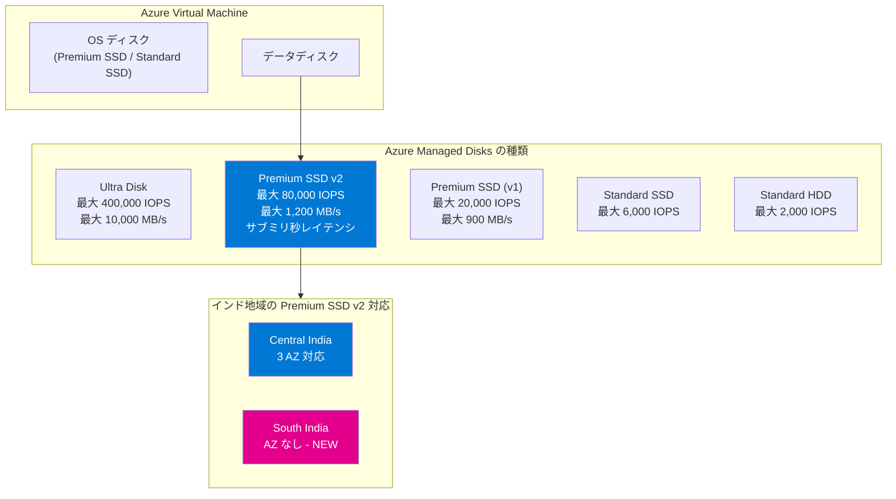

# Azure Disk Storage: Premium SSD v2 が South India リージョンで一般提供開始

**リリース日**: 2026-03-30

**サービス**: Azure Disk Storage

**機能**: Premium SSD v2 Disk の South India リージョン対応

**ステータス**: Launched (GA)

[このアップデートのインフォグラフィックを見る](https://takech9203.github.io/azure-news-summary/20260330-premium-ssd-v2-south-india.html)

## 概要

Azure Premium SSD v2 が South India (インド南部) リージョンで一般提供 (GA) を開始した。South India は Availability Zone (AZ) を持たないリージョンであり、Premium SSD v2 が AZ 非対応リージョンでも利用可能であることを示す重要なアップデートである。

Azure Premium SSD v2 は、Azure 仮想マシン向けの次世代汎用ブロックストレージであり、サブミリ秒のレイテンシと優れたコストパフォーマンスを提供する。容量・IOPS・スループットを個別に調整できるため、ワークロードに応じた柔軟なパフォーマンスチューニングとコスト最適化が可能である。

**アップデート前の課題**

- South India リージョンのユーザーは Premium SSD v2 を利用するために Central India など他のリージョンにデプロイする必要があり、レイテンシが増加する場合があった
- インド南部地域のデータレジデンシー要件を満たしつつ高性能ストレージを利用することが困難だった
- Premium SSD v1 では IOPS やスループットがディスクサイズに固定されており、過剰プロビジョニングによるコスト増が発生していた

**アップデート後の改善**

- South India リージョンで Premium SSD v2 をローカルにデプロイ可能となり、インド南部のユーザーへのレイテンシが低減される
- サブミリ秒のディスクレイテンシにより、データベースやトランザクション処理ワークロードの応答性が向上する
- 容量・IOPS・スループットの個別設定により、必要な性能のみを購入できるためコスト最適化が可能になった

## アーキテクチャ図



この図は、Azure VM のストレージアーキテクチャにおける Premium SSD v2 の位置付けと、インド地域での利用可能リージョンを示している。Premium SSD v2 はデータディスクとしてのみ利用可能であり、OS ディスクとしては使用できない。South India は AZ なしのリージョンとして新たに対応が追加された。

## サービスアップデートの詳細

### 主要機能

1. **South India リージョンでの一般提供**
   - Availability Zone を持たないリージョンでの Premium SSD v2 提供
   - AZ なしリージョンではインフラストラクチャ冗長性なし (No infrastructure redundancy required) でデプロイ
   - AZ 対応リージョンと比較して、平均レイテンシがわずかに高くなる可能性がある点に留意が必要

2. **柔軟なパフォーマンス調整**
   - 容量 (1 GiB - 64 TiB)、IOPS (最大 80,000)、スループット (最大 1,200 MB/s) を個別に設定可能
   - 24 時間以内に最大 4 回のパフォーマンス変更が可能 (ディスク作成を含む)
   - VM の再起動なしでパフォーマンスを動的に調整可能

3. **コスト効率の高い課金モデル**
   - ベースライン IOPS: 3,000 IOPS (無料で含まれる)
   - ベースラインスループット: 125 MB/s (無料で含まれる)
   - 容量は GiB 単位の従量課金 (固定サイズではない)

## 技術仕様

| 項目 | 仕様 |
|---|---|
| ディスクタイプ | SSD |
| 最大ディスクサイズ | 65,536 GiB (64 TiB) |
| 最小ディスクサイズ | 1 GiB |
| サイズ増分 | 1 GiB |
| 最大 IOPS | 80,000 |
| 最大スループット | 1,200 MB/s |
| ベースライン IOPS (無料) | 3,000 |
| ベースラインスループット (無料) | 125 MB/s |
| IOPS スケーリング | 6 GiB 超で 500 IOPS/GiB |
| スループットスケーリング | 設定 IOPS あたり 0.25 MB/s |
| レイテンシ | サブミリ秒 |
| セクターサイズ | 4K (デフォルト) / 512E |
| OS ディスクとして利用 | 不可 |
| ホストキャッシュ | 非対応 |
| サブスクリプションあたりの容量上限 | リージョンあたり 100 TiB (デフォルト、増加可能) |
| SLA | プロビジョニングされた IOPS/スループットの 99.9% |

### IOPS とディスクサイズの関係

| ディスクサイズ | 最大設定可能 IOPS |
|---|---|
| 1 - 6 GiB | 3,000 |
| 8 GiB | 4,000 |
| 10 GiB | 5,000 |
| 160 GiB 以上 | 80,000 |

### Premium SSD v2 と Premium SSD (v1) の比較

| 項目 | Premium SSD v2 | Premium SSD (v1) |
|---|---|---|
| 最大 IOPS | 80,000 | 20,000 |
| 最大スループット | 1,200 MB/s | 900 MB/s |
| 最大ディスクサイズ | 64 TiB | 32 TiB |
| パフォーマンス設定 | 容量・IOPS・スループット個別設定 | ディスクサイズに連動 (固定) |
| サイズ指定 | 1 GiB 単位で自由に設定 | P1-P80 の固定サイズ |
| OS ディスク利用 | 不可 | 可能 |
| ホストキャッシュ | 非対応 | 対応 |
| レイテンシ | サブミリ秒 | シングルミリ秒 |

## 設定方法

### Azure CLI での Premium SSD v2 作成 (AZ なしリージョン)

South India のような AZ なしリージョンでは、`--zone` パラメータを指定せずにデプロイする。

```bash
# Premium SSD v2 ディスクの作成
az disk create \
  --name myPremiumSSDv2 \
  --resource-group myResourceGroup \
  --size-gb 100 \
  --disk-iops-read-write 5000 \
  --disk-mbps-read-write 150 \
  --location southindia \
  --sku PremiumV2_LRS \
  --logical-sector-size 4096

# 既存 VM へのアタッチ
az vm disk attach \
  --vm-name myVM \
  --resource-group myResourceGroup \
  --name myPremiumSSDv2
```

### Azure PowerShell での作成

```powershell
$diskconfig = New-AzDiskConfig `
  -Location "southindia" `
  -DiskSizeGB 100 `
  -DiskIOPSReadWrite 5000 `
  -DiskMBpsReadWrite 150 `
  -AccountType PremiumV2_LRS `
  -LogicalSectorSize 4096 `
  -CreateOption Empty

New-AzDisk `
  -ResourceGroupName "myResourceGroup" `
  -DiskName "myPremiumSSDv2" `
  -Disk $diskconfig
```

### Azure Portal での作成

1. Azure Portal で **Disks** に移動し、新しいディスクを作成
2. リージョンに **South India** を選択
3. **Change size** で **Premium SSD v2** を選択
4. 容量、IOPS、スループットを設定
5. **Availability zone** を **No infrastructure redundancy required** に設定
6. **Advanced** タブでセクターサイズ (4K / 512E) を選択
7. デプロイを実行

### パフォーマンスの動的調整

```bash
# IOPS とスループットの変更 (24 時間以内に最大 4 回)
az disk update \
  --resource-group myResourceGroup \
  --name myPremiumSSDv2 \
  --disk-iops-read-write 10000 \
  --disk-mbps-read-write 300
```

## メリット

### ビジネス面

- **コスト最適化**: 必要なパフォーマンスのみを購入できるため、Premium SSD v1 と比較して多くのワークロードで低コストを実現
- **データレジデンシー**: South India リージョンでのローカルデプロイにより、インド南部のデータ主権要件に対応可能
- **レイテンシ低減**: インド南部のユーザーに近接したストレージ配置により、アプリケーションの応答性が向上
- **運用の柔軟性**: パフォーマンスの動的調整により、ピーク時と非ピーク時でコストを最適化可能

### 技術面

- **サブミリ秒レイテンシ**: データベースやトランザクション処理に最適な低レイテンシ
- **高い IOPS**: 最大 80,000 IOPS で Premium SSD v1 の 4 倍
- **高スループット**: 最大 1,200 MB/s で大容量データ転送にも対応
- **きめ細かなチューニング**: 容量・IOPS・スループットの独立した設定でワークロードに最適化
- **ディスクストライピング不要**: 個別のパフォーマンス設定により、複数ディスクのストライピングによるパフォーマンス確保が不要になるケースがある

## デメリット・制約事項

- **OS ディスクとして使用不可**: Premium SSD v2 はデータディスク専用であり、OS ディスクには Premium SSD v1 や Standard SSD を別途使用する必要がある
- **ホストキャッシュ非対応**: ディスクキャッシュが利用できないが、サブミリ秒のレイテンシにより多くの場合はキャッシュなしでも十分なパフォーマンスを得られる
- **Azure Compute Gallery 非対応**: イメージの管理・共有に Azure Compute Gallery を使用できない
- **AZ なしリージョンでのレイテンシ**: South India は AZ を持たないリージョンであるため、AZ 対応リージョンと比較して平均レイテンシがわずかに高くなる可能性がある
- **冗長性の制約**: Premium SSD v2 はローカル冗長ストレージ (LRS) のみ対応であり、ゾーン冗長ストレージ (ZRS) は非対応
- **パフォーマンス変更回数の制限**: 24 時間以内に最大 4 回まで (ディスク作成を 1 回としてカウント)

## ユースケース

1. **インド南部のデータベースワークロード**
   - SQL Server、Oracle、MariaDB、SAP などのデータベースを South India リージョンでホスティング
   - サブミリ秒のレイテンシにより、トランザクション処理の応答性を確保

2. **ビッグデータ・アナリティクス**
   - 大容量データの高速読み書きが必要な分析ワークロードに適用
   - IOPS とスループットを独立して最適化可能

3. **ゲーミングアプリケーション**
   - ピーク時に高 IOPS が必要なゲームサーバーのストレージ
   - パフォーマンスの動的調整でピーク時と非ピーク時のコストを最適化

4. **インド南部でのコンプライアンス対応**
   - データレジデンシー要件がある企業のワークロード
   - インド国内にデータを保持する必要があるアプリケーション

## 料金

Premium SSD v2 の料金は以下の 3 つの要素で構成される (具体的な金額は Azure 料金ページを参照)。

| 課金要素 | 説明 |
|---|---|
| 容量 (GiB) | プロビジョニングされた GiB あたりの従量課金 |
| IOPS | ベースラインの 3,000 IOPS を超える分に対して課金 |
| スループット | ベースラインの 125 MB/s を超える分に対して課金 |

- ベースライン IOPS (3,000) とベースラインスループット (125 MB/s) は無料で含まれる
- ディスクサイズに関係なく、実際に設定したパフォーマンスに対してのみ課金される
- 詳細な料金については [Azure Managed Disks の料金ページ](https://azure.microsoft.com/pricing/details/managed-disks/) を参照

## 利用可能リージョン

Premium SSD v2 は以下のリージョンで利用可能である (2026 年 3 月時点)。

### AZ なしリージョン

Australia Central 2、Australia Southeast、Brazil Southeast、Canada East、Germany North、**India South (今回追加)**、North Central US、Norway West、Switzerland West、Taiwan North、UK West、West Central US、West US

### 2 AZ 対応リージョン

Japan West

### 3 AZ 対応リージョン

Austria East、Australia East、Brazil South、Canada Central、Central India、Central US、China North 3、East Asia、East US、East US 2、France Central、Germany West Central、Indonesia Central、Israel Central、Italy North、Japan East、Korea Central、Malaysia West、Mexico Central、New Zealand North、North Europe、Norway East、Poland Central、Spain Central、South African North、South Central US、Southeast Asia、Sweden Central、Switzerland North、UAE North、UK South、US Gov Virginia、West Europe、West US 2、West US 3

## 関連サービス・機能

| サービス・機能 | 関連性 |
|---|---|
| Azure Virtual Machines | Premium SSD v2 をデータディスクとしてアタッチするコンピューティングサービス |
| Azure Ultra Disk | より高いパフォーマンス (最大 400,000 IOPS) が必要な場合の上位オプション |
| Premium SSD (v1) | OS ディスクとして利用可能な従来のプレミアムストレージ |
| Azure Disk Encryption | Premium SSD v2 に対する暗号化オプション |
| Azure Backup | Premium SSD v2 ディスクのバックアップ |

## 参考リンク

- [インフォグラフィック](https://takech9203.github.io/azure-news-summary/20260330-premium-ssd-v2-south-india.html)
- [公式アップデート情報](https://azure.microsoft.com/updates?id=559526)
- [Microsoft Learn - Azure Managed Disks の種類](https://learn.microsoft.com/en-us/azure/virtual-machines/disks-types)
- [Microsoft Learn - Premium SSD v2 のデプロイ](https://learn.microsoft.com/en-us/azure/virtual-machines/disks-deploy-premium-v2)
- [料金ページ - Azure Managed Disks](https://azure.microsoft.com/pricing/details/managed-disks/)

## まとめ

Azure Premium SSD v2 が South India リージョンで一般提供を開始した。South India は Availability Zone を持たないリージョンであるが、Premium SSD v2 の利用が可能となり、インド南部のユーザーがサブミリ秒レイテンシの高性能ブロックストレージをローカルで利用できるようになった。Premium SSD v2 は容量・IOPS・スループットを個別に設定できる柔軟な課金モデルにより、Premium SSD v1 と比較して多くのワークロードでコスト効率が向上する。最大 80,000 IOPS、最大 1,200 MB/s のスループットを提供し、データベース、ビッグデータ分析、ゲーミングなど幅広いワークロードに適用可能である。ただし、OS ディスクとしては使用できない点、ホストキャッシュに非対応である点、AZ なしリージョンでは平均レイテンシがわずかに高くなる可能性がある点には留意が必要である。

---

**タグ**: #Azure #DiskStorage #PremiumSSDv2 #SouthIndia #GA #Storage #Compute #VirtualMachines #BlockStorage
