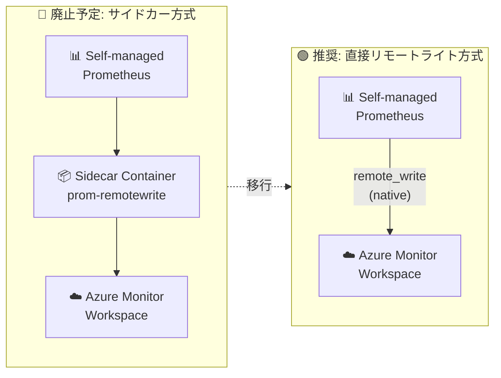

# Azure Monitor: Prometheus リモートライト用サイドカーの廃止

**リリース日**: 2026-03-30

**サービス**: Azure Monitor managed service for Prometheus

**機能**: Prometheus リモートライト用サイドカーコンテナーの廃止

**ステータス**: Retirement notice

[このアップデートのインフォグラフィックを見る](https://takech9203.github.io/azure-news-summary/20260330-prometheus-sidecar-remote-write-retirement.html)

## 概要

Azure Monitor は、Prometheus メトリクスを Azure Monitor ワークスペースにリモートライトするためのサイドカーコンテナー (`prom-remotewrite`) を 2027 年 3 月 31 日に廃止することを発表した。これは、信頼性の向上と複雑性の削減を目的とした取り組みの一環である。

サイドカーコンテナーは、セルフホスト型 Prometheus から Azure Monitor ワークスペースへメトリクスを送信するための中間コンポーネントとして機能していた。今後は、Prometheus のネイティブな `remote_write` 機能を使用して、サイドカーを介さずに直接 Azure Monitor ワークスペースへメトリクスを送信する構成に移行することが推奨される。

**アップデート前の課題**

- サイドカーコンテナー (`prom-remotewrite`) を各 Prometheus Pod にデプロイ・管理する必要があった
- サイドカーの設定 (INGESTION_URL、IDENTITY_TYPE、AZURE_CLIENT_ID など) を個別に管理する必要があった
- サイドカーコンテナーのリソース消費やリスタートなどの追加的な運用負荷が発生していた

**アップデート後の改善**

- Prometheus のネイティブ `remote_write` 設定で直接 Azure Monitor ワークスペースに送信可能
- サイドカーコンテナーが不要になり、Pod 構成がシンプルになる
- Prometheus の標準的な設定ファイル (`prometheus.yml`) のみで構成を管理できる

## アーキテクチャ図



サイドカーコンテナーを経由する方式から、Prometheus のネイティブ `remote_write` 機能を使用した直接送信方式への移行を示す。移行により中間コンポーネントが不要になり、構成がシンプルになる。

## サービスアップデートの詳細

### 廃止対象

1. **Azure Monitor サイドカーコンテナー (`prom-remotewrite`)**
   - コンテナーイメージ: `mcr.microsoft.com/azuremonitor/prometheus/promdev/prom-remotewrite`
   - Prometheus Pod のサイドカーとして動作し、メトリクスを Azure Monitor ワークスペースに転送する役割を担っていた

### 廃止タイムライン

- **発表日**: 2026 年 3 月 30 日
- **廃止日**: 2027 年 3 月 31 日
- 廃止日以降、サイドカーコンテナーはサポートされなくなる

### 推奨される移行先

Prometheus のネイティブ `remote_write` 機能を使用した直接構成への移行が推奨される。以下の認証方式がサポートされている。

1. **システム割り当てマネージド ID** - AKS、Azure VM/VMSS で利用可能 (Prometheus 3.50 以上が必要)
2. **ユーザー割り当てマネージド ID** - AKS、Arc 対応 Kubernetes、Azure VM/VMSS で利用可能 (Prometheus 2.45 以上が必要)
3. **Microsoft Entra ID** - AKS、Arc 対応 Kubernetes、他クラウド/オンプレミスのクラスターで利用可能 (Prometheus 2.48 以上が必要)
4. **Microsoft Entra ワークロード ID** - AKS、Arc 対応 Kubernetes で利用可能 (Prometheus 3.60 以上が必要)

## 技術仕様

| 項目 | 詳細 |
|------|------|
| 廃止対象 | Azure Monitor サイドカーコンテナー (`prom-remotewrite`) |
| 廃止日 | 2027 年 3 月 31 日 |
| 移行先 | Prometheus ネイティブ `remote_write` 設定 |
| 必要な Prometheus バージョン (最小) | 2.45 以上 (認証方式による) |
| サポートされる認証方式 | システム割り当てマネージド ID、ユーザー割り当てマネージド ID、Microsoft Entra ID、ワークロード ID |
| 送信先 | Azure Monitor ワークスペースのメトリクス取り込みエンドポイント |

## 設定方法

### 前提条件

1. Azure Monitor ワークスペースが作成済みであること
2. Prometheus 2.45 以上 (認証方式によりバージョン要件が異なる)
3. 認証用の ID (マネージド ID または Microsoft Entra ID) が作成済みであること
4. 認証用 ID に Azure Monitor ワークスペースの DCR に対する **Monitoring Metrics Publisher** ロールが割り当て済みであること

### Prometheus 設定ファイルの更新 (マネージド ID 使用時)

```yaml
# prometheus.yml の remote_write セクション
remote_write:
  - url: "<Azure Monitor ワークスペースのメトリクス取り込みエンドポイント>"
    azuread:
      cloud: 'AzurePublic'
      managed_identity:
        client_id: "<マネージド ID のクライアント ID>"
```

### Prometheus Operator 使用時

```yaml
prometheus:
  prometheusSpec:
    remoteWrite:
    - url: "<Azure Monitor ワークスペースのメトリクス取り込みエンドポイント>"
      azureAd:
        cloud: 'AzurePublic'
        managedIdentity:
          clientId: "<マネージド ID のクライアント ID>"
```

設定後、Prometheus を再起動して新しい構成を適用する。

```bash
# Kubernetes の場合
kubectl -n monitoring rollout restart deploy <prometheus-deployment-name>
```

## メリット

### 技術面

- サイドカーコンテナーが不要になり、Pod のリソース消費が削減される
- Prometheus の標準機能のみで構成できるため、構成がシンプルになる
- サイドカーコンテナーの障害やリスタートに起因する問題が解消される
- Prometheus の公式ドキュメントに準拠した標準的な構成になる

### 運用面

- 管理すべきコンポーネントが減少し、運用負荷が軽減される
- サイドカーコンテナーのイメージ更新が不要になる
- トラブルシューティングが容易になる (中間コンポーネントがないため)

## デメリット・制約事項

- 既存のサイドカー方式を使用している環境では、2027 年 3 月 31 日までに移行作業が必要
- Prometheus のバージョンアップが必要な場合がある (認証方式により 2.45 以上または 3.50 以上)
- 認証設定を Prometheus の設定ファイルで直接管理する必要がある
- ロールの割り当てが反映されるまで最大 30 分かかる場合がある (その間 HTTP 403 エラーが発生する可能性)

## ユースケース

### ユースケース 1: AKS クラスターからの移行

**シナリオ**: AKS クラスターでサイドカーコンテナーを使用して Prometheus メトリクスを Azure Monitor ワークスペースに送信している環境での移行

**移行手順**:

1. Prometheus のバージョンが要件を満たしているか確認
2. 使用する認証方式を決定 (マネージド ID 推奨)
3. 認証用 ID を作成し、Monitoring Metrics Publisher ロールを割り当て
4. `prometheus.yml` に `remote_write` セクションを追加
5. サイドカーコンテナーの設定を削除
6. Prometheus を再起動して動作確認

**効果**: Pod 構成のシンプル化とリソース消費の削減

### ユースケース 2: マルチクラスター環境での集約

**シナリオ**: 複数のセルフホスト Prometheus クラスターから 1 つの Azure Monitor ワークスペースにメトリクスを集約している環境

**移行手順**:

1. 各クラスターの Prometheus 設定ファイルを更新
2. 大量データ送信環境では、追加の DCR/DCE を作成して取り込み負荷を分散

**効果**: 各クラスターのサイドカー管理が不要になり、統一的な構成管理が可能

## 関連サービス・機能

- **Azure Monitor managed service for Prometheus**: セルフマネージド Prometheus の代替として推奨されるフルマネージドサービス
- **Azure Kubernetes Service (AKS)**: サイドカー方式の主な利用環境
- **Azure Arc 対応 Kubernetes**: ハイブリッド/マルチクラウド環境での Prometheus メトリクス収集
- **Azure Monitor ワークスペース**: Prometheus メトリクスの保存先
- **Data Collection Rule (DCR)**: メトリクス取り込みのエンドポイントとルーティングを定義

## 参考リンク

- [インフォグラフィック](https://takech9203.github.io/azure-news-summary/20260330-prometheus-sidecar-remote-write-retirement.html)
- [公式アップデート情報](https://azure.microsoft.com/updates?id=550519)
- [Microsoft Learn - セルフマネージド Prometheus の接続ガイド](https://learn.microsoft.com/en-us/azure/azure-monitor/containers/prometheus-remote-write)
- [Prometheus remote_write 公式ドキュメント](https://prometheus.io/docs/prometheus/latest/configuration/configuration/#remote_write)
- [Prometheus remote write チューニングガイド](https://prometheus.io/docs/practices/remote_write/)

## まとめ

Azure Monitor は、Prometheus メトリクスのリモートライト用サイドカーコンテナーを 2027 年 3 月 31 日に廃止する。移行先は Prometheus のネイティブ `remote_write` 機能を使用した直接構成であり、サイドカーが不要になることで構成のシンプル化と運用負荷の軽減が期待できる。現在サイドカー方式を使用している環境では、廃止日までに Prometheus の設定ファイルを更新し、直接リモートライト構成に移行することが推奨される。移行にあたっては、使用する認証方式に応じた Prometheus のバージョン要件を確認し、適切な ID とロールの設定を行う必要がある。

---

**タグ**: Azure Monitor, Prometheus, AKS, Containers, Remote Write, Sidecar, Retirement, DevOps, Management and governance
