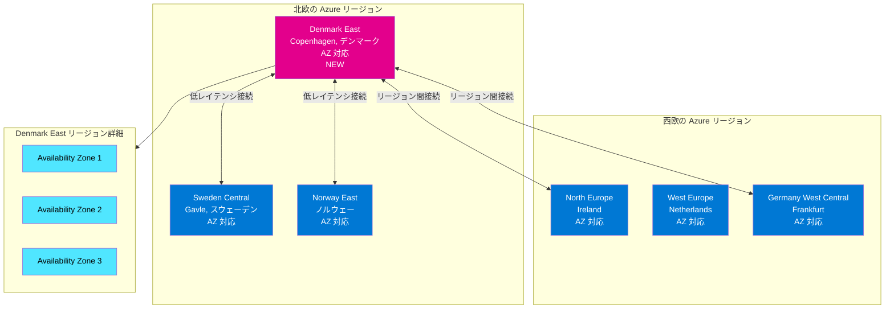

# Azure Regions: デンマーク初のクラウドリージョン Denmark East が一般提供開始

**リリース日**: 2026-03-31

**サービス**: Azure Regions & Datacenters

**機能**: Denmark East リージョンの一般提供開始

**ステータス**: Launched (GA)

[このアップデートのインフォグラフィックを見る](https://takech9203.github.io/azure-news-summary/20260331-azure-denmark-east-region.html)

## 概要

Microsoft Azure がデンマーク初のクラウドリージョンである Denmark East をコペンハーゲンに開設し、一般提供 (GA) を開始した。このリージョンは、デンマークの顧客に対してローカルかつセキュアなクラウドインフラストラクチャを提供し、デジタルトランスフォーメーションと AI イノベーションの加速を目的としている。Denmark East リージョンは Availability Zone (AZ) に対応しており、高可用性ワークロードのデプロイが可能である。

**アップデート前の課題**

- デンマークの顧客は最寄りの Azure リージョン (North Europe (アイルランド)、West Europe (オランダ)、Sweden Central、Norway East など) を利用する必要があり、国外にデータが保存されていた
- デンマーク国内のデータレジデンシー要件を満たすことが困難であった
- 近隣リージョンへの接続では、地理的距離に起因するレイテンシが発生していた

**アップデート後の改善**

- デンマーク国内でのデータ保存が可能となり、ローカルデータレジデンシー要件に対応
- コペンハーゲンに物理的に近接したインフラストラクチャにより、デンマーク国内ユーザーへの低レイテンシ接続を実現
- Availability Zone 対応により、リージョン内での高可用性構成が可能

## アーキテクチャ図

この図は、Denmark East リージョンの北欧・西欧リージョンとの位置関係を示している。Denmark East は Sweden Central および Norway East と地理的に近接しており、低レイテンシでのリージョン間接続が期待できる。Availability Zone に対応しているため、リージョン内での冗長構成が可能である。

## サービスアップデートの詳細

### 主要機能

1. **デンマーク初の Azure リージョン**
   - コペンハーゲンに位置する Microsoft 初のデンマーク国内クラウドリージョン
   - デンマークの顧客にローカルなクラウドインフラストラクチャを提供

2. **Availability Zone 対応**
   - 高可用性ワークロードのためのゾーン冗長構成が可能
   - Azure のゾーン冗長サービスおよびゾーナルサービスの両方をデプロイ可能

3. **データレジデンシーの確保**
   - デンマーク国内にデータを保存可能
   - ローカルのデータ主権要件およびコンプライアンス要件に対応

4. **AI イノベーションの支援**
   - デジタルトランスフォーメーションと AI イノベーションの加速を目的として設計

## 技術仕様

| 項目 | 詳細 |
|------|------|
| リージョン名 | Denmark East |
| プログラム名 | denmarkeast |
| 物理的所在地 | Copenhagen (コペンハーゲン) |
| ジオグラフィ | Denmark |
| Availability Zone | 対応 |
| ペアリージョン | なし (N/A) |

## メリット

### ビジネス面

- **データレジデンシー**: デンマーク国内にデータを保持でき、デンマークおよび EU のデータ保護規制への対応が容易になる
- **デジタルトランスフォーメーションの加速**: ローカルなクラウドインフラストラクチャにより、デンマーク企業のクラウド移行とイノベーションが促進される
- **AI イノベーション**: Azure AI サービスをローカルリージョンから利用することで、AI ソリューションの開発・展開が容易になる
- **顧客信頼性の向上**: データが国内に保存されることで、顧客やパートナーからの信頼が向上する

### 技術面

- **低レイテンシ**: デンマーク国内のユーザーおよびシステムに対して、地理的に近接したリージョンからのサービス提供が可能
- **高可用性**: Availability Zone 対応により、リージョン内でのゾーン冗長構成が可能
- **北欧リージョンとの近接性**: Sweden Central、Norway East との地理的近接性により、マルチリージョン構成での低レイテンシを実現
- **グローバルネットワーク接続**: Microsoft のグローバルバックボーンネットワークを通じた他リージョンへの高速接続

## デメリット・制約事項

- **ペアリージョンなし**: Denmark East にはペアリージョンが設定されていないため、ペアリージョンに依存する一部のサービス (geo 冗長ストレージの自動フェイルオーバーなど) では別途 DR 戦略の検討が必要
- **サービス提供範囲**: 新規リージョンのため、初期段階では一部の Azure サービスが利用できない可能性がある (具体的なサービス一覧は公式ドキュメントを参照)
- **料金**: 新規リージョンの料金体系は他の欧州リージョンと異なる可能性がある (公式料金ページで確認が必要)

## ユースケース

1. **デンマーク企業のクラウド移行**
   - データレジデンシー要件があるデンマーク企業のオンプレミスからクラウドへの移行
   - 公共セクターのデジタルサービス基盤としての活用

2. **北欧地域のマルチリージョン DR 構成**
   - Denmark East と Sweden Central または Norway East を組み合わせた北欧地域内でのディザスタリカバリ構成
   - 地理的に分散した高可用性アーキテクチャの構築

3. **AI・データ分析ワークロード**
   - デンマーク国内のデータを国外に出さずに AI モデルのトレーニングや推論を実行
   - Azure OpenAI Service などの AI サービスをローカルリージョンで利用

4. **金融・ヘルスケア分野のコンプライアンス対応**
   - 厳格なデータ規制がある業界でのクラウド活用
   - デンマーク国内のデータ保存要件を満たしたアプリケーション運用

## 料金

Denmark East リージョンの具体的な料金は、Azure 料金ページで各サービスごとに確認が必要である。一般的に、新規リージョンの料金は同一ジオグラフィ内の既存リージョンと同等か、若干の差異がある場合がある。

- 詳細は [Azure 料金計算ツール](https://azure.microsoft.com/pricing/calculator/) を参照

## 利用可能リージョン

本アップデートは Denmark East リージョンの新規開設に関するものである。以下は北欧地域の Azure リージョン一覧である (2026 年 3 月時点)。

| リージョン | 所在地 | AZ 対応 | ペアリージョン |
|------|------|------|------|
| **Denmark East (今回追加)** | Copenhagen, デンマーク | 対応 | なし |
| Sweden Central | Gavle, スウェーデン | 対応 | Sweden South (制限付き) |
| Norway East | ノルウェー | 対応 | Norway West (制限付き) |
| North Europe | Ireland | 対応 | West Europe |

## 関連サービス・機能

| サービス・機能 | 関連性 |
|------|------|
| Azure Availability Zones | Denmark East で利用可能な高可用性機能 |
| Azure Virtual Machines | Denmark East にデプロイ可能なコンピューティングサービス |
| Azure Storage | デンマーク国内でのデータ保存に利用 |
| Azure AI Services | ローカルリージョンでの AI ワークロード実行 |
| Azure ExpressRoute | オンプレミスから Denmark East への専用接続 |
| Azure Virtual Network | Denmark East でのネットワーク構成 |

## 参考リンク

- [インフォグラフィック](https://takech9203.github.io/azure-news-summary/20260331-azure-denmark-east-region.html)
- [公式アップデート情報](https://azure.microsoft.com/updates?id=559406)
- [Microsoft Learn - Azure リージョン一覧](https://learn.microsoft.com/en-us/azure/reliability/availability-zones-region-support)
- [Microsoft Learn - Availability Zone 対応サービス](https://learn.microsoft.com/en-us/azure/reliability/availability-zones-service-support)
- [Microsoft データセンター - デンマーク](https://datacenters.microsoft.com/globe/explore/denmark)

## まとめ

Microsoft Azure がデンマーク初のクラウドリージョンである Denmark East をコペンハーゲンに開設し、一般提供を開始した。このリージョンは Availability Zone に対応しており、高可用性構成が可能である。デンマークの顧客はローカルなデータレジデンシーを確保しながら、Azure のクラウドサービスを低レイテンシで利用できるようになった。ペアリージョンは設定されていないため、DR 戦略については Sweden Central や Norway East など近隣の北欧リージョンとの組み合わせを検討する必要がある。デジタルトランスフォーメーションと AI イノベーションの加速を目的として設計されたこのリージョンは、デンマーク企業のクラウド活用を大きく推進するものとなる。

---

**タグ**: #Azure #Regions #Datacenters #DenmarkEast #Copenhagen #Denmark #NordicRegions #AvailabilityZones #DataResidency #GA
