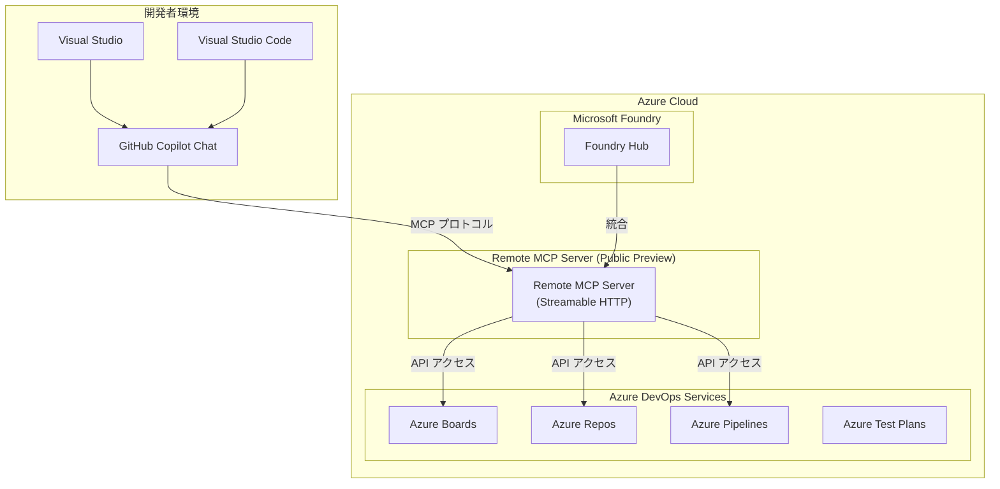

# Azure DevOps: 2026 年 3 月アップデート

**リリース日**: 2026-03-31

**サービス**: Azure DevOps

**機能**: Azure DevOps March 2026 updates

**ステータス**: Launched (GA)

[このアップデートのインフォグラフィックを見る](https://takech9203.github.io/azure-news-summary/20260331-devops-march-2026-updates.html)

## 概要

Azure DevOps の 2026 年 3 月アップデートとして、複数の重要な機能改善とセキュリティ強化が発表された。最も注目すべきアップデートは、Remote MCP Server のパブリックプレビュー開始であり、ローカルサーバーを必要とせず AI を活用した Azure DevOps との統合が可能となる。

セキュリティ面では、ビルドサービス ID の API アクセスに関する制限変更が行われた。また、Kanban / Sprint ボードの表示改善、Team Calendar 拡張機能のビジュアルリファイン、Azure DevOps Server のパッチリリースなど、開発者の生産性向上に寄与する複数の改善が含まれている。

**アップデート前の課題**

- MCP Server の利用にはローカルサーバーのインストールと管理が必要であり、セットアップの手間がかかっていた
- ビルドサービス ID による API アクセスのセキュリティ管理が十分でなく、過剰な権限が付与されるリスクがあった
- Kanban / Sprint ボードでフィールドやタグが多い場合、画面スペースが不足し視認性が低下していた
- Team Calendar のカラーパレットやコントラストが見づらい場面があった

**アップデート後の改善**

- Remote MCP Server により、Streamable HTTP トランスポートを使用したホスト型のリモート接続が可能となり、ローカルサーバーの管理が不要になる
- Microsoft Foundry との統合により、Visual Studio や Visual Studio Code の GitHub Copilot Chat から Azure DevOps データへのアクセスが容易になる
- ビルドサービス ID のセキュリティ強化により、サービスプリンシパルへの移行が推奨され、より安全な認証が実現する
- ボードのコンデンスドビューにより、限られた画面スペースでも効率的に作業項目を確認できるようになる

## アーキテクチャ図

この図は、Remote MCP Server がホスト型サービスとして Azure DevOps の各サービスと開発者環境を接続する構成を示している。開発者は Visual Studio や Visual Studio Code の GitHub Copilot Chat を通じて、ローカルサーバーなしで Azure DevOps のデータにアクセスできる。

## サービスアップデートの詳細

### 主要機能

1. **Remote MCP Server (パブリックプレビュー)**
   - ホスト型の MCP Server として提供され、ローカルサーバーのインストールが不要になる
   - Streamable HTTP トランスポートを使用し、ローカル MCP Server と同じコアシナリオをサポートする
   - Microsoft Foundry 内でも利用可能となり、AI アプリケーション構築の統合プラットフォームとして機能する
   - Visual Studio や Visual Studio Code の GitHub Copilot Chat を通じて Azure DevOps データとの接続が可能

2. **ビルドサービス ID のセキュリティ強化**
   - ビルドサービス ID に対する API アクセスの制限が導入された
   - 顧客への影響を考慮し、一時的にロールバックされたが、段階的な移行が推奨されている
   - ビルドサービス ID に依存する自動化処理は、Advanced Security: Read alerts 権限を持つサービスプリンシパルへの移行が必要

3. **Kanban / Sprint ボードのコンデンスドビュー**
   - フィールドやタグが多いボードでの画面スペースの問題に対応する新しい表示モード
   - カード上の情報をコンパクトに表示し、一覧性を向上させる

4. **Team Calendar 拡張機能のビジュアル改善**
   - カラーパレットが更新され、より見やすい配色となった
   - コントラストが改善され、アクセシビリティが向上した

5. **Azure DevOps Server パッチ**
   - グループメンバーシップの非アクティブ化に関する問題を修正するパッチがリリースされた

## 技術仕様

| 項目 | 詳細 |
|------|------|
| Remote MCP Server ステータス | パブリックプレビュー |
| トランスポートプロトコル | Streamable HTTP |
| ローカル MCP Server との互換性 | 同一のコアシナリオをサポート |
| Microsoft Foundry 統合 | 対応 |
| 対応 IDE | Visual Studio, Visual Studio Code |
| AI 統合 | GitHub Copilot Chat |
| ビルド ID 移行先 | サービスプリンシパル (Advanced Security: Read alerts 権限) |

## 設定方法

### 前提条件

1. Azure DevOps Services の組織が必要
2. Remote MCP Server を利用する場合、パブリックプレビューへのアクセスが必要
3. GitHub Copilot Chat との統合には、Visual Studio または Visual Studio Code と GitHub Copilot のライセンスが必要

### Remote MCP Server の利用開始

Remote MCP Server はホスト型サービスとして提供されるため、ローカルサーバーのインストールは不要である。Microsoft Foundry を通じてアクセスするか、IDE の MCP 設定で Remote MCP Server のエンドポイントを指定する。ローカル MCP Server からの移行の場合、同じコアシナリオがサポートされるため、設定の変更は最小限で済む。

### ビルドサービス ID の移行

ビルドサービス ID に依存するパイプラインの自動化処理を使用している場合は、以下の手順でサービスプリンシパルへの移行を検討する。

1. Azure DevOps の組織設定から、現在ビルドサービス ID を使用している自動化処理を特定する
2. Microsoft Entra ID でサービスプリンシパルを作成する
3. Advanced Security: Read alerts 権限を付与する
4. パイプラインの認証をサービスプリンシパルに切り替える

## メリット

### ビジネス面

- Remote MCP Server により、AI を活用した開発ワークフローの導入障壁が低下し、チーム全体での生産性向上が期待できる
- ローカルサーバーの管理が不要になることで、IT 管理の負荷が軽減される
- コンデンスドビューにより、アジャイル開発におけるボード運用の効率が向上する

### 技術面

- Streamable HTTP トランスポートにより、ファイアウォール越しの接続やクラウドネイティブ環境での利用が容易になる
- Microsoft Foundry との統合により、AI アプリケーション構築における Azure DevOps データの活用範囲が拡大する
- ビルドサービス ID のセキュリティ強化により、CI/CD パイプラインのセキュリティ態勢が改善される

## デメリット・制約事項

- Remote MCP Server はパブリックプレビュー段階であり、本番環境での利用には注意が必要
- ビルドサービス ID の API アクセス制限は一時的にロールバックされたが、将来的に再度適用される可能性があるため、早期の移行が推奨される
- Remote MCP Server のサポートするシナリオはローカル MCP Server と同等とされているが、プレビュー段階での機能差異がある可能性がある

## ユースケース

### ユースケース 1: AI 支援によるプロジェクト管理

**シナリオ**: 開発チームが Visual Studio Code の GitHub Copilot Chat から、Remote MCP Server を通じて Azure Boards の作業項目を自然言語で検索・更新する。チームメンバーは IDE を離れることなく、バックログの確認やタスクのステータス更新を行える。
**効果**: コンテキストスイッチの削減により開発者の集中力が維持され、プロジェクト管理タスクの効率が向上する。

### ユースケース 2: セキュアな CI/CD パイプラインの構築

**シナリオ**: エンタープライズ組織が、ビルドサービス ID に依存していたパイプライン自動化をサービスプリンシパルに移行し、Advanced Security アラートの読み取り権限を適切に管理する。
**効果**: 最小権限の原則に基づいたセキュリティ態勢が実現し、資格情報の漏洩リスクが低減される。

## 料金

Azure DevOps の料金体系に変更はない。Remote MCP Server はパブリックプレビュー期間中の追加料金に関する情報は公開されていない。Azure DevOps Services の基本プラン (Basic Plan) は、最初の 5 ユーザーまで無料、以降はユーザーあたり月額 $6 で利用可能である。

## 利用可能リージョン

Azure DevOps Services はグローバルサービスとして提供されており、本アップデートは全リージョンの Azure DevOps Services ユーザーに対して適用される。Azure DevOps Server のパッチは、オンプレミス環境に個別に適用する必要がある。

## 関連サービス・機能

- **Azure DevOps MCP Server (ローカル版)**: 2025 Q4 に GA となったローカル版 MCP Server。Remote MCP Server はそのホスト型の発展版
- **Microsoft Foundry**: AI アプリケーション構築のための統合プラットフォーム。Remote MCP Server がネイティブに統合されている
- **GitHub Copilot Chat**: IDE 内での AI 支援を提供し、MCP Server を通じて Azure DevOps データにアクセスする
- **GitHub Advanced Security for Azure DevOps**: セキュリティアラートの管理機能。ビルドサービス ID の移行先としてサービスプリンシパルに Read alerts 権限を付与する際に関連する

## 参考リンク

- [インフォグラフィック](https://takech9203.github.io/azure-news-summary/20260331-devops-march-2026-updates.html)
- [公式アップデート情報](https://azure.microsoft.com/updates?id=559660)
- [Azure DevOps Blog](https://devblogs.microsoft.com/devops/)
- [Azure DevOps ロードマップ](https://learn.microsoft.com/en-us/azure/devops/release-notes/features-timeline)

## まとめ

Azure DevOps の 2026 年 3 月アップデートは、AI 統合の強化とセキュリティ改善を中心とした包括的なリリースである。Remote MCP Server のパブリックプレビューは、ローカルサーバー不要で AI を活用した Azure DevOps 操作を可能にし、開発者体験を大きく向上させる。ビルドサービス ID のセキュリティ強化は、CI/CD パイプラインのセキュリティ態勢の改善に貢献する。Kanban / Sprint ボードのコンデンスドビューや Team Calendar の改善など、日常的な開発ワークフローの効率化にも注力されている。

---

**タグ**: #AzureDevOps #MCP #RemoteMCPServer #DevOps #セキュリティ #KanbanBoard #ContinuousIntegration #AIIntegration #MicrosoftFoundry #GitHubCopilot
