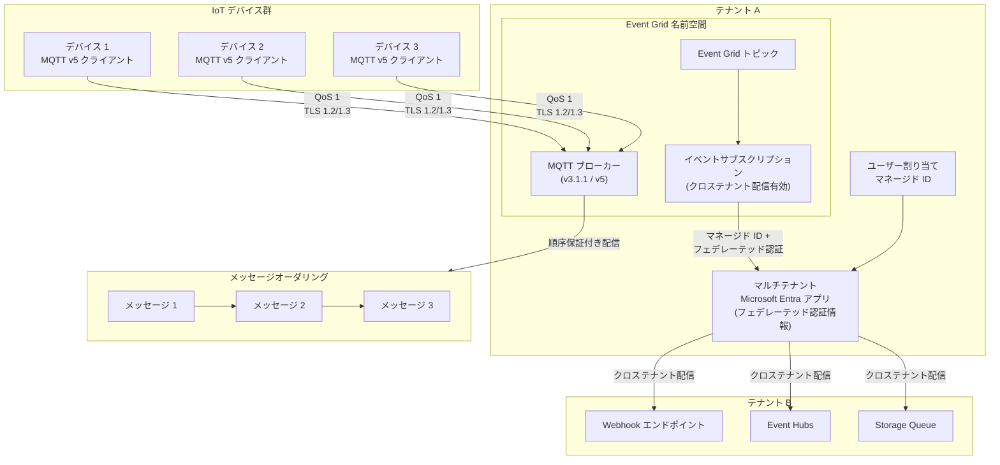

# Azure Event Grid: スマートかつセキュアなイベント駆動アーキテクチャのための新機能

**リリース日**: 2026-03-31

**サービス**: Azure Event Grid

**機能**: New capabilities for smarter, more secure event-driven architectures

**ステータス**: 一般提供 (GA) / パブリックプレビュー

[このアップデートのインフォグラフィックを見る](https://takech9203.github.io/azure-news-summary/20260331-event-grid-new-capabilities.html)

## 概要

Azure Event Grid に対して、大規模分散システムの管理を強化し、相互運用性とセキュリティの向上を目的とした複数の新機能が発表された。本アップデートには、一般提供 (GA) となった機能とパブリックプレビューとして提供される機能の両方が含まれている。

GA となった主要機能として、MQTT メッセージオーダリングが挙げられる。これは MQTT v5 における順序保証付きメッセージ配信を実現する機能である。パブリックプレビューとしては、クロステナント Webhook 配信が提供され、テナント境界を越えたセキュアなイベント配信が可能になった。

これらの機能は、IoT シナリオにおけるデバイス間通信の信頼性向上や、マルチテナント環境でのイベント駆動アーキテクチャの構築を支援するものである。

**アップデート前の課題**

- MQTT ブローカーにおいて、QoS 1 を使用した場合でもトピック単位・クライアント単位の順序保証付きメッセージ配信が提供されていなかった
- テレメトリデータや時系列データの処理において、メッセージの到着順序が保証されないため、アプリケーション側での順序制御が必要だった
- Azure Event Grid のイベント配信が同一テナント内に限定されており、マルチテナント環境での Webhook 配信にはカスタム実装が必要だった
- 異なるテナントにまたがる組織間のイベント連携において、セキュアかつ簡便な配信手段が不足していた

**アップデート後の改善**

- MQTT v5 でのメッセージオーダリングにより、各トピック・各クライアント単位で QoS 1 メッセージの順序保証付き配信が GA として利用可能になった
- テレメトリ、コマンド実行、時系列データなどのシーケンス整合性が重要なワークフローにおいて、アプリケーション側の順序制御が不要になった
- クロステナント Webhook 配信（プレビュー）により、マネージド ID とフェデレーテッド認証情報を使用したテナント間イベント配信が可能になった
- Basic ティアおよび Standard ティア（名前空間）の両方でクロステナント Webhook 配信がサポートされた

## アーキテクチャ図

この図は、Azure Event Grid の 2 つの主要な新機能を示している。上部では IoT デバイスが MQTT v5 プロトコルを使用して MQTT ブローカーに接続し、メッセージオーダリングにより順序保証付きでメッセージが配信される流れを表す。下部では、テナント A からテナント B へのクロステナント配信の仕組みを示しており、ユーザー割り当てマネージド ID とマルチテナント Microsoft Entra アプリを経由して、Webhook、Event Hubs、Storage Queue など複数の配信先にセキュアにイベントが配信される。

## サービスアップデートの詳細

### 一般提供 (GA) 機能

#### MQTT メッセージオーダリング

MQTT v5 において、QoS レベル 1 を使用した場合に各トピック・各クライアント単位での順序保証付きメッセージ配信が GA となった。これは、シーケンスの整合性が必要なワークフローに不可欠な機能であり、テレメトリ、コマンド実行、時系列データなどのシナリオに適している。

ただし、異なるトピック間や、異なる QoS レベルで送信されたメッセージ間での順序保証は対象外である。

### パブリックプレビュー機能

#### クロステナント Webhook 配信

テナント境界を越えたセキュアな Webhook 配信を実現する機能がパブリックプレビューとして提供された。マネージド ID とフェデレーテッド認証情報を活用し、異なるテナントに存在するエンドポイントへのイベント配信が可能になる。

Basic ティアおよび Standard ティア（名前空間）の両方で利用可能であり、Webhook 以外にも Event Hubs やNamespace Topics へのクロステナント配信もプレビューとして利用できる。

## 技術仕様

| 項目 | 詳細 |
|------|------|
| MQTT プロトコルバージョン | MQTT v3.1.1、MQTT v5（WebSocket 対応含む） |
| メッセージオーダリング対応 QoS | QoS 1（at-least-once delivery） |
| オーダリングの範囲 | 各トピック・各クライアント単位 |
| TLS 要件 | TLS 1.2 または TLS 1.3 必須 |
| MQTT ポート | TCP 8883（直接接続）、TCP 443（WebSocket） |
| 最大パケットサイズ | 512 KiB |
| クロステナント配信対応ティア | Basic ティア、Standard ティア（名前空間） |
| クロステナント Webhook 配信ステータス | パブリックプレビュー（Basic / Standard 両対応） |
| クロステナント認証方式 | ユーザー割り当てマネージド ID + フェデレーテッド認証情報 |
| クロステナント対応配信先（GA） | Event Hubs、Service Bus、Storage Queues（Basic ティア） |
| クロステナント対応配信先（プレビュー） | Webhooks、Namespace Topics、Event Hubs（Standard ティア） |

## 設定方法

### MQTT メッセージオーダリングの利用

1. Event Grid 名前空間を作成または既存の名前空間を使用する
2. MQTT クライアントが MQTT v5 プロトコルで接続するよう構成する
3. PUBLISH メッセージで QoS レベル 1 を指定する
4. 同一トピック・同一クライアントからのメッセージが順序保証付きで配信される

### クロステナント Webhook 配信の構成

1. テナント A に Event Grid トピックを作成し、ユーザー割り当てマネージド ID を有効化する
2. マルチテナント Microsoft Entra アプリを作成し、フェデレーテッド ID 認証情報を構成する
3. テナント B に配信先のリソース（Webhook エンドポイント等）を作成する
4. 配信先リソースの IAM で、マルチテナントアプリに適切なロールを割り当てる
5. イベントサブスクリプション作成時に「クロステナント配信」を有効化し、マネージド ID とフェデレーテッド認証情報を指定する

## メリット

### ビジネス面

- マルチテナント環境における組織間イベント連携が容易になり、パートナー企業やグループ会社との統合コストが削減される
- IoT ソリューションにおけるメッセージの信頼性が向上し、データ整合性に起因する障害対応コストが低減される
- Azure のネイティブ機能としてクロステナント配信が実現されるため、カスタム実装の保守負担が不要になる

### 技術面

- MQTT メッセージオーダリングにより、アプリケーション層での順序制御ロジックの実装が不要になる
- マネージド ID ベースのクロステナント認証により、認証情報のハードコーディングやシークレット管理が不要になる
- QoS 1 での at-least-once delivery と順序保証の組み合わせにより、信頼性の高いメッセージングが実現される
- MQTT v3.1.1 と v5 間のクロスバージョン通信がサポートされているため、デバイスの段階的移行が可能

## デメリット・制約事項

- メッセージオーダリングは MQTT v5 のみ対応であり、MQTT v3.1.1 クライアントでは利用できない
- 順序保証は同一トピック・同一クライアント単位に限定され、異なるトピック間や異なる QoS レベル間での順序保証はない
- クロステナント Webhook 配信はパブリックプレビュー段階であり、SLA の対象外となる
- クロステナント配信の構成にはマルチテナント Microsoft Entra アプリとフェデレーテッド認証情報のセットアップが必要であり、設定手順が複雑である
- QoS 2 は未サポートであり、exactly-once delivery は利用できない
- 最大パケットサイズは 512 KiB に制限されている
- Keep Alive の最大値は 1,160 秒に制限されている

## ユースケース

- **IoT テレメトリの順序保証付き収集**: 製造業の生産ラインにおけるセンサーデータを、発生順序を保証しながら収集・処理する。メッセージオーダリングにより、時系列データの整合性が担保される
- **マルチテナント SaaS プラットフォーム**: SaaS プロバイダーが顧客テナントの Azure 環境にあるエンドポイントへイベントを配信する。クロステナント Webhook 配信により、セキュアな連携が実現される
- **コマンド・コントロールシステム**: IoT デバイスへのコマンド送信において、実行順序が重要な場合（例: ファームウェア更新の段階的実行）にメッセージオーダリングを活用する
- **グループ会社間のイベント連携**: 異なる Azure テナントを持つグループ会社間で、業務イベント（注文、在庫変動等）をリアルタイムに連携する

## 料金

Event Grid の料金はティアや操作の種類によって異なる。クロステナント配信に関する追加料金の詳細は公式ドキュメントを参照のこと。MQTT ブローカー機能を含む Event Grid 名前空間の料金は、Event Grid の Standard ティアの料金体系に準ずる。具体的な料金については [Azure Event Grid の価格](https://azure.microsoft.com/pricing/details/event-grid/) を参照。

## 利用可能リージョン

本アップデートの対象リージョンに関する具体的な情報は公式アナウンスに記載されていない。Event Grid 名前空間の利用可能リージョンについては [Azure Event Grid のリージョン別提供状況](https://azure.microsoft.com/explore/global-infrastructure/products-by-region/?products=event-grid) を参照。

## 関連サービス・機能

- **Azure Event Hubs**: クロステナント配信先として利用可能。大量イベントのストリーム処理に適している
- **Azure Service Bus**: クロステナント配信先（Basic ティア GA）。キューおよびトピックへの配信をサポート
- **Azure Storage Queues**: クロステナント配信先（Basic ティア GA）。軽量なメッセージキューイングに利用
- **Microsoft Entra ID**: クロステナント配信のフェデレーテッド認証基盤として使用される
- **Azure IoT Hub**: IoT デバイス管理の中核サービス。Event Grid MQTT ブローカーとの連携が可能
- **Microsoft Fabric**: MQTT イベントを直接 Fabric に送信する機能がプレビューとして利用可能

## 参考リンク

- [インフォグラフィック](https://takech9203.github.io/azure-news-summary/20260331-event-grid-new-capabilities.html)
- [公式アップデート情報 (GA)](https://azure.microsoft.com/updates?id=492542)
- [公式アップデート情報 (Preview)](https://azure.microsoft.com/updates?id=559695)
- [Azure Event Grid の新機能](https://learn.microsoft.com/azure/event-grid/whats-new)
- [MQTT ブローカーでサポートされる機能](https://learn.microsoft.com/azure/event-grid/mqtt-support)
- [クロステナント配信](https://learn.microsoft.com/azure/event-grid/cross-tenant-delivery-using-managed-identity)
- [Azure Event Grid の価格](https://azure.microsoft.com/pricing/details/event-grid/)

## まとめ

Azure Event Grid に対して、イベント駆動アーキテクチャの信頼性とセキュリティを強化する複数の新機能が発表された。GA となった MQTT メッセージオーダリングは、MQTT v5 において QoS 1 でのトピック・クライアント単位の順序保証付きメッセージ配信を提供し、IoT テレメトリやコマンド制御などのシーケンス整合性が重要なシナリオに対応する。パブリックプレビューとして提供されたクロステナント Webhook 配信は、マネージド ID とフェデレーテッド認証情報を活用して、テナント境界を越えたセキュアなイベント配信を実現する。これらの機能により、大規模分散システムにおける相互運用性と制御性が大幅に向上し、マルチテナント環境やIoT ソリューションの構築がより容易になる。

---

**タグ**: #Azure #EventGrid #MQTT #IoT #クロステナント #イベント駆動 #GA #パブリックプレビュー #Integration
