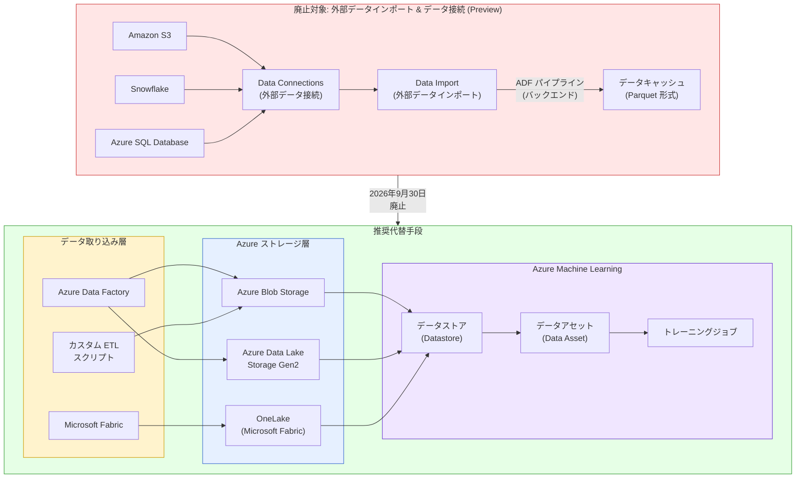

# Azure Machine Learning: 外部データインポートおよびデータ接続機能の廃止 (2026 年 9 月 30 日)

**リリース日**: 2026-03-31

**サービス**: Azure Machine Learning

**機能**: External Data Import & Data Connections の廃止

**ステータス**: Retirement

[このアップデートのインフォグラフィックを見る](https://takech9203.github.io/azure-news-summary/20260331-ml-external-data-import-retirement.html)

## 概要

Azure Machine Learning の外部データインポート機能 (Preview) および外部データ接続機能 (Preview) が 2026 年 9 月 30 日に廃止される。対象となるのは、Amazon S3、Snowflake、Azure SQL Database からのデータインポート機能と、これらの外部ソースに対するデータ接続 (Data Connections) である。廃止日以降、これらの機能は利用できなくなる。

外部データインポート機能は、外部データソースからデータを取得し、Azure Machine Learning プラットフォーム内にキャッシュとして保存する仕組みを提供していた。バックエンドでは Azure Data Factory (ADF) パイプラインを使用してデータ転送を行い、転送されたデータは Parquet 形式で Azure ストレージに保存されていた。この機能はプレビュー段階のまま廃止となるため、利用中のユーザーは代替手段への移行を計画する必要がある。

代替手段としては、Azure Machine Learning のデータストア (Datastore) を活用して Azure Blob Storage、Azure Data Lake Storage Gen2 などの Azure ストレージサービスに直接接続する方法が推奨される。外部データソースのデータを事前に Azure ストレージに取り込んだうえで、データストア経由でアクセスする構成への移行が求められる。

**アップデート前の課題**

- 外部データインポート機能を使用して Amazon S3、Snowflake、Azure SQL Database から直接データを取り込んでいたワークフローが存在する
- 外部データ接続 (Data Connections) を介した外部ソースへの接続が設定されている環境がある
- プレビュー機能に依存したデータパイプラインが本番環境で利用されている可能性がある

**アップデート後の改善**

- Azure Machine Learning のデータストア機能は GA 済みで、安定したデータアクセス基盤を提供する
- Azure Blob Storage、Azure Data Lake Storage Gen2、Azure Files、OneLake (Microsoft Fabric) など、幅広い Azure ストレージサービスへの接続をサポートする
- ID ベース認証 (Microsoft Entra ID) と資格情報ベース認証の両方をサポートし、セキュリティ要件に柔軟に対応できる
- Azure Data Factory や Microsoft Fabric などの専用データ統合サービスを活用することで、より堅牢な外部データ取り込みパイプラインを構築できる

## アーキテクチャ図



上図は、廃止対象の外部データインポート機能と、推奨される代替アーキテクチャを示している。従来は Data Connections と Data Import 機能を通じて外部ソースから直接データを取り込んでいたが、廃止後は Azure Data Factory や Microsoft Fabric などのデータ統合サービスで外部データを Azure ストレージに取り込み、Azure Machine Learning のデータストア経由でアクセスする構成が推奨される。

## サービスアップデートの詳細

### 廃止タイムライン

| 日付 | イベント |
|------|---------|
| 2026 年 3 月 31 日 | 廃止アナウンス |
| 2026 年 9 月 30 日 | External Data Import および Data Connections (Preview) の廃止日 |

### 廃止対象の機能

1. **外部データインポート (Import Data from External Sources - Preview)**
   - Amazon S3 からのデータインポート (uri_folder 形式)
   - Snowflake からのデータインポート (mltable 形式)
   - Azure SQL Database からのデータインポート (mltable 形式)
   - スケジュールベースの定期データインポート
   - ADF パイプラインを利用したバックエンドデータ転送

2. **外部データ接続 (External Data Connections - Preview)**
   - Amazon S3 への接続設定
   - Snowflake への接続設定
   - Azure SQL Database への外部接続設定

### 推奨される代替手段

1. **Azure Machine Learning データストア (Datastore)**
   - Azure Blob Storage、Azure Data Lake Storage Gen2、Azure Files、OneLake に対応
   - ID ベース認証 (Microsoft Entra ID) と資格情報ベース認証 (サービスプリンシパル、SAS トークン、アカウントキー) をサポート
   - `az ml datastore create` コマンドまたは Python SDK で作成可能

2. **Azure Data Factory によるデータ取り込み**
   - Amazon S3、Snowflake、Azure SQL Database を含む多数の外部ソースからデータをコピー可能
   - スケジュールベースおよびイベントドリブンのパイプライン実行をサポート
   - Azure Blob Storage や Azure Data Lake Storage Gen2 へのデータ転送を自動化

3. **Microsoft Fabric によるデータ統合**
   - OneLake を中心としたデータレイクハウスアーキテクチャ
   - Azure Machine Learning からの OneLake データストア接続をサポート

## 技術仕様

### 廃止機能と代替手段の比較

| 項目 | 廃止機能 (Data Import) | 代替 (Datastore + ADF) |
|------|----------------------|----------------------|
| ステータス | Preview (廃止予定) | GA (安定版) |
| Amazon S3 対応 | 直接インポート | ADF 経由で Azure ストレージに転送後、Datastore 接続 |
| Snowflake 対応 | 直接インポート | ADF 経由で Azure ストレージに転送後、Datastore 接続 |
| Azure SQL DB 対応 | 直接インポート | ADF 経由で Azure ストレージに転送後、Datastore 接続 |
| データ形式 | Parquet (自動変換) | ソース形式を維持、または ADF で変換 |
| 認証 | Workspace Connections | Datastore: Entra ID / SAS / Key / SP |
| スケジュール実行 | 組み込み (Recurrence/Cron) | ADF トリガー (スケジュール/イベント) |
| データバージョニング | 自動バージョン管理 | データアセットによるバージョン管理 |

### サポートされるデータストアの種類

| データストア種別 | 認証方式 |
|----------------|---------|
| Azure Blob Storage | ID ベース / アカウントキー / SAS |
| Azure Data Lake Storage Gen2 | ID ベース / サービスプリンシパル |
| Azure Files | アカウントキー / SAS |
| OneLake (Microsoft Fabric) | ID ベース / サービスプリンシパル |

## 移行手順

### 前提条件

- Azure Machine Learning ワークスペース
- Azure CLI ml 拡張機能 v2 (バージョン 2.37.0 以降) または Python SDK azure-ai-ml v2 (バージョン 1.31.0 以降)
- 外部データの転送先となる Azure ストレージアカウント (Blob Storage または ADLS Gen2)
- 外部データソースからの転送を行う場合は Azure Data Factory リソース

### 移行ステップ

1. **現在の外部データインポート設定の確認**
   - Azure Machine Learning Studio の「Data」セクションで「Data Import」タブを確認
   - 使用中のデータ接続 (Connections) とインポートスケジュールを洗い出す

2. **Azure ストレージの準備**
   - データの格納先となる Azure Blob Storage または Azure Data Lake Storage Gen2 を準備する
   - 適切なアクセス制御 (RBAC) を設定する

3. **Azure Data Factory によるデータ転送パイプラインの構築**
   - 外部ソース (S3、Snowflake、Azure SQL DB) から Azure ストレージへのコピーパイプラインを作成
   - 既存のインポートスケジュールに対応するトリガーを設定する

4. **データストアの作成**

   Azure CLI での作成例:

   ```bash
   az ml datastore create --file my_blob_datastore.yml
   ```

   Python SDK での作成例:

   ```python
   from azure.ai.ml.entities import AzureBlobDatastore
   from azure.ai.ml import MLClient
   from azure.identity import DefaultAzureCredential

   ml_client = MLClient.from_config(credential=DefaultAzureCredential())
   store = AzureBlobDatastore(
       name="my_datastore",
       account_name="mystorageaccount",
       container_name="mycontainer"
   )
   ml_client.create_or_update(store)
   ```

5. **データアセットの作成とジョブの更新**
   - 新しいデータストアを参照するデータアセットを作成する
   - トレーニングジョブの入力設定を新しいデータアセットに更新する

6. **テストと検証**
   - 新しいデータパイプラインとデータストア経由のアクセスが正常に動作することを確認する
   - 2026 年 9 月 30 日の廃止日より前に切り替えを完了する

## メリット

### ビジネス面

- GA 済みの安定した機能への移行により、プレビュー機能への依存リスクを排除できる
- Azure Data Factory を活用することで、より多様な外部データソースへの対応が可能になる
- SLA に裏付けられたデータパイプラインの信頼性が向上する

### 技術面

- データストアは ID ベース認証 (Microsoft Entra ID) をサポートし、シークレット管理が簡素化される
- Azure Machine Learning のデータランタイムは Rust ベースで高速かつメモリ効率が高い
- マウント (ro_mount/rw_mount)、ダウンロード、アップロードなど、柔軟なデータアクセスモードを提供する
- OneLake (Microsoft Fabric) との統合により、モダンなデータレイクハウスアーキテクチャへの移行パスが開ける

## デメリット・制約事項

- 外部データインポートが提供していた「直接接続」の利便性が失われ、中間のデータ転送ステップが必要になる
- Azure Data Factory の追加リソースが必要となり、構成の複雑さが増す可能性がある
- 既存のインポートスケジュールを ADF トリガーとして再構築する作業が発生する
- 外部データインポートが自動的に行っていた Parquet 変換を、ADF パイプライン内で明示的に設定する必要がある
- プレビュー機能のため、移行に関する専用ツールは提供されない可能性がある

## ユースケース

### 移行が必要なケース

- Amazon S3 バケットのデータを Azure Machine Learning のトレーニングジョブで使用しているケース → ADF で S3 から Azure Blob Storage にコピーし、Datastore 経由でアクセス
- Snowflake データウェアハウスのクエリ結果を ML モデルのトレーニングデータとして利用しているケース → ADF の Snowflake コネクタで Azure ストレージに転送後、mltable データアセットとして登録
- Azure SQL Database のデータを定期的にインポートしてモデルの再トレーニングを行っているケース → ADF のスケジュールトリガーで定期的にデータを転送し、Datastore 経由でアクセス

## 関連サービス・機能

- **Azure Machine Learning データストア (Datastore)**: Azure ストレージサービスへの接続を管理する GA 済みの機能
- **Azure Machine Learning データアセット (Data Asset)**: データの参照とバージョン管理を行う機能
- **Azure Data Factory**: 外部データソースからのデータ転送を自動化するデータ統合サービス
- **Microsoft Fabric**: OneLake を中心としたモダンデータプラットフォーム
- **Azure Machine Learning データランタイム**: Rust ベースの高速データアクセスエンジン

## 参考リンク

- [インフォグラフィック](https://takech9203.github.io/azure-news-summary/20260331-ml-external-data-import-retirement.html)
- [公式アップデート情報](https://azure.microsoft.com/updates?id=557406)
- [Azure Machine Learning でのデータインポート (Preview)](https://learn.microsoft.com/en-us/azure/machine-learning/how-to-import-data-assets)
- [Azure Machine Learning のデータ概念](https://learn.microsoft.com/en-us/azure/machine-learning/concept-data)
- [Azure Machine Learning データストアの使用方法](https://learn.microsoft.com/en-us/azure/machine-learning/how-to-datastore)
- [Azure Machine Learning データアセットの作成](https://learn.microsoft.com/en-us/azure/machine-learning/how-to-create-data-assets)

## まとめ

Azure Machine Learning の外部データインポート機能 (Preview) および外部データ接続機能 (Preview) は 2026 年 9 月 30 日に廃止される。対象は Amazon S3、Snowflake、Azure SQL Database からのデータインポートと、それらに対する外部データ接続である。これらの機能はプレビュー段階のまま廃止となる。代替手段として、Azure Data Factory などのデータ統合サービスで外部データを Azure ストレージに取り込み、Azure Machine Learning のデータストア (Datastore) 経由でアクセスする構成への移行が推奨される。データストアは GA 済みの安定した機能であり、ID ベース認証や複数のストレージサービスへの対応など、エンタープライズ要件を満たす機能を提供する。影響を受けるユーザーは、廃止日までに移行計画を策定し、代替構成への切り替えを完了することが推奨される。

---

**タグ**: #Azure #MachineLearning #DataImport #DataConnections #Retirement #ADF #Datastore #S3 #Snowflake #AzureSQL #Migration
