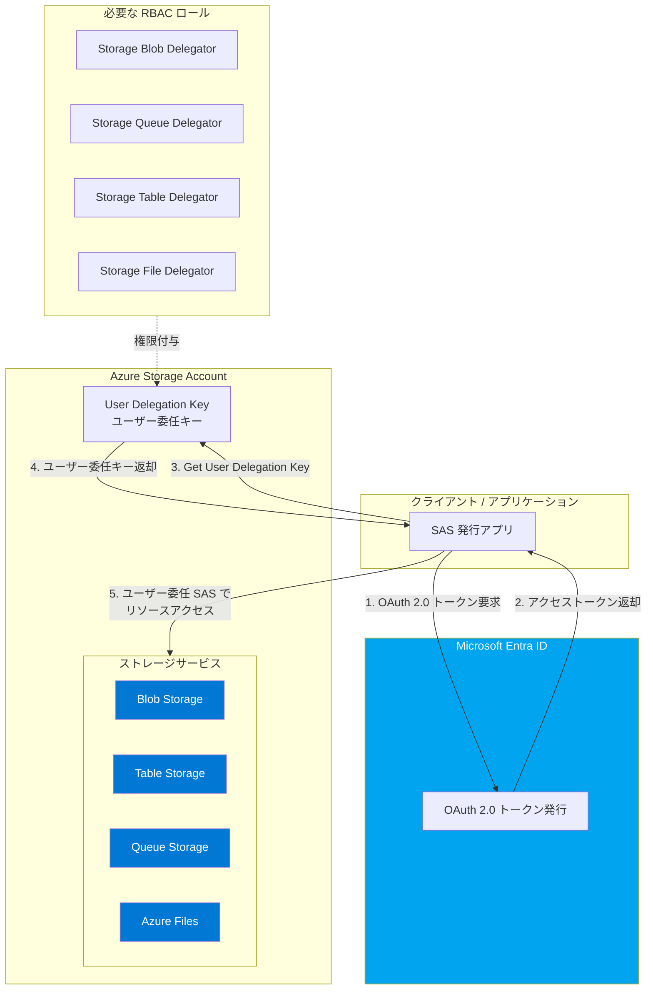

# Azure Storage: ユーザー委任 SAS の Azure Tables, Azure Files, Azure Queues への拡張

**リリース日**: 2026-03-31

**サービス**: Azure Storage (Azure Tables, Azure Files, Azure Queues)

**機能**: User delegation SAS for Azure Tables, Azure Files, and Azure Queues

**ステータス**: GA (一般提供)

[このアップデートのインフォグラフィックを見る](https://takech9203.github.io/azure-news-summary/20260331-storage-user-delegation-sas.html)

## 概要

Azure Storage のユーザー委任 SAS (User Delegation SAS) が、従来の Blob Storage に加えて Azure Tables、Azure Files、Azure Queues でも一般提供 (GA) となった。ユーザー委任 SAS は、ストレージアカウントキーではなく Microsoft Entra ID の資格情報で署名される SAS トークンであり、アカウント SAS やサービス SAS と比較してより安全な共有アクセス署名を作成できる。

従来、ユーザー委任 SAS は Blob Storage (Data Lake Storage 含む) でのみサポートされていたが、本アップデートにより Azure Storage の全サービス (Blob, Table, Queue, Files) でユーザー委任 SAS が利用可能となった。これにより、すべてのストレージサービスにおいてアカウントキーに依存しないセキュアなアクセス委任が実現される。

**アップデート前の課題**

- Table Storage、Queue Storage、Azure Files でユーザー委任 SAS を使用できず、サービス SAS またはアカウント SAS (いずれもアカウントキーで署名) に依存する必要があった
- アカウントキーベースの SAS はキーの漏洩リスクが高く、キーが漏洩した場合はすべての SAS が無効化される恐れがあった
- Blob Storage ではユーザー委任 SAS を使用できたが、他のストレージサービスでは同等のセキュリティレベルを確保できなかった
- Microsoft のベストプラクティスではユーザー委任 SAS の使用が推奨されていたが、Tables、Files、Queues ではその推奨に従うことができなかった

**アップデート後の改善**

- Azure Tables、Azure Files、Azure Queues でもユーザー委任 SAS が利用可能となり、アカウントキーに依存しないセキュアなアクセス委任が全ストレージサービスで実現された
- Microsoft Entra ID の資格情報でトークンを署名するため、アカウントキーの漏洩リスクを排除できるようになった
- 全ストレージサービスで統一的なセキュリティポリシーを適用できるようになった
- 各サービス向けの専用の Delegator ロール (Storage Queue Delegator、Storage Table Delegator、Storage File Delegator) が追加された

## アーキテクチャ図



この図は、ユーザー委任 SAS を使用した Azure Storage へのアクセスフローを示している。アプリケーションは Microsoft Entra ID から OAuth 2.0 トークンを取得し、そのトークンを使用してストレージアカウントからユーザー委任キーを取得する。取得したキーを用いて SAS トークンを生成し、Blob Storage、Table Storage、Queue Storage、Azure Files のいずれのサービスに対してもユーザー委任 SAS によるアクセスが可能となった。

## サービスアップデートの詳細

### 主要機能

1. **Azure Tables でのユーザー委任 SAS サポート**
   - テーブルエンティティに対するクエリ (`r`)、追加 (`a`)、更新 (`u`)、削除 (`d`) 操作を SAS で制御可能
   - `tableName` (`tn`) パラメータでアクセス対象のテーブルを指定
   - `startPk`/`startRk` および `endPk`/`endRk` パラメータにより、アクセス可能なパーティションキーと行キーの範囲を制限可能

2. **Azure Files でのユーザー委任 SAS サポート**
   - ファイルおよびファイル共有に対する読み取り (`r`)、書き込み (`w`)、削除 (`d`)、一覧表示 (`l`) 操作を SAS で制御可能
   - `signedResource` (`sr`) パラメータで `f` (ファイル) または `s` (共有) を指定
   - レスポンスヘッダーのオーバーライド (`rscc`, `rscd`, `rsce`, `rscl`, `rsct`) に対応

3. **Azure Queues でのユーザー委任 SAS サポート**
   - キューに対する読み取り (`r`)、追加 (`a`)、更新 (`u`)、処理 (`p`) 操作を SAS で制御可能
   - メッセージのピーク、追加、更新、取得・削除をきめ細かく制御

4. **サービス別の Delegator ロール**
   - `Storage Queue Delegator` - Queue Storage 向けのユーザー委任キー生成権限
   - `Storage Table Delegator` - Table Storage 向けのユーザー委任キー生成権限
   - `Storage File Delegator` - Azure Files 向けのユーザー委任キー生成権限

## 技術仕様

| 項目 | 詳細 |
|------|------|
| 必要な API バージョン | `sv=2025-07-05` 以降 |
| 対象サービス | Azure Tables, Azure Files, Azure Queues (Blob Storage は既存サポート) |
| 認証方式 | Microsoft Entra ID (OAuth 2.0) |
| ユーザー委任キーの最大有効期間 | 7 日間 |
| SAS トークン種別 | アドホック SAS のみ (ストアドアクセスポリシー非対応) |
| Table Storage 固有パラメータ | `tn` (テーブル名), `spk`/`srk` (開始キー), `epk`/`erk` (終了キー) |
| Files 固有パラメータ | `sr=f` (ファイル), `sr=s` (共有), レスポンスヘッダーオーバーライド |
| Queue パーミッション | `r` (読み取り), `a` (追加), `u` (更新), `p` (処理) |

### 各サービスの String-to-Sign フォーマット

各ストレージサービスごとに署名文字列のフォーマットが定義されている (API バージョン 2025-07-05 以降):

- **Table Storage**: パーミッション、有効期間、Canonicalized Resource、キー情報に加え、`startingPartitionKey`、`startingRowKey`、`endingPartitionKey`、`endingRowKey` を含む
- **Queue Storage**: パーミッション、有効期間、Canonicalized Resource、キー情報のみのシンプルな構成
- **Azure Files**: パーミッション、有効期間、Canonicalized Resource、キー情報に加え、レスポンスヘッダーオーバーライド (`rscc`, `rscd`, `rsce`, `rscl`, `rsct`) を含む

### Canonicalized Resource のフォーマット

| サービス | URL 例 | Canonicalized Resource |
|---------|--------|----------------------|
| Table Storage | `https://{account}.table.core.windows.net/Employees` | `/table/{account}/employees` |
| Queue Storage | `https://{account}.queue.core.windows.net/thumbnails` | `/queue/{account}/thumbnails` |
| Azure Files (共有) | `https://{account}.file.core.windows.net/music` | `/file/{account}/music` |
| Azure Files (ファイル) | `https://{account}.file.core.windows.net/music/intro.mp3` | `/file/{account}/music/intro.mp3` |

## 設定方法

### 1. RBAC ロールの割り当て

ユーザー委任キーを要求するセキュリティプリンシパルに、対象サービスに応じた Delegator ロールを割り当てる。

```bash
# Queue Storage の場合
az role assignment create \
  --assignee {principal-id} \
  --role "Storage Queue Delegator" \
  --scope /subscriptions/{sub-id}/resourceGroups/{rg}/providers/Microsoft.Storage/storageAccounts/{account}

# Table Storage の場合
az role assignment create \
  --assignee {principal-id} \
  --role "Storage Table Delegator" \
  --scope /subscriptions/{sub-id}/resourceGroups/{rg}/providers/Microsoft.Storage/storageAccounts/{account}

# Azure Files の場合
az role assignment create \
  --assignee {principal-id} \
  --role "Storage File Delegator" \
  --scope /subscriptions/{sub-id}/resourceGroups/{rg}/providers/Microsoft.Storage/storageAccounts/{account}
```

### 2. ユーザー委任キーの取得

Microsoft Entra ID から取得した OAuth 2.0 トークンを使用して、ユーザー委任キーを要求する。

```http
POST https://{account}.{service}.core.windows.net/?restype=service&comp=userdelegationkey
Authorization: Bearer {OAuth-token}
x-ms-version: 2025-07-05

<?xml version="1.0" encoding="utf-8"?>
<KeyInfo>
    <Start>2026-03-31T00:00:00Z</Start>
    <Expiry>2026-04-01T00:00:00Z</Expiry>
</KeyInfo>
```

### 3. ユーザー委任 SAS トークンの生成

取得したユーザー委任キーを使用して、対象サービス向けの SAS トークンを生成する。各サービス固有のパラメータを含める必要がある。

### 4. SAS トークンを使用したリソースアクセス

```http
# Queue へのメッセージ追加の例
POST https://{account}.queue.core.windows.net/{queue}/messages?{sas-token}

# Table エンティティのクエリの例
GET https://{account}.table.core.windows.net/{table}()?{sas-token}

# ファイルの読み取りの例
GET https://{account}.file.core.windows.net/{share}/{file}?{sas-token}
```

## メリット

### ビジネス面

- **統一的なセキュリティポリシー**: 全ストレージサービスでユーザー委任 SAS を使用できるようになり、組織全体で一貫したセキュリティポリシーを適用できる
- **アカウントキー依存の排除**: アカウントキーの共有・管理が不要となり、キー漏洩によるセキュリティリスクを低減できる
- **コンプライアンス対応**: Microsoft Entra ID ベースの認証により、誰がアクセスを委任したかの追跡が容易になり、監査要件への対応が強化される

### 技術面

- **Microsoft 推奨のベストプラクティスに準拠**: Microsoft は SAS 使用時にユーザー委任 SAS を推奨しており、全サービスでこの推奨に従うことが可能になった
- **きめ細かいアクセス制御**: Table Storage ではパーティションキー・行キーの範囲指定、Queue では操作種別の制御、Files ではファイル・共有レベルの制御が可能
- **既存の Entra ID 統合との親和性**: 既存の RBAC ベースのアクセス管理フレームワークと自然に統合できる
- **Shared Key アクセスの無効化が可能に**: 全サービスでユーザー委任 SAS が利用可能となったことで、ストレージアカウントの Shared Key アクセスを無効化するハードルが低下した

## デメリット・制約事項

- **API バージョン要件**: `sv=2025-07-05` 以降が必要であり、古い SDK やツールでは利用できない場合がある
- **ストアドアクセスポリシー非対応**: ユーザー委任 SAS はストアドアクセスポリシーに対応しておらず、アドホック SAS としてのみ使用可能である
- **ユーザー委任キーの有効期間制限**: ユーザー委任キーの有効期間は最大 7 日間であり、長期間のアクセス委任には定期的なキー更新が必要
- **コンテナ・キュー・テーブルの作成・削除・一覧表示は不可**: ユーザー委任 SAS ではこれらの管理操作はサポートされず、アカウント SAS を使用する必要がある
- **Queue のメタデータ書き込み不可**: ユーザー委任 SAS ではキューのメタデータ書き込みやキューのクリアはサポートされない
- **クライアント SDK の更新が必要**: 新しい API バージョンに対応した SDK へのアップグレードが必要となる場合がある

## ユースケース

1. **マイクロサービスアーキテクチャでのキュー連携**: マイクロサービス間のメッセージキュー連携において、各サービスにユーザー委任 SAS を発行し、アカウントキーを共有せずにキューへのメッセージ送受信を実現する

2. **IoT デバイスからの Table Storage へのデータ書き込み**: IoT デバイスに対してパーティションキー範囲を限定したユーザー委任 SAS を発行し、デバイスごとに書き込み可能なエンティティ範囲を制限する

3. **外部パートナーとのファイル共有**: Azure Files の特定の共有またはファイルに対するユーザー委任 SAS を発行し、アカウントキーを開示せずに外部パートナーとファイルを安全に共有する

4. **Shared Key アクセスの完全無効化**: 全ストレージサービスでユーザー委任 SAS が利用可能となったことで、セキュリティポリシーとしてストレージアカウントの Shared Key アクセスを無効化し、Entra ID ベースの認証のみに統一する

## 料金

ユーザー委任 SAS 自体に追加料金は発生しない。通常の Azure Storage の料金体系が適用される:

- **Get User Delegation Key 操作**: ストレージアカウントの種類に応じた操作料金として課金される
- **SAS を使用したデータアクセス**: 各ストレージサービスの通常のトランザクション料金が適用される
- **データ転送**: 通常のデータ転送料金が適用される

## 利用可能リージョン

本アップデートの公式発表において、特定のリージョン制限に関する記載はない。Azure Storage のユーザー委任 SAS はストレージサービスの標準機能として提供されるため、Azure Storage が利用可能なすべてのパブリックリージョンで利用可能と考えられる。

## 関連サービス・機能

| サービス・機能 | 関連性 |
|--------------|--------|
| Microsoft Entra ID | ユーザー委任 SAS の署名に使用される OAuth 2.0 トークンの発行元 |
| Azure Blob Storage ユーザー委任 SAS | 既存の Blob Storage 向けユーザー委任 SAS (2018-11-09 から利用可能) |
| ユーザーバウンド ユーザー委任 SAS | SAS トークンの使用を特定の Entra ID ユーザーに制限する機能 (プレビュー) |
| Azure RBAC | Delegator ロールの割り当てによるユーザー委任キー生成権限の管理 |
| SAS 有効期限ポリシー | ストレージアカウント レベルで SAS の推奨最大有効期間を設定する機能 |

## 参考リンク

- [インフォグラフィック](https://takech9203.github.io/azure-news-summary/20260331-storage-user-delegation-sas.html)
- [公式アップデート情報](https://azure.microsoft.com/updates?id=559535)
- [ユーザー委任 SAS の作成 (REST API)](https://learn.microsoft.com/en-us/rest/api/storageservices/create-user-delegation-sas)
- [共有アクセス署名 (SAS) の概要](https://learn.microsoft.com/en-us/azure/storage/common/storage-sas-overview)

## まとめ

ユーザー委任 SAS の Azure Tables、Azure Files、Azure Queues への拡張は、Azure Storage のセキュリティ体系における重要なマイルストーンである。従来、Blob Storage でのみ利用可能であったユーザー委任 SAS が全ストレージサービスで GA となったことで、アカウントキーに依存しない Entra ID ベースのアクセス委任を組織全体で統一的に採用できるようになった。

Solutions Architect にとって最も大きなインパクトは、ストレージアカウントの Shared Key アクセスを無効化できる条件が整ったことである。全サービスでユーザー委任 SAS が利用可能となったことで、SAS を必要とするワークロードにおいてもアカウントキーへの依存を排除できる。API バージョン `2025-07-05` 以降が必要となるため、使用中の SDK やツールの対応状況を確認し、段階的な移行計画を策定することが推奨される。

---

**タグ**: `Azure Storage` `Azure Tables` `Azure Files` `Queue Storage` `Table Storage` `Security` `SAS` `User Delegation SAS` `Microsoft Entra ID` `GA`
