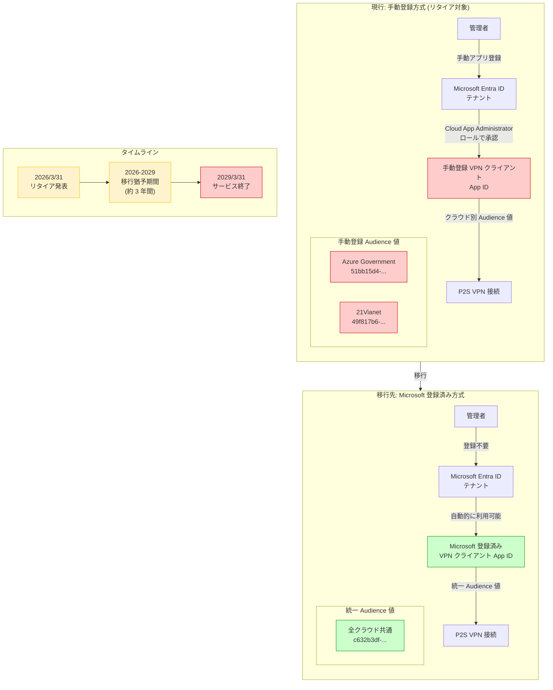

# VPN Gateway: 手動登録 Azure VPN クライアントのリタイア (Azure Government / 21Vianet)

**リリース日**: 2026-03-31

**サービス**: VPN Gateway

**機能**: 手動登録 Azure VPN クライアントのリタイア (Azure Government / Microsoft Azure operated by 21Vianet)

**ステータス**: Retirement

[このアップデートのインフォグラフィックを見る](https://takech9203.github.io/azure-news-summary/20260331-vpn-client-manual-registration-retirement.html)

## 概要

Microsoft は、Azure Government および Microsoft Azure operated by 21Vianet クラウドにおいて、Microsoft Entra ID 認証を使用したポイント対サイト (P2S) VPN 接続で使用されている手動登録 Azure VPN クライアントを 2029 年 3 月 31 日にリタイアすることを発表した。

従来、Azure VPN クライアントを Microsoft Entra ID 認証で使用する場合、テナント管理者が Azure VPN クライアントアプリを Microsoft Entra テナントに手動で登録し、Cloud App Administrator ロールを使用してアプリの承認やアクセス許可の割り当てを行う必要があった。この手動登録方式では、クラウドごとに異なる Audience 値 (Azure Government: `51bb15d4-3a4f-4ebf-9dca-40096fe32426`、21Vianet: `49f817b6-84ae-4cc0-928c-73f27289b3aa`) を使用していた。

新しい Microsoft 登録済み Azure VPN クライアント App ID では、すべてのクラウドで統一された Audience 値 (`c632b3df-fb67-4d84-bdcf-b95ad541b5c8`) を使用し、手動でのアプリ登録プロセスが不要となる。これにより、セキュリティが向上し、設定手順が簡素化される。

## アーキテクチャ図

手動登録方式から Microsoft 登録済み方式への移行パスを示している。移行により、クラウド別の Audience 値が統一され、手動でのアプリ登録プロセスが不要になる。

## サービスアップデートの詳細

### 主要な変更点

1. **手動登録 Azure VPN クライアントのリタイア**
   - Azure Government および Microsoft Azure operated by 21Vianet クラウドにおける手動登録 Azure VPN クライアントが 2029 年 3 月 31 日に廃止される
   - 対象は Microsoft Entra ID 認証を使用した P2S VPN 接続

2. **影響を受ける Audience 値**
   - Azure Government: `51bb15d4-3a4f-4ebf-9dca-40096fe32426`
   - Microsoft Azure operated by 21Vianet: `49f817b6-84ae-4cc0-928c-73f27289b3aa`
   - これらの Audience 値で構成された P2S VPN ゲートウェイが対象となる

3. **移行先: Microsoft 登録済み App ID**
   - 新しい統一 Audience 値: `c632b3df-fb67-4d84-bdcf-b95ad541b5c8`
   - すべてのクラウド (Azure Public、Azure Government、Azure Germany、21Vianet) で共通
   - 手動登録プロセスが不要で、テナントで自動的に利用可能

## 技術仕様

| 項目 | 詳細 |
|------|------|
| 対象サービス | Azure VPN Gateway (P2S 接続) |
| 認証方式 | Microsoft Entra ID 認証 |
| 対象クラウド | Azure Government、Microsoft Azure operated by 21Vianet |
| リタイア日 | 2029 年 3 月 31 日 |
| 移行猶予期間 | 約 3 年間 |
| 移行先 Audience 値 | `c632b3df-fb67-4d84-bdcf-b95ad541b5c8` (全クラウド共通) |
| トンネルタイプ | OpenVPN (SSL) |
| 対応クライアント (Microsoft 登録済み) | Windows、macOS、Linux |
| 対応クライアント (手動登録) | Windows、macOS のみ |

### Audience 値の比較

| クラウド | 手動登録 (リタイア対象) | Microsoft 登録済み (移行先) |
|------|------|------|
| Azure Public | `41b23e61-6c1e-4545-b367-cd054e0ed4b4` | `c632b3df-fb67-4d84-bdcf-b95ad541b5c8` |
| Azure Government | `51bb15d4-3a4f-4ebf-9dca-40096fe32426` | `c632b3df-fb67-4d84-bdcf-b95ad541b5c8` |
| Azure Germany | `538ee9e6-310a-468d-afef-ea97365856a9` | `c632b3df-fb67-4d84-bdcf-b95ad541b5c8` |
| 21Vianet | `49f817b6-84ae-4cc0-928c-73f27289b3aa` | `c632b3df-fb67-4d84-bdcf-b95ad541b5c8` |

## 設定方法

### 移行手順

以下の手順で P2S VPN ゲートウェイの Audience 値を Microsoft 登録済み App ID に更新する。

#### 1. 現在の構成の確認

Azure Portal で VPN Gateway の「ポイント対サイトの構成」ページを開き、現在設定されている Audience 値を確認する。

#### 2. Audience 値の更新

1. Azure Portal で VPN Gateway の「ポイント対サイトの構成」ページに移動する
2. 認証タイプが「Microsoft Entra ID」であることを確認する
3. **Audience** フィールドを新しい統一値 `c632b3df-fb67-4d84-bdcf-b95ad541b5c8` に変更する
4. **Tenant** フィールドはクラウドに応じた URL を維持する
   - Azure Government: `https://login.microsoftonline.us/{TenantID}`
   - 21Vianet: `https://login.chinacloudapi.cn/{TenantID}`
5. **Issuer** フィールドに末尾のスラッシュが含まれていることを確認する (例: `https://sts.windows.net/{TenantID}/`)
6. 「保存」をクリックする

#### 3. VPN クライアント構成パッケージの再ダウンロード

1. 「ポイント対サイトの構成」ページ上部の「VPN クライアントのダウンロード」をクリックする
2. ダウンロードした ZIP ファイルを展開し、`AzureVPN` フォルダ内の `azurevpnconfig.xml` を取得する

#### 4. クライアント側の更新

1. 各クライアントマシンに最新バージョンの Azure VPN Client をインストールする
2. 新しい `azurevpnconfig.xml` を使用して VPN クライアントプロファイルを再構成する
3. 接続テストを実施する

### 注意事項

- P2S VPN ゲートウェイは一度に 1 つの Audience 値のみサポートするため、ゲートウェイ設定を変更した時点で旧クライアント構成は接続不可となる
- Azure VPN Client for Linux は手動登録の古い Audience 値との後方互換性がないため、Linux クライアントを使用する場合は Microsoft 登録済み App ID への移行が必須である
- 「Azure VPN クライアントアプリケーションの管理者の同意を付与する」リンクは手動登録クライアント専用であり、Microsoft 登録済み App ID では不要である

## メリット

- **セキュリティの向上**: 手動でのアプリ登録が不要となり、Cloud App Administrator ロールによる承認プロセスを省略できるため、不必要な権限付与のリスクが軽減される
- **運用の簡素化**: すべてのクラウドで統一された Audience 値を使用するため、マルチクラウド環境での構成管理が容易になる
- **Linux クライアントのサポート**: Microsoft 登録済み App ID は Linux クライアントをサポートしており、手動登録方式では利用できなかった Linux からの P2S VPN 接続が可能になる
- **一貫した管理体験**: Azure Public、Azure Government、21Vianet の各クラウドで同一の構成手順を適用でき、運用手順の標準化が可能になる

## デメリット・制約事項

- P2S VPN ゲートウェイは同時に複数の Audience 値をサポートできないため、ゲートウェイの Audience 値を変更した時点ですべてのクライアントが新しい構成に更新される必要がある
- 移行時にすべてのリモートユーザーの VPN クライアントプロファイルを更新する必要があり、ユーザー数が多い環境では展開計画が必要となる
- Azure VPN Client for Windows は ARM プロセッサ搭載システムではサポートされていない
- Azure VPN Client for Linux のサポートは Ubuntu 20.04 および Ubuntu 22.04 に限定されている

## ユースケース

### ユースケース 1: Azure Government を利用する政府機関

**シナリオ**: 政府機関の職員が Azure Government 環境にホストされたリソースにリモートアクセスするため、P2S VPN 接続を Microsoft Entra ID 認証で使用しているケース

**対応**: VPN ゲートウェイの Audience 値を `c632b3df-fb67-4d84-bdcf-b95ad541b5c8` に更新し、全職員の Azure VPN Client プロファイルを再配布する。移行後は Linux ワークステーションからの VPN 接続も可能になり、利用可能なクライアントプラットフォームが拡大する

### ユースケース 2: 21Vianet クラウドを利用する中国拠点の企業

**シナリオ**: 中国国内で Microsoft Azure operated by 21Vianet を利用し、従業員がリモートから Azure 仮想ネットワーク内のリソースにアクセスするために P2S VPN を使用しているケース

**対応**: 移行猶予期間内に Audience 値を更新し、VPN クライアント構成パッケージを再配布する。カスタム Audience 値が必要な場合は、代替としてカスタムアプリ ID を登録する方法も利用可能である

## 関連サービス・機能

- **Azure VPN Gateway**: P2S および S2S VPN 接続を提供するゲートウェイサービス。今回のリタイアは P2S 接続の認証構成に影響する
- **Microsoft Entra ID**: ID およびアクセス管理サービス。VPN 接続の認証基盤として使用される
- **Azure VPN Client**: Windows、macOS、Linux 向けの VPN クライアントアプリケーション。Microsoft 登録済み App ID は最新バージョンのクライアントで利用可能
- **Azure ExpressRoute**: VPN の代替として、専用回線によるプライベート接続を提供するサービス

## 参考リンク

- [インフォグラフィック](https://takech9203.github.io/azure-news-summary/20260331-vpn-client-manual-registration-retirement.html)
- [公式アップデート情報](https://azure.microsoft.com/updates?id=557395)
- [P2S VPN ゲートウェイの Microsoft Entra ID 認証構成 (Microsoft 登録済みクライアント) - Microsoft Learn](https://learn.microsoft.com/en-us/azure/vpn-gateway/point-to-site-entra-gateway)
- [P2S ゲートウェイ設定の更新 (手動登録から Microsoft 登録済みへ) - Microsoft Learn](https://learn.microsoft.com/en-us/azure/vpn-gateway/point-to-site-entra-gateway-update)
- [カスタム Audience App ID の作成 - Microsoft Learn](https://learn.microsoft.com/en-us/azure/vpn-gateway/point-to-site-entra-register-custom-app)

## まとめ

Azure Government および Microsoft Azure operated by 21Vianet クラウドにおいて、手動登録 Azure VPN クライアント (P2S VPN 接続の Microsoft Entra ID 認証用) が 2029 年 3 月 31 日にリタイアとなる。移行先は Microsoft 登録済み Azure VPN クライアント App ID であり、全クラウド共通の Audience 値 `c632b3df-fb67-4d84-bdcf-b95ad541b5c8` を使用する。

移行作業は VPN ゲートウェイの Audience 値の変更とクライアントプロファイルの再配布で完了するが、ゲートウェイは同時に 1 つの Audience 値しかサポートしないため、移行はすべてのクライアントを同時に更新する計画で実施する必要がある。移行猶予期間は約 3 年間あるが、Microsoft 登録済み方式はセキュリティ面でも運用面でも優れているため、早期の移行を推奨する。

---

**タグ**: #Azure #VPNGateway #Networking #Security #MicrosoftEntraID #P2S #AzureGovernment #21Vianet #Retirement #Migration
