# Azure AI Language: 一部機能のリタイア発表

**リリース日**: 2026-04-01

**サービス**: Azure AI Language

**機能**: 8 つのレガシー機能のサポート終了予告

**ステータス**: Retirement

[このアップデートのインフォグラフィックを見る](https://takech9203.github.io/azure-news-summary/20260401-ai-language-features-retirement.html)

## 概要

Microsoft は、Azure AI Language (Foundry Tools) の 8 つの機能を 2029 年 3 月 31 日にリタイアすることを発表した。対象となるのは Key Phrase Extraction (キーフレーズ抽出)、Sentiment Analysis and Opinion Mining (感情分析とオピニオンマイニング)、Custom Text Classification (カスタムテキスト分類)、Conversational Language Understanding (CLU、会話言語理解)、Custom Question Answering (CQA、カスタム質問応答)、Orchestration Workflow (オーケストレーションワークフロー)、Entity Linking (エンティティリンキング)、Language Detection (言語検出) の 8 機能である。

これらの機能は Azure AI Language の概要ページにおいて「Legacy capabilities (レガシー機能)」として分類されており、既存の実装に対するサポートは継続されるものの、新規開発には推奨されていない。Microsoft は、新規プロジェクトには「Core capabilities (コア機能)」として分類されている PII 検出、Named Entity Recognition (NER)、Text Analytics for Health などを使用するか、Microsoft Foundry モデルへの移行を推奨している。

今回のリタイア発表は、Azure AI Language サービスの戦略的な再編の一環であり、コア機能への投資集中と Microsoft Foundry プラットフォームへの統合を加速するものと位置づけられる。各機能の個別ドキュメントにおいても、Microsoft Foundry モデルへの移行が推奨されている。

**リタイア前の状態**

- 8 つの機能が Azure AI Language の一部として利用可能
- REST API、クライアントライブラリ (C#, Java, JavaScript, Python)、Docker コンテナで提供
- Language Studio (現 Foundry) を通じた GUI ベースの利用が可能

**リタイア後の変更**

- 2029 年 3 月 31 日以降、対象機能のサポートが終了
- サポート終了後は機能の利用が不可能になる
- Microsoft Foundry モデルまたは Azure AI Language のコア機能への移行が必要

## アーキテクチャ図

```mermaid
flowchart TB
    subgraph Retiring["リタイア対象機能 (2029/3/31)"]
        direction TB
        subgraph PreBuilt["事前構築済み機能"]
            KPE["Key Phrase Extraction\nキーフレーズ抽出"]
            SA["Sentiment Analysis\n& Opinion Mining\n感情分析"]
            EL["Entity Linking\nエンティティリンキング"]
            LD["Language Detection\n言語検出"]
        end
        subgraph Custom["カスタム機能"]
            CTC["Custom Text\nClassification\nカスタムテキスト分類"]
            CLU["Conversational Language\nUnderstanding (CLU)\n会話言語理解"]
            CQA["Custom Question\nAnswering (CQA)\nカスタム質問応答"]
            OW["Orchestration\nWorkflow\nオーケストレーション"]
        end
    end

    subgraph Core["Azure AI Language コア機能 (継続)"]
        PII["PII 検出"]
        NER["Named Entity\nRecognition (NER)"]
        TAH["Text Analytics\nfor Health"]
        LDC["Language Detection\n(コア版)"]
    end

    subgraph Foundry["Microsoft Foundry モデル"]
        FM["Foundry Models\n(強化された NLU 機能)"]
        IRA["Intent Routing\nAgent"]
        EQA["Exact Question\nAnswering Agent"]
    end

    KPE -->|"移行"| FM
    SA -->|"移行"| FM
    EL -->|"移行"| NER
    LD -->|"移行"| LDC
    CTC -->|"移行"| FM
    CLU -->|"移行"| IRA
    CQA -->|"移行"| EQA
    OW -->|"移行"| IRA

    style KPE fill:#ffcccc,stroke:#cc0000
    style SA fill:#ffcccc,stroke:#cc0000
    style EL fill:#ffcccc,stroke:#cc0000
    style LD fill:#ffcccc,stroke:#cc0000
    style CTC fill:#ffcccc,stroke:#cc0000
    style CLU fill:#ffcccc,stroke:#cc0000
    style CQA fill:#ffcccc,stroke:#cc0000
    style OW fill:#ffcccc,stroke:#cc0000
    style PII fill:#e6ffe6,stroke:#339933
    style NER fill:#e6ffe6,stroke:#339933
    style TAH fill:#e6ffe6,stroke:#339933
    style LDC fill:#e6ffe6,stroke:#339933
    style FM fill:#e6f0ff,stroke:#3366cc
    style IRA fill:#e6f0ff,stroke:#3366cc
    style EQA fill:#e6f0ff,stroke:#3366cc
```

リタイア対象の 8 機能 (赤) と、移行先となる Azure AI Language コア機能 (緑) および Microsoft Foundry モデル/エージェント (青) の関係を示している。事前構築済み機能の多くは Microsoft Foundry モデルへ、カスタム機能は Foundry の専用エージェントへの移行が推奨される。Language Detection はコア機能として継続される。

## サービスアップデートの詳細

### リタイア対象の 8 機能

1. **Key Phrase Extraction (キーフレーズ抽出)**
   - 非構造化テキストから主要な概念やトピックを自動抽出する事前構築済み機能
   - リタイア日: 2029 年 3 月 31 日
   - 移行先: Microsoft Foundry モデル

2. **Sentiment Analysis and Opinion Mining (感情分析とオピニオンマイニング)**
   - テキストからポジティブ/ネガティブ/ニュートラルの感情を判定し、特定のアスペクトに関連付ける機能
   - リタイア日: 2029 年 3 月 31 日
   - 移行先: Microsoft Foundry モデル

3. **Custom Text Classification (カスタムテキスト分類)**
   - ユーザー定義のカテゴリに基づいてテキストドキュメントを分類するカスタム AI モデルを構築する機能
   - 移行先: Microsoft Foundry モデル

4. **Conversational Language Understanding (CLU、会話言語理解)**
   - ユーザー入力の意図を予測し、重要な情報を抽出するカスタム自然言語理解モデルを構築する機能
   - LUIS (Language Understanding) からの移行先として提供されていたが、今回リタイア対象に
   - 移行先: Azure Language Intent Routing Agent (Foundry)

5. **Custom Question Answering (CQA、カスタム質問応答)**
   - ユーザー入力に対して最適な回答を特定する会話型アプリケーション構築機能
   - QnA Maker からの移行先として提供されていたが、今回リタイア対象に
   - 移行先: Azure Language Exact Question Answering Agent (Foundry)

6. **Orchestration Workflow (オーケストレーションワークフロー)**
   - CLU と CQA のアプリケーションを連携させるカスタム機能
   - 移行先: Azure Language Intent Routing Agent (Foundry)

7. **Entity Linking (エンティティリンキング)**
   - テキスト内のエンティティを曖昧性解消し、Wikipedia へのリンクを返す事前構築済み機能
   - 移行先: Named Entity Recognition (NER) / Microsoft Foundry モデル

8. **Language Detection (言語検出)**
   - テキストが記述された言語を検出する事前構築済み機能
   - Azure AI Language のコア機能として Language Detection は引き続き提供される

### 継続されるコア機能

以下の機能は「Core capabilities」として引き続き積極的な開発・投資が行われる。

- **PII 検出**: 個人情報の検出と匿名化
- **Named Entity Recognition (NER)**: 事前構築済みおよびカスタム NER
- **Text Analytics for Health**: 医療テキストからの情報抽出
- **Language Detection**: 言語検出 (コア機能として継続)

## 技術仕様

| 項目 | 詳細 |
|------|------|
| 対象サービス | Azure AI Language (Foundry Tools) |
| リタイア対象 | 8 つのレガシー機能 |
| サポート終了日 | 2029 年 3 月 31 日 (個別機能ページでの記載に基づく) |
| 影響範囲 | REST API、クライアントライブラリ、Docker コンテナ、Language Studio |
| 推奨移行先 | Microsoft Foundry モデル、Azure AI Language コア機能、Foundry エージェント |
| 現在のステータス | レガシー機能として既存実装のサポートは継続中 |

## 推奨される移行パス

### Microsoft Foundry モデルへの移行

**対象**: Key Phrase Extraction、Sentiment Analysis、Custom Text Classification、Entity Linking

Microsoft Foundry モデルは、強化された自然言語理解機能を提供しており、既存の Azure AI Language 機能を代替できる。Microsoft は各機能のドキュメントにおいて、新規プロジェクトには Foundry モデルの使用を推奨している。

### Azure Language Intent Routing Agent への移行

**対象**: Conversational Language Understanding (CLU)、Orchestration Workflow

Azure Language Intent Routing Agent は、ユーザーの意図を理解し、会話フローをインテリジェントに管理するプリビルトエージェントである。予測可能な意思決定プロセスと制御された応答生成を組み合わせ、信頼性の高いインタラクションを提供する。

### Azure Language Exact Question Answering Agent への移行

**対象**: Custom Question Answering (CQA)

Azure Language Exact Question Answering Agent は、ビジネス上の重要な質問に対して信頼性の高い逐語的な回答を提供するプリビルトエージェントである。人間による監視と品質管理の仕組みが組み込まれている。

### LUIS / QnA Maker からの二重移行への注意

CLU と CQA は、それぞれ LUIS と QnA Maker からの移行先として提供されていた。LUIS から CLU への移行を行った、あるいは計画中のユーザーは、最終的に Foundry エージェントへの再移行が必要になる点に注意が必要である。

## デメリット・制約事項

- LUIS から CLU、QnA Maker から CQA へ移行したユーザーにとって、短期間で再度の移行が求められる
- Microsoft Foundry モデルへの移行には、既存のアプリケーションアーキテクチャの変更が必要になる可能性がある
- Docker コンテナでオンプレミス展開を行っているユーザーは、Foundry モデルへの移行に際してアーキテクチャの再設計が必要
- Foundry エージェント (Intent Routing Agent、Exact Question Answering Agent) はプレビュー段階であり、GA 時に仕様が変更される可能性がある
- サポート終了までの移行期間は約 3 年間あるが、カスタムモデルの再トレーニングや検証に相応の工数が必要

## ユースケース別の移行ガイダンス

### テキスト分析・感情分析

既存の Key Phrase Extraction や Sentiment Analysis を使用している場合は、Microsoft Foundry モデルが代替となる。Foundry モデルは従来の専用 API と比較して、より柔軟なプロンプトベースのアプローチで同等以上の機能を提供する。

### 会話 AI・チャットボット

CLU や CQA を使用してチャットボットを構築している場合は、Azure Language Intent Routing Agent および Exact Question Answering Agent への移行が推奨される。これらのエージェントは Foundry プラットフォーム上で動作し、組み込みのガバナンスとルーティングロジックを備えている。

### ドキュメント分類

Custom Text Classification を使用している場合は、Microsoft Foundry モデルへの移行が推奨される。カスタムモデルのトレーニングデータの再利用可否については、移行ガイドを確認する必要がある。

### エンティティ認識

Entity Linking を使用している場合は、コア機能として継続される Named Entity Recognition (NER) が代替候補となる。ただし、Entity Linking が提供していた Wikipedia へのリンク機能は NER には含まれないため、Foundry モデルの利用も検討する必要がある。

## 関連サービス・機能

- **Microsoft Foundry**: Azure AI サービスの統合プラットフォーム。リタイア対象機能の主要な移行先
- **Azure AI Language コア機能**: PII 検出、NER、Text Analytics for Health、Language Detection がコア機能として継続
- **Azure Language MCP Server**: AI エージェントと Language サービスを標準プロトコルで接続するサーバー (リモート/ローカル)
- **Azure Language Intent Routing Agent**: CLU/Orchestration Workflow の移行先となるプリビルトエージェント (プレビュー)
- **Azure Language Exact Question Answering Agent**: CQA の移行先となるプリビルトエージェント (プレビュー)

## 参考リンク

- [インフォグラフィック](https://takech9203.github.io/azure-news-summary/20260401-ai-language-features-retirement.html)
- [公式アップデート情報](https://azure.microsoft.com/updates?id=557394)
- [Azure AI Language 概要 - Microsoft Learn](https://learn.microsoft.com/en-us/azure/ai-services/language-service/overview)
- [LUIS / QnA Maker からの移行ガイド - Microsoft Learn](https://learn.microsoft.com/en-us/azure/ai-services/language-service/reference/migrate)
- [Key Phrase Extraction 概要 - Microsoft Learn](https://learn.microsoft.com/en-us/azure/ai-services/language-service/key-phrase-extraction/overview)
- [Sentiment Analysis 概要 - Microsoft Learn](https://learn.microsoft.com/en-us/azure/ai-services/language-service/sentiment-opinion-mining/overview)
- [CLU 概要 - Microsoft Learn](https://learn.microsoft.com/en-us/azure/ai-services/language-service/conversational-language-understanding/overview)
- [Custom Question Answering 概要 - Microsoft Learn](https://learn.microsoft.com/en-us/azure/ai-services/language-service/question-answering/overview)
- [Microsoft Foundry モデル概要 - Microsoft Learn](https://learn.microsoft.com/en-us/azure/ai-foundry/concepts/foundry-models-overview)

## まとめ

Azure AI Language の 8 つのレガシー機能 (Key Phrase Extraction、Sentiment Analysis and Opinion Mining、Custom Text Classification、CLU、CQA、Orchestration Workflow、Entity Linking、Language Detection) のサポート終了が発表された。各機能の個別ドキュメントによると、サポート終了日は 2029 年 3 月 31 日であり、Microsoft Foundry モデルへの移行が推奨されている。

特に注意が必要なのは、CLU と CQA がそれぞれ LUIS と QnA Maker からの移行先として提供されていた点である。これらのサービスから移行したユーザーは、再度 Foundry エージェントへの移行が必要になる。

サポート終了までは約 3 年の猶予があるが、カスタムモデルの再構築やアプリケーションアーキテクチャの変更が伴うため、早期の移行計画策定が推奨される。新規プロジェクトについては、Azure AI Language のコア機能 (PII 検出、NER、Text Analytics for Health) または Microsoft Foundry モデルの使用を検討すべきである。

---

**タグ**: #Azure #AILanguage #Retirement #KeyPhraseExtraction #SentimentAnalysis #CLU #CustomQuestionAnswering #OrchestrationWorkflow #EntityLinking #LanguageDetection #CustomTextClassification #MicrosoftFoundry #Migration
