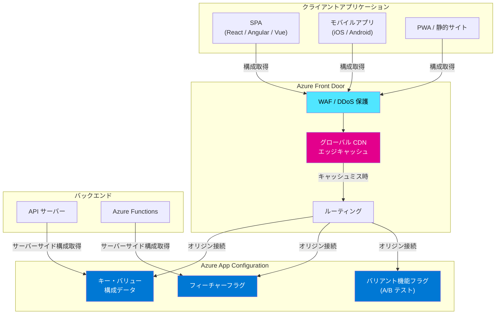

# Azure App Configuration: Azure Front Door 統合によるクライアントサイド構成配信 (パブリックプレビュー)

**リリース日**: 2026-04-01

**サービス**: Azure App Configuration

**機能**: Azure Front Door 統合によるクライアントサイドアプリケーションへの動的構成配信

**ステータス**: In preview

[このアップデートのインフォグラフィックを見る](https://takech9203.github.io/azure-news-summary/20260401-app-configuration-front-door-integration.html)

## 概要

Azure App Configuration と Azure Front Door の統合機能がパブリックプレビューとして発表された。この統合により、動的な構成データをクライアントサイドアプリケーションに対して、CDN スケールで安全に配信することが可能になる。

従来、Azure App Configuration はサーバーサイドアプリケーションからの利用が主なユースケースであり、クライアントサイドアプリケーション (SPA、モバイルアプリなど) から直接構成データを取得する場合、スケーラビリティやセキュリティの課題があった。今回の統合では、Azure Front Door のグローバル CDN インフラストラクチャを活用することで、構成データをエッジロケーションにキャッシュし、大規模なクライアントアプリケーションに対して低遅延で配信できるようになる。

この機能は、フィーチャーフラグ管理や A/B テストのシナリオにおいて特に有用であり、クライアントサイドでの機能制御をスケーラブルに実現するための重要な基盤となる。

**アップデート前の課題**

- クライアントサイドアプリケーションから Azure App Configuration への直接アクセスは、大量のリクエストが発生するとスロットリングやパフォーマンス低下のリスクがあった
- クライアントサイドでフィーチャーフラグや動的構成を利用する場合、独自のキャッシュレイヤーやプロキシを構築する必要があった
- クライアントサイドからの構成取得において、接続文字列やアクセスキーの露出リスクがあり、セキュリティ上の懸念があった
- グローバルに分散したクライアントアプリケーションに対する構成配信の遅延が大きかった

**アップデート後の改善**

- Azure Front Door の CDN インフラストラクチャを介して構成データを配信することで、大規模なクライアントリクエストにも対応可能になった
- 構成データがエッジロケーションにキャッシュされるため、クライアントへの配信遅延が大幅に低減される
- Front Door のセキュリティ機能 (WAF、DDoS 保護など) により、構成エンドポイントの保護が強化される
- クライアントサイドでのフィーチャーフラグ管理や A/B テストがスケーラブルに実現可能になった

## アーキテクチャ図

この図は、Azure App Configuration と Azure Front Door の統合アーキテクチャを示している。クライアントアプリケーション (SPA、モバイルアプリ、PWA) は Azure Front Door 経由で構成データにアクセスし、CDN エッジキャッシュ (ピンク色) により低遅延で配信される。バックエンドサービスは従来通り App Configuration に直接接続する。

## サービスアップデートの詳細

### 主要機能

1. **CDN スケールでのクライアントサイド構成配信**
   - Azure Front Door のグローバル CDN ネットワークを活用し、構成データをエッジロケーションにキャッシュして配信
   - 大量のクライアントからの同時リクエストに対応可能
   - クライアントアプリケーションの起動時やランタイム中の構成取得遅延を最小化

2. **クライアントサイドでのフィーチャーフラグ管理**
   - フィーチャーフラグの評価結果をクライアントサイドに配信し、UI の動的制御が可能
   - ターゲティングフィルターにより、特定のユーザーセグメントに対する機能の段階的ロールアウトを実現
   - キルスイッチとして機能し、問題発生時に即座に機能を無効化可能

3. **A/B テスト・実験の基盤**
   - バリアント機能フラグを活用した A/B テストをクライアントサイドで実施可能
   - ユーザートラフィックを異なるバリアントに分割し、メトリクスに基づいた意思決定を支援
   - 統計的に有意な結果を得るための実験フレームワークとの統合

4. **セキュアな構成配信**
   - Azure Front Door の WAF (Web Application Firewall) によるエンドポイント保護
   - クライアントサイドに配信する構成データの範囲を制御可能
   - 接続文字列やシークレットをクライアントに公開することなく構成を配信

## 技術仕様

| 項目 | 詳細 |
|------|------|
| ステータス | パブリックプレビュー |
| 統合サービス | Azure App Configuration + Azure Front Door |
| 配信方式 | CDN エッジキャッシュによるグローバル配信 |
| 対象クライアント | SPA、モバイルアプリ、PWA、静的 Web サイト |
| フィーチャーフラグ | 標準フィーチャーフラグ、バリアント機能フラグ対応 |
| フィーチャーフィルター | ターゲティング、タイムウィンドウ、カスタムフィルター |
| セキュリティ | Azure Front Door WAF、DDoS 保護 |
| プロトコル | HTTPS |

## メリット

### ビジネス面

- **A/B テストの迅速な実施**: バリアント機能フラグを活用し、UI の変更やビジネスロジックの検証をコード変更やデプロイなしに実施できる。これにより、プロダクトチームの実験サイクルが大幅に短縮される
- **段階的ロールアウト**: 新機能をユーザーの一部に対して段階的にリリースし、問題を早期に検知してリスクを低減できる
- **グローバル対応**: CDN による低遅延配信により、世界中のユーザーに対して一貫した構成体験を提供可能

### 技術面

- **スケーラビリティ**: CDN のキャッシュにより App Configuration ストアへの直接リクエスト数が大幅に削減され、スロットリングのリスクが低減される
- **低遅延**: エッジロケーションからの配信により、クライアントアプリケーションの構成取得時間が短縮される
- **運用の簡素化**: 独自のキャッシュレイヤーやプロキシサーバーの構築・運用が不要になる
- **セキュリティの向上**: Front Door の WAF と DDoS 保護により、構成エンドポイントへの不正アクセスを防止

## デメリット・制約事項

- パブリックプレビュー段階であり、SLA は提供されない。本番環境での利用には注意が必要
- CDN キャッシュの特性上、構成変更の即座の反映には伝搬遅延が発生する可能性がある
- クライアントサイドに配信する構成データは、機密情報を含まないよう設計する必要がある (接続文字列やシークレットはクライアントに配信すべきでない)
- Azure Front Door の追加コストが発生する

## ユースケース

### ユースケース 1: SPA でのフィーチャーフラグ管理

**シナリオ**: React ベースの SPA で新しい UI コンポーネントを段階的にロールアウトする。社内テスターには 100%、ベータユーザーには 50%、一般ユーザーには 10% の割合で新機能を表示する。

**効果**: コードのデプロイなしに機能の公開範囲を動的に制御でき、問題発生時にはフィーチャーフラグをオフにすることで即座にロールバック可能。Front Door 経由の配信により、大量のユーザーからのリクエストにも安定して対応できる。

### ユースケース 2: E コマースサイトでの A/B テスト

**シナリオ**: E コマースサイトのチェックアウトボタンのデザイン (色、配置、テキスト) を A/B テストし、コンバージョン率への影響を測定する。バリアント機能フラグを使用してユーザートラフィックを分割する。

**効果**: バリアント機能フラグにより、複数のデザインバリアントをクライアントサイドで動的に切り替え可能。テレメトリデータと組み合わせて統計的に有意な結果に基づいた意思決定を実現する。

### ユースケース 3: モバイルアプリのグローバル構成配信

**シナリオ**: グローバルに展開するモバイルアプリで、地域ごとの表示設定やプロモーション情報を動的に制御する。アプリの起動時に構成データを取得し、UI をパーソナライズする。

**効果**: Front Door のエッジロケーションからの配信により、世界中のユーザーに対して低遅延で構成データを提供。アプリの起動時間への影響を最小限に抑えつつ、リアルタイムに近い構成更新を実現する。

## 料金

本機能はパブリックプレビュー段階であり、統合機能自体の追加料金は発表されていない。以下の各サービスの料金が適用される。

**Azure App Configuration:**

| 項目 | Free | Standard |
|------|------|----------|
| 料金 | 無料 | 1 リソースあたり $1.20/日 |
| リクエスト数 | 1,000 リクエスト/日 | 30,000 リクエスト/時 |
| ストレージ | 10 MB | 1 GB |
| スナップショット | 1 | 含む |

**Azure Front Door**: Azure Front Door の料金は SKU (Standard / Premium)、データ転送量、リクエスト数に基づいて課金される。詳細は [Azure Front Door の料金ページ](https://azure.microsoft.com/pricing/details/frontdoor/) を参照されたい。

## 関連サービス・機能

- **Azure Front Door**: グローバル CDN およびロードバランサー。本統合でクライアントサイドへの構成配信のフロントエンドとして機能する
- **Azure App Configuration フィーチャーフラグ**: 機能の有効/無効を動的に制御するフィーチャーフラグ管理機能
- **Azure App Configuration 実験機能**: バリアント機能フラグを活用した A/B テスト・実験フレームワーク
- **Azure Key Vault**: App Configuration の Key Vault 参照機能により、シークレットを安全に管理。クライアントサイド配信ではなくサーバーサイドでの利用が推奨される

## 参考リンク

- [インフォグラフィック](https://takech9203.github.io/azure-news-summary/20260401-app-configuration-front-door-integration.html)
- [公式アップデート情報](https://azure.microsoft.com/updates?id=537234)
- [Azure App Configuration の概要 - Microsoft Learn](https://learn.microsoft.com/azure/azure-app-configuration/overview)
- [フィーチャー管理の概要 - Microsoft Learn](https://learn.microsoft.com/azure/azure-app-configuration/concept-feature-management)
- [Azure App Configuration の実験機能 - Microsoft Learn](https://learn.microsoft.com/azure/azure-app-configuration/concept-experimentation)
- [Azure App Configuration の料金](https://azure.microsoft.com/pricing/details/app-configuration/)
- [Azure Front Door の料金](https://azure.microsoft.com/pricing/details/frontdoor/)

## まとめ

Azure App Configuration と Azure Front Door の統合がパブリックプレビューとして公開された。この統合により、動的な構成データやフィーチャーフラグをクライアントサイドアプリケーションに対して CDN スケールで安全に配信できるようになる。SPA やモバイルアプリにおけるフィーチャーフラグ管理、A/B テスト、段階的ロールアウトなどのシナリオで特に有用であり、独自のキャッシュレイヤーを構築する必要がなくなる。プレビュー段階ではあるが、クライアントサイドでの機能管理を検討している場合は、早期に検証環境で評価することを推奨する。

---

**タグ**: `Azure App Configuration` `Azure Front Door` `フィーチャーフラグ` `A/B テスト` `CDN` `クライアントサイド構成` `パブリックプレビュー` `Feature Management`
