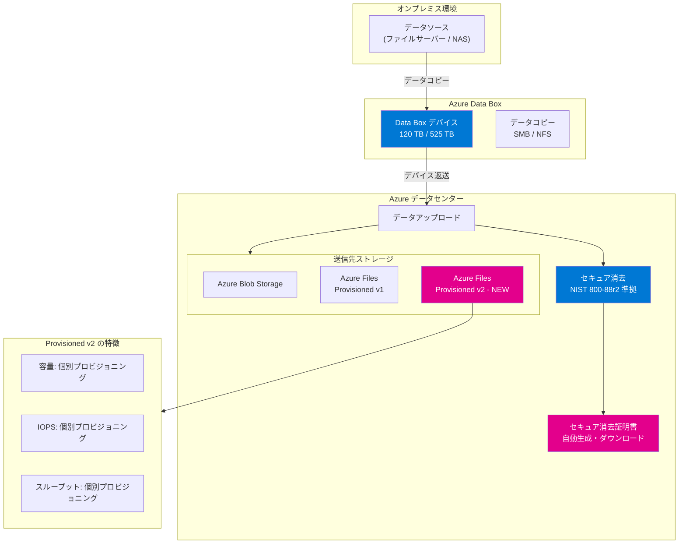

# Azure Data Box: セキュア消去証明書の自動生成と Azure Files Provisioned v2 対応

**リリース日**: 2026-04-01

**サービス**: Azure Data Box

**機能**: セキュア消去証明書の自動生成 / Azure Files Provisioned v2 ストレージアカウントへのデータ取り込み対応

**ステータス**: Launched (GA)

[このアップデートのインフォグラフィックを見る](https://takech9203.github.io/azure-news-summary/20260401-data-box-secure-erasure-files-v2.html)

## 概要

Azure Data Box に 2 つの機能強化が同時に一般提供 (GA) された。1 つ目はセキュア消去証明書 (Secure Erasure Certificate) の自動生成機能であり、2 つ目は Azure Files Provisioned v2 ストレージアカウントへのデータ取り込み対応である。

セキュア消去証明書の自動生成機能は、Data Box の注文完了時に NIST 800-88 Revision 2 準拠のデータ消去が実施されたことを証明する証明書を自動生成し、Azure ポータルからダウンロード可能にするものである。従来もデバイスのディスク消去は NIST 800-88r1 に従って実施されていたが、今回のアップデートでは最新の Revision 2 標準への準拠と、証明書の自動生成・ダウンロード機能が追加された。これにより、規制の厳しい業界におけるコンプライアンス対応が大幅に簡素化される。

Azure Files Provisioned v2 対応により、Data Box を使用して Azure Files Provisioned v2 ストレージアカウントにデータを直接取り込むことが可能になった。Provisioned v2 は容量・IOPS・スループットを個別にプロビジョニングして課金される課金モデルであり、ワークロードに応じた柔軟なリソース配分とコスト最適化を実現する。

**アップデート前の課題**

- Data Box のデータ消去に関するコンプライアンス証跡を手動で管理・取得する必要があり、監査対応に工数がかかっていた
- セキュア消去の証明は注文履歴のログに記録されるのみで、正式な証明書としてダウンロードできなかった
- Data Box から Azure Files にデータを転送する際、Provisioned v2 課金モデルのストレージアカウントを送信先として選択できなかった
- Provisioned v1 モデルではファイル共有のパフォーマンス設定がサイズに連動しており、必要以上の容量をプロビジョニングする場合があった

**アップデート後の改善**

- 注文完了時にセキュア消去証明書が自動生成され、Azure ポータルから直接ダウンロード可能になった
- 証明書には NIST 800-88 Revision 2 準拠のデータ消去方法、検証手法、デバイス情報が含まれ、監査対応が効率化された
- Data Box の送信先として Azure Files Provisioned v2 ストレージアカウントを選択可能になり、移行先の選択肢が拡大した
- Provisioned v2 の柔軟な課金モデルにより、容量・IOPS・スループットを個別に設定してコスト最適化が可能になった

## アーキテクチャ図



この図は、Azure Data Box のデータ移行ワークフローと今回のアップデートの位置付けを示している。オンプレミスのデータソースから Data Box デバイスにデータをコピーし、デバイスを Azure データセンターに返送すると、データが自動的にアップロードされる。アップロード完了後、NIST 800-88r2 に準拠したセキュア消去が実施され、証明書が自動生成される (ピンク色)。送信先として新たに Azure Files Provisioned v2 が選択可能になった (ピンク色)。

## サービスアップデートの詳細

### 主要機能

1. **セキュア消去証明書の自動生成**
   - Data Box の注文完了時に証明書が自動生成され、追加の操作は不要
   - Azure ポータルの注文詳細画面からダウンロード可能
   - NIST 800-88 Revision 2 標準に準拠した消去プロセスの証明
   - 証明書にはデバイスモデル、シリアル番号、ディスク情報、消去方法、検証手法、実施日時が記載される

2. **NIST 800-88r2 準拠のデータ消去**
   - Data Box 120 TB / 525 TB: ARCCONF 4.17.00 ツールによるブロック消去
   - Data Box Disk: MSECLI ツールによるブロック消去
   - 検証方法: ランダム 10% サンプリング + 二次 2% サンプリング
   - 消去方法: NIST 800-88 Purge レベル

3. **Azure Files Provisioned v2 へのデータ取り込み対応**
   - Data Box からの送信先として Provisioned v2 課金モデルの Azure Files ストレージアカウントを選択可能
   - 容量・IOPS・スループットを個別にプロビジョニングできる柔軟な課金モデル
   - SSD ベースのプレミアムファイル共有で利用可能

## 技術仕様

| 項目 | 詳細 |
|------|------|
| セキュア消去標準 | NIST SP 800-88 Revision 2 |
| 消去方法 | Block Erase (NIST 800-88 Purge レベル) |
| 消去ツール (Data Box 120/525) | ARCCONF 4.17.00 |
| 消去ツール (Data Box Disk) | MSECLI |
| 検証方法 | ランダム 10% サンプリング + 二次 2% サンプリング |
| 証明書形式 | Azure ポータルからダウンロード可能 |
| 対応 Data Box デバイス | Data Box 120 TB, Data Box 525 TB, Data Box Disk |
| Azure Files Provisioned v2 対応プロトコル | SMB |
| Provisioned v2 ストレージ階層 | SSD (プレミアム), HDD (スタンダード) |
| Data Box 最大容量 | 120 TB (Next-gen SKU 1), 525 TB (Next-gen SKU 2) |
| Data Box ネットワーク速度 | 最大 100 GbE (Next-gen), 最大 10 GbE (従来型) |
| データ転送速度 | 最大約 7 GB/s (SMB Direct on RDMA, 100 GbE) |

## 設定方法

### 前提条件

- Azure サブスクリプション (Data Box サービスが有効であること)
- Azure Files Provisioned v2 を利用する場合は FileStorage 種類のストレージアカウント (Provisioned v2 課金モデル)
- Azure ポータルへのアクセス権限

### Azure Portal

**セキュア消去証明書のダウンロード:**

1. Azure ポータルにサインインする
2. **Data Box** サービスに移動する
3. 完了済みの注文を選択する
4. 注文の詳細画面からセキュア消去証明書をダウンロードする

**Azure Files Provisioned v2 を送信先とした Data Box 注文:**

1. Azure ポータルで **Data Box** の注文を作成する
2. 送信先ストレージアカウントとして Provisioned v2 課金モデルの Azure Files ストレージアカウントを選択する
3. ファイル共有パスを指定してデータのマッピングを構成する
4. 注文を確定し、デバイスの配送を待つ

### Azure CLI

Data Box の注文作成は Azure ポータルから行う。Azure CLI での Data Box 注文管理の詳細は以下の公式ドキュメントを参照されたい。

```bash
# Data Box 注文の一覧表示
az databox job list --resource-group <resource-group-name>

# Data Box 注文の詳細表示
az databox job show --name <job-name> --resource-group <resource-group-name>
```

## メリット

### ビジネス面

- **コンプライアンス対応の自動化**: セキュア消去証明書の自動生成により、監査対応に必要な証跡の取得が自動化される。HIPAA、GDPR、金融規制など厳格なデータ保護要件を持つ業界でのデータ移行がより容易になる
- **運用コストの削減**: 証明書の手動取得・管理の工数が不要になり、コンプライアンス対応の運用負荷が軽減される
- **コスト最適化**: Provisioned v2 モデルにより、容量・IOPS・スループットを個別に設定できるため、過剰プロビジョニングを回避してストレージコストを最適化できる

### 技術面

- **NIST 800-88r2 準拠**: 最新のデータ消去標準に対応し、セキュリティ要件の高い環境でも安心して利用可能
- **柔軟なストレージ構成**: Provisioned v2 の個別プロビジョニングにより、移行先のファイル共有をワークロード特性に合わせて最適に構成可能
- **データ移行パスの拡大**: Data Box から Provisioned v2 ストレージアカウントへの直接取り込みが可能になり、移行後のストレージ再構成が不要

## デメリット・制約事項

- セキュア消去証明書はデバイスがAzure データセンターに返却され、消去プロセスが完了した後にのみ利用可能となる
- Azure Files Provisioned v2 の classic file shares は FileStorage 種類のストレージアカウントが必要であり、pay-as-you-go モデルとの混在はストレージアカウント単位で管理が必要
- Data Box デバイスのコマース境界を超えた配送は対応していない (データ転送はAzureネットワーク経由で跨境可能)
- Data Box は OS ディスクとしてのデータ移行には対応しておらず、ファイルデータの移行に特化している
- Provisioned v2 の Microsoft.FileShares (新リソースプロバイダー) は現時点でプレビューであり、SMB プロトコルは未対応 (NFS のみ)。Data Box での Provisioned v2 対応は Microsoft.Storage リソースプロバイダー経由の classic file shares が対象

## ユースケース

1. **規制産業でのデータセンター移行**: 金融機関や医療機関がオンプレミスのファイルサーバーを Azure に移行する際、Data Box で大量データを転送し、セキュア消去証明書で監査要件を満たす
2. **メディア・コンテンツ管理**: 大量の映像・画像データを Azure Files に移行し、Provisioned v2 でストリーミングに必要な IOPS とスループットを個別に確保する
3. **バックアップ・アーカイブ移行**: オンプレミスのバックアップデータを Azure Files に移行し、コンプライアンスに必要な消去証明を自動取得する
4. **ハイブリッドクラウド環境の構築**: Azure File Sync と組み合わせて大量の初期データを Data Box で移行し、以降は差分を同期する

## 料金

Data Box の料金はデバイスの種類 (Data Box 120 TB / 525 TB / Disk) と利用リージョンによって異なる。詳細は以下の公式料金ページを参照されたい。

- [Azure Data Box の料金](https://azure.microsoft.com/pricing/details/databox/)

Azure Files Provisioned v2 の料金は、プロビジョニングした容量・IOPS・スループットに基づいて課金される。詳細は以下を参照されたい。

- [Azure Files の料金](https://azure.microsoft.com/pricing/details/storage/files/)

## 利用可能リージョン

Azure Data Box の利用可能リージョンはサービスがデプロイされているリージョン、デバイスの配送先の国/地域、および送信先ストレージアカウントの所在リージョンに依存する。詳細は以下を参照されたい。

- [Azure Data Box のリージョン別利用可能状況](https://azure.microsoft.com/global-infrastructure/services/?products=databox&regions=all)

Azure Files Provisioned v2 は FileStorage ストレージアカウントで利用可能であり、Azure Files がサポートされるすべてのリージョンで使用できる。

## 関連サービス・機能

- **Azure Blob Storage**: Data Box の主要な送信先ストレージサービス
- **Azure File Sync**: Azure Files のオンプレミスキャッシュ機能。Data Box での初期データ移行後の差分同期に利用可能
- **Azure Backup**: Data Box を使用したオフラインバックアップの初期シード
- **Azure Key Vault**: Data Box のカスタマーマネージド暗号化キーの管理
- **Azure Data Box Disk**: より小規模なデータ移行向けの SSD ベースデバイス

## 参考リンク

- [Azure Data Box の概要 - Microsoft Learn](https://learn.microsoft.com/azure/databox/data-box-overview)
- [Azure Data Box のセキュリティとデータ保護 - Microsoft Learn](https://learn.microsoft.com/azure/databox/data-box-security)
- [Azure Files のデプロイ計画 - Microsoft Learn](https://learn.microsoft.com/azure/storage/files/storage-files-planning)
- [Azure Files の課金モデル - Microsoft Learn](https://learn.microsoft.com/azure/storage/files/understanding-billing)
- [Azure Data Box Secure Erasure Certificate アップデート](https://azure.microsoft.com/updates?id=559772)
- [Azure Data Box Azure Files Provisioned v2 対応アップデート](https://azure.microsoft.com/updates?id=559767)
- [NIST SP 800-88 Revision 2 - Guidelines for Media Sanitization](https://nvlpubs.nist.gov/nistpubs/SpecialPublications/NIST.SP.800-88r2.pdf)

## まとめ

Azure Data Box に 2 つの重要な機能強化が一般提供された。セキュア消去証明書の自動生成機能は、NIST 800-88 Revision 2 に準拠したデータ消去の証明を自動化し、規制の厳しい業界でのコンプライアンス対応を大幅に簡素化する。証明書にはデバイス情報、消去方法、検証手法が記載され、Azure ポータルから直接ダウンロードできる。Azure Files Provisioned v2 対応により、Data Box を使用したデータ移行先の選択肢が拡大し、容量・IOPS・スループットを個別にプロビジョニングできる柔軟な課金モデルを活用した移行が可能になった。これら 2 つのアップデートにより、大規模データ移行のセキュリティ保証とストレージ構成の柔軟性が同時に向上した。

---

**タグ**: `Azure Data Box` `Migration` `Storage` `セキュア消去` `NIST 800-88` `コンプライアンス` `Azure Files` `Provisioned v2` `GA`
