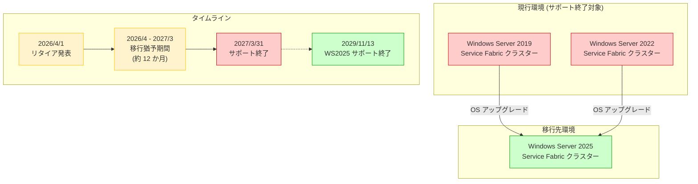

# Azure Service Fabric: Windows Server 2019/2022 サポート終了 - Windows Server 2025 へのアップグレードが必要

**リリース日**: 2026-04-01

**サービス**: Azure Service Fabric

**機能**: Windows Server 2019 および Windows Server 2022 上の Service Fabric クラスターサポート終了

**ステータス**: Retirement

[このアップデートのインフォグラフィックを見る](https://takech9203.github.io/azure-news-summary/20260401-service-fabric-windows-server-retirement.html)

## 概要

Microsoft は、Azure Service Fabric における Windows Server 2019 および Windows Server 2022 上で稼働するクラスターのサポートを 2027 年 3 月 31 日に終了することを発表した。この日以降、これらの OS バージョン上で動作する Service Fabric クラスターはサポート対象外となる。

対象となるすべてのクラスターは、サポート対象の状態を維持するために 2027 年 3 月 31 日までに Windows Server 2025 へアップグレードする必要がある。Windows Server 2025 上の Service Fabric サポートは 2029 年 11 月 13 日まで継続される予定であり、十分な余裕を持った移行計画が可能である。

本リタイアは、Windows Server 自体のライフサイクルに基づくものであり、Service Fabric は特定の OS バージョンのサポートが End of Life に達した時点で、その OS 上でのサポートを終了するポリシーを採用している。

## アーキテクチャ図



Windows Server 2019 および 2022 上の Service Fabric クラスターから Windows Server 2025 への移行パスを示している。2027 年 3 月 31 日のサポート終了までに OS のアップグレードを完了する必要がある。

## サービスアップデートの詳細

### 主要な変更点

1. **Windows Server 2019 上の Service Fabric サポート終了**
   - 2027 年 3 月 31 日をもって、Windows Server 2019 上で稼働する Service Fabric クラスターのサポートが終了する
   - サポート終了後はセキュリティ更新やバグ修正が提供されなくなる

2. **Windows Server 2022 上の Service Fabric サポート終了**
   - 同じく 2027 年 3 月 31 日をもって、Windows Server 2022 上で稼働する Service Fabric クラスターのサポートが終了する
   - Windows Server 2022 は比較的新しい OS であるが、Service Fabric のサポートポリシーに基づきサポートが終了する

3. **Windows Server 2025 への移行が必須**
   - サポート対象の状態を維持するには、Windows Server 2025 へのアップグレードが必要
   - Windows Server 2025 上の Service Fabric サポートは 2029 年 11 月 13 日まで継続される

## 技術仕様

| 項目 | 詳細 |
|------|------|
| 対象サービス | Azure Service Fabric |
| 対象 OS (リタイア) | Windows Server 2019、Windows Server 2022 |
| サポート終了日 | 2027 年 3 月 31 日 |
| 移行先 OS | Windows Server 2025 |
| 移行先サポート終了日 | 2029 年 11 月 13 日 |
| 移行猶予期間 | 約 12 か月 (2026 年 4 月 ~ 2027 年 3 月) |
| 現行最新ランタイム | Service Fabric 11.x (11 CU4) |
| 対象カテゴリ | Compute、Containers |

### Windows Server 別 Service Fabric サポート終了日一覧

| OS バージョン | Service Fabric サポート終了日 |
|------|------|
| Windows Server 2025 | 2029/11/13 |
| Windows Server 2022 | 2027/3/31 |
| Windows Server 2019 | 2027/3/31 |
| Windows Server 2016 | 2027/1/12 |

## 設定方法

### 前提条件

1. 現在のクラスターがサポート対象の Service Fabric ランタイムバージョンで稼働していること
2. クラスターのヘルスステータスが正常であること
3. アップグレード先の Service Fabric ランタイムバージョンが Windows Server 2025 と互換性があること

### Azure マネージドクラスターの場合

Azure Portal または ARM テンプレートを使用して、クラスターの OS イメージを Windows Server 2025 に更新する。マネージドクラスターでは、Azure が Service Fabric ランタイムのアップグレードを自動的に管理する。

### スタンドアロンクラスターの場合

#### 1. 現在のバージョンの確認

```powershell
# クラスターに接続
Connect-ServiceFabricCluster -ConnectionEndpoint "yourcluster:19000"

# 現在のクラスターバージョンを確認
Get-ServiceFabricClusterUpgrade
```

#### 2. アップグレード可能なバージョンの確認

```powershell
# アップグレード可能な Service Fabric バージョンを一覧表示
Get-ServiceFabricRegisteredClusterCodeVersion
```

#### 3. OS のアップグレード

Windows Server 2025 への OS アップグレードを実施する。Service Fabric クラスターでは、各ノードを順番にアップグレードするローリングアップグレード方式を推奨する。

#### 4. Service Fabric ランタイムのアップグレード

```powershell
# Service Fabric ランタイムをアップグレード
Start-ServiceFabricClusterUpgrade -Code -CodePackageVersion <version> -Monitored -FailureAction Rollback

# アップグレードの進捗を確認
Get-ServiceFabricClusterUpgrade
```

### 自動アップグレードの設定

クラスター構成で `fabricClusterAutoupgradeEnabled` を `true` に設定すると、新しい Service Fabric バージョンがリリースされた際に自動的にアップグレードが実行される。

```json
{
    "fabricClusterAutoupgradeEnabled": true
}
```

## メリット

### Windows Server 2025 へのアップグレードによるメリット

- **長期サポート**: Windows Server 2025 のサポートは 2029 年 11 月まで継続されるため、今後約 3 年半の安定した運用環境が確保される
- **セキュリティ強化**: Windows Server 2025 の最新セキュリティ機能により、クラスター全体のセキュリティ態勢が向上する
- **最新機能の活用**: Service Fabric の最新ランタイム (バージョン 11.x) との完全な互換性が保証される
- **パフォーマンス改善**: Windows Server 2025 の OS レベルでのパフォーマンス最適化の恩恵を受けられる

## デメリット・制約事項

- OS のアップグレードにはダウンタイムの計画が必要となる場合がある (特にスタンドアロンクラスター)
- アップグレード前にアプリケーションの Windows Server 2025 との互換性検証が必要となる
- スタンドアロンクラスターでは、各ノードの OS を個別にアップグレードする必要があり、大規模クラスターでは作業量が増大する
- 移行猶予期間が約 12 か月であるため、大規模環境では早期の計画着手が重要となる

## ユースケース

### ユースケース 1: Azure マネージドクラスターを運用する企業

**シナリオ**: Azure 上で Service Fabric マネージドクラスターを使用してマイクロサービスアプリケーションを運用しており、現在 Windows Server 2022 ベースのノードを使用しているケース

**対応**: Azure Portal またはARM テンプレートを通じてクラスターの OS SKU を Windows Server 2025 に変更する。マネージドクラスターでは Azure がローリングアップグレードを自動的に管理するため、ダウンタイムを最小限に抑えられる

### ユースケース 2: オンプレミスのスタンドアロンクラスターを運用する企業

**シナリオ**: 自社データセンターで Service Fabric スタンドアロンクラスターを Windows Server 2019 上で運用しており、業務基幹システムのマイクロサービスをホストしているケース

**対応**: まずテスト環境で Windows Server 2025 への OS アップグレードとアプリケーション互換性を検証する。検証完了後、本番環境でノードごとのローリングアップグレードを計画的に実施する。Service Fabric ランタイムのバージョンも最新のサポート対象バージョンに更新する

## 関連サービス・機能

- **Azure Virtual Machine Scale Sets**: Service Fabric クラスターの基盤となるインフラストラクチャ。OS イメージの更新はスケールセットレベルで管理される
- **Azure Service Fabric Managed Clusters**: Microsoft がインフラストラクチャ管理を担当するマネージドサービス。OS のアップグレードがより簡素化される
- **Windows Server 2025**: 移行先 OS。Service Fabric のサポートが 2029 年 11 月 13 日まで継続される

## 参考リンク

- [インフォグラフィック](https://takech9203.github.io/azure-news-summary/20260401-service-fabric-windows-server-retirement.html)
- [公式アップデート情報 - Windows Server 2022 サポート終了](https://azure.microsoft.com/updates?id=558247)
- [公式アップデート情報 - Windows Server 2019 サポート終了](https://azure.microsoft.com/updates?id=558246)
- [Azure Service Fabric バージョンおよびサポート対象 OS - Microsoft Learn](https://learn.microsoft.com/en-us/azure/service-fabric/service-fabric-versions)
- [スタンドアロンクラスターのバージョンアップグレード - Microsoft Learn](https://learn.microsoft.com/en-us/azure/service-fabric/service-fabric-cluster-upgrade-windows-server)
- [Service Fabric クラスターアップグレードの管理 - Microsoft Learn](https://learn.microsoft.com/en-us/azure/service-fabric/service-fabric-cluster-upgrade-version-azure)

## まとめ

Azure Service Fabric は、Windows Server 2019 および Windows Server 2022 上で稼働するすべてのクラスターのサポートを 2027 年 3 月 31 日に終了する。サポート対象を維持するためには、この日までに Windows Server 2025 へのアップグレードが必要である。

移行猶予期間は約 12 か月であるため、特に大規模なクラスターを運用している場合やスタンドアロンクラスターを使用している場合は、早期にアップグレード計画を策定し、テスト環境での検証を開始することを推奨する。Windows Server 2025 への移行により、2029 年 11 月 13 日までの長期サポートが確保されるほか、最新の OS 機能やセキュリティ改善の恩恵を受けることができる。

---

**タグ**: #Azure #ServiceFabric #Compute #Containers #WindowsServer #Retirement #Migration #WindowsServer2025 #WindowsServer2022 #WindowsServer2019
