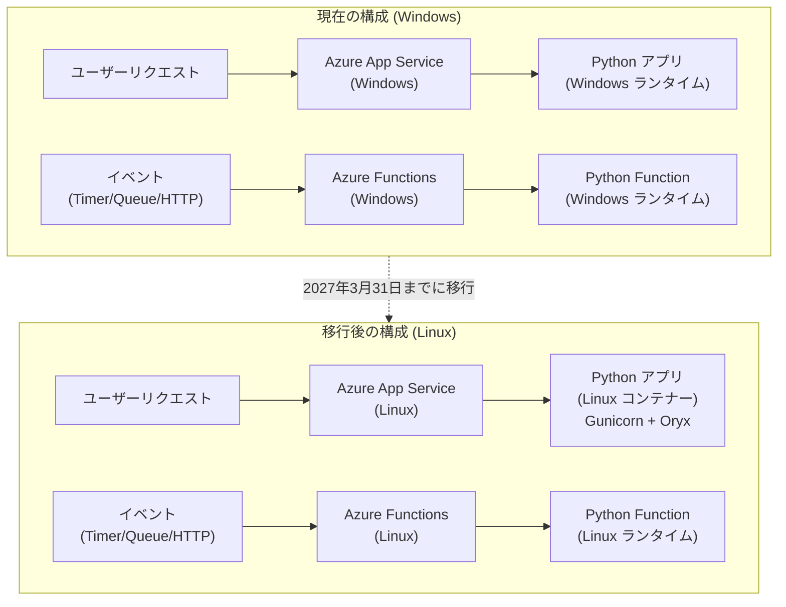

# Azure App Service / Azure Functions: Windows 上の Python サポート廃止予告

**リリース日**: 2026-04-02

**サービス**: Azure App Service, Azure Functions

**機能**: Windows 上の Python サポートの廃止

**ステータス**: Retirement (廃止予告)

[このアップデートのインフォグラフィックを見る](https://takech9203.github.io/azure-news-summary/20260402-app-service-functions-python-windows-retirement.html)

## 概要

Microsoft は、**Azure App Service on Windows** および **Azure Functions on Windows** における Python サポートを **2027 年 3 月 31 日** をもって廃止することを発表した。この日以降、Windows 上でホストされている Python アプリケーションは実行されなくなる。

現在、Azure App Service における Python アプリケーションの実行は Linux が唯一の公式サポート対象 OS となっている。Microsoft Learn のドキュメントでも「Linux is the only operating system option for running Python apps in App Service」と明記されており、今回の廃止は既存の方針を完全に反映するものである。

廃止後もアプリケーションの構成およびコンテンツはそのまま保持されるが、アプリ自体は停止する。影響を受けるユーザーは、2027 年 3 月 31 日までに Linux ベースの App Service または Functions への移行を完了する必要がある。

**廃止による影響**

- Windows 上の Python アプリケーションが実行停止になる
- アプリケーションの構成とコンテンツは保持されるが、サービスは停止する
- 新規デプロイも Windows 上の Python では受け付けられなくなる

**移行後の改善**

- Linux 上では最新の Python バージョン (Python 3.14 を含む) がサポートされる
- Gunicorn、Oryx ビルドシステムなど、Linux 向けに最適化されたランタイム環境が利用可能
- Flask、Django、FastAPI などのフレームワークが公式にサポートされる

## アーキテクチャ図



この図は、Windows 上の Python アプリケーションから Linux ベースの環境への移行パスを示している。App Service と Functions の両方について、Linux への移行が必要となる。

## 廃止スケジュールと対応の詳細

### タイムライン

1. **2026 年 4 月 2 日**
   - 廃止予告の公式アナウンス

2. **2027 年 3 月 31 日**
   - Windows 上の Python サポートが完全に終了
   - Python アプリケーション (App Service on Windows) が実行停止
   - Python Function (Azure Functions on Windows) が実行停止
   - アプリケーションの構成とコンテンツは保持されるが、実行はされない

### 移行先の選択肢

1. **Azure App Service on Linux**
   - Linux コンテナー上で Python アプリを実行する公式サポート環境
   - Gunicorn WSGI HTTP Server がデフォルトの Web サーバーとして提供される
   - Oryx ビルドシステムによる自動依存関係インストール
   - Flask、Django、FastAPI を公式サポート

2. **Azure Functions on Linux**
   - Python v2 プログラミングモデル (デコレーターベース) を推奨
   - Flex Consumption プラン、Premium プラン、Dedicated プランが利用可能
   - Python 3.13 以降では依存関係の分離やランタイムバージョン管理が改善

3. **カスタムコンテナー**
   - 特殊な OS レベルのパッケージや Python ビルドが必要な場合
   - カスタム Docker イメージを作成して App Service 上で実行可能

## 技術仕様

| 項目 | 詳細 |
|------|------|
| 廃止対象 | Azure App Service on Windows での Python サポート |
| 廃止対象 | Azure Functions on Windows での Python サポート |
| サポート終了日 | 2027 年 3 月 31 日 |
| 廃止後の動作 | アプリ構成・コンテンツは保持されるが、アプリは実行停止 |
| 移行先 OS | Linux |
| Linux 上のデフォルト Web サーバー | Gunicorn (App Service) |
| ビルドシステム | Oryx (自動依存関係解決) |
| サポートされるフレームワーク | Flask, Django, FastAPI (App Service on Linux) |

## 対応方法

### 前提条件

1. Azure CLI がインストールされていること
2. 移行先のリソースグループおよび App Service プランが準備されていること
3. アプリケーションのソースコードが Git リポジトリで管理されていること

### Azure App Service の移行手順

#### 1. 現在の構成を確認

```bash
# 現在のアプリの OS とランタイムを確認
az webapp show --resource-group <ResourceGroup> --name <AppName> --query "[siteConfig.windowsFxVersion, kind]"
```

#### 2. Linux ベースの App Service を新規作成

```bash
# Linux App Service プランを作成
az appservice plan create --name <PlanName> --resource-group <ResourceGroup> --is-linux --sku B1

# Linux 上に Python Web アプリを作成
az webapp create --resource-group <ResourceGroup> --plan <PlanName> --name <NewAppName> --runtime "PYTHON|3.12"
```

#### 3. アプリケーション設定の移行

```bash
# 既存アプリの設定を取得
az webapp config appsettings list --resource-group <ResourceGroup> --name <OldAppName> --output json > appsettings.json

# 新しいアプリに設定を適用
az webapp config appsettings set --resource-group <ResourceGroup> --name <NewAppName> --settings @appsettings.json
```

#### 4. アプリケーションのデプロイ

```bash
# ローカル Git デプロイまたは az webapp up を使用
az webapp up --resource-group <ResourceGroup> --name <NewAppName> --runtime "PYTHON|3.12"
```

### Azure Functions の移行手順

```bash
# Linux 上に Function App を作成
az functionapp create --resource-group <ResourceGroup> --consumption-plan-location <Region> --runtime python --runtime-version 3.12 --functions-version 4 --name <NewFunctionAppName> --storage-account <StorageAccount> --os-type Linux
```

### Azure Portal

1. Azure Portal で新しい App Service リソースを作成し、OS として **Linux** を選択する
2. ランタイムスタックで **Python** および希望するバージョンを選択する
3. 既存アプリの環境変数とアプリケーション設定を新しいリソースにコピーする
4. デプロイセンターで継続的デプロイを設定する

## 移行時の注意点

### 技術面

- Windows と Linux でファイルパスの区切り文字が異なる (バックスラッシュ vs スラッシュ)
- Windows 固有の OS コマンドやパスに依存しているコードの修正が必要
- Linux では依存関係ファイル (requirements.txt, pyproject.toml, setup.py) がプロジェクトルートに配置されている必要がある
- Linux App Service ではアプリケーションは Docker コンテナー内で実行される
- デプロイ時のビルド自動化により、requirements.txt から依存関係が自動インストールされる

### 運用面

- カスタムドメインや SSL 証明書の再設定が必要になる場合がある
- アプリケーション設定 (環境変数) の移行漏れに注意する
- デプロイスロットの構成も再設定が必要
- Linux App Service では SSH によるコンテナーへの直接接続が可能

## 制約事項

- Linux App Service の Python はカスタム Windows コンテナーイメージをサポートしない (カスタム Docker イメージの場合は Linux コンテナーを使用)
- ビルド自動化が有効な場合、Python アプリケーションのコンテンツは `/tmp/<uid>` にデプロイされ、`/home/site/wwwroot` には配置されない
- PRE_BUILD_COMMAND および POST_BUILD_COMMAND ではプロジェクトルートからの相対パスを使用する必要がある
- Linux Consumption プランは 2028 年 9 月 30 日以降に廃止予定であり、Flex Consumption プランへの移行が推奨される

## ユースケース

### ユースケース 1: Django Web アプリケーションの移行

**シナリオ**: Windows App Service 上で Django アプリケーションを運用しており、Linux への移行が必要

**推奨アクション**:
- requirements.txt をプロジェクトルートに配置する
- wsgi.py が適切に構成されていることを確認する (Gunicorn が自動検出する)
- 静的ファイルの配信には WhiteNoise パッケージの使用を推奨
- データベース接続文字列などの環境変数を新しい Linux App Service に移行する

**効果**: Linux 上で最新の Python バージョンと最適化されたランタイム環境を利用可能

### ユースケース 2: Azure Functions Python アプリの移行

**シナリオ**: Windows 上の Azure Functions で Python 関数を実行しており、Linux への移行が必要

**推奨アクション**:
- Python v2 プログラミングモデル (デコレーターベース) への移行を検討する
- Linux ベースの Function App を新規作成し、コードをデプロイする
- 環境変数とアプリケーション設定を移行する
- Flex Consumption プランの採用を検討する (Linux Consumption プランは将来廃止予定のため)

**効果**: Python 3.13 以降の依存関係分離やランタイムバージョン管理などの最新機能が利用可能

## 関連サービス・機能

- **Azure App Service on Linux**: Python アプリケーションの公式実行環境。Gunicorn + Oryx による最適化されたランタイムを提供
- **Azure Functions on Linux**: サーバーレス Python 関数の実行環境。v2 プログラミングモデルを推奨
- **Azure Container Apps**: コンテナーベースのアプリケーション実行環境。より柔軟な構成が必要な場合の代替選択肢
- **Flex Consumption プラン**: Azure Functions の次世代ホスティングプラン。Linux Consumption プランからの移行先として推奨

## 参考リンク

- [インフォグラフィック](https://takech9203.github.io/azure-news-summary/20260402-app-service-functions-python-windows-retirement.html)
- [公式アップデート情報](https://azure.microsoft.com/updates?id=558027)
- [Azure App Service で Linux Python アプリを構成する - Microsoft Learn](https://learn.microsoft.com/azure/app-service/configure-language-python)
- [Azure Functions Python 開発者リファレンス - Microsoft Learn](https://learn.microsoft.com/azure/azure-functions/functions-reference-python)
- [Azure App Service Python クイックスタート - Microsoft Learn](https://learn.microsoft.com/azure/app-service/quickstart-python)
- [Azure Functions デプロイオプション - Microsoft Learn](https://learn.microsoft.com/azure/azure-functions/functions-deployment-technologies)

## まとめ

Azure App Service on Windows および Azure Functions on Windows における Python サポートは、**2027 年 3 月 31 日** をもって廃止される。廃止後、Windows 上の Python アプリケーションは実行停止となるが、構成とコンテンツは保持される。

推奨される次のアクションは以下の通り:

1. 現在 Windows 上で実行されている Python アプリケーションおよび Functions を特定する
2. Linux ベースの App Service または Functions への移行計画を策定する
3. アプリケーションコードの Windows 依存部分 (ファイルパス、OS コマンドなど) を修正する
4. 環境変数、カスタムドメイン、SSL 証明書などの構成を移行する
5. **2027 年 3 月 31 日までに移行を完了させる**

移行先としては Linux App Service が最も直接的な選択肢であり、Gunicorn と Oryx ビルドシステムによる最適化された Python 実行環境が提供される。Azure Functions の場合は Flex Consumption プランの採用も検討することを推奨する。

---

**タグ**: #AzureAppService #AzureFunctions #Python #Windows #Linux #Retirement #Migration #Compute #Web
