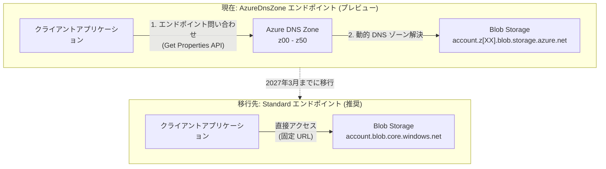

# Azure Blob Storage: AzureDnsZone エンドポイント (プレビュー) の廃止予告

**リリース日**: 2026-04-02

**サービス**: Azure Blob Storage

**機能**: AzureDnsZone エンドポイント (プレビュー) の廃止

**ステータス**: Retirement (廃止予告)

[このアップデートのインフォグラフィックを見る](https://takech9203.github.io/azure-news-summary/20260402-blob-storage-azuredns-endpoints-retirement.html)

## 概要

Azure Blob Storage アカウントの AzureDnsZone エンドポイント (プレビュー) が、**2027 年 3 月**をもって廃止されることが発表された。現在 AzureDnsZone エンドポイントを使用しているユーザーは、すべての新規および既存の Blob Storage アカウントのデプロイにおいて、Standard エンドポイントへの移行を行う必要がある。

AzureDnsZone エンドポイントは、1 サブスクリプション・1 リージョンあたり最大 5,000 のストレージアカウントを作成可能にするプレビュー機能として提供されていた。Standard エンドポイントでは既定で 250 (クォータ増加申請で最大 500) のストレージアカウントが作成可能である。AzureDnsZone エンドポイントでは `z00` から `z50` の DNS ゾーン識別子を含む動的な DNS ゾーンが割り当てられる仕組みであったが、今後は Standard エンドポイントの利用が推奨される。

本廃止はプレビュー機能の終了であり、Standard エンドポイントを使用している既存のストレージアカウントには影響がない。

**廃止の背景**

- AzureDnsZone エンドポイントはプレビュー段階にとどまり、GA (一般提供) には至らなかった
- Standard エンドポイントはクォータ増加申請により最大 500 アカウント/リージョンまで拡張可能
- AzureDnsZone エンドポイントはエンドポイント URL にゾーン識別子 (`z00`-`z50`) を含むため、アプリケーション側で実行時にエンドポイントを動的に取得する必要があった

**移行後の変更点**

- エンドポイント URL が `<account>.z[00-50].blob.storage.azure.net` 形式から `<account>.blob.core.windows.net` 形式に変更される
- アプリケーションコードやネットワーク構成で AzureDnsZone エンドポイント URL を参照している箇所の更新が必要
- Standard エンドポイントではストレージアカウント名からエンドポイント URL を直接構築可能になるため、実行時のエンドポイント問い合わせが不要になる

## アーキテクチャ図



この図は、AzureDnsZone エンドポイントから Standard エンドポイントへの移行を示している。AzureDnsZone エンドポイントでは動的に割り当てられた DNS ゾーンを介してアクセスしていたが、Standard エンドポイントでは固定の URL パターンで直接アクセスする。

## 廃止スケジュールと対応の詳細

### タイムライン

1. **2026 年 4 月 2 日**
   - AzureDnsZone エンドポイント (プレビュー) の廃止がアナウンスされる

2. **2027 年 3 月**
   - AzureDnsZone エンドポイント (プレビュー) が廃止される
   - AzureDnsZone エンドポイントを使用するストレージアカウントへのアクセスに影響が生じる可能性がある

### 必要なアクション

1. **影響範囲の特定**
   - AzureDnsZone エンドポイントを使用しているストレージアカウントを特定する
   - エンドポイント URL に `z[00-50].blob.storage.azure.net` パターンが含まれているアカウントが対象

2. **Standard エンドポイントへの移行**
   - 新規のストレージアカウントは Standard エンドポイントで作成する
   - 既存の AzureDnsZone エンドポイントを使用するアカウントは Standard エンドポイントのアカウントに移行する

3. **アプリケーションコードの更新**
   - エンドポイント URL の参照を Standard 形式に更新する
   - `Get Properties` API によるエンドポイント動的取得のロジックがある場合は簡略化を検討する

## 技術仕様

| 項目 | 詳細 |
|------|------|
| 廃止対象 | AzureDnsZone エンドポイント (プレビュー) |
| 廃止日 | 2027 年 3 月 |
| 影響範囲 | AzureDnsZone エンドポイントを使用する Blob Storage アカウント |
| 移行先 | Standard エンドポイント |
| Standard エンドポイント形式 | `https://<account>.blob.core.windows.net` |
| AzureDnsZone エンドポイント形式 | `https://<account>.z[00-50].blob.storage.azure.net` |
| Standard エンドポイントの上限 | 250 アカウント/リージョン/サブスクリプション (既定)、500 (クォータ増加時) |
| AzureDnsZone エンドポイントの上限 | 5,000 アカウント/リージョン/サブスクリプション (プレビュー) |

## 対応方法

### AzureDnsZone エンドポイント使用状況の確認

```bash
# サブスクリプション内のストレージアカウントのエンドポイント情報を取得
az storage account list --query "[].{name:name, primaryEndpoints:primaryEndpoints.blob}" -o table

# 特定のストレージアカウントのエンドポイントを確認
az storage account show --name <StorageAccountName> --resource-group <ResourceGroupName> --query "primaryEndpoints"
```

エンドポイント URL に `.z[00-50].blob.storage.azure.net` が含まれている場合、そのアカウントは AzureDnsZone エンドポイントを使用している。

### 新規ストレージアカウントの作成 (Standard エンドポイント)

```bash
# Standard エンドポイントでストレージアカウントを作成
az storage account create \
  --name <StorageAccountName> \
  --resource-group <ResourceGroupName> \
  --location <Region> \
  --sku Standard_LRS \
  --kind StorageV2
```

### データ移行

```bash
# AzCopy を使用して既存アカウントから新規アカウントへデータをコピー
azcopy copy "https://<source>.z[XX].blob.storage.azure.net/<container>" \
  "https://<destination>.blob.core.windows.net/<container>" \
  --recursive
```

## デメリット・制約事項

- Standard エンドポイントではサブスクリプション・リージョンあたりのストレージアカウント数の上限が 250 (最大 500) に制限される。AzureDnsZone エンドポイントの 5,000 アカウントと比較して大幅に少ない
- 既存のアカウントのエンドポイントタイプを直接変更することはできないため、新規アカウントの作成とデータ移行が必要
- エンドポイント URL が変更されるため、アプリケーション、ファイアウォールルール、DNS 設定、SAS トークンなどの更新が必要
- 多数のストレージアカウントを使用しているユーザーは、Standard エンドポイントのクォータ制限に抵触する可能性がある

## ユースケース

### ユースケース 1: 少数のストレージアカウントを AzureDnsZone エンドポイントで使用しているケース

**シナリオ**: プレビュー機能の検証目的で数個の AzureDnsZone エンドポイントのストレージアカウントを使用している

**推奨アクション**:
- Standard エンドポイントで新規ストレージアカウントを作成する
- AzCopy でデータを移行する
- アプリケーションのエンドポイント参照を更新する
- 移行完了後、旧アカウントを削除する

**効果**: 最小限の労力で Standard エンドポイントに移行可能

### ユースケース 2: 大量のストレージアカウントを運用しているケース

**シナリオ**: マルチテナントアプリケーションなどで 500 以上のストレージアカウントを 1 リージョンで運用しており、AzureDnsZone エンドポイントのスケーラビリティに依存している

**推奨アクション**:
- Standard エンドポイントのクォータ上限 (最大 500) を確認し、必要に応じてクォータ増加を申請する
- 複数サブスクリプションへのストレージアカウント分散を検討する
- Azure サポートに問い合わせて移行計画を策定する

**効果**: クォータ制限に対応しながら、サポートされるエンドポイントタイプへ移行可能

## 関連サービス・機能

- **Azure Blob Storage**: Azure の主要なオブジェクトストレージサービス。Standard エンドポイントが推奨される標準的なアクセス方法
- **Azure Data Lake Storage**: Blob Storage 上に構築されたビッグデータ分析向けストレージ。同様にエンドポイントタイプの影響を受ける
- **Azure Files**: ファイル共有サービス。AzureDnsZone エンドポイントの廃止は Azure Files のエンドポイントにも影響する可能性がある
- **Azure DNS**: Azure のドメインネームシステムサービス。AzureDnsZone エンドポイントの DNS ゾーン管理を担っていた

## 参考リンク

- [インフォグラフィック](https://takech9203.github.io/azure-news-summary/20260402-blob-storage-azuredns-endpoints-retirement.html)
- [公式アップデート情報](https://azure.microsoft.com/updates?id=558276)
- [ストレージアカウントの概要 - Microsoft Learn](https://learn.microsoft.com/en-us/azure/storage/common/storage-account-overview)
- [ストレージアカウントの作成 - Microsoft Learn](https://learn.microsoft.com/en-us/azure/storage/common/storage-account-create)
- [Azure Storage のクォータ増加申請 - Microsoft Learn](https://learn.microsoft.com/en-us/azure/quotas/storage-account-quota-requests)

## まとめ

Azure Blob Storage アカウントの AzureDnsZone エンドポイント (プレビュー) は、**2027 年 3 月**に廃止される。現在 AzureDnsZone エンドポイントを使用しているユーザーは、Standard エンドポイントへの移行が必要である。Standard エンドポイントはアカウント名から固定の URL パターンで直接アクセスできるため、アプリケーション実装が簡素化される。

推奨される次のアクションは以下の通り:

1. AzureDnsZone エンドポイントを使用しているストレージアカウントを特定する (エンドポイント URL に `.z[00-50].blob.storage.azure.net` パターンが含まれるアカウント)
2. Standard エンドポイントで新規ストレージアカウントを作成し、AzCopy 等でデータを移行する
3. アプリケーションコード、ネットワーク構成、SAS トークンなどのエンドポイント参照を更新する
4. **2027 年 3 月**までにすべての移行を完了させる

---

**タグ**: #AzureBlobStorage #AzureStorage #AzureDnsZone #Retirement #Endpoints #DNS #Migration
