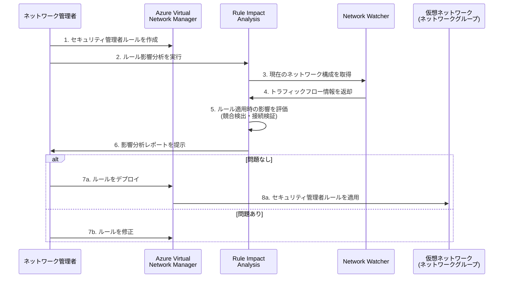

# Azure Network Watcher: ルール影響分析 (Rule Impact Analysis)

**リリース日**: 2026-04-06

**サービス**: Azure Network Watcher

**機能**: Rule Impact Analysis (ルール影響分析)

**ステータス**: In preview (パブリックプレビュー)

[このアップデートのインフォグラフィックを見る](https://takech9203.github.io/azure-news-summary/20260406-network-watcher-rule-impact-analysis.html)

## 概要

Azure Network Watcher に **Rule Impact Analysis (ルール影響分析)** 機能がパブリックプレビューとして追加された。この機能は、Azure Virtual Network Manager のセキュリティ管理者ルール (Security Admin Rules) を環境に適用する前に、その影響をプレビューすることを可能にする。

セキュリティ管理者ルールは、仮想ネットワーク全体にグローバルなセキュリティポリシーを強制する強力な機能であり、NSG (Network Security Group) よりも高い優先度で評価される。そのため、誤ったルールを適用すると広範囲にわたる接続障害を引き起こす可能性がある。Rule Impact Analysis は、ルールの動作を検証し、潜在的な競合を特定し、接続要件が満たされていることを事前に確認するための仕組みを提供する。

この機能により、ネットワーク管理者は「まず試してから適用する」というワークフローを実現でき、本番環境へのセキュリティポリシー適用をより安全に行えるようになる。

**アップデート前の課題**

- セキュリティ管理者ルールを適用する前に、その影響範囲を正確に把握する手段がなかった
- ルールの適用後に予期しない接続障害が発生するリスクがあった
- 既存の NSG ルールとの競合を事前に検知することが困難だった
- 大規模環境でのセキュリティポリシー変更に伴うリスク評価が手動で行われていた

**アップデート後の改善**

- ルール適用前に影響をプレビューし、問題を事前に発見できる
- 潜在的なルール競合を自動的に特定できる
- 接続要件が満たされているかを適用前に確認できる
- セキュリティポリシーの変更をより安全かつ確信を持って実施できる

## アーキテクチャ図



この図は、Rule Impact Analysis を使用したセキュリティ管理者ルールの適用ワークフローを示している。管理者はルールを作成した後、実際にデプロイする前に影響分析を実行し、問題がないことを確認してから適用を行う。

## サービスアップデートの詳細

### 主要機能

1. **ルール影響のプレビュー**
   - セキュリティ管理者ルールを実際に適用する前に、そのルールがネットワークトラフィックにどのような影響を与えるかをシミュレーションできる
   - 対象となるネットワークグループ内の仮想ネットワークに対する影響を可視化する

2. **ルール動作の検証**
   - 定義したルールが意図した通りに動作するかを事前に確認できる
   - Allow、Deny、Always Allow の各アクションが期待通りの結果をもたらすかを検証する

3. **競合の特定**
   - 新しいセキュリティ管理者ルールと既存のルールとの間の潜在的な競合を検出する
   - NSG ルールとの優先順位関係を考慮した競合分析を提供する

4. **接続要件の検証**
   - ルール適用後もサービスやアプリケーションに必要な接続が維持されるかを確認する
   - 重要な通信パスが意図せずブロックされないことを事前に検証する

## 技術仕様

| 項目 | 詳細 |
|------|------|
| 機能名 | Rule Impact Analysis |
| 対象サービス | Azure Network Watcher |
| 関連サービス | Azure Virtual Network Manager |
| 分析対象 | セキュリティ管理者ルール (Security Admin Rules) |
| ステータス | パブリックプレビュー |
| ルールのアクション種別 | Allow / Deny / Always Allow |
| ルール優先度範囲 | 1 - 4,096 |
| 対応プロトコル | TCP / UDP / ICMP / ESP / AH / Any |

## セキュリティ管理者ルールの背景

### ルールの評価順序

セキュリティ管理者ルールは NSG よりも高い優先度を持ち、先に評価される。Rule Impact Analysis はこの評価順序を考慮して影響を分析する。

| ルール種別 | 適用対象 | 評価順序 | アクション |
|-----------|---------|---------|----------|
| セキュリティ管理者ルール | 仮想ネットワーク | 高優先度 (先に評価) | Allow / Deny / Always Allow |
| NSG ルール | サブネット / NIC | 低優先度 (後に評価) | Allow / Deny |

### アクションの動作

- **Allow**: セキュリティ管理者ルールで許可された後、NSG ルールでさらに評価される
- **Deny**: トラフィックを即座にブロックし、NSG ルールの評価は行われない
- **Always Allow**: トラフィックを即座に許可し、NSG ルールの評価を完全にバイパスする

## 前提条件

1. Azure サブスクリプションが必要
2. Azure Virtual Network Manager インスタンスが作成済みであること
3. ネットワークグループが構成されていること
4. Azure Network Watcher がリージョンで有効化されていること

## メリット

### ビジネス面

- セキュリティポリシー変更に伴うダウンタイムリスクの低減
- 本番環境への影響を事前に把握することで、変更管理プロセスの品質向上
- セキュリティインシデントの予防による運用コストの削減
- コンプライアンス要件への適合を事前に検証可能

### 技術面

- ルール適用前の影響シミュレーションによる安全なデプロイメント
- 既存 NSG ルールとセキュリティ管理者ルールの競合を自動検出
- 大規模環境 (複数の仮想ネットワーク・ネットワークグループ) でのルール検証を効率化
- ネットワークセキュリティのガバナンス強化

## デメリット・制約事項

- パブリックプレビュー段階のため、SLA の対象外である可能性がある
- セキュリティ管理者ルールは一部サービスのサブネット (Azure Application Gateway、Azure Bastion、Azure Firewall、Azure VPN Gateway 等) には適用されない
- Azure SQL Managed Instances や Azure Databricks を含む仮想ネットワークにはデフォルトでセキュリティ管理者ルールが適用されない
- プライベートエンドポイントにはセキュリティ管理者ルールが適用されない
- セキュリティ管理者ルールは最終的な整合性モデル (Eventual Consistency) を使用しており、適用に若干の遅延がある

## ユースケース

### ユースケース 1: 高リスクポートのブロック検証

**シナリオ**: 組織全体で RDP (ポート 3389) や SSH (ポート 22) へのインターネットからのアクセスをブロックするセキュリティ管理者ルールを適用する前に、業務に影響がないか確認したい。

**実装例**:

```bash
# セキュリティ管理者構成の作成
az network manager security-admin-config create \
  --resource-group myResourceGroup \
  --network-manager-name myNetworkManager \
  --configuration-name blockHighRiskPorts \
  --description "Block high-risk ports from internet"

# ルールコレクションとルールを作成後、
# Rule Impact Analysis でデプロイ前に影響を分析
```

**効果**: RDP/SSH ブロックルールの適用前に、VPN 経由の管理アクセスや例外が必要なワークロードを特定でき、接続障害を未然に防止できる。

### ユースケース 2: ネットワークセグメンテーションの導入

**シナリオ**: 開発環境と本番環境の仮想ネットワーク間の通信を制限するセキュリティ管理者ルールを適用する際、CI/CD パイプラインやモニタリングツールの通信が遮断されないか事前に確認したい。

**効果**: セグメンテーションルールの影響を事前に分析し、必要な通信パスを維持しつつ、不要な通信を遮断するルールを安全に導入できる。

## 関連サービス・機能

- **Azure Virtual Network Manager**: セキュリティ管理者ルールを管理するサービス。Rule Impact Analysis はこのサービスで作成されたルールの影響を分析する
- **Network Security Group (NSG)**: サブネット・NIC レベルのセキュリティルール。セキュリティ管理者ルールとの評価順序を理解することが重要
- **Azure Network Watcher**: ネットワーク診断・監視サービス。Rule Impact Analysis はこのサービスの新機能として提供される
- **IP Flow Verify**: Network Watcher の既存機能。特定の IP フローが許可/拒否されるかを検証する関連機能

## 参考リンク

- [インフォグラフィック](https://takech9203.github.io/azure-news-summary/20260406-network-watcher-rule-impact-analysis.html)
- [公式アップデート情報](https://azure.microsoft.com/updates?id=559876)
- [Azure Network Watcher ドキュメント](https://learn.microsoft.com/azure/network-watcher/)
- [セキュリティ管理者ルールの概念](https://learn.microsoft.com/azure/virtual-network-manager/concept-security-admins)
- [セキュリティ管理者ルールでトラフィックをブロックする方法](https://learn.microsoft.com/azure/virtual-network-manager/how-to-block-network-traffic-portal)

## まとめ

Azure Network Watcher の Rule Impact Analysis は、セキュリティ管理者ルールの適用前に影響をプレビューできる重要な機能である。セキュリティ管理者ルールは NSG よりも高い優先度で評価されるため、誤った適用は広範囲の接続障害を引き起こす可能性がある。本機能を活用することで、ルールの動作検証、競合検出、接続要件の確認を事前に行い、安全なセキュリティポリシーの展開が可能になる。

パブリックプレビュー段階であるため、まずは検証環境で機能を試し、Azure Virtual Network Manager を活用したセキュリティガバナンスのワークフローに組み込むことを推奨する。

---

**タグ**: #Azure #NetworkWatcher #VirtualNetworkManager #SecurityAdminRules #RuleImpactAnalysis #NetworkSecurity #Preview #Governance #Networking
