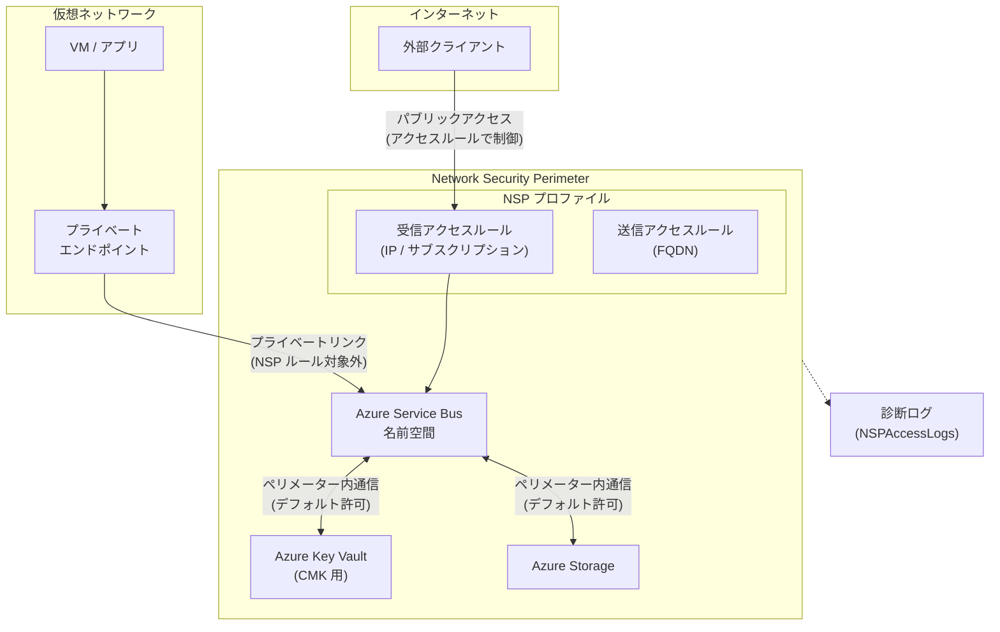

# Azure Service Bus: Network Security Perimeter の一般提供開始

**リリース日**: 2026-04-06

**サービス**: Azure Service Bus

**機能**: Network Security Perimeter (NSP) サポート

**ステータス**: Launched (GA)

[このアップデートのインフォグラフィックを見る](https://takech9203.github.io/azure-news-summary/20260406-service-bus-network-security-perimeter.html)

## 概要

Azure Service Bus における **Network Security Perimeter (NSP)** のサポートが一般提供 (GA) となった。Network Security Perimeter は、Azure PaaS リソースの周囲に論理的なネットワーク境界を作成し、不正なパブリックアクセスをブロックする機能である。

Service Bus 名前空間を Network Security Perimeter に関連付けることで、同一ペリメーター内の PaaS リソース間のみに通信が制限される。外部との通信が必要な場合は、明示的なアクセスルールを設定することで許可できる。これにより、データの漏洩リスクを大幅に軽減しつつ、必要な接続性を維持することが可能となる。

この機能は Azure Private Link の一部として提供され、仮想ネットワーク外にデプロイされた PaaS サービス間のセキュアな通信を実現する。Service Bus が Key Vault と連携してカスタマーマネージドキー (CMK) を使用する場合など、PaaS リソース間のアクセスパターンにも対応している。

**アップデート前の課題**

- Service Bus 名前空間へのパブリックアクセス制御が、IP ファイアウォールルールや仮想ネットワークサービスエンドポイント、プライベートエンドポイントなどの個別機能に依存していた
- 複数の PaaS リソース間の通信を一元的にセキュリティ管理する仕組みがなかった
- PaaS リソース間のデータ漏洩 (Data Exfiltration) リスクの統合的な管理が困難だった

**アップデート後の改善**

- 論理的なネットワーク境界により、Service Bus を含む複数の PaaS リソースを統合的に保護可能
- ペリメーター内のリソース間通信はデフォルトで許可、外部アクセスはデフォルトで拒否
- アクセスログによる監査・コンプライアンス対応が容易に
- Azure Portal、PowerShell、Azure CLI による一元管理が可能

## アーキテクチャ図



Network Security Perimeter は Service Bus 名前空間を含む PaaS リソースの周囲に論理境界を形成する。ペリメーター内のリソース間通信はデフォルトで許可され、外部からのパブリックアクセスはアクセスルールによって制御される。プライベートエンドポイント経由のトラフィックは NSP ルールの対象外として許可される。

## サービスアップデートの詳細

### 主要機能

1. **ペリメーター内リソース間通信**
   - 同一 NSP 内に関連付けられた PaaS リソース間の通信がデフォルトで許可される
   - Service Bus と Azure Key Vault 間の CMK 通信など、PaaS 間連携をセキュアに実現

2. **パブリックアクセスの明示的制御**
   - Enforced モードではペリメーター外からのパブリックトラフィックがデフォルトで拒否される
   - インバウンドルール (IP ベース / サブスクリプションベース) およびアウトバウンドルール (FQDN ベース) で例外を設定可能

3. **アクセスモード (Transition / Enforced)**
   - Transition モード (旧 Learning モード): 既存のアクセスパターンを分析するための推奨初期モード
   - Enforced モード: ペリメーター内トラフィックと明示的ルール以外のすべてのトラフィックを拒否

4. **診断ログ**
   - NSPAccessLogs テーブルを通じてアクセスログを収集可能
   - インバウンド/アウトバウンドの許可・拒否の各カテゴリでログを取得
   - Log Analytics、Azure Storage、Event Hubs へのログ送信に対応

5. **Service Bus 固有のシナリオ対応**
   - カスタマーマネージドキー (CMK) のための Azure Key Vault との通信をサポート

## 技術仕様

| 項目 | 詳細 |
|------|------|
| リソースタイプ | Microsoft.ServiceBus/namespaces |
| アクセスモード | Transition (旧 Learning) / Enforced |
| インバウンドルール | IP ベース、サブスクリプションベース |
| アウトバウンドルール | FQDN ベース |
| ペリメーターあたりの上限 (推奨) | サブスクリプションあたり 100 ペリメーター |
| プロファイル数上限 (推奨) | ペリメーターあたり 200 |
| ルール要素数上限 | プロファイルあたりインバウンド/アウトバウンド各 200 (ハードリミット) |
| PaaS リソース関連付け上限 (推奨) | ペリメーターあたり 1,000 |
| リソース名の長さ制限 | NSP 対応には 44 文字以内 |
| プライベートエンドポイント | NSP ルールの対象外 (常に許可) |

## 設定方法

### 前提条件

1. Azure サブスクリプション
2. Azure Service Bus 名前空間 (Standard / Premium)
3. Network Security Perimeter リソースの作成権限

### Azure CLI

```bash
# Network Security Perimeter の作成
az network perimeter create \
  --name myNSP \
  --resource-group myResourceGroup \
  --location japaneast

# プロファイルの作成
az network perimeter profile create \
  --perimeter-name myNSP \
  --resource-group myResourceGroup \
  --name myProfile

# Service Bus 名前空間をペリメーターに関連付け
az network perimeter association create \
  --perimeter-name myNSP \
  --resource-group myResourceGroup \
  --name myAssociation \
  --access-mode Transition \
  --profile myProfile \
  --private-link-resource "/subscriptions/{subscription-id}/resourceGroups/{rg}/providers/Microsoft.ServiceBus/namespaces/{namespace-name}"
```

### Azure Portal

1. Azure Portal で Service Bus 名前空間のページを開く
2. **設定** セクションの **ネットワーク** を選択
3. **パブリックアクセス** タブを選択
4. **Network Security Perimeter** セクションの **関連付け** を選択
5. **ネットワーク セキュリティ ペリメーターの選択** ダイアログで、関連付けるペリメーターを検索して選択
6. 名前空間に関連付けるプロファイルを選択
7. **関連付け** を選択して完了

## メリット

### ビジネス面

- PaaS リソース全体のネットワークセキュリティを一元管理でき、運用コスト削減に寄与
- アクセスログによる監査・コンプライアンス対応が容易になり、規制要件への適合を支援
- データ漏洩リスクの低減により、セキュリティインシデントの影響を最小化

### 技術面

- ペリメーター内のリソース間通信がデフォルトで許可されるため、複雑な個別ネットワークルール設定が不要
- Transition モードにより、既存のアクセスパターンを把握してから Enforced モードに移行可能
- プライベートエンドポイントとの併用が可能で、既存のネットワーク構成を維持しつつ追加のセキュリティレイヤーを提供
- 統一されたログスキーマにより、ペリメーター内の全 PaaS リソースのアクセス状況を一括で可視化

## デメリット・制約事項

- **Geo-Replication 非対応**: Azure Service Bus の Geo-Replication 機能は現時点で Network Security Perimeter に対応していない
- **プライベートエンドポイントは NSP ルール対象外**: プライベートエンドポイント経由のトラフィックは NSP アクセスルールでは制御されない
- **サービスエンドポイント非対応**: サービスエンドポイント経由のトラフィックは NSP ではサポートされず、インバウンドルールで 0.0.0.0/0 を許可していても拒否される場合がある。IaaS - PaaS 間通信にはプライベートエンドポイントの使用が推奨される
- **SAS トークン認証の制限**: ペリメーター内通信およびサブスクリプションベースのインバウンドルールでは SAS トークンによる認証がサポートされない。別の認証方法 (Microsoft Entra ID など) を使用する必要がある
- **リソース名の長さ制限**: NSP リソース関連付けの名前は `{resourceName}-{perimeter-guid}` 形式で最大 80 文字のため、リソース名は 44 文字以内に制限される
- **SDK による関連付け作成時の権限エラー**: SDK 経由での関連付け作成時に 403 エラーが発生する場合があり、`Microsoft.Network/locations/*/read` 権限の付与または `WaitUntil.Started` の使用が必要
- **ログ送信先の制約**: 診断ログの送信先 (Log Analytics Workspace、Storage、Event Hubs) は同一ペリメーター内に存在する必要がある
- **Azure Backup 非対応**: NSP が有効な Storage Account では Azure Backup はサポートされない

## ユースケース

### ユースケース 1: メッセージングシステムのデータ漏洩防止

**シナリオ**: 金融機関で Service Bus を使用したメッセージングシステムを運用しており、機密データの外部漏洩を防止する必要がある。Service Bus と Key Vault (暗号化キー管理) および Storage (メッセージアーカイブ) をペリメーターで保護する。

**実装例**:

```bash
# ペリメーターの作成
az network perimeter create \
  --name financial-nsp \
  --resource-group rg-finance \
  --location japaneast

# プロファイルの作成
az network perimeter profile create \
  --perimeter-name financial-nsp \
  --resource-group rg-finance \
  --name finance-profile

# Service Bus の関連付け
az network perimeter association create \
  --perimeter-name financial-nsp \
  --resource-group rg-finance \
  --name sb-association \
  --access-mode Enforced \
  --profile finance-profile \
  --private-link-resource "/subscriptions/{sub-id}/resourceGroups/rg-finance/providers/Microsoft.ServiceBus/namespaces/sb-finance"

# Key Vault の関連付け
az network perimeter association create \
  --perimeter-name financial-nsp \
  --resource-group rg-finance \
  --name kv-association \
  --access-mode Enforced \
  --profile finance-profile \
  --private-link-resource "/subscriptions/{sub-id}/resourceGroups/rg-finance/providers/Microsoft.KeyVault/vaults/kv-finance"
```

**効果**: Service Bus と Key Vault がペリメーター内で安全に通信でき、外部への不正なデータ送信がデフォルトでブロックされる。診断ログにより全アクセス試行を監査可能。

### ユースケース 2: 段階的なセキュリティ強化

**シナリオ**: 既存の Service Bus 環境に対して、サービスを停止させることなく段階的に NSP を導入したい場合。

**実装例**:

```bash
# まず Transition モードで関連付け (既存トラフィックへの影響なし)
az network perimeter association create \
  --perimeter-name myNSP \
  --resource-group myRG \
  --name sb-transition \
  --access-mode Transition \
  --profile myProfile \
  --private-link-resource "/subscriptions/{sub-id}/resourceGroups/myRG/providers/Microsoft.ServiceBus/namespaces/my-servicebus"

# 診断ログを有効化してアクセスパターンを分析
# ログ分析後、必要なアクセスルールを作成してから Enforced モードへ移行
```

**効果**: Transition モードでアクセスパターンを把握し、必要なアクセスルールを事前に設定してから Enforced モードに移行することで、サービス中断リスクを最小化できる。

## 料金

Network Security Perimeter 自体の追加料金に関する情報は、取得した公式ドキュメントからは確認できなかった。Service Bus の料金は既存の価格体系に従い、利用する SKU (Basic / Standard / Premium) に応じて課金される。最新の料金情報は [Azure Service Bus の料金ページ](https://azure.microsoft.com/pricing/details/service-bus/) を参照されたい。

## 利用可能リージョン

Network Security Perimeter は **すべての Azure パブリッククラウドリージョン** で一般提供されている。ただし、診断ログに使用する Log Analytics Workspace は Azure Monitor がサポートするリージョンに配置する必要がある。

## 関連サービス・機能

- **Azure Private Link / プライベートエンドポイント**: 仮想ネットワークから PaaS リソースへのプライベート接続を提供。NSP と併用可能で、プライベートエンドポイント経由のトラフィックは NSP ルール対象外
- **Azure Key Vault**: Service Bus の CMK (カスタマーマネージドキー) 暗号化で使用。同一ペリメーター内に配置することでセキュアな連携が可能
- **Azure Event Hubs**: 同様に NSP に対応済み (GA)。イベントストリーミングとメッセージングの統合シナリオで利用可能
- **Azure Storage**: NSP に対応済み (GA)。メッセージのアーカイブやログ保存先として利用可能
- **Azure Monitor / Log Analytics**: NSP の診断ログの収集・分析基盤。NSPAccessLogs テーブルでアクセスログを確認可能

## 参考リンク

- [インフォグラフィック](https://takech9203.github.io/azure-news-summary/20260406-service-bus-network-security-perimeter.html)
- [公式アップデート情報](https://azure.microsoft.com/updates?id=559899)
- [Microsoft Learn - Service Bus の Network Security Perimeter](https://learn.microsoft.com/azure/service-bus-messaging/network-security-perimeter)
- [Microsoft Learn - Network Security Perimeter の概要](https://learn.microsoft.com/azure/private-link/network-security-perimeter-concepts)
- [Microsoft Learn - NSP 診断ログ](https://learn.microsoft.com/azure/private-link/network-security-perimeter-diagnostic-logs)
- [Azure Service Bus の料金](https://azure.microsoft.com/pricing/details/service-bus/)

## まとめ

Azure Service Bus に対する Network Security Perimeter の GA により、Service Bus 名前空間を含む複数の PaaS リソースを論理的なネットワーク境界で統合的に保護できるようになった。従来の IP ファイアウォールやサービスエンドポイントによる個別管理から、ペリメーター単位での一元的なアクセス制御へと移行でき、データ漏洩防止と運用効率の両面で大きな改善が期待できる。

推奨される次のアクションとして、まず Transition モードで既存の Service Bus 名前空間を NSP に関連付け、アクセスパターンを分析した上で Enforced モードへの移行を計画することが望ましい。Geo-Replication を使用している環境では NSP が非対応であるため、別途ネットワークセキュリティ対策を検討する必要がある。また、SAS トークン認証を使用している場合は Microsoft Entra ID ベースの認証への移行を併せて検討されたい。

---

**タグ**: #Azure #ServiceBus #NetworkSecurityPerimeter #Security #Integration #GA #ネットワークセキュリティ #PaaS
