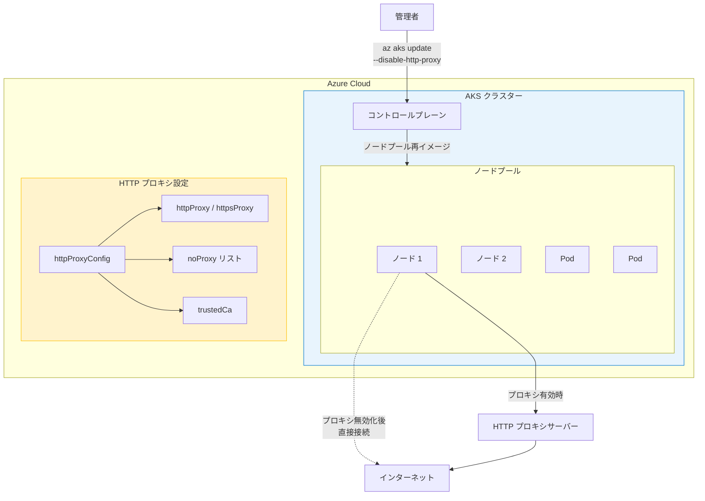

# Azure Kubernetes Service (AKS): HTTP プロキシの無効化

**リリース日**: 2026-04-07

**サービス**: Azure Kubernetes Service (AKS)

**機能**: HTTP プロキシの無効化 (Disable HTTP Proxy)

**ステータス**: Launched (GA)

[このアップデートのインフォグラフィックを見る](https://takech9203.github.io/azure-news-summary/20260407-aks-disable-http-proxy.html)

## 概要

Azure Kubernetes Service (AKS) において、既存のクラスターで HTTP プロキシ設定を無効化する機能が一般提供 (GA) となった。これまで AKS クラスターに HTTP プロキシを構成することは可能であったが、ネットワーク要件の変化に伴いプロキシ設定を削除・無効化する必要が生じた場合、実行中のクラスターに対してこの操作を行う公式な手段が限定されていた。

本アップデートにより、`az aks update --disable-http-proxy` コマンドまたは ARM テンプレートを使用して、稼働中の AKS クラスターから HTTP プロキシ設定を安全に無効化できるようになった。無効化後もプロキシ設定はデータベースに保存されるため、`--enable-http-proxy` フラグで再度有効化することも可能である。

**アップデート前の課題**

- HTTP プロキシを使用して送信トラフィックを制御している組織が、ネットワーク要件の変化に伴いプロキシ設定を変更・削除する際に手順が煩雑だった
- 実行中のクラスターでプロキシ設定を無効化する公式な手段が制限されていた
- プロキシ設定の変更がクラスターの運用に混乱を招く可能性があった

**アップデート後の改善**

- `az aks update --disable-http-proxy` コマンドで簡単にプロキシを無効化可能
- ARM テンプレートでも `httpProxyConfig.enabled` を `false` に設定することで無効化可能
- 無効化後も設定が保存されるため、`--enable-http-proxy` で迅速に再有効化可能
- Pod およびノードからプロキシ環境変数が自動的に削除される

## アーキテクチャ図



この図は、AKS クラスターにおける HTTP プロキシ設定の無効化フローを示している。管理者が `az aks update --disable-http-proxy` を実行すると、コントロールプレーンが全ノードプールを再イメージし、ノードおよび Pod からプロキシ環境変数が削除される。

## サービスアップデートの詳細

### 主要機能

1. **HTTP プロキシの無効化**
   - 稼働中の AKS クラスターで `az aks update --disable-http-proxy` を実行することで、HTTP プロキシ設定を無効化できる
   - 無効化すると、Pod およびノードから `HTTP_PROXY`、`HTTPS_PROXY`、`NO_PROXY` およびそれらの小文字版の環境変数が削除される

2. **HTTP プロキシの再有効化**
   - 無効化後も設定はデータベースに保存されるため、`az aks update --enable-http-proxy` で再度有効化可能
   - 再有効化時には以前の設定が自動的に適用されるが、現在の要件に合致するか事前に確認することが推奨される

3. **ARM テンプレートによる無効化**
   - `httpProxyConfig` の `enabled` プロパティを `false` に設定して ARM テンプレートをデプロイすることでも無効化可能

4. **Pod 単位のプロキシ環境変数注入制御**
   - Pod にアノテーション `"kubernetes.azure.com/no-http-proxy-vars":"true"` を設定することで、特定の Pod へのプロキシ環境変数の注入を無効化可能
   - Mutating Admission Webhook により環境変数が注入される仕組みを利用

## 技術仕様

| 項目 | 詳細 |
|------|------|
| 機能名 | Disable HTTP Proxy in AKS |
| 対象サービス | Azure Kubernetes Service (AKS) |
| ステータス | 一般提供 (GA) |
| 必要な Azure CLI バージョン | 2.85.0 以上 |
| プロキシ設定パラメータ | httpProxy, httpsProxy, noProxy, trustedCa |
| 環境変数 (Pod に注入) | HTTP_PROXY, http_proxy, HTTPS_PROXY, https_proxy, NO_PROXY, no_proxy |
| httpProxy URL スキーム | http のみ |
| 証明書形式 | PEM 形式 (base64 エンコード)、SAN 必須 |

## 設定方法

### 前提条件

1. Azure CLI バージョン 2.85.0 以上がインストールされていること
2. HTTP プロキシが構成済みの AKS クラスターが存在すること

### Azure CLI による HTTP プロキシの無効化

```bash
# HTTP プロキシを無効化
az aks update \
    --name $clusterName \
    --resource-group $resourceGroup \
    --disable-http-proxy
```

### Azure CLI による HTTP プロキシの再有効化

```bash
# HTTP プロキシを再有効化 (以前の設定が自動適用される)
az aks update \
    --name $clusterName \
    --resource-group $resourceGroup \
    --enable-http-proxy
```

### ARM テンプレートによる無効化

```json
"properties": {
    "httpProxyConfig": {
       "enabled": "false"
    }
}
```

### 無効化の確認方法

```bash
# Pod のプロキシ環境変数を確認
kubectl describe pod <pod-name> -n kube-system

# ノードの環境変数を確認
kubectl get nodes
kubectl node-shell <node-name>
cat /etc/environment
```

## メリット

### ビジネス面

- ネットワーク要件の変化に迅速に対応でき、運用の柔軟性が向上する
- プロキシ設定の変更に伴うダウンタイムリスクを軽減できる
- 再有効化機能により、一時的なネットワーク構成変更が容易になる

### 技術面

- 単一コマンドでプロキシの無効化が完了し、運用手順が簡素化される
- 設定がデータベースに保持されるため、再有効化時に再構成が不要
- ARM テンプレートによる Infrastructure as Code (IaC) ワークフローに対応
- Pod Disruption Budgets (PDB) を活用することで、再イメージ時のサービス中断を最小化可能

## デメリット・制約事項

- プロキシ設定の無効化・有効化時に全ノードプールが自動的に再イメージされるため、一時的なワークロードの中断が発生する可能性がある
- ノードプールごとに異なるプロキシ設定を構成することはサポートされていない
- ユーザー名/パスワード認証によるプロキシはサポートされていない
- Windows ノードプールを持つ AKS クラスターではサポートされていない
- Virtual Machine Availability Sets (VMAS) を使用するノードプールではサポートされていない
- `noProxy` でワイルドカード (`*`) をドメインサフィックスに付けて使用することはサポートされていない
- `noProxy` ホストは RFC 1123 に準拠する必要がある
- `no_proxy` の CIDR 表記は Go ベースのコンポーネントでは対応しているが、Curl や Python では対応していない

## ユースケース

### ユースケース 1: ネットワークアーキテクチャの移行

**シナリオ**: 企業がオンプレミスの HTTP プロキシ経由でインターネットアクセスを制御していたが、Azure Firewall への移行に伴い、AKS クラスターのプロキシ設定を削除する必要がある。

**実装例**:

```bash
# 既存クラスターの HTTP プロキシを無効化
az aks update \
    --name myAKSCluster \
    --resource-group myResourceGroup \
    --disable-http-proxy

# 無効化後、Pod の環境変数からプロキシ設定が削除されたことを確認
kubectl describe pod <pod-name> -n kube-system
```

**効果**: クラスターを再作成することなく、プロキシ設定をクリーンに削除でき、Azure Firewall への移行をスムーズに実施できる。

### ユースケース 2: 開発・テスト環境でのプロキシ設定の一時的な無効化

**シナリオ**: 開発チームが HTTP プロキシの障害をトラブルシューティングするために、一時的にプロキシを無効化してネットワーク接続を直接テストし、問題解決後にプロキシを再有効化する。

**実装例**:

```bash
# プロキシを一時的に無効化
az aks update --name devCluster --resource-group devRG --disable-http-proxy

# トラブルシューティング完了後、プロキシを再有効化
az aks update --name devCluster --resource-group devRG --enable-http-proxy
```

**効果**: 設定がデータベースに保持されるため、再有効化時に再構成不要で迅速に元の状態に復帰できる。

## 料金

HTTP プロキシの無効化機能自体に追加料金は発生しない。通常の AKS クラスターの料金体系が適用される。

## 関連サービス・機能

- **Azure Kubernetes Service (AKS) HTTP プロキシ構成**: HTTP プロキシの設定・更新を行う親機能。本アップデートは無効化と再有効化の機能を追加するもの
- **Azure Firewall**: AKS クラスターの送信トラフィック制御の代替手段。プロキシから Azure Firewall への移行シナリオに関連
- **Istio ベースのサービスメッシュアドオン**: Istio を使用している場合、外部リソースへのアクセスに HTTP プロキシを経由するための ServiceEntry 構成が必要
- **Pod Disruption Budgets (PDB)**: プロキシ設定変更時のノード再イメージに伴うワークロード中断を制御するための Kubernetes リソース

## 参考リンク

- [インフォグラフィック](https://takech9203.github.io/azure-news-summary/20260407-aks-disable-http-proxy.html)
- [公式アップデート情報](https://azure.microsoft.com/updates?id=557857)
- [Microsoft Learn - AKS HTTP プロキシの構成](https://learn.microsoft.com/azure/aks/http-proxy)
- [AKS 料金ページ](https://azure.microsoft.com/pricing/details/kubernetes-service/)

## まとめ

Azure Kubernetes Service (AKS) における HTTP プロキシの無効化機能が一般提供 (GA) となり、稼働中のクラスターでプロキシ設定を安全に無効化・再有効化できるようになった。`az aks update --disable-http-proxy` コマンドまたは ARM テンプレートにより、ネットワーク要件の変化に柔軟に対応できる。無効化時には全ノードプールが再イメージされるため、Pod Disruption Budgets (PDB) を活用してサービス中断を最小化することを推奨する。

ネットワークアーキテクチャの移行やトラブルシューティングなど、プロキシ設定の変更が必要なシナリオにおいて、クラスターの再作成を行うことなく柔軟に対応できる実用的な機能である。

---

**タグ**: #Azure #AKS #KubernetesService #HTTPProxy #Networking #Containers #Compute #GA
