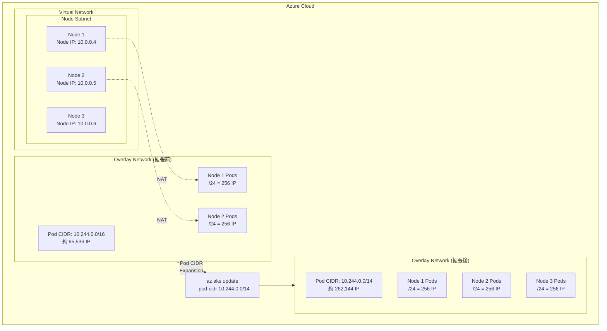

# Azure Kubernetes Service (AKS): Pod CIDR Expansion (Pod CIDR 拡張)

**リリース日**: 2026-04-07

**サービス**: Azure Kubernetes Service (AKS)

**機能**: Pod CIDR Expansion (Pod CIDR 拡張)

**ステータス**: Launched (GA)

[このアップデートのインフォグラフィックを見る](https://takech9203.github.io/azure-news-summary/20260407-aks-pod-cidr-expansion.html)

## 概要

Azure Kubernetes Service (AKS) において、**Pod CIDR Expansion (Pod CIDR 拡張)** 機能が一般提供 (GA) となった。この機能は、Azure CNI Overlay ネットワーキングを使用する AKS クラスターにおいて、Pod の IP アドレス範囲 (Pod CIDR) をクラスターの再構築なしにインプレースで拡張することを可能にする。

従来、AKS クラスターで Pod IP アドレスが枯渇した場合、チームはキャパシティを回復するために環境全体を再構築する必要があり、大きな運用上の中断を引き起こしていた。Pod CIDR Expansion により、Overlay ベースの AKS クラスターで Pod IP 範囲をインプレースで拡大できるようになり、この問題が解消される。

この機能は、クラスターのスケーリングに伴う IP アドレス計画の柔軟性を大幅に向上させ、大規模な Kubernetes 環境の運用を容易にするものである。

**アップデート前の課題**

- Pod IP アドレスが枯渇した場合、クラスター環境の再構築が必要だった
- 再構築に伴うダウンタイムや運用上の中断が発生していた
- クラスター作成時に十分な Pod CIDR を見積もる必要があり、初期の IP アドレス計画が困難だった
- スケールアウト時にノード追加のための `/24` アドレス空間が不足するリスクがあった

**アップデート後の改善**

- クラスターの再構築なしに Pod CIDR をインプレースで拡張可能
- Pod IP アドレス枯渇時の運用中断を回避できる
- 初期の IP アドレス計画に対する厳密さの要求が緩和される
- クラスターの成長に合わせて段階的に IP アドレス空間を拡大できる

## アーキテクチャ図



この図は、Azure CNI Overlay ネットワーキングにおける Pod CIDR 拡張の概念を示している。ノードは VNet サブネットから IP アドレスを取得し、Pod はオーバーレイネットワーク上のプライベート CIDR から IP を取得する。Pod CIDR Expansion により、このオーバーレイの IP 範囲をインプレースで拡大できる。

## サービスアップデートの詳細

### 主要機能

1. **インプレースでの Pod CIDR 拡張**
   - 既存の Azure CNI Overlay クラスターの Pod CIDR をクラスターの再作成なしに拡張できる
   - 拡張操作はクラスターの稼働中に実行可能であり、ワークロードへの影響を最小限に抑える

2. **Azure CNI Overlay ネットワーキングとの統合**
   - Overlay モードでは Pod にプライベート CIDR 空間から IP アドレスが割り当てられるため、VNet の IP アドレスを消費しない
   - 各ノードには Pod CIDR から `/24` のアドレス空間が割り当てられ、最大 250 Pod をサポートする

3. **段階的なスケーリング対応**
   - 初期に小さな Pod CIDR で開始し、需要に応じて拡張するアプローチが可能になる
   - クラスターの成長に合わせた柔軟な IP アドレス管理を実現する

## 技術仕様

| 項目 | 詳細 |
|------|------|
| 機能名 | Pod CIDR Expansion |
| 対象サービス | Azure Kubernetes Service (AKS) |
| 対象ネットワークモデル | Azure CNI Overlay (`--network-plugin-mode overlay`) |
| デフォルト Pod CIDR | `10.244.0.0/16` |
| ノードあたりの Pod CIDR | `/24` (固定、変更不可) |
| 最大 Pod 数/ノード | 250 (Azure CNI Overlay のデフォルトおよび最大値) |
| 最大ノード数 | 5,000 ノード (Azure CNI Overlay) |
| CIDR 拡張方向 | 拡張のみ (縮小は不可) |
| ステータス | 一般提供 (GA) |

## 設定方法

### 前提条件

1. Azure サブスクリプションが必要
2. Azure CLI バージョン 2.48.0 以降がインストールされていること
3. 既存の AKS クラスターが Azure CNI Overlay モードで構成されていること (`--network-plugin azure --network-plugin-mode overlay`)

### Azure CLI

```bash
# 既存の Azure CNI Overlay クラスターの Pod CIDR を拡張する
az aks update \
  --resource-group $RESOURCE_GROUP \
  --name $CLUSTER_NAME \
  --pod-cidr 10.244.0.0/14
```

```bash
# 新規クラスター作成時に Pod CIDR を指定する (参考)
az aks create \
  --name $CLUSTER_NAME \
  --resource-group $RESOURCE_GROUP \
  --location $REGION \
  --network-plugin azure \
  --network-plugin-mode overlay \
  --pod-cidr 192.168.0.0/16 \
  --generate-ssh-keys
```

## メリット

### ビジネス面

- クラスター再構築に伴うダウンタイムと運用コストの削減
- IP アドレス枯渇による緊急対応の回避
- 段階的なインフラ投資が可能になり、初期コストの最適化が図れる
- スケーリング計画の柔軟性向上によるビジネスの俊敏性の改善

### 技術面

- クラスターのライフサイクルを通じた IP アドレス管理の柔軟性
- VNet の IP アドレス空間に影響を与えずに Pod CIDR を拡張可能 (Overlay モードの利点)
- 既存ワークロードへの影響を最小限に抑えたインプレース拡張
- 最大 5,000 ノード、ノードあたり最大 250 Pod の大規模クラスターをサポート

## デメリット・制約事項

- Azure CNI Overlay モードのクラスターのみが対象であり、従来の Azure CNI (VNet モード) や kubenet では利用できない
- Pod CIDR は拡張のみ可能であり、縮小はサポートされない
- Pod CIDR は RFC 1918 および RFC 6598 のプライベートアドレス範囲を使用する必要がある (パブリック IP 範囲はサポート対象外)
- Pod CIDR はクラスターサブネット範囲、サービス CIDR 範囲、ピアリングされた VNet、およびオンプレミスネットワークと重複してはならない
- Azure CNI Overlay 自体の制約として、VM 可用性セット (Availability Sets) はサポートされない
- Azure CNI Overlay では DCsv2 シリーズの VM はノードプールで使用できない

## ユースケース

### ユースケース 1: 急成長するマイクロサービス環境

**シナリオ**: 初期にデフォルトの `/16` Pod CIDR で AKS クラスターを作成したが、マイクロサービスの増加に伴い Pod 数が急増し、IP アドレスの枯渇が近づいている。

**実装例**:

```bash
# 現在の Pod CIDR を /16 から /14 に拡張
az aks update \
  --resource-group myResourceGroup \
  --name myAKSCluster \
  --pod-cidr 10.244.0.0/14
```

**効果**: クラスターを再構築することなく、Pod IP アドレス空間を約 65,000 IP から約 262,000 IP に拡張でき、サービスの中断なしにスケーリングを継続できる。

### ユースケース 2: 段階的なクラスター成長計画

**シナリオ**: コスト最適化のため、初期段階では小規模な Pod CIDR で AKS クラスターを開始し、ビジネスの成長に合わせて IP アドレス空間を段階的に拡大したい。

**効果**: 初期の IP アドレス計画に過度な余裕を持たせる必要がなくなり、実際の需要に応じて Pod CIDR を段階的に拡張できるため、リソース計画がより現実的になる。

## 料金

Pod CIDR Expansion 機能自体に追加料金は発生しない。AKS の標準的な料金体系が適用される。

| 項目 | 料金 |
|------|------|
| AKS クラスター管理 | 無料 (Free tier) / Standard tier: $0.10/クラスター/時間 / Premium tier: $0.60/クラスター/時間 |
| ノード (VM) | 使用する VM SKU に応じた料金 |
| Pod CIDR Expansion | 追加料金なし |

## 利用可能リージョン

Azure CNI Overlay をサポートするすべての AKS 利用可能リージョンで使用可能。具体的なリージョン一覧については、公式ドキュメントを参照のこと。

## 関連サービス・機能

- **Azure CNI Overlay**: Pod CIDR Expansion の基盤となるネットワーキングモデル。Pod にプライベート CIDR 空間から IP を割り当て、VNet IP を消費しない
- **Azure CNI Powered by Cilium**: Cilium ベースの高度なネットワーキング機能を提供する AKS のネットワークプラグインオプション
- **Azure Virtual Network Manager**: VNet レベルのネットワーク管理サービス。AKS クラスターのネットワーク構成と連携する
- **Azure Monitor for Containers**: AKS クラスターの監視。Pod CIDR の使用状況の監視に活用可能

## 参考リンク

- [インフォグラフィック](https://takech9203.github.io/azure-news-summary/20260407-aks-pod-cidr-expansion.html)
- [公式アップデート情報](https://azure.microsoft.com/updates?id=557907)
- [Azure CNI Overlay ネットワーキングの構成](https://learn.microsoft.com/azure/aks/azure-cni-overlay)
- [Azure CNI Overlay ネットワーキングの概要](https://learn.microsoft.com/azure/aks/concepts-network-azure-cni-overlay)
- [AKS 料金ページ](https://azure.microsoft.com/pricing/details/kubernetes-service/)

## まとめ

AKS の Pod CIDR Expansion は、Azure CNI Overlay ベースのクラスターにおいて Pod IP アドレス範囲をインプレースで拡張できる重要な機能である。従来、Pod IP アドレスの枯渇はクラスター環境の再構築を余儀なくされる深刻な運用課題であったが、本機能によりこの問題が解消される。

Azure CNI Overlay モードを使用している AKS クラスターにおいて、スケーリングに伴う IP アドレスの枯渇が懸念される場合は、本機能を活用して Pod CIDR を拡張することを推奨する。新規クラスターの構築時にも、初期の Pod CIDR を控えめに設定し、必要に応じて拡張するアプローチが取れるようになったため、IP アドレス計画の柔軟性が大幅に向上している。

---

**タグ**: #Azure #AKS #Kubernetes #PodCIDR #Networking #AzureCNIOverlay #GA #Containers #Compute
