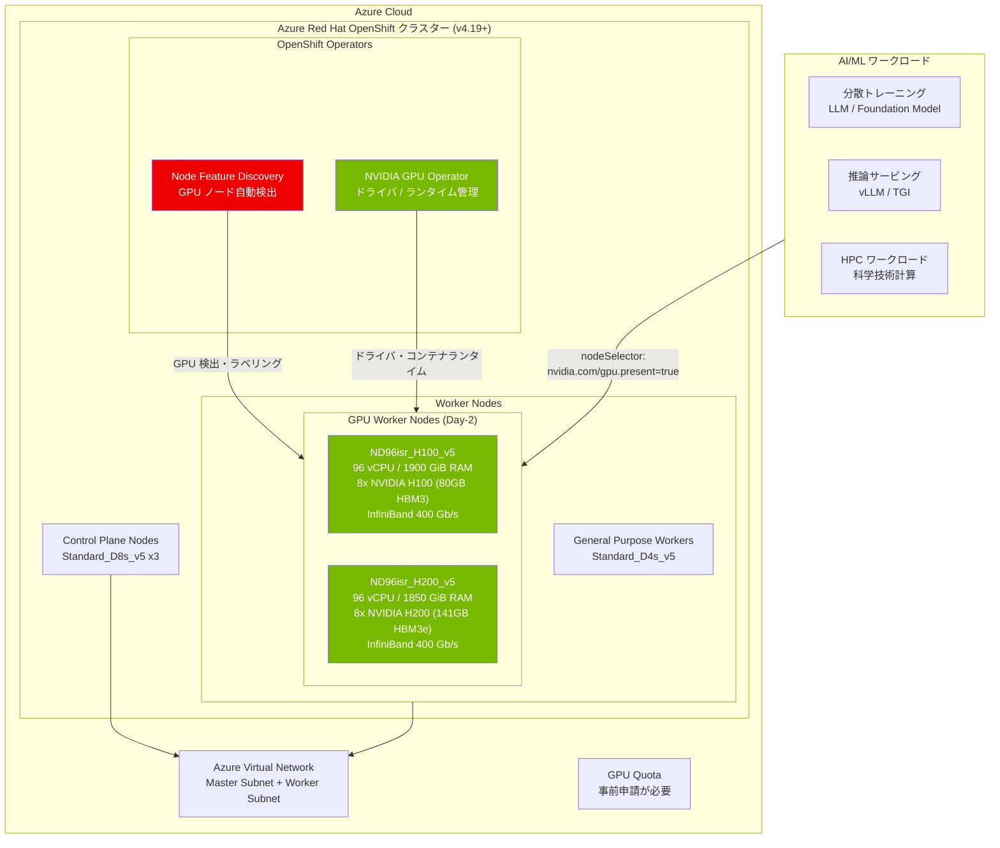

# Azure Red Hat OpenShift: NVIDIA H100 / H200 GPU サポートの一般提供開始

**リリース日**: 2026-04-07

**サービス**: Azure Red Hat OpenShift

**機能**: NVIDIA H100 および H200 GPU ベースの Azure VM SKU サポート

**ステータス**: Launched (GA)

[このアップデートのインフォグラフィックを見る](https://takech9203.github.io/azure-news-summary/20260407-aro-nvidia-h100-h200-gpu.html)

## 概要

Azure Red Hat OpenShift (ARO) が、NVIDIA H100 および H200 GPU を搭載した Azure Virtual Machine SKU のサポートを一般提供 (GA) として開始した。これにより、フルマネージドの OpenShift サービス上で大規模な AI / 機械学習 (ML) およびハイパフォーマンスコンピューティング (HPC) ワークロードを実行することが可能になった。

ARO はこれまで NVIDIA T4、V100 (NCv3)、A100 シリーズの GPU をサポートしていたが、今回の更新で最新世代の NVIDIA Hopper アーキテクチャ (H100) および後継の H200 が追加された。H100 は前世代の A100 と比較して AI トレーニングおよび推論のパフォーマンスが大幅に向上しており、H200 はさらに HBM3e メモリを搭載することで大規模言語モデル (LLM) の推論ワークロードに最適化されている。ARO 上でこれらの GPU を利用することで、Kubernetes のオーケストレーション機能と Red Hat OpenShift のエンタープライズ機能を活用しながら、最先端の GPU コンピューティングリソースにアクセスできるようになる。

なお、H100 / H200 の VM SKU は「Day-2」オペレーションとしてのみサポートされ、ARO バージョン 4.19 以降が必要である。クラスター作成時のインストールオプションとしてはサポートされず、クラスター作成後に MachineSet を追加する形で利用する。

**アップデート前の課題**

- ARO でサポートされていた GPU は T4、V100 (NCv3)、A100 シリーズまでであり、最新の Hopper アーキテクチャ GPU を利用できなかった
- 大規模な LLM トレーニングや推論ワークロードにおいて、A100 では GPU メモリ (80 GB HBM3) やスループットが不足するケースが増加していた
- 最新 GPU を利用するには ARO 以外の環境（AKS、ベアメタル、別のクラウドサービス等）を選択する必要があり、OpenShift エコシステムの統一的な運用が困難だった

**アップデート後の改善**

- NVIDIA H100 (80 GB HBM3) および H200 (141 GB HBM3e) GPU を ARO ワーカーノードとして利用可能になった
- OpenShift の統一的な運用管理の中で、最先端の GPU コンピューティングリソースを活用した AI/ML ワークロードを実行できるようになった
- NVIDIA GPU Operator と Node Feature Discovery (NFD) を使用した自動的な GPU 検出とドライバ管理が可能
- InfiniBand 対応の ND シリーズ VM により、マルチノード GPU クラスタリングによる分散トレーニングが実現可能

## アーキテクチャ図



この図は、ARO クラスター上で GPU ワーカーノード (H100/H200) を Day-2 オペレーションとして追加し、NVIDIA GPU Operator と Node Feature Discovery によって GPU リソースを自動管理する構成を示している。AI/ML および HPC ワークロードは nodeSelector を使用して GPU ノードにスケジューリングされる。

## サービスアップデートの詳細

### 主要機能

1. **NVIDIA H100 GPU サポート (Standard_ND96isr_H100_v5)**
   - 96 vCPU、1900 GiB メモリ、8 基の NVIDIA H100 Tensor Core GPU (各 80 GB HBM3)
   - 400 Gb/s InfiniBand 接続によるマルチノード分散トレーニング対応
   - FP8 Transformer Engine による AI トレーニング / 推論の高速化

2. **NVIDIA H200 GPU サポート (Standard_ND96isr_H200_v5)**
   - 96 vCPU、1850 GiB メモリ、8 基の NVIDIA H200 Tensor Core GPU (各 141 GB HBM3e)
   - H100 比で約 1.8 倍の GPU メモリ容量により、大規模モデルの推論パフォーマンスが向上
   - 400 Gb/s InfiniBand 接続による高帯域ノード間通信

3. **Day-2 MachineSet による柔軟なスケーリング**
   - クラスター作成後に GPU ワーカーノードを MachineSet として追加する運用モデル
   - GPU ノード数の増減を MachineSet のレプリカ数で制御可能
   - GPU ワークロードの需要に応じた柔軟なスケーリング

4. **NVIDIA GPU Operator / NFD による自動化**
   - Node Feature Discovery Operator が GPU ハードウェアを自動検出し、ノードにラベルを付与
   - NVIDIA GPU Operator がドライバ、コンテナランタイム、デバイスプラグイン、モニタリングツールを自動デプロイ
   - OpenShift OperatorHub からのワンクリックインストール

## 技術仕様

| 項目 | Standard_ND96isr_H100_v5 | Standard_ND96isr_H200_v5 |
|------|--------------------------|--------------------------|
| vCPU | 96 | 96 |
| メモリ (GiB) | 1900 | 1850 |
| GPU 数 | 8x NVIDIA H100 | 8x NVIDIA H200 |
| GPU メモリ | 各 80 GB HBM3 (合計 640 GB) | 各 141 GB HBM3e (合計 1128 GB) |
| GPU アーキテクチャ | NVIDIA Hopper | NVIDIA Hopper (H200) |
| ノード間接続 | InfiniBand NDR 400 Gb/s | InfiniBand NDR 400 Gb/s |
| 必須 ARO バージョン | 4.19 以降 | 4.19 以降 |
| デプロイ方法 | Day-2 MachineSet のみ | Day-2 MachineSet のみ |
| Hyper-V 世代 | Generation 2 VM | Generation 2 VM |

## 設定方法

### 前提条件

1. Azure Red Hat OpenShift クラスター (バージョン 4.19 以降) がデプロイ済みであること
2. 対象リージョンで ND96isr_H100_v5 または ND96isr_H200_v5 の GPU クォータが確保されていること (デフォルトは 0 のため、Azure Portal からクォータ増加を申請する必要がある)
3. OpenShift CLI (`oc`) がインストール済みで、cluster-admin 権限でログインしていること
4. `jq`、`moreutils`、`gettext` パッケージがインストール済みであること

### GPU クォータの申請

```bash
# Azure Portal で以下の手順を実施:
# 1. Azure Portal にサインイン
# 2. 検索バーで "quotas" を検索し、"Compute" を選択
# 3. "ND96isr_H100_v5" または "ND96isr_H200_v5" を検索
# 4. クラスターのリージョンを選択し、"Request quota increase" を選択
# 5. 必要なコア数 (96 の倍数) を指定して申請
```

### GPU MachineSet の作成

```bash
# 既存の MachineSet をテンプレートとしてエクスポート
MACHINESET=$(oc get machineset -n openshift-machine-api \
  -o=jsonpath='{.items[0]}' | jq -r '[.metadata.name] | @tsv')
oc get machineset -n openshift-machine-api $MACHINESET -o json > gpu_machineset.json

# MachineSet 名を変更
jq '.metadata.name = "nvidia-h100-worker-<region><az>"' gpu_machineset.json | sponge gpu_machineset.json

# レプリカ数を設定
jq '.spec.replicas = 1' gpu_machineset.json | sponge gpu_machineset.json

# セレクタを更新
jq '.spec.selector.matchLabels."machine.openshift.io/cluster-api-machineset" = "nvidia-h100-worker-<region><az>"' gpu_machineset.json | sponge gpu_machineset.json
jq '.spec.template.metadata.labels."machine.openshift.io/cluster-api-machineset" = "nvidia-h100-worker-<region><az>"' gpu_machineset.json | sponge gpu_machineset.json

# VM サイズを H100 に設定
jq '.spec.template.spec.providerSpec.value.vmSize = "Standard_ND96isr_H100_v5"' gpu_machineset.json | sponge gpu_machineset.json

# Generation 2 VM 用の image SKU を設定 (例: aro_419 -> v419-v2)
# az vm image list --architecture x64 -o table --all --offer aro4 --publisher azureopenshift で確認
jq '.spec.template.spec.providerSpec.value.image.sku = "<v2-sku-version>"' gpu_machineset.json | sponge gpu_machineset.json

# ゾーンを設定
jq '.spec.template.spec.providerSpec.value.zone = "1"' gpu_machineset.json | sponge gpu_machineset.json

# status セクションを削除
jq 'del(.status)' gpu_machineset.json | sponge gpu_machineset.json

# MachineSet を作成
oc create -f gpu_machineset.json
```

### NVIDIA GPU Operator のインストール

```bash
# nvidia-gpu-operator namespace を作成
cat <<EOF | oc apply -f -
apiVersion: v1
kind: Namespace
metadata:
  name: nvidia-gpu-operator
EOF

# OperatorGroup を作成
cat <<EOF | oc apply -f -
apiVersion: operators.coreos.com/v1
kind: OperatorGroup
metadata:
  name: nvidia-gpu-operator-group
  namespace: nvidia-gpu-operator
spec:
  targetNamespaces:
  - nvidia-gpu-operator
EOF

# NVIDIA GPU Operator チャネルとパッケージを取得
CHANNEL=$(oc get packagemanifest gpu-operator-certified \
  -n openshift-marketplace -o jsonpath='{.status.defaultChannel}')
PACKAGE=$(oc get packagemanifests/gpu-operator-certified \
  -n openshift-marketplace -ojson | \
  jq -r '.status.channels[] | select(.name == "'$CHANNEL'") | .currentCSV')

# Subscription を作成
envsubst <<EOF | oc apply -f -
apiVersion: operators.coreos.com/v1alpha1
kind: Subscription
metadata:
  name: gpu-operator-certified
  namespace: nvidia-gpu-operator
spec:
  channel: "$CHANNEL"
  installPlanApproval: Automatic
  name: gpu-operator-certified
  source: certified-operators
  sourceNamespace: openshift-marketplace
  startingCSV: "$PACKAGE"
EOF
```

### GPU の動作確認

```bash
# NFD による GPU 検出の確認
oc describe node | egrep 'Roles|pci-10de' | grep -v master

# nvidia-smi による GPU 確認
oc project nvidia-gpu-operator
for i in $(oc get pod -lopenshift.driver-toolkit=true --no-headers | awk '{print $1}'); do
  echo $i
  oc exec -it $i -- nvidia-smi
  echo -e '\n'
done

# テスト Pod の実行
cat <<EOF | oc apply -f -
apiVersion: v1
kind: Pod
metadata:
  name: cuda-vector-add
spec:
  restartPolicy: OnFailure
  containers:
    - name: cuda-vector-add
      image: "quay.io/giantswarm/nvidia-gpu-demo:latest"
      resources:
        limits:
          nvidia.com/gpu: 1
      nodeSelector:
        nvidia.com/gpu.present: true
EOF

oc logs cuda-vector-add --tail=-1
```

## メリット

### ビジネス面

- **最新 GPU でのフルマネージド OpenShift 運用**: H100 / H200 GPU を利用しながら、Red Hat と Microsoft による共同運用・サポートを受けられるため、GPU インフラの運用負荷を大幅に削減できる
- **AI/ML ワークロードの高速化**: H100 は A100 比で AI トレーニングが最大 3 倍高速であり、LLM のトレーニング / ファインチューニング時間の短縮によるコスト削減が期待できる
- **OpenShift エコシステムの統一**: 既存の OpenShift ベースの CI/CD パイプライン、モニタリング、セキュリティポリシーをそのまま GPU ワークロードにも適用でき、運用の一貫性を維持できる

### 技術面

- **InfiniBand 400 Gb/s による高速ノード間通信**: マルチノード分散トレーニングにおいて、InfiniBand NDR によりノード間の勾配同期やモデルパラメータの通信がボトルネックになりにくい
- **HBM3e メモリ (H200)**: 141 GB の大容量 GPU メモリにより、大規模な LLM (70B+ パラメータ) をメモリに収容でき、モデルの分割数を削減してスループットを向上できる
- **Kubernetes ネイティブな GPU 管理**: NVIDIA GPU Operator と NFD による自動的な GPU 検出・ドライバ管理・デバイスプラグインにより、手動での GPU 設定が不要
- **MachineSet によるスケーラビリティ**: GPU ノードの追加・削除を MachineSet のレプリカ数で制御でき、ワークロードの需要に応じた弾力的な GPU リソース管理が可能

## デメリット・制約事項

- H100 / H200 VM SKU は **Day-2 オペレーションのみ** でサポートされ、クラスター作成時のインストールオプションとしては利用不可
- ARO バージョン **4.19 以降** が必須。既存クラスターのアップグレードが必要な場合がある
- **Generation 2 VM が必須** であり、MachineSet の image SKU を v2 バージョンに設定する必要がある (設定を誤ると Hyper-V 世代エラーが発生する)
- GPU クォータは**デフォルトで 0** のため、Azure Portal から事前にクォータ増加を申請する必要がある。GPU の需要が高いため、リージョンによっては確保が困難な場合がある
- ND96isr シリーズは 1 ノードあたり 96 vCPU を消費するため、サブスクリプション全体の vCPU クォータに対する影響が大きい
- GPU VM の料金は高額であり、コスト管理に十分な注意が必要

## ユースケース

### ユースケース 1: 大規模言語モデル (LLM) のファインチューニング

**シナリオ**: 企業が独自のドメインデータで LLM をファインチューニングし、社内の AI アシスタントサービスとして OpenShift 上にデプロイする。

**実装例**:

```bash
# H100 GPU ノードを 4 台追加 (合計 32 GPU)
jq '.spec.replicas = 4' gpu_machineset.json | sponge gpu_machineset.json
jq '.spec.template.spec.providerSpec.value.vmSize = "Standard_ND96isr_H100_v5"' gpu_machineset.json | sponge gpu_machineset.json
oc apply -f gpu_machineset.json

# PyTorch 分散トレーニングジョブの例 (概念)
# nodeSelector と GPU リソースリクエストにより H100 ノードにスケジューリング
```

**効果**: 8 基の H100 GPU x 4 ノード = 32 GPU による分散トレーニングで、70B パラメータクラスのモデルのファインチューニングを数時間で完了できる。InfiniBand 400 Gb/s により、ノード間通信のオーバーヘッドが最小化される。

### ユースケース 2: LLM 推論サービングの大規模デプロイ

**シナリオ**: 顧客向け AI サービスの推論バックエンドとして、大規模な LLM を ARO 上で低レイテンシでサービングする。

**実装例**:

```bash
# H200 GPU ノードを追加 (大容量メモリで大規模モデルを効率的にサービング)
jq '.spec.template.spec.providerSpec.value.vmSize = "Standard_ND96isr_H200_v5"' gpu_machineset.json | sponge gpu_machineset.json
oc apply -f gpu_machineset.json

# vLLM や TGI などの推論フレームワークを OpenShift 上にデプロイ
# H200 の 141 GB HBM3e メモリにより、70B+ モデルを少ない GPU 分割数でサービング可能
```

**効果**: H200 の 141 GB HBM3e メモリにより、70B パラメータモデルを 1 ノード (8 GPU) で完全に収容可能。テンソル並列化の分割数が削減されることで、推論レイテンシとスループットが向上する。

### ユースケース 3: HPC / 科学技術計算

**シナリオ**: 製薬企業が分子動力学シミュレーションや薬物候補のスクリーニングを ARO 上の GPU クラスターで実行する。

**実装例**:

```bash
# H100 GPU ノードを複数台デプロイ
# MPI ベースの HPC ワークロードを OpenShift Job として実行
# InfiniBand による低レイテンシ通信でマルチノード並列計算を実現
```

**効果**: OpenShift のジョブスケジューリング機能と InfiniBand 対応の H100 GPU により、HPC ワークロードをコンテナ化された環境で効率的に実行できる。研究者は OpenShift のセルフサービスポータルから GPU リソースを申請し、即座に計算環境を利用可能。

## 料金

GPU VM の料金はリージョンおよび契約形態により異なる。以下は参考情報である。

| VM SKU | GPU | 概算料金 (従量課金/時間) |
|--------|-----|----------------------|
| Standard_ND96isr_H100_v5 | 8x NVIDIA H100 | リージョンにより異なる (Azure 料金ページを参照) |
| Standard_ND96isr_H200_v5 | 8x NVIDIA H200 | リージョンにより異なる (Azure 料金ページを参照) |

上記 VM 料金に加えて、ARO の OpenShift ライセンス料が別途発生する。リザーブドインスタンス (1 年 / 3 年) の利用により、従量課金と比較して大幅なコスト削減が可能。正確な料金は [Azure 料金計算ツール](https://azure.microsoft.com/pricing/calculator/) を使用して見積もること。

## 利用可能リージョン

H100 / H200 GPU VM の利用可能リージョンは、Azure のハードウェアの展開状況に依存する。GPU クォータの確保可能なリージョンは限定されており、デプロイ前に [Azure リージョン別利用可能サービス](https://azure.microsoft.com/global-infrastructure/services/) で確認すること。

## 関連サービス・機能

- **Azure Kubernetes Service (AKS)**: Azure のマネージド Kubernetes サービス。OpenShift エコシステムが不要な場合は AKS + GPU ノードプールも選択肢となる
- **Azure Machine Learning**: マネージドな ML プラットフォーム。GPU コンピューティングを含むエンドツーエンドの ML ライフサイクル管理が必要な場合に適している
- **NVIDIA GPU Operator**: OpenShift 上で GPU ドライバ、コンテナランタイム、デバイスプラグイン、モニタリングを自動管理する Operator
- **Node Feature Discovery (NFD)**: ノードのハードウェア特性を自動検出し、ラベルを付与する OpenShift Operator。GPU ノードの自動検出に使用
- **Azure Virtual Network**: ARO クラスターのネットワーク基盤。InfiniBand は VM 間の専用接続であり、Azure VNet とは独立して動作する

## 参考リンク

- [インフォグラフィック](https://takech9203.github.io/azure-news-summary/20260407-aro-nvidia-h100-h200-gpu.html)
- [公式アップデート情報](https://azure.microsoft.com/updates?id=559547)
- [Microsoft Learn - ARO での GPU ワークロードの使用](https://learn.microsoft.com/en-us/azure/openshift/howto-gpu-workloads)
- [Microsoft Learn - ARO サポートポリシー (サポート対象 VM サイズ)](https://learn.microsoft.com/en-us/azure/openshift/support-policies-v4)
- [NVIDIA GPU Operator ドキュメント](https://docs.nvidia.com/datacenter/cloud-native/gpu-operator/openshift/install-gpu-ocp.html)
- [料金ページ - Azure Red Hat OpenShift](https://azure.microsoft.com/pricing/details/openshift/)
- [料金ページ - Azure Virtual Machines (GPU)](https://azure.microsoft.com/pricing/details/virtual-machines/linux/)

## まとめ

Azure Red Hat OpenShift への NVIDIA H100 / H200 GPU サポートの追加は、フルマネージドの OpenShift 環境上で最先端の AI/ML および HPC ワークロードを実行する道を開く重要なアップデートである。特に、大規模言語モデルのトレーニング・推論、科学技術計算など、高い GPU コンピューティング性能を必要とするワークロードにとって大きな意義がある。

Solutions Architect への推奨アクション:

1. **ARO バージョンの確認とアップグレード**: H100 / H200 サポートには ARO 4.19 以降が必要。既存クラスターのバージョンを確認し、必要に応じてアップグレード計画を策定する
2. **GPU クォータの事前申請**: ND96isr シリーズの GPU クォータはデフォルトで 0 のため、利用予定のリージョンで事前にクォータ増加を申請する。競争が激しいため、早めの申請を推奨
3. **Generation 2 VM の image SKU 設定確認**: MachineSet 作成時に image SKU を v2 バージョンに設定する必要がある点に注意。`az vm image list` コマンドで正しい SKU を確認すること
4. **コスト見積もりの実施**: GPU VM は高額のため、Azure 料金計算ツールで事前にコストを見積もり、リザーブドインスタンスの活用を検討する
5. **既存の AKS GPU ワークロードとの比較検討**: OpenShift 固有の機能（Operator ライフサイクル管理、ビルド機能、マルチテナンシー等）が必要かどうかを評価し、AKS との使い分けを明確にする

---

**タグ**: #AzureRedHatOpenShift #GPU #NVIDIA #H100 #H200 #AI #MachineLearning #HPC #Containers #OpenShift #GA
