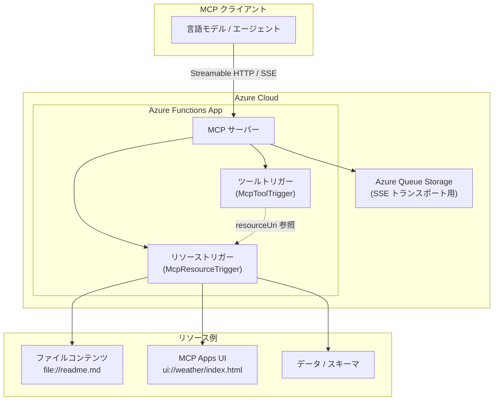

# Azure Functions: MCP リソーストリガーの一般提供開始

**リリース日**: 2026-04-07

**サービス**: Azure Functions

**機能**: MCP Resource Triggers (MCP リソーストリガー)

**ステータス**: Launched (GA)

[このアップデートのインフォグラフィックを見る](https://takech9203.github.io/azure-news-summary/20260407-azure-functions-mcp-resource-triggers.html)

## 概要

Azure Functions の Model Context Protocol (MCP) 拡張機能において、**MCP リソーストリガー** が一般提供 (GA) となった。これまで Azure Functions でホストされる MCP サーバーでは「ツール (tools)」のみを公開できたが、今回のアップデートにより「リソース (resources)」も直接公開できるようになった。

MCP はクライアント・サーバー型のプロトコルであり、言語モデルやエージェントが外部のデータソースやツールを効率的に発見・利用するために設計されている。リソーストリガーを使用することで、ファイルの内容、データベーススキーマ、API ドキュメントなどのコンテキスト情報を MCP クライアントに直接提供できる。さらに、ツールトリガーとリソーストリガーを組み合わせることで **MCP Apps** の構築も可能となり、ツールがプレーンテキストの代わりにインタラクティブな UI を返却できるようになる。

**アップデート前の課題**

- Azure Functions の MCP サーバーではツールのみが公開可能で、リソースの公開ができなかった
- コンテキスト情報（ファイル内容、スキーマ等）をクライアントに提供するにはツール経由の回避策が必要だった
- MCP Apps のようなインタラクティブ UI を返すパターンを実装する手段がなかった

**アップデート後の改善**

- リソーストリガーにより、MCP クライアントが `resources/list` や `resources/read` で直接リソースにアクセス可能になった
- `ui://` スキームを使用した MCP Apps の UI リソース公開が可能になった
- ツールトリガーとリソーストリガーの組み合わせで、インタラクティブなアプリケーションを構築できるようになった

## アーキテクチャ図



MCP クライアント（言語モデルやエージェント）が Azure Functions 上の MCP サーバーに接続し、ツールトリガーとリソーストリガーの両方を利用できるアーキテクチャを示している。リソーストリガーはファイル、UI、データなど様々なリソースを公開し、ツールトリガーから `resourceUri` を通じてリソースを参照することで MCP Apps パターンを実現する。

## サービスアップデートの詳細

### 主要機能

1. **MCP リソーストリガー (`McpResourceTrigger`)**
   - Azure Functions の関数をMCP リソースとして公開するトリガー
   - URI ベースのリソースアドレッシング（`file://`、`ui://` など任意のスキームを使用可能）
   - クライアントは `resources/list` でリソース一覧を取得し、`resources/read` でリソースを読み取る
   - リソースの名前、説明、MIME タイプ、サイズなどのメタデータを定義可能

2. **MCP Apps サポート**
   - リソーストリガーとツールトリガーを組み合わせ、インタラクティブな UI を返すアプリケーションを構築
   - `ui://` スキームと `text/html;profile=mcp-app` MIME タイプで UI リソースを定義
   - ツールのメタデータで `resourceUri` を指定してリソースを参照
   - MCP ホストがリソースをフェッチしてレンダリング

3. **リソースメタデータ**
   - `McpMetadata` 属性（C#）または `metadata` パラメータ（Python / TypeScript）で追加メタデータを定義
   - クライアントが `resources/list` を呼び出した際に `meta` フィールドとして返却
   - リソースの表示方法や処理方法に影響を与えることが可能

## 技術仕様

| 項目 | 詳細 |
|------|------|
| トリガータイプ | `McpResourceTrigger` |
| 必須パラメータ | `Uri` (リソース URI)、`ResourceName` (リソース名) |
| オプションパラメータ | `Description`、`Title`、`MimeType`、`Size`、`Metadata` |
| 戻り値の型 (C#) | `string` (テキスト) または `byte[]` (Base64 エンコードバイナリ) |
| 戻り値の型 (Python) | `str` (テキスト) または `bytes` (バイナリ) |
| 戻り値の型 (TypeScript/JavaScript) | `string` |
| トランスポート | Streamable HTTP (`/runtime/webhooks/mcp`) / SSE (`/runtime/webhooks/mcp/sse`) |
| 認証 | システムキー `mcp_extension` (デフォルト) または Anonymous 設定可能 |

## 設定方法

### 前提条件

1. Azure Functions Core Tools バージョン 4.0.7030 以降（ローカル実行時）
2. 言語別の依存パッケージ:
   - **C#**: `Microsoft.Azure.Functions.Worker.Extensions.Mcp` NuGet パッケージ（Isolated Worker モデルのみ）、`Microsoft.Azure.Functions.Worker` v2.1.0 以降、`Microsoft.Azure.Functions.Worker.Sdk` v2.0.2 以降
   - **TypeScript/JavaScript**: `@azure/functions` v4.12.0 以降（リソーストリガー用）
   - **Python**: `azure-functions` v2.0.0 以降、Python 3.13 以上
   - **Java**: `azure-functions-java-library` v3.2.2 以降、`azure-functions-maven-plugin` v1.40.0 以降
3. SSE トランスポート使用時: Azure Queue Storage（`AzureWebJobsStorage`）に対して `Storage Queue Data Contributor` および `Storage Queue Data Message Processor` ロールが必要

### host.json 設定

```json
{
  "version": "2.0",
  "extensionBundle": {
    "id": "Microsoft.Azure.Functions.ExtensionBundle",
    "version": "[4.0.0, 5.0.0)"
  },
  "extensions": {
    "mcp": {
      "instructions": "MCP サーバーの使用方法の説明",
      "serverName": "MyMCPServer",
      "serverVersion": "1.0.0"
    }
  }
}
```

### コード例 (Python)

```python
@app.mcp_resource_trigger(
    arg_name="context",
    uri="file://readme.md",
    resource_name="readme",
    description="アプリケーションの README ファイル",
    mime_type="text/plain"
)
def get_text_resource(context) -> str:
    file_path = Path(__file__).parent / "assets" / "readme.md"
    return file_path.read_text(encoding="utf-8")
```

### コード例 (C#)

```csharp
[Function(nameof(GetTextResource))]
public string GetTextResource(
    [McpResourceTrigger(
        "file://readme.md",
        "readme",
        Description = "Application readme file",
        MimeType = "text/plain")]
    ResourceInvocationContext context)
{
    var file = Path.Combine(AppContext.BaseDirectory, "assets", "readme.md");
    return File.ReadAllText(file);
}
```

### MCP クライアント接続設定

```json
{
    "servers": {
        "local-mcp-function": {
            "type": "http",
            "url": "http://localhost:7071/runtime/webhooks/mcp"
        },
        "remote-mcp-function": {
            "type": "http",
            "url": "https://<FUNCTION_APP_HOST>/runtime/webhooks/mcp",
            "headers": {
                "x-functions-key": "<MCP_EXTENSION_SYSTEM_KEY>"
            }
        }
    }
}
```

### Azure CLI でシステムキーを取得

```bash
az functionapp keys list \
  --resource-group <RESOURCE_GROUP> \
  --name <APP_NAME> \
  --query systemKeys.mcp_extension \
  --output tsv
```

## メリット

### ビジネス面

- AI エージェントやコパイロットにコンテキスト情報を直接提供でき、より高精度な応答を実現
- MCP Apps により、AI ツールがインタラクティブな UI を返せるためエンドユーザー体験が向上
- サーバーレスの課金モデルにより、リソース公開のインフラコストを最適化

### 技術面

- ツールとリソースの両方を単一の Azure Functions アプリで管理でき、アーキテクチャがシンプルに
- URI ベースのリソースアドレッシングで、MCP 標準の `resources/list` / `resources/read` プロトコルに準拠
- Streamable HTTP と SSE の両トランスポートをサポートし、様々な MCP クライアントと互換性がある
- C#、Python、TypeScript/JavaScript、Java の 4 言語をサポート

## デメリット・制約事項

- PowerShell はサポートされていない
- C# では Isolated Worker モデルのみ対応（In-Process モデルは非対応）
- Python でリソーストリガーを使用するには Python 3.13 以上が必要
- TypeScript/JavaScript でリソーストリガーを使用するには `@azure/functions` v4.12.0 以上が必要
- SSE トランスポート使用時は Azure Queue Storage への依存があり、適切なロールベースのアクセス許可が必要
- SSE トランスポートは新しいプロトコルバージョンでは非推奨となっており、Streamable HTTP の使用が推奨される

## ユースケース

### ユースケース 1: AI エージェントへのドキュメントコンテキスト提供

**シナリオ**: 社内のナレッジベースや API ドキュメントを MCP リソースとして公開し、AI エージェントが正確なコンテキストに基づいて回答できるようにする。

**実装例**:

```python
@app.mcp_resource_trigger(
    arg_name="context",
    uri="file://api-docs/openapi.json",
    resource_name="API仕様書",
    description="社内 API の OpenAPI 仕様",
    mime_type="application/json"
)
def get_api_spec(context) -> str:
    return Path("assets/openapi.json").read_text()
```

**効果**: エージェントが API 仕様を直接参照でき、正確な API 呼び出し方法の提案やコード生成が可能になる。

### ユースケース 2: MCP Apps によるインタラクティブダッシュボード

**シナリオ**: 天気情報やシステムモニタリングなどのインタラクティブな UI をツールの応答として返し、ユーザーにリッチな体験を提供する。

**実装例**:

```python
@app.mcp_resource_trigger(
    arg_name="context",
    uri="ui://dashboard/index.html",
    resource_name="Dashboard Widget",
    description="インタラクティブダッシュボード",
    mime_type="text/html;profile=mcp-app",
    metadata='{"ui": {"prefersBorder": true}}'
)
def get_dashboard(context) -> str:
    return Path("app/dist/index.html").read_text()
```

**効果**: AI ツールがプレーンテキストではなくインタラクティブな HTML UI を返却でき、データの可視化やユーザー操作が可能になる。

## 料金

MCP リソーストリガーに対する追加料金は発生しない。Azure Functions の標準的な課金モデル（実行回数、実行時間、メモリ使用量に基づく従量課金）が適用される。

| プラン | 課金体系 |
|------|------|
| 従量課金プラン | 実行回数 + 実行時間ベース |
| Flex Consumption プラン | 実行回数 + 実行時間ベース（常時ウォームインスタンスのオプションあり） |
| Premium プラン | vCPU/メモリベースの時間課金 |

無料枠: Azure Functions 従量課金プランでは月間 100 万回の実行と 400,000 GB-s のリソース使用が無料。

## 利用可能リージョン

Azure Functions が利用可能な全リージョンで使用可能。MCP 拡張機能はランタイムの一部として提供されるため、Azure Functions をサポートするすべてのリージョンで利用できる。

## 関連サービス・機能

- **Azure Functions MCP ツールトリガー**: MCP ツールとして関数を公開する既存のトリガー。リソーストリガーと組み合わせて MCP Apps を構築可能
- **MCP Apps**: ツールトリガーとリソーストリガーを組み合わせ、インタラクティブな UI を返すアプリケーションパターン
- **Azure Queue Storage**: SSE トランスポート使用時にバックエンドとして必要
- **GitHub Copilot (VS Code)**: MCP クライアントとして Azure Functions 上の MCP サーバーに接続可能

## 参考リンク

- [インフォグラフィック](https://takech9203.github.io/azure-news-summary/20260407-azure-functions-mcp-resource-triggers.html)
- [公式アップデート情報](https://azure.microsoft.com/updates?id=559981)
- [Microsoft Learn - Model Context Protocol bindings for Azure Functions](https://learn.microsoft.com/azure/azure-functions/functions-bindings-mcp)
- [Microsoft Learn - MCP resource trigger for Azure Functions](https://learn.microsoft.com/azure/azure-functions/functions-bindings-mcp-resource-trigger)
- [GitHub - Azure Functions MCP Extension](https://github.com/Azure/azure-functions-mcp-extension)
- [GitHub サンプル - .NET](https://github.com/Azure-Samples/remote-mcp-functions-dotnet)
- [GitHub サンプル - TypeScript](https://github.com/Azure-Samples/remote-mcp-functions-typescript)
- [GitHub サンプル - Python](https://github.com/Azure-Samples/remote-mcp-functions-python)
- [Azure Functions 料金ページ](https://azure.microsoft.com/pricing/details/functions/)

## まとめ

Azure Functions の MCP リソーストリガーが一般提供となり、MCP サーバー上でツールだけでなくリソースも公開できるようになった。これにより、AI エージェントや言語モデルがファイル内容、データベーススキーマ、API ドキュメントなどのコンテキスト情報に直接アクセスできるようになる。さらに、MCP Apps パターンを活用することで、ツールがインタラクティブな HTML UI を返すリッチなアプリケーションの構築も可能となった。

C#、Python、TypeScript/JavaScript、Java の 4 言語をサポートしており、既存の Azure Functions MCP ツールトリガーを利用しているユーザーは、リソーストリガーを追加するだけで MCP サーバーの機能を拡張できる。Solutions Architect は、AI エージェント向けのコンテキスト提供基盤として本機能の採用を検討すべきである。

---

**タグ**: #Azure #AzureFunctions #MCP #ModelContextProtocol #MCPApps #Serverless #GA #AIエージェント #リソーストリガー
