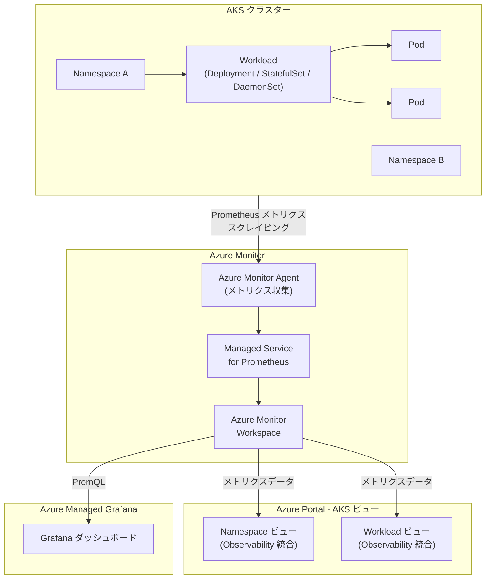

# Azure Kubernetes Service (AKS): Namespace / Workload ビューでの Observability 機能が一般提供開始

**リリース日**: 2026-04-08

**サービス**: Azure Kubernetes Service (AKS)

**機能**: Namespace および Workload ビューにおける Observability データの統合表示

**ステータス**: Launched (GA)

[このアップデートのインフォグラフィックを見る](https://takech9203.github.io/azure-news-summary/20260408-aks-namespace-workload-observability.html)

## 概要

Azure Kubernetes Service (AKS) の Namespace ビューおよび Workload ビューに、Azure Monitor managed service for Prometheus を活用した Observability データが直接統合表示されるようになった。この機能が一般提供 (GA) として正式にリリースされた。

従来、AKS クラスターの健全性やワークロードの状態を確認するには、Azure Monitor や Grafana ダッシュボードなど複数のツールを行き来する必要があった。今回のアップデートにより、AKS の Azure Portal 上の Namespace ビューと Workload ビューから直接、Prometheus メトリクスに基づく Observability データを確認できるようになり、運用効率が大幅に向上する。

この機能により、クラスターおよびワークロードの健全性モニタリング、Pending や Failed 状態の Pod のトラブルシューティング、リソース使用率の分析がより簡単に行えるようになる。

**アップデート前の課題**

- クラスターの健全性確認やワークロードの監視に、Azure Portal、Azure Monitor、Grafana など複数のツールを切り替える必要があった
- Pending や Failed 状態の Pod を特定・調査する際、Namespace やワークロードのコンテキストから離れて別の監視ツールに移動する必要があった
- リソース使用率の分析が Prometheus メトリクスの直接クエリや Grafana ダッシュボードに依存しており、AKS の管理ビューとは分離されていた
- Namespace 単位やワークロード単位での Observability 情報の集約が容易ではなかった

**アップデート後の改善**

- AKS の Namespace ビューおよび Workload ビュー内で Prometheus メトリクスベースの Observability データを直接確認可能
- コンテキストを切り替えることなく、クラスターとワークロードの健全性を即座にモニタリング可能
- Pending / Failed Pod のトラブルシューティングが同一ビュー内で完結
- リソース使用率 (CPU、メモリなど) の分析が Namespace / Workload の文脈で直接実行可能

## アーキテクチャ図



この図は、AKS クラスターから Azure Monitor Agent を通じて Prometheus メトリクスが収集され、Azure Monitor Workspace に格納された後、Azure Portal の Namespace ビューおよび Workload ビューに直接表示される流れを示している。従来の Grafana ダッシュボードによる可視化に加え、AKS の管理ビュー内で Observability データに直接アクセスできるようになった。

## サービスアップデートの詳細

### 主要機能

1. **Namespace ビューでの Observability データ表示**
   - AKS の Azure Portal において、Namespace 単位でクラスターの健全性情報を直接確認可能
   - Namespace に属する Pod の状態 (Running、Pending、Failed など) を一覧表示
   - Namespace 単位でのリソース使用率 (CPU / メモリ) を可視化

2. **Workload ビューでの Observability データ表示**
   - Deployment、StatefulSet、DaemonSet などのワークロード単位で Observability 情報を表示
   - ワークロードに紐づく Pod の健全性ステータスを即座に確認可能
   - ワークロードレベルでのリソース消費状況を分析

3. **Pending / Failed Pod のトラブルシューティング支援**
   - Pending 状態や Failed 状態の Pod を Namespace / Workload のコンテキスト内で即座に特定
   - 問題の原因調査に必要な情報が同一ビューに集約

4. **Azure Monitor managed service for Prometheus との統合**
   - Observability データのバックエンドとして Azure Monitor managed service for Prometheus を活用
   - Prometheus メトリクスに基づく信頼性の高いモニタリングデータを提供

## 技術仕様

| 項目 | 詳細 |
|------|------|
| 対象サービス | Azure Kubernetes Service (AKS) |
| データソース | Azure Monitor managed service for Prometheus |
| 表示場所 | Azure Portal - AKS リソースの Namespace ビュー / Workload ビュー |
| ステータス | 一般提供 (GA) |
| 対象ビュー | Namespace ビュー、Workload ビュー |

## 前提条件

1. AKS クラスターが作成済みであること
2. Azure Monitor managed service for Prometheus がクラスターで有効化されていること
3. Azure Monitor Workspace が構成されていること

### Azure Portal での利用方法

1. Azure Portal で対象の AKS クラスターに移動する
2. **Kubernetes resources** セクションから **Namespaces** または **Workloads** を選択する
3. 各ビューに統合された Observability データ (Pod の状態、リソース使用率など) が表示される

### Prometheus メトリクス収集の有効化 (未設定の場合)

```bash
# AKS クラスターで Azure Monitor managed service for Prometheus を有効化
az aks update \
    --resource-group <リソースグループ名> \
    --name <AKSクラスター名> \
    --enable-azure-monitor-metrics \
    --azure-monitor-workspace-resource-id <Azure Monitor Workspace のリソース ID>
```

## メリット

### ビジネス面

- 監視ツール間の切り替えが不要になり、運用チームの作業効率が向上
- 問題の検出から原因特定までの時間 (MTTD / MTTR) が短縮される
- Kubernetes 運用の習熟コストが低減し、より多くのチームメンバーがクラスター状態を把握可能に

### 技術面

- Namespace / Workload のコンテキストで Observability データに直接アクセス可能
- Azure Monitor managed service for Prometheus による高可用性・スケーラブルなメトリクス基盤を活用
- Prometheus メトリクスデータは最大 18 か月間保持される
- 既存の Grafana ダッシュボードや PromQL クエリとの併用が可能

## デメリット・制約事項

- Azure Monitor managed service for Prometheus の有効化が前提条件であり、未設定のクラスターでは追加の構成が必要
- Prometheus メトリクスの収集にはデータインジェストに応じたコストが発生する

## ユースケース

### ユースケース 1: Pending Pod の迅速なトラブルシューティング

**シナリオ**: 開発チームが新しいデプロイをロールアウトした際、一部の Pod が Pending 状態のままスケジュールされない状況が発生した。

**対応手順**:
1. Azure Portal で AKS クラスターの **Workloads** ビューを開く
2. 対象の Deployment を選択し、Pod の状態一覧を確認する
3. Pending 状態の Pod を特定し、統合された Observability データからリソース不足やスケジューリング制約を確認する

**効果**: 従来は kubectl コマンドや別の監視ツールを使う必要があった調査が、Azure Portal 内で完結し、問題解決までの時間が短縮される。

### ユースケース 2: Namespace 単位のリソース使用率モニタリング

**シナリオ**: マルチテナント環境で各チームが異なる Namespace を使用しており、各 Namespace のリソース消費状況を定期的に確認する必要がある。

**対応手順**:
1. Azure Portal で AKS クラスターの **Namespaces** ビューを開く
2. 各 Namespace の CPU / メモリ使用率を Observability データから確認する
3. リソースクォータの調整が必要な Namespace を特定する

**効果**: Namespace 管理者が自身の Namespace の状態を直感的に把握でき、リソース最適化の判断が迅速に行える。

## 料金

この機能自体に追加料金は発生しない。ただし、バックエンドとなる Azure Monitor managed service for Prometheus のメトリクス収集にはデータインジェストおよびクエリに応じた料金が発生する。

| 項目 | 料金 |
|------|------|
| Azure Monitor Workspace (Prometheus) | インジェスト量およびクエリ量に基づく従量課金 |
| データ保持 | 最大 18 か月間、追加のストレージコストなし |

詳細は [Azure Monitor の料金ページ](https://azure.microsoft.com/pricing/details/monitor/) の **Metrics** タブを参照。

## 関連サービス・機能

- **Azure Monitor managed service for Prometheus**: 本機能のバックエンドとして Prometheus メトリクスの収集・保存を担当するフルマネージドサービス
- **Azure Managed Grafana**: Prometheus メトリクスをより詳細に可視化するためのダッシュボードサービス。PromQL による高度な分析が可能
- **Container insights**: AKS クラスターのログ、パフォーマンスデータ、イベントを収集・分析する機能。Prometheus メトリクスと組み合わせて包括的な監視を実現
- **Azure Monitor Workspace**: Prometheus メトリクスの格納先となるワークスペース。最大 18 か月のデータ保持をサポート

## 参考リンク

- [インフォグラフィック](https://takech9203.github.io/azure-news-summary/20260408-aks-namespace-workload-observability.html)
- [公式アップデート情報](https://azure.microsoft.com/updates?id=560039)
- [Microsoft Learn - Monitor AKS](https://learn.microsoft.com/en-us/azure/aks/monitor-aks)
- [Microsoft Learn - Azure Monitor managed service for Prometheus](https://learn.microsoft.com/en-us/azure/azure-monitor/essentials/prometheus-metrics-overview)
- [料金ページ](https://azure.microsoft.com/pricing/details/monitor/)

## まとめ

今回の GA リリースにより、AKS の Azure Portal 上で Namespace ビューおよび Workload ビューに Prometheus メトリクスベースの Observability データが直接統合された。これにより、クラスター管理者や SRE チームは複数の監視ツールを行き来することなく、AKS の管理画面内でクラスターの健全性確認、Pod のトラブルシューティング、リソース使用率の分析を一貫して行えるようになった。

Azure Monitor managed service for Prometheus を既に有効化している AKS クラスターでは、この機能は自動的に利用可能になる。まだ Prometheus メトリクス収集を有効化していないクラスターについては、この機会に有効化を検討することを推奨する。

---

**タグ**: #AKS #AzureMonitor #Prometheus #Observability #Kubernetes #GA #Monitoring #DevOps
