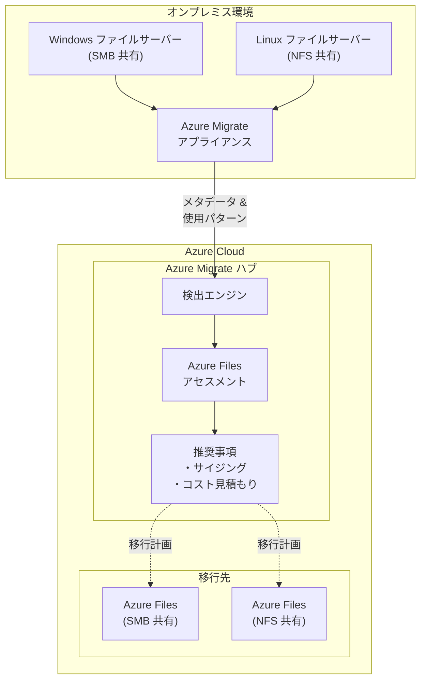

# Azure Migrate: Azure Files アセスメントのパブリックプレビュー開始

**リリース日**: 2026-04-08

**サービス**: Azure Migrate

**機能**: Azure Files assessments (Azure Files アセスメント)

**ステータス**: In preview

[このアップデートのインフォグラフィックを見る](https://takech9203.github.io/azure-news-summary/20260408-azure-migrate-files-assessment.html)

## 概要

Azure Migrate において、**Azure Files アセスメント** がパブリックプレビューとして利用可能になった。これにより、オンプレミス環境の SMB および NFS ファイル共有（Windows / Linux）を Azure Files へ移行する際の計画立案を、Azure Migrate の統合プラットフォーム上で効率的に実施できるようになった。

本機能は、オンプレミスのファイル共有を自動的に検出し、使用パターンの可視化を提供する。これまで Azure Migrate では仮想マシン、SQL データベース、Web アプリ、Azure VMware Solution (AVS) に対するアセスメントが提供されていたが、ファイル共有ワークロードに対するネイティブなアセスメント機能は存在しなかった。今回のアップデートにより、ファイルサーバーの移行計画もAzure Migrate のワークフローに統合された。

**アップデート前の課題**

- オンプレミスのファイル共有を Azure Files に移行する際、手動でのサイジングや互換性調査が必要だった
- ファイル共有の使用パターン（容量、IOPS、スループット等）の可視化ツールが Azure Migrate に統合されていなかった
- SMB / NFS ファイル共有のインベントリ収集を個別のツールや手作業で行う必要があった
- ファイルサーバー移行のコスト見積もりを Azure Migrate 上で一元的に行えなかった

**アップデート後の改善**

- Azure Migrate のアプライアンスを通じてオンプレミスのファイル共有を自動検出できるようになった
- ファイル共有の使用パターン（容量、アクセスパターン等）の可視化が可能になった
- SMB（Windows）と NFS（Linux）の両方のプロトコルに対応したアセスメントが提供される
- Azure Files への移行に関するサイジング推奨やコスト見積もりが Azure Migrate 上で統合的に確認できるようになった

## アーキテクチャ図

Azure Migrate アプライアンスがオンプレミスの Windows / Linux ファイルサーバーからファイル共有のメタデータと使用パターンを収集し、Azure Migrate ハブに送信する。アセスメントエンジンがデータを分析し、Azure Files への移行に関するサイジング推奨とコスト見積もりを生成する。

## サービスアップデートの詳細

### 主要機能

1. **ファイル共有の自動検出**
   - Azure Migrate アプライアンスを通じてオンプレミスの SMB / NFS ファイル共有を自動的に検出
   - Windows ファイルサーバーおよび Linux ファイルサーバーの両方に対応

2. **使用パターンの可視化**
   - ファイル共有の使用状況（容量、アクセスパターン等）を収集・分析
   - 移行計画に必要なデータをダッシュボード上で確認可能

3. **Azure Files 向けアセスメント**
   - 検出されたファイル共有に対して Azure Files への移行適性を評価
   - 適切な Azure Files ティア（Standard / Premium）やプロトコル（SMB / NFS）の推奨を提供

4. **移行計画の効率化**
   - パートナーおよび顧客がファイル共有の移行を体系的に計画できるワークフローを提供
   - 既存の Azure Migrate の VM / SQL / Web アプリアセスメントと統合された一元的な管理画面

## 技術仕様

| 項目 | 詳細 |
|------|------|
| アセスメントタイプ | Azure Files |
| 対応プロトコル | SMB (Windows)、NFS (Linux) |
| 検出方法 | Azure Migrate アプライアンス経由 |
| 対象 OS | Windows Server (SMB 共有)、Linux (NFS 共有) |
| ステータス | パブリックプレビュー |

## メリット

### ビジネス面

- ファイルサーバー移行の計画立案にかかる時間とコストを削減
- Azure Migrate の統合プラットフォーム上で VM、SQL、Web アプリ、ファイル共有の移行を一元管理可能
- 移行前にコスト見積もりを確認でき、予算計画の精度が向上

### 技術面

- SMB と NFS の両方のプロトコルをサポートし、Windows / Linux の混在環境に対応
- Azure Migrate アプライアンスによる自動検出で、手動のインベントリ作業を削減
- 使用パターンに基づくデータ駆動型のサイジング推奨により、過剰プロビジョニングを防止
- 既存の Azure Migrate ワークフロー（Wave Planning 等）と統合可能

## デメリット・制約事項

- パブリックプレビュー段階のため、本番環境での利用には注意が必要
- プレビュー期間中は機能や仕様が変更される可能性がある
- SLA はプレビュー機能には適用されない

## ユースケース

### ユースケース 1: 大規模ファイルサーバー統合

**シナリオ**: 企業が複数拠点に分散した Windows ファイルサーバー（SMB 共有）を Azure Files に統合する移行プロジェクトを計画している。

**効果**: Azure Migrate のアプライアンスを各拠点に展開し、全ファイル共有を自動検出することで、移行対象の全体像を迅速に把握できる。使用パターンの分析により、適切な Azure Files ティアの選定とコスト見積もりが可能になる。

### ユースケース 2: Linux NFS 共有のクラウド移行

**シナリオ**: 開発チームがオンプレミスの Linux NFS ファイルサーバーをクラウドに移行し、Azure 上のコンピューティングリソースからのアクセスを効率化したい。

**効果**: Azure Files アセスメントにより、NFS 共有の使用状況を分析し、Azure Files (NFS) への移行適性を評価できる。Azure Files の NFS プロトコルサポートを活用し、アプリケーションの変更を最小限に抑えた移行が可能になる。

## 料金

Azure Migrate 自体は無料で利用可能。Azure Files アセスメント機能に対する追加料金は発生しない。移行後の Azure Files の利用には、選択したティアとプロトコルに応じた料金が適用される。

| Azure Files ティア | 主な課金項目 |
|------|------|
| Standard (トランザクション最適化 / ホット / クール) | 保存容量 + トランザクション数 |
| Premium | プロビジョニング容量ベース |

## 関連サービス・機能

- **Azure Files**: クラウド上のフルマネージドファイル共有サービス。SMB、NFS、Azure Files REST API をサポート
- **Azure Migrate**: オンプレミスワークロードの Azure への移行を支援する統合プラットフォーム。検出、アセスメント、移行の各フェーズをカバー
- **Azure File Sync**: オンプレミスの Windows ファイルサーバーと Azure Files 間のデータ同期を提供するサービス
- **Azure Migrate Wave Planning**: 大規模な移行プロジェクトを管理可能なウェーブに分割して計画・実行するための機能

## 参考リンク

- [インフォグラフィック](https://takech9203.github.io/azure-news-summary/20260408-azure-migrate-files-assessment.html)
- [公式アップデート情報](https://azure.microsoft.com/updates?id=560025)
- [Microsoft Learn - Azure Files の概要](https://learn.microsoft.com/azure/storage/files/storage-files-introduction)
- [Microsoft Learn - Azure Migrate の概要](https://learn.microsoft.com/azure/migrate/overview)
- [Azure Files 料金ページ](https://azure.microsoft.com/pricing/details/storage/files/)

## まとめ

Azure Migrate に Azure Files アセスメント機能がパブリックプレビューとして追加された。これにより、オンプレミスの SMB（Windows）および NFS（Linux）ファイル共有を Azure Files へ移行する際の検出、使用パターン分析、サイジング推奨をAzure Migrate の統合プラットフォーム上で実施できるようになった。

既に Azure Migrate を使用して VM や SQL の移行計画を進めている組織にとって、ファイル共有ワークロードも同一プラットフォームで管理できるようになる点は大きなメリットである。Solutions Architect は、ファイルサーバーの移行プロジェクトを計画している場合、本機能のプレビューを評価し、移行計画の精度向上に活用することを推奨する。

---

**タグ**: #Azure #AzureMigrate #AzureFiles #Migration #FileShare #SMB #NFS #Preview #アセスメント #ファイル移行
