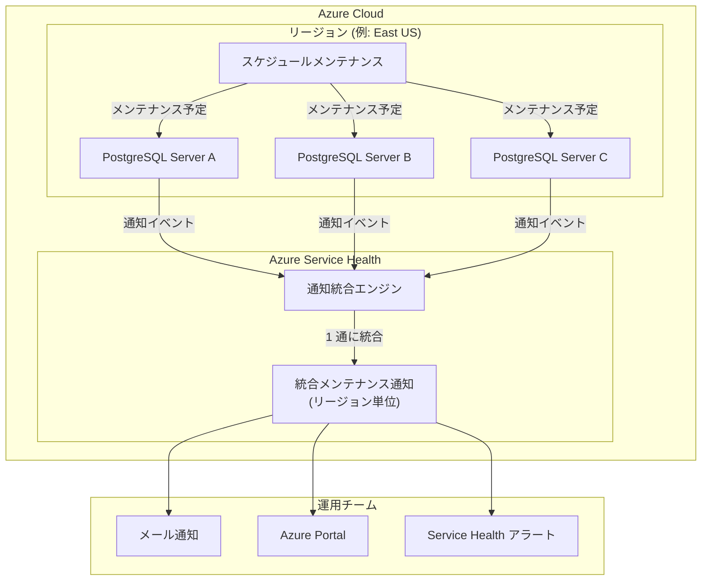

# Azure Database for PostgreSQL: メンテナンス通知のリージョンレベル統合

**リリース日**: 2026-04-08

**サービス**: Azure Database for PostgreSQL

**機能**: Enhancements to maintenance notifications in Azure Service Health

**ステータス**: Launched (GA)

[このアップデートのインフォグラフィックを見る](https://takech9203.github.io/azure-news-summary/20260408-postgresql-consolidated-maintenance-notifications.html)

## 概要

Azure Database for PostgreSQL のメンテナンス通知が強化され、Azure Service Health においてリージョンレベルで統合されたメンテナンス通知が導入された。これにより、メンテナンスに関する通知の管理方法が大幅に簡素化される。

従来は、Azure Database for PostgreSQL のスケジュールメンテナンスが予定されると、サーバーごとに個別のメンテナンス通知が Azure Service Health から送信されていた。多数のサーバーを運用している環境では、同一リージョン内で同時期に実施されるメンテナンスに対して大量の通知が発生し、通知の管理が煩雑になるという課題があった。

今回のアップデートにより、同一リージョン内のメンテナンスは 1 つの統合通知にまとめて送信されるようになった。これにより、運用チームはメンテナンス情報を効率的に把握し、必要な対応を計画できるようになる。

**アップデート前の課題**

- サーバーごとに個別のメンテナンス通知が送信されるため、多数のサーバーを運用する環境では通知が大量に発生し、管理が煩雑だった
- 同一リージョン内で同時期に実施されるメンテナンスであっても、サーバー数分の通知を個別に確認する必要があった
- 通知の量が多いことで、重要な通知が埋もれるリスクがあった
- メンテナンス対応の計画策定において、複数の通知を手動で集約・整理する作業が発生していた

**アップデート後の改善**

- リージョン単位で統合された 1 つの通知を受信するだけで、該当リージョン内のメンテナンス状況を把握できるようになった
- 通知の総数が大幅に削減され、通知管理の負荷が軽減された
- 重要な通知の見落としリスクが低減した
- メンテナンス対応の計画策定がより効率的になった

## アーキテクチャ図



この図は、同一リージョン内の複数の Azure Database for PostgreSQL サーバーに対するメンテナンス通知が、Azure Service Health の統合エンジンによって 1 つの通知にまとめられ、運用チームに配信されるフローを示している。従来はサーバーごとに個別の通知が送信されていたが、本アップデートによりリージョン単位で統合された通知のみが送信される。

## サービスアップデートの詳細

### 主要機能

1. **リージョンレベルの通知統合**
   - 同一リージョン内の Azure Database for PostgreSQL サーバーに対するメンテナンス通知が、1 つの通知に統合される
   - サーバーごとの個別通知ではなく、リージョン単位で情報が集約されるため、通知数が大幅に削減される

2. **Azure Service Health との統合**
   - 統合通知は Azure Service Health の「計画メンテナンス (Planned Maintenance)」カテゴリに表示される
   - Service Health アラートを設定することで、メール、SMS、プッシュ通知、音声メッセージなど複数チャネルで統合通知を受信可能

3. **既存のメンテナンスウィンドウとの互換性**
   - 各サーバーに設定済みのカスタムメンテナンスウィンドウやシステム管理スケジュールはそのまま維持される
   - 通知の統合はあくまで Service Health での表示・配信レベルの改善であり、メンテナンスの実行スケジュール自体には影響しない

## 技術仕様

| 項目 | 詳細 |
|------|------|
| 対象サービス | Azure Database for PostgreSQL Flexible Server |
| 通知統合単位 | リージョン単位 |
| 通知チャネル | Azure Service Health (Planned Maintenance) |
| 事前通知期間 | メンテナンスの 5 カレンダー日前 |
| メンテナンスウィンドウ | カスタム (任意の曜日・時間帯) またはシステム管理 (23:00-07:00) |
| 最小メンテナンス間隔 | 通常 30 日以上 (緊急アップデートを除く) |

## 設定方法

### Azure Portal

1. Azure Portal で **Service Health** を開く
2. **計画メンテナンス (Planned Maintenance)** セクションを選択する
3. Azure Database for PostgreSQL に関する統合メンテナンス通知が表示される

### Service Health アラートの設定

```bash
# Service Health アラートを作成し、PostgreSQL のメンテナンス通知を受信する
az monitor activity-log alert create \
  --resource-group <resource-group-name> \
  --name "postgresql-maintenance-alert" \
  --description "PostgreSQL メンテナンス通知アラート" \
  --condition category=ServiceHealth \
  --condition cause=PlannedMaintenance \
  --action-group <action-group-id>
```

### メンテナンスウィンドウの設定

```bash
# サーバーごとのカスタムメンテナンスウィンドウを設定
az postgres flexible-server update \
  --resource-group <resource-group-name> \
  --name <server-name> \
  --maintenance-window "day=0 hour=23 minute=0"
```

## メリット

### ビジネス面

- **運用効率の向上**: 通知数の削減により、運用チームがメンテナンス情報の確認・対応に費やす時間を短縮できる
- **意思決定の迅速化**: リージョン単位で集約された情報により、メンテナンス対応の計画策定がより迅速に行える
- **通知疲れの軽減**: 大量の個別通知による通知疲れ (alert fatigue) を防止し、重要な通知への注意力を維持できる

### 技術面

- **通知管理の簡素化**: 同一リージョン内のメンテナンス情報が 1 つの通知にまとまることで、ITSM ツールやチケットシステムとの連携がシンプルになる
- **既存設定との互換性**: サーバーごとのメンテナンスウィンドウ設定やアラートルールに変更は不要
- **Azure Service Health アラートとの連携**: 既存の Service Health アラートルールで統合通知を受信可能

## デメリット・制約事項

- 統合通知によりリージョン単位でまとめられるため、個別サーバーのメンテナンス詳細を確認するには通知内容を展開して確認する必要がある
- 緊急のセキュリティアップデートの場合、事前通知期間が 5 日未満になる、または通知なしでメンテナンスが実行される場合がある（これは既存の制約であり、本アップデートで変更されたものではない）
- メンテナンス中はサーバー操作（構成変更、停止/起動等）を避ける必要がある（既存の制約）

## ユースケース

### ユースケース 1: 大規模マルチサーバー環境での運用

**シナリオ**: ある企業が East US リージョンに 50 台の Azure Database for PostgreSQL Flexible Server を運用しており、毎月のメンテナンスサイクルで 50 件の個別通知を受信していた。

**効果**: 統合通知により、50 件の個別通知が 1 件のリージョンレベル通知に集約される。運用チームは 1 つの通知を確認するだけで、リージョン全体のメンテナンス状況を把握でき、対応計画を効率的に策定できる。

### ユースケース 2: マルチリージョン展開での通知管理

**シナリオ**: グローバル展開されたアプリケーションが 5 つのリージョンにそれぞれ 10 台のサーバーを配置しており、合計 50 件の通知を受信していた。

**効果**: リージョンごとに 1 件、合計 5 件の統合通知に削減される。各リージョンの運用担当者は自分の担当リージョンの通知のみを確認すればよく、責任範囲が明確になる。

## 料金

本アップデート（メンテナンス通知の統合）自体に追加料金は発生しない。Azure Service Health の通知機能は無料で利用可能である。

Azure Database for PostgreSQL Flexible Server の料金は、選択したコンピューティングティア、ストレージ、バックアップに基づく従量課金制となる。詳細は [Azure Database for PostgreSQL 料金ページ](https://azure.microsoft.com/pricing/details/postgresql/flexible-server/) を参照。

## 関連サービス・機能

- **Azure Service Health**: Azure サービスの正常性情報を提供するサービス。メンテナンス通知、サービスインシデント、正常性アドバイザリなどを一元的に管理・表示する
- **Azure Monitor アクティビティログ**: Service Health 通知はアクティビティログイベントとして記録され、アラートルールのトリガーやログ分析に活用可能
- **Azure Database for PostgreSQL Flexible Server**: 本アップデートの対象サービス。フルマネージドの PostgreSQL データベースサービスで、カスタムメンテナンスウィンドウの設定をサポート

## 参考リンク

- [インフォグラフィック](https://takech9203.github.io/azure-news-summary/20260408-postgresql-consolidated-maintenance-notifications.html)
- [公式アップデート情報](https://azure.microsoft.com/updates?id=559628)
- [Microsoft Learn - Azure Database for PostgreSQL スケジュールメンテナンス](https://learn.microsoft.com/en-us/azure/postgresql/flexible-server/concepts-maintenance)
- [Microsoft Learn - Azure Service Health 通知の概要](https://learn.microsoft.com/en-us/azure/service-health/service-health-notifications-properties)
- [Microsoft Learn - Service Health アラートの作成](https://learn.microsoft.com/en-us/azure/service-health/alerts-activity-log-service-notifications-portal)
- [料金ページ](https://azure.microsoft.com/pricing/details/postgresql/flexible-server/)

## まとめ

Azure Database for PostgreSQL のメンテナンス通知がリージョンレベルで統合されたことにより、大規模環境における通知管理の負荷が大幅に軽減される。従来のサーバーごとの個別通知から、リージョン単位の統合通知に変更されたことで、運用チームはメンテナンス情報の確認と対応計画の策定をより効率的に行えるようになった。

Solutions Architect への推奨アクション:

1. **Service Health アラートの確認**: 既存の Service Health アラートルールが Azure Database for PostgreSQL の計画メンテナンス通知をカバーしているか確認する
2. **通知配信先の最適化**: 統合通知に対応したアクションルール（メール配信先、チケットシステム連携等）を見直し、適切な運用チームに通知が届くよう設定する
3. **メンテナンスウィンドウの見直し**: 各サーバーのメンテナンスウィンドウ設定を確認し、ビジネス要件に応じたカスタムスケジュールが適切に設定されているか検証する
4. **運用手順書の更新**: メンテナンス通知の確認手順を更新し、統合通知に基づく新しいワークフローを運用チームに展開する

GA としてリリースされた機能であるため、即座に本番環境で利用可能である。特に多数の PostgreSQL サーバーを運用している環境では、通知管理の改善効果が大きい。

---

**タグ**: #AzureDatabaseForPostgreSQL #AzureServiceHealth #メンテナンス通知 #GA #Databases #運用効率化
