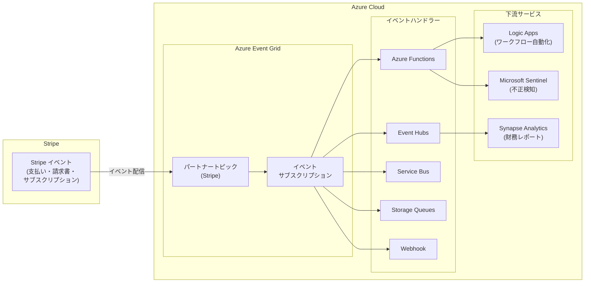

# Azure Event Grid: Stripe イベントのパートナートピック統合がパブリックプレビュー開始

**リリース日**: 2026-04-10

**サービス**: Azure Event Grid

**機能**: Stripe イベントを Event Grid のパートナートピックとして受信する統合機能

**ステータス**: In preview

[このアップデートのインフォグラフィックを見る](https://takech9203.github.io/azure-news-summary/20260410-event-grid-stripe-events-integration.html)

## 概要

Azure Event Grid の Partner Events 機能に、決済プラットフォーム Stripe が新たなパートナーとして追加され、パブリックプレビューが開始された。これにより、開発者は Stripe で発生する決済イベント (支払い成功、請求書の支払い失敗、サブスクリプションの変更など) を Azure Event Grid に直接ルーティングし、スケーラブルなイベント駆動アーキテクチャを構築できるようになった。

従来、Stripe のイベントを Azure 上のアプリケーションで処理するには、Webhook エンドポイントを自前で構築・管理し、リトライロジックやスケーリングを独自に実装する必要があった。今回の統合により、Event Grid がフルマネージドのイベントブローカーとして Stripe と Azure サービスの間に入り、信頼性の高いイベント配信を at-least-once セマンティクスで提供する。

Event Grid のパートナートピックを介して受信した Stripe イベントは、Azure Functions、Event Hubs、Service Bus、Storage Queues、Webhook など、Event Grid がサポートするすべてのイベントハンドラーに配信可能である。これにより、決済ワークフローの自動化、サブスクリプション管理、財務レポーティング、不正検知といったユースケースを Azure ネイティブのサービスで実現できる。

**アップデート前の課題**

- Stripe の Webhook イベントを受信するために、カスタムのエンドポイントを自前で構築・運用する必要があった
- Webhook の信頼性 (リトライ、スケーリング、可用性) を自前で保証する必要があった
- Stripe イベントを複数の Azure サービスにファンアウトするには、カスタムブローカーの開発が必要だった
- 決済データと Azure サービス間の統合にボイラープレートコードが多く、開発・保守コストが高かった

**アップデート後の改善**

- Event Grid がフルマネージドのイベントブローカーとして機能し、Webhook インフラの管理が不要になった
- at-least-once セマンティクスによるリトライ機構が標準提供され、イベント配信の信頼性が向上した
- Event Grid のイベントサブスクリプションを通じて、複数の Azure サービスへのファンアウトが容易になった
- CloudEvents 1.0 スキーマに準拠したイベント形式で、標準化されたイベント処理が可能になった

## アーキテクチャ図

Stripe から発行されたイベントが Event Grid のパートナートピックに配信され、イベントサブスクリプションの設定に基づいて Azure Functions、Event Hubs、Service Bus などのハンドラーに転送される。ハンドラーから更に下流のサービスに接続することで、ワークフロー自動化や分析パイプラインを構築できる。

## サービスアップデートの詳細

### 主要機能

1. **Stripe パートナートピック**
   - Stripe を Event Grid の検証済みパートナーとして登録し、パートナートピックを通じてイベントを受信する機能。Stripe Dashboard から Azure Event Grid をイベントの宛先として直接設定できる。

2. **豊富な Stripe イベントタイプのサポート**
   - 決済、請求書、サブスクリプション、顧客情報など、Stripe API が提供するイベントタイプを網羅的にサポート。イベントサブスクリプションでフィルタリングし、必要なイベントのみを選択的に受信可能。

3. **フルマネージドイベントブローカー**
   - Event Grid が Stripe と Azure サービス間のイベントブローカーとして機能し、高信頼性のイベント配信 (at-least-once セマンティクス)、リトライ機構、スケーリングを自動的に提供する。

4. **CloudEvents 1.0 スキーマ対応**
   - Stripe イベントは CloudEvents 1.0 スキーマに準拠した形式で配信され、標準化されたイベント処理が可能。

## 技術仕様

| 項目 | 詳細 |
|------|------|
| ステータス | パブリックプレビュー |
| イベント形式 | CloudEvents 1.0 スキーマ |
| 配信保証 | at-least-once セマンティクス |
| 対応イベントタイプ | `payment_intent.succeeded`, `payment_intent.payment_failed`, `charge.refunded`, `charge.failed`, `customer.subscription.created`, `customer.subscription.updated`, `customer.subscription.deleted`, `invoice.paid`, `invoice.payment_failed`, `checkout.session.completed` など (Stripe API の全イベントタイプ) |
| 対応イベントハンドラー | Azure Functions, Event Hubs, Service Bus (Queue/Topic), Storage Queues, Webhook, Hybrid Connections |
| パートナー認証 | Microsoft による検証済みパートナー (Verified Partner) |

## 設定方法

### 前提条件

1. Azure サブスクリプション
2. Stripe アカウント (Stripe Dashboard へのアクセス権限およびイベント宛先の設定権限)
3. Azure サブスクリプションに Microsoft.EventGrid リソースプロバイダーが登録されていること

### Azure Portal

**手順 1: Event Grid リソースプロバイダーの登録**

1. Azure Portal の左メニューから「サブスクリプション」を選択
2. 対象のサブスクリプションを選択し、「設定」>「リソース プロバイダー」を開く
3. `Microsoft.EventGrid` を検索し、「登録」を選択

**手順 2: Stripe パートナーの承認**

1. Azure Portal の検索バーで「Event Grid Partner Configurations」を検索
2. 「+ 作成」を選択し、対象のサブスクリプションとリソースグループを指定
3. 「+ Partner Authorization」を選択し、検証済みパートナーの一覧から「Stripe」を選択
4. 承認の有効期限を設定し、「追加」を選択
5. 「確認と作成」で設定を確認し、「作成」を選択

**手順 3: Stripe Dashboard でのイベント宛先設定**

1. Stripe Dashboard にサインインし、「Developers」>「Destinations」に移動
2. 「+ Add destination」を選択し、宛先タイプとして「Azure Event Grid」を選択
3. Azure Event Grid から提供されるパートナートピックチャネル URL を入力
4. 送信するイベントタイプ (例: `payment_intent.succeeded`, `invoice.paid` など) を選択
5. 宛先設定を保存

**手順 4: パートナートピックのアクティブ化**

1. Azure Portal で「Event Grid Partner Topics」を検索
2. 作成されたパートナートピックを選択し、「アクティブ化」を選択

**手順 5: イベントサブスクリプションの作成**

1. アクティブ化されたパートナートピックのページで「+ イベント サブスクリプション」を選択
2. サブスクリプション名を入力し、受信するイベントタイプを選択
3. エンドポイントタイプ (Azure Functions, Event Hubs, Service Bus など) を選択し、エンドポイントを構成
4. 「作成」を選択

## メリット

### ビジネス面

- Webhook インフラの構築・運用コストを削減し、決済システムの統合にかかる開発期間を短縮できる
- リアルタイムの決済イベント処理により、注文処理やデジタルコンテンツの即時提供など顧客体験を向上できる
- 支払い失敗イベントへの即時対応により、収益回収率を改善できる
- 決済データをリアルタイムに分析パイプラインに取り込み、財務レポーティングやコンプライアンス対応を効率化できる

### 技術面

- フルマネージドサービスにより、Webhook エンドポイントのスケーリング、高可用性、リトライ処理の実装が不要になる
- Event Grid のファンアウト機能により、1 つの Stripe イベントを複数のハンドラーに同時配信でき、マイクロサービスアーキテクチャとの親和性が高い
- CloudEvents 1.0 準拠のイベント形式により、標準化されたイベント処理パイプラインを構築できる
- Azure のイベント駆動サービス (Functions, Logic Apps, Event Hubs など) とネイティブに統合でき、ボイラープレートコードを最小化できる

## デメリット・制約事項

- 現時点ではパブリックプレビューであり、SLA は提供されない。本番ワークロードでの利用は推奨されない
- Event Grid のパートナートピックに関するサービス制限 (スループット、イベントサイズなど) が適用される
- パートナートピックの承認には有効期限 (1 ~ 365 日) があり、期限切れ後はパートナーがリソースを作成できなくなる
- Stripe Dashboard 側でのイベント宛先設定が必要であり、Stripe アカウントへの管理アクセス権限が必要

## ユースケース

### ユースケース 1: 決済完了時の自動フルフィルメント

**シナリオ**: EC サイトにおいて、Stripe での決済完了 (`payment_intent.succeeded` / `checkout.session.completed`) を Event Grid 経由で Azure Functions に配信し、注文処理・在庫更新・確認メール送信を自動化する。

**効果**: Webhook エンドポイントの自前構築が不要になり、リトライ機構も Event Grid が提供するため、決済完了から注文処理までのレイテンシーと信頼性が改善される。

### ユースケース 2: サブスクリプションライフサイクル管理

**シナリオ**: SaaS アプリケーションで `customer.subscription.created` / `updated` / `deleted` イベントを受信し、ユーザーの権限管理、プラン変更処理、オンボーディング/オフボーディングワークフローを Logic Apps で自動化する。

**効果**: サブスクリプション状態の変更にリアルタイムで対応でき、手動でのプロビジョニング作業が不要になる。

### ユースケース 3: 支払い失敗時の収益回収

**シナリオ**: `invoice.payment_failed` や `payment_intent.payment_failed` イベントを検知し、Azure Communication Services を通じて顧客に通知を送信、またはサポートワークフローをエスカレーションする。

**効果**: 支払い失敗の即時検知と自動対応により、顧客の離脱を防ぎ、収益回収率を向上できる。

### ユースケース 4: 財務データのリアルタイム分析

**シナリオ**: `charge.*` や `invoice.*` イベントを Event Hubs 経由で Azure Synapse Analytics や Microsoft Fabric Real-Time Intelligence に取り込み、リアルタイムの収益ダッシュボードや監査ログを構築する。

**効果**: カスタムのデータ抽出ツールを構築することなく、決済データをリアルタイムで分析パイプラインに統合できる。

### ユースケース 5: 不正決済の検知

**シナリオ**: Stripe イベントを Azure Monitor や Microsoft Sentinel にルーティングし、異常な決済パターンの検知、高リスクトランザクションのフラグ付け、潜在的な不正決済への自動対応を実装する。

**効果**: 決済監視とインシデント対応を統合し、不正決済のリスクを低減できる。

## 料金

Event Grid のパートナーイベントは、イベントのルーティング時に実行されるオペレーション数に基づいて課金される。詳細な料金情報は [Event Grid の料金ページ](https://azure.microsoft.com/pricing/details/event-grid/) を参照のこと。

## 関連サービス・機能

- **Azure Event Grid Partner Events**: Stripe 以外にも Auth0、Tribal Group、Microsoft Graph API (Entra ID, Teams, Outlook, SharePoint) など複数のパートナーからのイベント受信をサポートするフレームワーク
- **Azure Functions**: Event Grid のイベントハンドラーとして利用し、サーバーレスでイベント処理ロジックを実装可能
- **Azure Event Hubs**: 大量のイベントストリームを取り込み、下流の分析サービスに接続するためのハンドラー
- **Azure Service Bus**: キューまたはトピックを介した信頼性の高いメッセージ配信先として利用可能
- **Azure Logic Apps**: ノーコードのワークフロー自動化により、Stripe イベントに基づくビジネスプロセスを構築可能
- **Microsoft Sentinel**: Stripe イベントをセキュリティ情報として取り込み、不正決済の検知・対応に活用可能

## 参考リンク

- [インフォグラフィック](https://takech9203.github.io/azure-news-summary/20260410-event-grid-stripe-events-integration.html)
- [公式アップデート情報](https://azure.microsoft.com/updates?id=559836)
- [Stripe パートナートピックの概要 - Microsoft Learn](https://learn.microsoft.com/azure/event-grid/stripe-overview)
- [Stripe イベントのサブスクライブ手順 - Microsoft Learn](https://learn.microsoft.com/azure/event-grid/subscribe-to-stripe-events)
- [Event Grid Partner Events の概要 - Microsoft Learn](https://learn.microsoft.com/azure/event-grid/partner-events-overview)
- [料金ページ](https://azure.microsoft.com/pricing/details/event-grid/)

## まとめ

Azure Event Grid に Stripe がパートナーとして追加されたことで、決済イベントを Azure のイベント駆動アーキテクチャにネイティブに統合できるようになった。これにより、Webhook インフラの自前構築・運用が不要になり、開発者は決済ワークフローの自動化、サブスクリプション管理、財務分析、不正検知といったビジネスロジックの実装に集中できる。

現時点ではパブリックプレビューであるため、本番環境での利用前に制約事項やサービス制限を十分に確認することが推奨される。Stripe と Azure の両方を利用している組織は、この統合機能を評価し、既存の Webhook ベースの統合をフルマネージドのパートナートピックに移行することを検討すべきである。

---

**タグ**: #Azure #EventGrid #Stripe #PartnerEvents #決済 #イベント駆動 #パブリックプレビュー #Integration #Serverless
