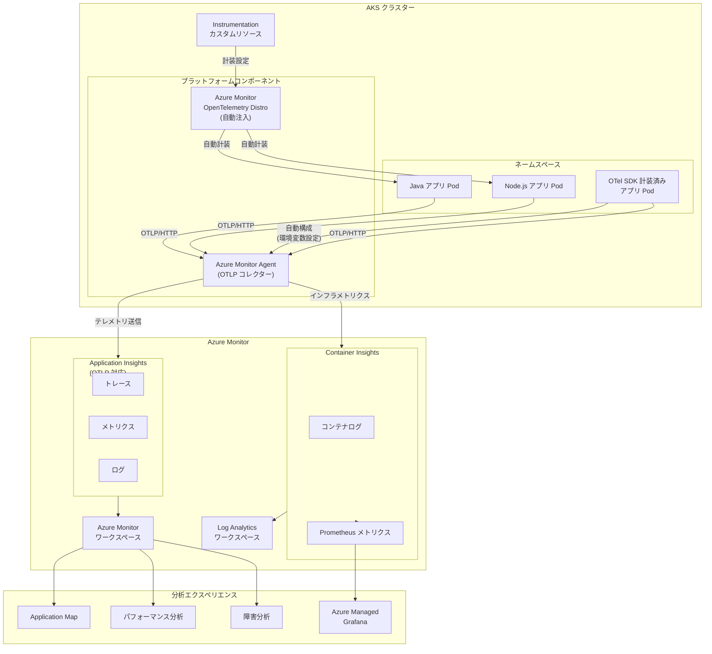

# Azure Monitor: AKS アプリケーションの OpenTelemetry モニタリングがパブリックプレビュー開始

**リリース日**: 2026-04-13

**サービス**: Azure Monitor

**機能**: AKS 上のアプリケーションを OpenTelemetry Protocol (OTLP) で計装し、Azure Monitor で監視する機能

**ステータス**: In preview

[このアップデートのインフォグラフィックを見る](https://takech9203.github.io/azure-news-summary/20260413-aks-opentelemetry-azure-monitor.html)

## 概要

Azure Monitor が Azure Kubernetes Service (AKS) 上で動作するアプリケーションの監視において、OpenTelemetry Protocol (OTLP) を使用した計装とデータ収集のパブリックプレビューを開始した。この機能により、AKS ワークロードに対して Azure Monitor OpenTelemetry ディストリビューションの自動計装 (autoinstrumentation) をデプロイするか、Azure Monitor パイプラインを使用して OpenTelemetry シグナルを複数の宛先に収集・ルーティングすることが可能になる。

従来、AKS 上のアプリケーションを Application Insights で監視するには、アプリケーションコードに手動で SDK を組み込み、接続文字列の設定やテレメトリのエクスポート処理を実装する必要があった。特にマイクロサービスアーキテクチャでは、多数のサービスそれぞれに計装コードを追加する作業が開発負荷の大きな要因となっていた。今回の機能では、AKS のネームスペースまたはデプロイメント単位でモニタリングを有効化でき、コード変更なしにテレメトリの収集を開始できる自動計装と、既に OpenTelemetry SDK で計装済みのアプリケーションに対して環境変数を設定するだけで Application Insights へのエクスポートを有効化する自動構成 (autoconfiguration) の 2 つのアプローチが提供される。

テレメトリデータは Application Insights に送信され、Container Insights のコンテキストでアプリケーションパフォーマンスを分析できる。トレース、メトリクス、ログの 3 つのシグナルをすべて OTLP で収集し、Application Map、障害分析、パフォーマンス分析などの Application Insights エクスペリエンスで活用できる。

**アップデート前の課題**

- AKS 上の各アプリケーションに手動で OpenTelemetry SDK を組み込み、接続文字列やエクスポーターの設定をコード内で管理する必要があった
- マイクロサービスごとに計装コードを追加・保守する負荷が高く、特に多言語環境では対応が困難だった
- アプリケーションレベルのテレメトリ (トレース、メトリクス) とインフラストラクチャレベルの監視 (Container Insights) が別々に管理されており、統合的な可観測性の実現が難しかった
- OpenTelemetry シグナルを複数の宛先にルーティングするためのコレクター構成を自前で管理する必要があった

**アップデート後の改善**

- ネームスペースまたはデプロイメント単位で自動計装を有効化でき、コード変更なしにテレメトリ収集を開始できるようになった
- Azure Monitor OpenTelemetry ディストリビューションが Pod に自動注入され、計装の管理が AKS プラットフォーム側に委譲された
- Application Insights と Container Insights が統合され、アプリケーションパフォーマンスとインフラストラクチャの状態をコンテキスト付きで分析できるようになった
- 既に OpenTelemetry SDK で計装済みのアプリケーションも、自動構成によって環境変数の設定のみで Application Insights にデータをエクスポートできるようになった

## アーキテクチャ図



AKS クラスター内で Instrumentation カスタムリソースを作成すると、Azure Monitor OpenTelemetry ディストリビューションが対象 Pod に自動注入される。収集されたテレメトリは OTLP/HTTP プロトコルで Azure Monitor Agent に送信され、Application Insights に転送される。Container Insights と統合することで、アプリケーションレベルとインフラストラクチャレベルの両方を統合的に監視できる。

## サービスアップデートの詳細

### 主要機能

1. **自動計装 (Autoinstrumentation)**
   - Azure Monitor OpenTelemetry ディストリビューションを AKS の Pod に自動注入する機能。Java および Node.js アプリケーションに対応しており、コード変更なしにトレース、メトリクス、ログの収集を開始できる。ネームスペース単位で言語を指定するか、デプロイメントごとにアノテーションで個別に制御できる。

2. **自動構成 (Autoconfiguration)**
   - 既にオープンソースの OpenTelemetry SDK で計装済みのアプリケーションに対して、環境変数を設定することで Application Insights へのテレメトリエクスポートを有効化する機能。アプリケーションコードの変更は不要で、プラットフォームレベルで OTLP エクスポーターの宛先を設定する。

3. **OTLP インジェスト対応の Application Insights**
   - Application Insights リソースで OTLP サポートを有効化することで、OpenTelemetry Protocol による直接的なテレメトリ取り込みが可能になる。マネージドワークスペースと組み合わせて使用する。

4. **Container Insights との統合**
   - Application Insights のテレメトリと Container Insights のインフラストラクチャ情報を統合し、コントローラービューからリクエスト障害、遅延オペレーション、推奨される調査を確認できる。Application Map からドリルダウンして Pod の状態を確認することも可能。

5. **Kubernetes カスタムリソースによるオンボーディング**
   - `Instrumentation` カスタムリソースを使用して、ネームスペース単位またはデプロイメント単位で監視を構成できる。OpenTelemetry のアノテーション (`instrumentation.opentelemetry.io/inject-java` など) を使用してデプロイメントごとの設定をオーバーライドできる。

## 技術仕様

| 項目 | 詳細 |
|------|------|
| ステータス | パブリックプレビュー |
| プロトコル | OTLP/HTTP (バイナリ Protobuf) |
| 自動計装対応言語 | Java、Node.js |
| 限定プレビュー対応言語 | .NET、Python |
| 収集シグナル | トレース、メトリクス、ログ |
| メトリクス仕様 | デルタ時間集約 (Delta temporality)、指数ヒストグラム (Exponential histogram) |
| DCR アソシエーション上限 | 1 クラスターあたり最大 30 |
| ログ・トレースのスケール上限 | 50,000 イベント/秒 (EPS) |
| リソースオーバーヘッド | 約 250 MiB メモリ + 0.5 vCPU (クラスターあたり) |
| 必要な Azure CLI バージョン | 2.78.0 以降 |
| 必要な拡張機能 | aks-preview |
| ノードプール制限 | Windows ノードプールは非対応 |

## 設定方法

### 前提条件

1. Azure パブリッククラウドで動作する AKS クラスター (1 つ以上の Kubernetes デプロイメントが稼働中)
2. Azure CLI 2.78.0 以降がインストールされていること
3. `aks-preview` Azure CLI 拡張機能がインストールされていること
4. Microsoft.ContainerService および Microsoft.Insights リソースプロバイダーが登録されていること

### Azure CLI

```bash
# aks-preview 拡張機能のインストール
az extension add --name aks-preview
az extension update --name aks-preview

# プレビュー機能フラグの登録 (AKS サブスクリプション)
az feature register --namespace "Microsoft.ContainerService" --name "AzureMonitorAppMonitoringPreview"

# 登録状態の確認 (Registered になるまで待機)
az feature list -o table --query "[?contains(name, 'Microsoft.ContainerService/AzureMonitorAppMonitoringPreview')].{Name:name,State:properties.state}"

# リソースプロバイダーの再登録
az provider register --namespace "Microsoft.ContainerService"

# Application Insights OTLP プレビュー機能フラグの登録
az feature register --name OtlpApplicationInsights --namespace Microsoft.Insights
az provider register -n Microsoft.Insights
```

```bash
# 既存クラスターでアプリケーション監視を有効化
az aks update --resource-group <resource-group> --name <cluster-name> --enable-azure-monitor-app-monitoring
```

### Azure Portal

**手順 1: クラスターの準備**

1. AKS リソースの「Monitor」ペインを開く
2. 「Enable support for Autoinstrumentation」と「Enable support for data collection from vendor neutral OpenTelemetry SDKs (Preview)」を有効にする
3. 「Review + enable」を選択

**手順 2: OTLP 対応の Application Insights リソースの作成**

1. Azure Portal で新しい Application Insights リソースを作成
2. 「Enable OTLP Support (Preview)」を有効にする
3. 「Use managed workspaces」を「Yes」に設定
4. インフラストラクチャメトリクスに使用するワークスペースとは別の Azure Monitor ワークスペースを指定

**手順 3: アプリケーションのオンボーディング**

1. AKS リソースの「Kubernetes resources」>「Namespaces」から対象のネームスペースを選択
2. 「Application Monitoring (Preview)」を選択
3. OTLP 対応の Application Insights リソースを選択
4. 計装タイプを選択 (Java 自動計装 / Node.js 自動計装 / ユーザー構成)
5. 「Configure」を選択

**手順 4: デプロイメントの再起動**

```bash
kubectl rollout restart deployment -n <namespace>
```

**手順 5: 計装状態の確認**

1. 「Application Monitoring (Preview)」に戻り、デプロイメントが「Instrumented」ステータスになっていることを確認

## メリット

### ビジネス面

- アプリケーション監視のオンボーディングに要する開発工数を大幅に削減でき、マイクロサービスの迅速なデプロイと運用を加速できる
- クラスター管理者とアプリケーション開発者の責務が明確に分離され、運用効率が向上する
- OpenTelemetry 標準に準拠しているため、ベンダーロックインを回避しつつ Azure のマネージドサービスの利点を享受できる

### 技術面

- 自動計装によりコード変更なしにトレース、メトリクス、ログの 3 シグナルを収集でき、可観測性のベースラインを即座に確立できる
- Application Insights と Container Insights の統合により、アプリケーションパフォーマンスとインフラストラクチャの問題を同一画面で横断的に分析できる
- Kubernetes カスタムリソースとアノテーションによるデクララティブな構成管理が可能で、GitOps ワークフローとの親和性が高い
- 既存の OpenTelemetry SDK 計装を活かしつつ、自動構成で Application Insights へのエクスポートを追加できる

## デメリット・制約事項

- パブリックプレビューであり、SLA は提供されない。本番ワークロードでの利用は推奨されない
- 自動計装の対応言語は現時点で Java と Node.js のみ (.NET と Python は限定プレビュー)
- Windows ノードプールおよび Linux Arm64 ノードプールは非対応
- OTLP/HTTP (バイナリ Protobuf) のみサポートされ、JSON ペイロードや OTLP/gRPC は非対応
- OpenTelemetry SDK エクスポーターの圧縮はサポートされていない
- Istio mTLS が有効なネームスペースでは動作しない
- DCR アソシエーションは 1 クラスターあたり最大 30 まで
- Israel Central、Israel North West、Qatar Central、UAE North、UAE Central リージョンでは利用不可
- AKS HTTP プロキシ構成、Private Link 構成、デュアルスタッククラスターは未検証

## ユースケース

### ユースケース 1: マイクロサービスの統合可観測性

**シナリオ**: 数十の Java / Node.js マイクロサービスで構成される EC サイトの AKS クラスターに対して、ネームスペース単位で自動計装を有効化し、全サービスのトレース、メトリクス、ログを Application Insights に集約する。

**効果**: 各マイクロサービスに個別に SDK を組み込む作業が不要になり、Application Map でサービス間の依存関係と障害の伝播経路を即座に可視化できる。Container Insights と統合することで、アプリケーションの遅延が Pod のリソース不足に起因するものか、コードの問題に起因するものかを迅速に切り分けられる。

### ユースケース 2: 既存 OpenTelemetry 計装の Application Insights 統合

**シナリオ**: 既にオープンソースの OpenTelemetry SDK で計装し、Jaeger や Prometheus にテレメトリを送信しているアプリケーションに対して、自動構成 (autoconfiguration) を使用して Application Insights への追加エクスポートを有効化する。

**効果**: 既存の計装コードを変更することなく、Azure Monitor の分析機能 (Application Map、障害分析、パフォーマンス分析) を利用できるようになる。環境変数の設定のみで有効化できるため、デプロイメントのアノテーションを追加するだけで完了する。

### ユースケース 3: 開発環境での迅速なデバッグ

**シナリオ**: 開発・ステージング環境の AKS クラスターで自動計装を有効化し、新機能のデプロイ時にトレースとログを即座に確認できる環境を構築する。

**効果**: 開発者がモニタリングのセットアップに時間を費やすことなく、デプロイ直後から分散トレースを確認してパフォーマンスのボトルネックやエラーの原因を特定できる。

## 料金

Application Insights の OTLP インジェストは、Azure Monitor の Application Insights 料金体系に基づいて課金される。主要なコスト要因は以下のとおり。

| 項目 | 概要 |
|------|------|
| データインジェスト | Application Insights に取り込まれるテレメトリデータ量に応じた従量課金 |
| データ保持 | デフォルト 90 日間は無料。それ以降は保持期間に応じて課金 |
| 無料枠 | 月間 5 GB のデータインジェストが無料 |

詳細な料金情報は [Azure Monitor の料金ページ](https://azure.microsoft.com/pricing/details/monitor/) を参照のこと。サンプリング設定やログの詳細度を適切に構成することで、コストを最適化できる。

## 関連サービス・機能

- **Application Insights**: AKS アプリケーションからのテレメトリの格納先であり、Application Map、障害分析、パフォーマンス分析、Live Metrics などのエクスペリエンスを提供する
- **Container Insights**: AKS クラスターのインフラストラクチャ監視 (コンテナログ、Prometheus メトリクス) を提供し、アプリケーションテレメトリと統合して分析可能
- **Azure Managed Grafana**: Prometheus メトリクスのダッシュボード表示に使用。AKS クラスターの監視設定時に連携可能
- **Azure Monitor OpenTelemetry Distro**: .NET、Java、Node.js、Python 向けの OpenTelemetry ディストリビューション。この機能で AKS Pod に自動注入される計装ライブラリ
- **Azure Monitor ワークスペース**: OTLP 対応 Application Insights がメトリクスを格納するマネージドワークスペース

## 参考リンク

- [インフォグラフィック](https://takech9203.github.io/azure-news-summary/20260413-aks-opentelemetry-azure-monitor.html)
- [公式アップデート情報](https://azure.microsoft.com/updates?id=560119)
- [Monitor AKS applications with OpenTelemetry Protocol (OTLP) Preview - Microsoft Learn](https://learn.microsoft.com/azure/azure-monitor/containers/kubernetes-open-protocol)
- [Monitor applications on AKS with Azure Monitor Application Insights (Preview) - Microsoft Learn](https://learn.microsoft.com/azure/azure-monitor/containers/kubernetes-codeless)
- [Enable OpenTelemetry in Application Insights - Microsoft Learn](https://learn.microsoft.com/azure/azure-monitor/app/opentelemetry-enable)
- [Application Insights OpenTelemetry observability overview - Microsoft Learn](https://learn.microsoft.com/azure/azure-monitor/app/app-insights-overview)
- [Enable monitoring for AKS clusters - Microsoft Learn](https://learn.microsoft.com/azure/azure-monitor/containers/kubernetes-monitoring-enable)
- [料金ページ](https://azure.microsoft.com/pricing/details/monitor/)

## まとめ

Azure Monitor が AKS 上のアプリケーション監視において OpenTelemetry Protocol (OTLP) をネイティブにサポートしたことで、コード変更なしに自動計装でトレース・メトリクス・ログを収集できるようになった。Java と Node.js の自動計装、既存 OpenTelemetry SDK 計装アプリへの自動構成、Container Insights との統合により、AKS 環境における可観測性の確立が大幅に容易になる。

パブリックプレビューの段階であるため、本番ワークロードでの利用前に制約事項 (対応言語、ノードプール制限、リージョン制限、プロトコル制限) を十分に確認することが推奨される。AKS でマイクロサービスを運用している組織は、まず開発・ステージング環境でこの機能を評価し、自動計装による可観測性の向上と運用負荷の削減効果を検証することを推奨する。

---

**タグ**: #Azure #AzureMonitor #AKS #OpenTelemetry #ApplicationInsights #ContainerInsights #OTLP #Autoinstrumentation #Kubernetes #パブリックプレビュー #DevOps #可観測性
