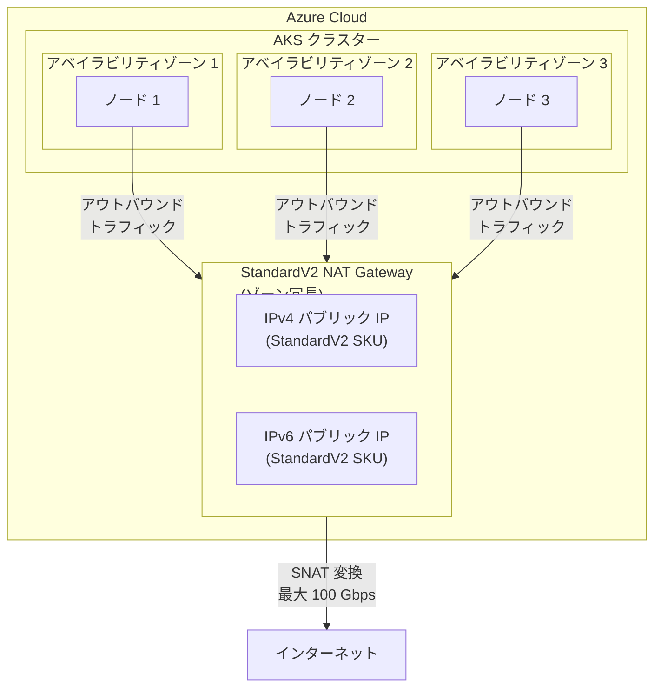

# Azure Kubernetes Service (AKS): StandardV2 NAT Gateway をアウトバウンドタイプとして利用可能に (パブリックプレビュー)

**リリース日**: 2026-04-13

**サービス**: Azure Kubernetes Service (AKS), Azure NAT Gateway

**機能**: StandardV2 NAT Gateway as an outbound type for AKS

**ステータス**: Launched (GA)

[このアップデートのインフォグラフィックを見る](https://takech9203.github.io/azure-news-summary/20260413-aks-standardv2-nat-gateway.html)

## 概要

Azure Kubernetes Service (AKS) で、StandardV2 NAT Gateway をアウトバウンドタイプとして利用できるようになった。マネージド型 (`managedNATGatewayV2`) およびユーザー割り当て型 (`userAssignedNATGateway`) の両方で StandardV2 NAT Gateway がサポートされ、AKS マネージド VNet および BYO (Bring Your Own) VNet のいずれでも使用可能である。

StandardV2 NAT Gateway は、従来の Standard NAT Gateway の全機能を継承しつつ、ゾーン冗長性、最大 100 Gbps のアウトバウンドスループット、IPv6 アウトバウンドサポートといった大幅な機能強化を提供する。これにより、AKS クラスターからのアウトバウンド接続の信頼性、パフォーマンス、およびスケーラビリティが大きく向上する。

なお、マネージド型の `managedNATGatewayV2` アウトバウンドタイプは現在パブリックプレビュー段階であり、プレビュー機能の利用規約が適用される。ユーザー割り当て型 (`userAssignedNATGateway`) では、Standard および StandardV2 の両方の NAT Gateway SKU がサポートされている。

**アップデート前の課題**

- Standard NAT Gateway は単一のアベイラビリティゾーンでしか動作せず、ゾーン障害時にアウトバウンド接続が中断されるリスクがあった
- Standard NAT Gateway のスループットは最大 50 Gbps に制限されており、大規模クラスターのアウトバウンドトラフィック需要に対して制約があった
- IPv6 アウトバウンド接続が NAT Gateway 単体ではサポートされておらず、デュアルスタック構成に制限があった
- ゾーン冗長なアウトバウンド接続を実現するには、複数ゾーンにまたがる構成を手動で設計する必要があった

**アップデート後の改善**

- StandardV2 NAT Gateway はゾーン冗長がデフォルトで組み込まれ、単一ゾーン障害時でもアウトバウンド接続を維持できる
- 最大 100 Gbps のスループットにより、大規模 AKS クラスターでも十分なアウトバウンド帯域を確保できる
- IPv6 パブリック IP アドレスおよびプレフィックスがサポートされ、IPv6 アウトバウンド接続が可能になる
- フローログのサポートにより、アウトバウンドトラフィックの監視・分析が強化される

## アーキテクチャ図



この図は、複数のアベイラビリティゾーンに分散した AKS クラスターのノードが、ゾーン冗長な StandardV2 NAT Gateway を経由してインターネットへのアウトバウンド接続を行う構成を示している。StandardV2 NAT Gateway は全ゾーンにまたがって動作するため、単一ゾーン障害時でも他のゾーンからのアウトバウンド接続が継続される。

## サービスアップデートの詳細

### 主要機能

1. **マネージド StandardV2 NAT Gateway (`managedNATGatewayV2`)**
   - AKS が StandardV2 NAT Gateway リソースを自動的に作成・管理する
   - Azure マネージド IP (自動割り当て) またはカスタマー定義 IP (事前プロビジョニング) のいずれかを選択可能
   - Azure マネージド IP では `--nat-gateway-managed-outbound-ip-count` および `--nat-gateway-managed-outbound-ipv6-count` を使用
   - カスタマー定義 IP では `--nat-gateway-outbound-ips` および `--nat-gateway-outbound-ip-prefixes` を使用
   - 現在パブリックプレビュー段階であり、`ManagedNATGatewayV2Preview` フィーチャーフラグの登録が必要

2. **ユーザー割り当て StandardV2 NAT Gateway (`userAssignedNATGateway`)**
   - ユーザーが事前に作成した StandardV2 NAT Gateway リソースを AKS クラスターのサブネットに関連付ける
   - BYO (Bring Your Own) VNet 構成で使用
   - Azure CNI ネットワークプラグインが必要

3. **ゾーン冗長アウトバウンド接続**
   - StandardV2 NAT Gateway はデフォルトで全アベイラビリティゾーンにまたがって動作する
   - ゾーン指定が不要で、自動的にゾーン冗長構成となる
   - 単一ゾーン障害時でもアウトバウンド接続を維持

4. **IPv6 アウトバウンドサポート**
   - StandardV2 パブリック IP アドレスおよびプレフィックスによる IPv6 アウトバウンド接続をサポート
   - IPv4 と IPv6 の両方のアウトバウンド IP を同時に構成可能

5. **フローログサポート**
   - IP ベースのトラフィック情報を提供し、アウトバウンドトラフィックフローの監視と分析を支援

## 技術仕様

| 項目 | StandardV2 NAT Gateway | Standard NAT Gateway |
|------|----------------------|---------------------|
| ゾーン冗長性 | 全ゾーンにまたがる (デフォルト) | 単一ゾーンのみ |
| 最大スループット | 100 Gbps | 50 Gbps |
| IPv6 サポート | あり | なし |
| フローログ | サポート | なし |
| 最大アウトバウンドフロー | IP あたり 64,512 (TCP/UDP) | IP あたり 64,512 (TCP/UDP) |
| 最大パブリック IP 数 | 16 | 16 |
| 対応パブリック IP SKU | StandardV2 のみ | Standard のみ |
| AKS アウトバウンドタイプ | `managedNATGatewayV2` / `userAssignedNATGateway` | `managedNATGateway` / `userAssignedNATGateway` |
| アイドルタイムアウト | 4 - 120 分 (TCP)、4 分固定 (UDP) | 4 - 120 分 (TCP)、4 分固定 (UDP) |

## 設定方法

### 前提条件

1. Azure CLI の最新バージョンがインストールされていること
2. Kubernetes バージョン 1.20.x 以上
3. `managedNATGatewayV2` を使用する場合は、`aks-preview` CLI 拡張機能 (バージョン 20.0.0b1 以上) が必要
4. `managedNATGatewayV2` を使用する場合は、`ManagedNATGatewayV2Preview` フィーチャーフラグの登録が必要
5. `userAssignedNATGateway` を使用する場合は、BYO VNet と Azure CNI が必要

### Azure CLI (マネージド StandardV2 NAT Gateway)

```bash
# aks-preview 拡張機能のインストール
az extension add --name aks-preview
az extension update --name aks-preview

# ManagedNATGatewayV2Preview フィーチャーフラグの登録
az feature register --namespace "Microsoft.ContainerService" --name "ManagedNATGatewayV2Preview"

# 登録状態の確認
az feature show --namespace "Microsoft.ContainerService" --name "ManagedNATGatewayV2Preview"

# リソースプロバイダーの再登録
az provider register --namespace Microsoft.ContainerService
```

```bash
# リソースグループの作成
az group create --name myResourceGroup --location eastus2

# StandardV2 パブリック IP の作成
MY_IP_ID=$(az network public-ip create \
    --resource-group myResourceGroup \
    --name myNatOutboundIP \
    --location eastus2 \
    --sku StandardV2 \
    --allocation-method Static \
    --version IPv4 \
    --zone 1 2 3 \
    --query id \
    --output tsv)

# managedNATGatewayV2 でAKS クラスターを作成
az aks create \
    --resource-group myResourceGroup \
    --name myAKSCluster \
    --node-count 3 \
    --outbound-type managedNATGatewayV2 \
    --nat-gateway-outbound-ips $MY_IP_ID \
    --nat-gateway-idle-timeout 4 \
    --generate-ssh-keys
```

### Azure CLI (ユーザー割り当て StandardV2 NAT Gateway)

```bash
# StandardV2 パブリック IP の作成
az network public-ip create \
    --resource-group myResourceGroup \
    --name myNatGatewayPip \
    --location eastus2 \
    --allocation-method Static \
    --version IPv4 \
    --zone 1 2 3 \
    --sku standard-v2

# StandardV2 NAT Gateway の作成
az network nat gateway create \
    --resource-group myResourceGroup \
    --name myNatGateway \
    --location eastus2 \
    --public-ip-addresses myNatGatewayPip \
    --sku StandardV2 \
    --idle-timeout 4

# VNet とサブネットの作成 (NAT Gateway を関連付け)
az network vnet create \
    --resource-group myResourceGroup \
    --name myVnet \
    --location eastus2 \
    --address-prefixes 172.16.0.0/20

SUBNET_ID=$(az network vnet subnet create \
    --resource-group myResourceGroup \
    --vnet-name myVnet \
    --name mySubnet \
    --address-prefixes 172.16.0.0/22 \
    --nat-gateway myNatGateway \
    --query id \
    --output tsv)

# userAssignedNATGateway で AKS クラスターを作成
az aks create \
    --resource-group myResourceGroup \
    --name myAKSCluster \
    --location eastus2 \
    --network-plugin azure \
    --vnet-subnet-id $SUBNET_ID \
    --outbound-type userAssignedNATGateway \
    --generate-ssh-keys
```

## メリット

### ビジネス面

- ゾーン冗長によるアウトバウンド接続の高可用性により、ゾーン障害時のサービス中断リスクが低減される
- 100 Gbps のスループットにより、大規模なアウトバウンドトラフィックを処理するワークロードのパフォーマンスが向上する
- IPv6 対応により、IPv6 移行を進める組織のネットワーク要件に対応できる

### 技術面

- ゾーン指定が不要なため、ゾーン冗長構成の設計・管理が簡素化される
- Standard NAT Gateway と比較して 2 倍のスループット (50 Gbps から 100 Gbps) を実現
- フローログにより、アウトバウンドトラフィックの可視化と分析が可能になる
- IP あたり最大 64,512 の SNAT ポートにより、大量の同時接続を処理でき SNAT ポート枯渇のリスクが低減される
- マネージド型とユーザー割り当て型の両方の構成パターンが利用可能で、柔軟な設計が可能

## デメリット・制約事項

- `managedNATGatewayV2` は現在パブリックプレビュー段階であり、SLA の対象外。プロダクション利用は慎重に検討する必要がある
- StandardV2 NAT Gateway は StandardV2 SKU のパブリック IP アドレス / プレフィックスのみをサポートし、既存の Standard SKU パブリック IP は使用不可
- Standard NAT Gateway から StandardV2 NAT Gateway への直接アップグレードは不可。新規に StandardV2 NAT Gateway を作成し、サブネット上の Standard NAT Gateway を置き換える必要がある
- `managedNATGatewayV2` では、作成後に Azure マネージド IP とカスタマー定義 IP の間での切り替えは不可 (作成時の選択が不変)
- `managedNATGatewayV2` はカスタム VNet との併用が不可 (マネージド VNet のみ)
- 一部のリージョンでは StandardV2 NAT Gateway が未サポート (Brazil Southeast、Canada East、Central India、West Central US など)
- Terraform では StandardV2 NAT Gateway および StandardV2 パブリック IP のデプロイがまだサポートされていない
- 一部のデリゲートサブネット (SQL Managed Instance、Azure Container Instances、PostgreSQL Flexible Server など) への StandardV2 NAT Gateway の関連付けは不可
- Load Balancer アウトバウンドルールを使用した IPv6 アウトバウンドトラフィックは、StandardV2 NAT Gateway をサブネットに関連付けると中断される既知の問題がある

## ユースケース

### ユースケース 1: ゾーン冗長な大規模コンテナープラットフォーム

**シナリオ**: 金融機関が複数のアベイラビリティゾーンに分散した AKS クラスターを運用しており、外部 API やデータフィードへの高可用性なアウトバウンド接続が求められている。

**実装例**:

```bash
# ゾーン冗長な AKS クラスターを managedNATGatewayV2 で作成
az aks create \
    --resource-group finance-prod-rg \
    --name finance-aks-cluster \
    --node-count 9 \
    --zones 1 2 3 \
    --outbound-type managedNATGatewayV2 \
    --nat-gateway-managed-outbound-ip-count 4 \
    --nat-gateway-idle-timeout 10 \
    --generate-ssh-keys
```

**効果**: 単一ゾーン障害時でもアウトバウンド接続が維持され、外部 API への通信が中断されない。4 つのパブリック IP による最大 258,048 の同時 SNAT ポートにより、大量の外部接続を処理できる。

### ユースケース 2: IPv6 対応のマルチスタック AKS 環境

**シナリオ**: グローバルに展開するサービスが IPv6 対応を進めており、AKS クラスターから IPv6 エンドポイントへのアウトバウンド通信が必要である。

**実装例**:

```bash
# IPv4 と IPv6 の両方のマネージド IP を持つクラスターを作成
az aks create \
    --resource-group global-service-rg \
    --name global-aks-cluster \
    --node-count 6 \
    --outbound-type managedNATGatewayV2 \
    --nat-gateway-managed-outbound-ip-count 2 \
    --nat-gateway-managed-outbound-ipv6-count 2 \
    --nat-gateway-idle-timeout 4 \
    --generate-ssh-keys
```

**効果**: IPv4 と IPv6 の両方のアウトバウンド接続が StandardV2 NAT Gateway 経由で提供され、デュアルスタック環境でのアウトバウンド通信要件を満たすことができる。

### ユースケース 3: BYO VNet での高スループットアウトバウンド接続

**シナリオ**: 既存の企業ネットワーク (BYO VNet) に AKS クラスターをデプロイし、大量のデータを外部ストレージやサードパーティサービスに転送する必要がある。

**実装例**:

```bash
# StandardV2 NAT Gateway を既存 VNet のサブネットに関連付け
az network nat gateway create \
    --resource-group enterprise-rg \
    --name enterprise-nat-gw \
    --location eastus2 \
    --public-ip-addresses enterprise-nat-pip \
    --sku StandardV2 \
    --idle-timeout 10

az network vnet subnet update \
    --resource-group enterprise-rg \
    --vnet-name enterprise-vnet \
    --name aks-subnet \
    --nat-gateway enterprise-nat-gw

# userAssignedNATGateway で AKS クラスターを作成
az aks create \
    --resource-group enterprise-rg \
    --name enterprise-aks \
    --network-plugin azure \
    --vnet-subnet-id /subscriptions/<sub-id>/resourceGroups/enterprise-rg/providers/Microsoft.Network/virtualNetworks/enterprise-vnet/subnets/aks-subnet \
    --outbound-type userAssignedNATGateway \
    --generate-ssh-keys
```

**効果**: 最大 100 Gbps のスループットにより、大量データの外部転送がボトルネックなく処理される。既存のネットワーク構成を維持しながら、高性能なアウトバウンド接続を実現できる。

## 料金

StandardV2 NAT Gateway と Standard NAT Gateway の料金は同一である。

| 項目 | 料金 |
|------|------|
| NAT Gateway リソース時間 | リソースがデプロイされている時間に基づく課金 |
| データ処理 | NAT Gateway を経由して処理されたデータ量に基づく課金 |

StandardV2 パブリック IP アドレスの料金は別途発生する。

詳細な料金については、[Azure NAT Gateway の料金ページ](https://azure.microsoft.com/pricing/details/azure-nat-gateway/)を参照されたい。

## 関連サービス・機能

- **Azure NAT Gateway**: AKS のアウトバウンド接続を提供する基盤サービス。StandardV2 SKU により、ゾーン冗長性、高スループット、IPv6 サポートが追加された
- **Azure Kubernetes Service (AKS)**: コンテナーオーケストレーションサービス。アウトバウンドタイプとして NAT Gateway を選択することで、スケーラブルなアウトバウンド接続を実現する
- **Azure Load Balancer**: AKS のデフォルトのアウトバウンドタイプ。NAT Gateway と比較して SNAT ポート数に制限があり、大規模環境では NAT Gateway への移行が推奨される
- **Azure Virtual Network**: AKS クラスターのネットワーク基盤。BYO VNet 構成では、サブネットに StandardV2 NAT Gateway を関連付けて使用する
- **Azure CNI**: AKS のネットワークプラグイン。`userAssignedNATGateway` アウトバウンドタイプでは Azure CNI が必要

## 参考リンク

- [インフォグラフィック](https://takech9203.github.io/azure-news-summary/20260413-aks-standardv2-nat-gateway.html)
- [公式アップデート情報](https://azure.microsoft.com/updates?id=560207)
- [Microsoft Learn - AKS での NAT Gateway の作成](https://learn.microsoft.com/en-us/azure/aks/nat-gateway)
- [Microsoft Learn - Azure NAT Gateway の概要](https://learn.microsoft.com/en-us/azure/nat-gateway/nat-overview)
- [Azure NAT Gateway 料金ページ](https://azure.microsoft.com/pricing/details/azure-nat-gateway/)
- [AKS 料金ページ](https://azure.microsoft.com/pricing/details/kubernetes-service/)

## まとめ

AKS で StandardV2 NAT Gateway がアウトバウンドタイプとしてサポートされたことにより、AKS クラスターのアウトバウンド接続における信頼性、パフォーマンス、機能性が大幅に向上した。特にゾーン冗長性がデフォルトで組み込まれている点は、高可用性が求められるプロダクション環境にとって大きな改善である。

Solutions Architect への推奨アクションとして、まず `managedNATGatewayV2` がプレビュー段階であることを踏まえ、開発・テスト環境での検証を開始することを推奨する。既存の Standard NAT Gateway を使用している AKS クラスターについては、StandardV2 NAT Gateway への移行計画を策定し、ゾーン冗長性と高スループットのメリットを評価されたい。BYO VNet 環境では `userAssignedNATGateway` で StandardV2 NAT Gateway を即座に利用可能であるため、ゾーン冗長なアウトバウンド接続が必要な環境から優先的に導入を検討することを推奨する。

---

**タグ**: #Azure #AKS #Kubernetes #NATGateway #StandardV2 #ZoneRedundant #IPv6 #Networking #PublicPreview
