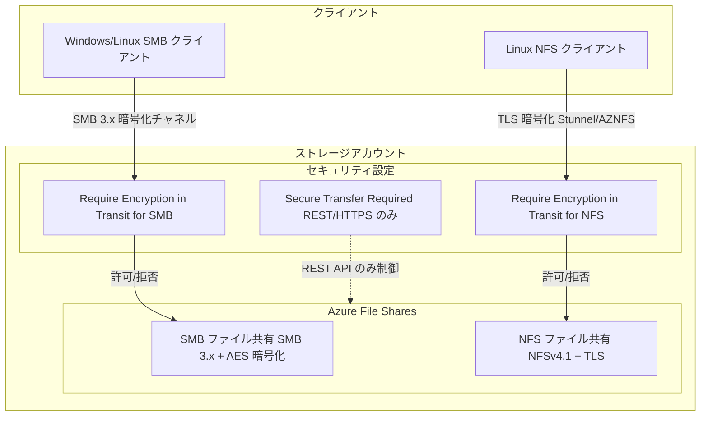

# Azure Files: SMB/NFS プロトコル別の転送中暗号化制御が一般提供開始

**リリース日**: 2026-04-13

**サービス**: Azure Files

**機能**: SMB および NFS の転送中暗号化 (Encryption-in-Transit) のきめ細かなプロトコル別制御

**ステータス**: Launched (GA)

[このアップデートのインフォグラフィックを見る](https://takech9203.github.io/azure-news-summary/20260413-azure-files-encryption-in-transit-smb-nfs.html)

## 概要

Azure Files において、SMB と NFS プロトコルの転送中暗号化設定をストレージアカウントレベルで独立して構成できる機能が一般提供 (GA) となった。従来はストレージアカウント全体に適用される「セキュア転送が必須 (Secure transfer required)」設定のみで暗号化要件を制御していたが、本アップデートにより SMB と NFS それぞれに専用の「Require Encryption in Transit」設定が導入され、プロトコルごとに暗号化ポリシーを定義できるようになった。

これにより、SMB ファイル共有と NFS ファイル共有を同一ストレージアカウント内で異なるセキュリティポリシーで運用することが可能となり、レガシークライアントのサポートとセキュリティ要件の両立がより柔軟に実現できる。新しいプロトコル別設定は、従来の「Secure transfer required」設定よりも優先され、REST/HTTPS トラフィックのみに適用範囲が限定される。

**アップデート前の課題**

- ストレージアカウントレベルの「Secure transfer required」設定が SMB、NFS、REST すべてのトラフィックに一律適用されていた
- SMB で暗号化を強制すると NFS クライアントにも影響し、プロトコルごとの柔軟なセキュリティポリシー定義ができなかった
- レガシーの SMB 2.1 クライアントをサポートするために暗号化を無効化すると、NFS を含むすべてのプロトコルでセキュリティレベルが低下した
- 同一ストレージアカウント内で SMB と NFS の暗号化要件を個別に管理する手段がなかった

**アップデート後の改善**

- SMB 用「Require Encryption in Transit for SMB」と NFS 用「Require Encryption in Transit for NFS」の専用設定がそれぞれ導入された
- プロトコルごとに独立して暗号化要件を有効/無効化でき、きめ細かなセキュリティポリシーが定義可能になった
- 従来の「Secure transfer required」は REST/HTTPS トラフィックのみに適用され、ファイル共有プロトコルとの役割分離が明確になった
- Azure Portal で作成した新規ストレージアカウントでは、SMB・NFS ともにデフォルトで暗号化が有効化される

## アーキテクチャ図



SMB クライアントと NFS クライアントはそれぞれ独立した暗号化設定によって制御され、プロトコルごとに暗号化要件の有無を個別に判定する。従来の Secure Transfer Required 設定は REST/HTTPS トラフィックのみに適用される。

## サービスアップデートの詳細

### 主要機能

1. **SMB 向け転送中暗号化制御 (Require Encryption in Transit for SMB)**
   - SMB ファイル共有へのアクセスに対して暗号化を要求するかどうかを独立して制御する
   - 有効化すると、SMB 3.x + チャネル暗号化をサポートするクライアントのみがマウント可能となる
   - SMB 2.1 など暗号化非対応クライアントからの接続は拒否される
   - サポートされるチャネル暗号化: AES-256-GCM、AES-128-GCM、AES-128-CCM

2. **NFS 向け転送中暗号化制御 (Require Encryption in Transit for NFS)**
   - NFS ファイル共有へのアクセスに対して TLS 暗号化を要求するかどうかを独立して制御する
   - AZNFS マウントヘルパーと Stunnel を使用した TLS 暗号化トンネルによるデータ保護
   - AES-GCM による暗号化で、Kerberos や Active Directory のセットアップが不要

3. **Secure Transfer Required の役割変更**
   - プロトコル別の暗号化設定が構成されると、Secure Transfer Required は REST/HTTPS トラフィックのみに適用される
   - プロトコル別設定が「Not selected」の場合、従来どおり Secure Transfer Required が SMB/NFS の暗号化動作を制御する

4. **既存ストレージアカウントとの後方互換性**
   - 既存ストレージアカウントではプロトコル別設定は「Not selected」として表示される
   - 明示的に設定を変更しない限り、既存の動作に影響はない
   - 一度明示的に設定すると、その設定が Secure Transfer Required よりも優先される

## 技術仕様

| 項目 | SMB | NFS |
|------|-----|-----|
| 設定名 | Require Encryption in Transit for SMB | Require Encryption in Transit for NFS |
| プロトコルバージョン | SMB 3.0 / SMB 3.1.1 | NFSv4.1 |
| 暗号化方式 | AES-256-GCM、AES-128-GCM、AES-128-CCM | TLS (Stunnel 経由、AES-GCM) |
| 新規アカウント (Portal) デフォルト | 有効 | 有効 |
| 新規アカウント (CLI/PS/API) デフォルト | Not selected (後方互換) | Not selected (後方互換) |
| 既存アカウント初期値 | Not selected | Not selected |
| 追加料金 | なし | なし |
| クライアント要件 (SMB) | SMB 3.x 対応 OS (Windows 8.1+ / Server 2012 R2+) | - |
| クライアント要件 (NFS) | - | AZNFS マウントヘルパー + Stunnel |

## 設定方法

### 前提条件

1. Azure サブスクリプション
2. Azure Files をサポートするストレージアカウント (SMB: General Purpose v2 / FileStorage、NFS: FileStorage のみ)
3. NFS の暗号化にはクライアントに AZNFS マウントヘルパーパッケージのインストールが必要

### Azure Portal

1. Azure Portal にサインインし、対象のストレージアカウントに移動する
2. 左メニューの「Data storage」>「File shares」を選択する
3. 「File share settings」セクションで「Security」に関連する値を選択する
4. **SMB**: 「Require Encryption in Transit for SMB」の有効/無効を設定する
5. **NFS**: 「Require Encryption in Transit for NFS」の有効/無効を設定する
6. 必要に応じて SMB セキュリティプロファイル (Maximum compatibility / Maximum security / Custom) を選択する
7. 「Save」を選択して設定を保存する

### Azure PowerShell

```powershell
# SMB の転送中暗号化を有効化
Update-AzStorageFileServiceProperty `
    -ResourceGroupName "<resource-group>" `
    -StorageAccountName "<storage-account-name>" `
    -SmbEncryptionInTransitRequired $true

# NFS の転送中暗号化を有効化
Update-AzStorageFileServiceProperty `
    -ResourceGroupName "<resource-group>" `
    -StorageAccountName "<storage-account-name>" `
    -NfsEncryptionInTransitRequired $true
```

### Azure CLI

```bash
# SMB の転送中暗号化を有効化
az storage account file-service-properties update \
    --require-smb-encryption-in-transit --smb-eit true \
    -n <storage-account-name> -g <resource-group>

# NFS の転送中暗号化を有効化
az storage account file-service-properties update \
    --nfs-eit --require-nfs-encryption-in-transit true \
    -n <storage-account-name> -g <resource-group>
```

### NFS クライアント側 (AZNFS マウントヘルパー)

```bash
# AZNFS マウントヘルパーのインストール (Ubuntu/Debian)
curl -sSL -O https://packages.microsoft.com/config/$(source /etc/os-release && echo "$ID/$VERSION_ID")/packages-microsoft-prod.deb
sudo dpkg -i packages-microsoft-prod.deb
rm packages-microsoft-prod.deb
sudo apt-get update
sudo apt-get install aznfs

# TLS 暗号化ありで NFS 共有をマウント
sudo mount -t aznfs <storage-account-name>.file.core.windows.net:/<storage-account-name>/<share-name> \
    /mount/<storage-account-name>/<share-name> \
    -o vers=4,minorversion=1,sec=sys,nconnect=4
```

## メリット

### ビジネス面

- SMB と NFS で異なるコンプライアンス要件を持つワークロードを同一ストレージアカウントで運用可能になり、管理コストを削減できる
- セキュリティポリシーの粒度が向上し、監査や規制対応が容易になる
- 追加料金なしで利用できるため、セキュリティ強化にコスト負担がない

### 技術面

- プロトコルごとに独立した暗号化ポリシーを定義でき、レガシークライアントサポートと高セキュリティ要件を両立できる
- NFS の TLS 暗号化は Stunnel ベースで Kerberos や AD セットアップが不要であり、導入が簡素化される
- 既存ストレージアカウントに対して即座の動作変更がないため、安全に移行計画を立てられる
- SMB チャネル暗号化アルゴリズム (AES-256-GCM など) と組み合わせて多層的な暗号化戦略を構築できる

## デメリット・制約事項

- NFS の暗号化にはクライアント側に AZNFS マウントヘルパーと Stunnel のインストールが必要であり、OS 依存の設定作業が発生する
- AZNFS がサポートする Linux ディストリビューションは限定されている (Ubuntu、RHEL、CentOS、SUSE、Oracle Linux、Alma Linux、Azure Linux)
- Azure PowerShell、Azure CLI、FileREST API で作成したストレージアカウントはデフォルトで「Not selected」となるため、明示的な設定変更が必要
- NFS ファイル共有は SSD (Premium) ティアのみで利用可能であり、HDD (Standard) ティアはサポートされない
- 同一ストレージアカウント・同一サーバーエンドポイントへの接続で、TLS と非 TLS のマウントを混在させることはできない
- SMB 2.1 のみをサポートするレガシー OS (Windows 7、Windows Server 2008 R2 など) は暗号化有効時に接続できない

## ユースケース

### ユースケース 1: ハイブリッド環境での SMB/NFS 共存

**シナリオ**: Windows ベースのアプリケーション (SMB) と Linux ベースの HPC ワークロード (NFS) を同一ストレージアカウントで運用しつつ、セキュリティポリシーを個別に制御したい。

**実装例**:

```bash
# SMB は暗号化を強制 (Windows クライアントはすべて SMB 3.x 対応)
az storage account file-service-properties update \
    --require-smb-encryption-in-transit --smb-eit true \
    -n mystorageaccount -g myresourcegroup

# NFS は暗号化を無効化 (VNet 内の高スループット HPC ワークロード)
az storage account file-service-properties update \
    --nfs-eit --require-nfs-encryption-in-transit false \
    -n mystorageaccount -g myresourcegroup
```

**効果**: SMB クライアントには最大限のセキュリティを適用しつつ、VNet 内で保護された NFS ワークロードではパフォーマンスを優先する構成が可能になる。

### ユースケース 2: 段階的なセキュリティ強化の移行

**シナリオ**: 既存のストレージアカウントに対して、レガシークライアントへの影響を最小化しながら段階的に暗号化要件を導入したい。

**実装例**:

```powershell
# ステップ 1: NFS の暗号化を先に有効化 (NFS クライアントは新しい Linux のみ)
Update-AzStorageFileServiceProperty `
    -ResourceGroupName "myresourcegroup" `
    -StorageAccountName "mystorageaccount" `
    -NfsEncryptionInTransitRequired $true

# ステップ 2: レガシー SMB クライアントの更新後に SMB の暗号化を有効化
Update-AzStorageFileServiceProperty `
    -ResourceGroupName "myresourcegroup" `
    -StorageAccountName "mystorageaccount" `
    -SmbEncryptionInTransitRequired $true
```

**効果**: プロトコルごとに独立したタイムラインでセキュリティ強化を実施でき、レガシークライアントの更新計画と暗号化導入計画を分離して管理できる。

## 料金

転送中暗号化の有効化に追加料金は発生しない。Azure Files の料金はストレージティアと使用量に基づく従来の課金モデルが適用される。

- [Azure Files 料金ページ](https://azure.microsoft.com/pricing/details/storage/files/)

## 利用可能リージョン

- SMB の転送中暗号化: Azure Files をサポートするすべてのリージョンで利用可能
- NFS の転送中暗号化: SSD (Premium) Azure ファイル共有をサポートするすべてのリージョンで利用可能

## 関連サービス・機能

- **Azure Storage セキュア転送 (Secure Transfer Required)**: ストレージアカウントレベルの暗号化設定。本アップデートにより REST/HTTPS トラフィックのみに役割が限定された
- **Azure Private Endpoints**: NFS ファイル共有へのアクセスにはプライベートエンドポイントまたはサービスエンドポイントが必要
- **SMB Multichannel**: SSD ファイル共有向けの SMB パフォーマンス最適化機能。暗号化と併用可能
- **Azure File Sync**: オンプレミスの Windows Server への SMB ファイル共有のキャッシュ。転送中暗号化の設定に影響される
- **AZNFS マウントヘルパー**: NFS の TLS 暗号化を実現するクライアントユーティリティ。Stunnel を使用してローカルで暗号化トンネルを構築する

## 参考リンク

- [インフォグラフィック](https://takech9203.github.io/azure-news-summary/20260413-azure-files-encryption-in-transit-smb-nfs.html)
- [公式アップデート情報](https://azure.microsoft.com/updates?id=560001)
- [SMB File Shares in Azure Files - Microsoft Learn](https://learn.microsoft.com/azure/storage/files/files-smb-protocol)
- [NFS File Shares in Azure Files - Microsoft Learn](https://learn.microsoft.com/azure/storage/files/files-nfs-protocol)
- [Encryption in Transit for NFS Shares - Microsoft Learn](https://learn.microsoft.com/azure/storage/files/encryption-in-transit-for-nfs-shares)
- [Require Secure Transfer - Microsoft Learn](https://learn.microsoft.com/azure/storage/common/storage-require-secure-transfer)
- [料金ページ](https://azure.microsoft.com/pricing/details/storage/files/)

## まとめ

Azure Files における SMB と NFS の転送中暗号化設定が個別に制御可能になったことで、マルチプロトコル環境でのセキュリティ管理が大幅に柔軟化された。従来の「Secure transfer required」設定は REST/HTTPS に限定され、ファイル共有プロトコルにはそれぞれ専用の暗号化設定が適用される。既存ストレージアカウントへの影響はなく、明示的に設定を変更した場合にのみ新しい動作が有効になるため、段階的な移行が可能である。Solutions Architect としては、既存のストレージアカウントにおける暗号化設定の棚卸しを行い、プロトコル別の設定への移行計画を策定することを推奨する。

---

**タグ**: #AzureFiles #Storage #Security #SMB #NFS #EncryptionInTransit #GA
