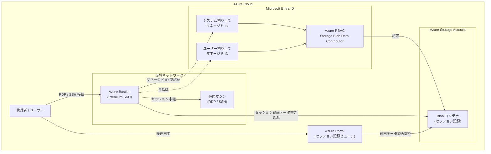

# Azure Bastion: グラフィカルセッション記録におけるマネージド ID サポート (パブリックプレビュー)

**リリース日**: 2026-04-13

**サービス**: Azure Bastion

**機能**: グラフィカルセッション記録におけるマネージド ID サポート

**ステータス**: In preview

[このアップデートのインフォグラフィックを見る](https://takech9203.github.io/azure-news-summary/20260413-bastion-managed-identity-session-recording.html)

## 概要

Azure Bastion のグラフィカルセッション記録機能において、ストレージアカウントへの書き込みアクセスにマネージド ID が利用可能になった。これにより、従来の SAS URL (Shared Access Signature) に代わる認証方式として、システム割り当てマネージド ID またはユーザー割り当てマネージド ID を選択できるようになる。

Azure Bastion のセッション記録機能は、RDP および SSH のグラフィカルセッションを自動的に録画し、指定したストレージアカウントの Blob コンテナに保存する機能である。従来はストレージアカウントへのアクセスに SAS URL を使用しており、SAS トークンの生成・管理・ローテーションが運用上の負荷となっていた。今回のアップデートにより、マネージド ID を使用することで SAS トークンの管理が不要となり、セキュリティと運用効率が向上する。

**アップデート前の課題**

- セッション記録のストレージアクセスに SAS URL の生成・管理が必要であった
- SAS トークンの有効期限管理とローテーション作業が運用負荷となっていた
- SAS トークンの漏洩リスクがあり、長期間有効なトークンはセキュリティ上の懸念があった
- SAS URL の期限切れによりセッション記録が失敗する可能性があった

**アップデート後の改善**

- マネージド ID によるストレージアクセスにより、SAS トークンの管理が不要になる
- Azure RBAC を通じたアクセス制御により、セキュリティポスチャが向上する
- トークンの有効期限管理やローテーション作業から解放される
- システム割り当てまたはユーザー割り当てのいずれかのマネージド ID を選択可能

## アーキテクチャ図

Azure Bastion がマネージド ID を使用してストレージアカウントに認証し、セッション録画データを Blob コンテナに書き込む。管理者は Azure Portal の統合ビューアからセッション録画を再生できる。

## サービスアップデートの詳細

### 主要機能

1. **マネージド ID によるストレージ認証**
   - システム割り当てマネージド ID またはユーザー割り当てマネージド ID を使用してストレージアカウントに認証
   - SAS URL の生成・管理・ローテーションが不要になり、運用負荷が軽減される
   - Azure RBAC (Storage Blob Data Contributor ロール) を通じたアクセス制御

2. **システム割り当てマネージド ID の設定**
   - Bastion リソースの Identity ブレードでシステム割り当てマネージド ID を有効化
   - ストレージアカウントに対して Storage Blob Data Contributor ロールを割り当て
   - Bastion の Configuration でマネージド ID と Blob コンテナ URI を指定

3. **ユーザー割り当てマネージド ID の設定**
   - 事前に作成したユーザー割り当てマネージド ID を Bastion に関連付け
   - システム割り当てと同様のロール割り当てとコンテナ URI 設定が必要

4. **既存の SAS URL 方式との共存**
   - マネージド ID は SAS URL の代替として提供される
   - 既存の SAS URL 方式も引き続き利用可能

## 技術仕様

| 項目 | 詳細 |
|------|------|
| ステータス | パブリックプレビュー |
| 必要な SKU | Premium SKU |
| サポートされる ID 種別 | システム割り当てマネージド ID、ユーザー割り当てマネージド ID |
| 必要な RBAC ロール | Storage Blob Data Contributor (ストレージアカウントスコープ) |
| 録画対象プロトコル | RDP、SSH (グラフィカルセッション) |
| ストレージ構成 | 1 コンテナ / 1 ストレージアカウント |
| 録画再生方法 | Azure Portal 統合 Web プレーヤー |
| 録画閲覧に必要なロール | Storage Blob Data Reader |

## 設定方法

### 前提条件

1. Azure Bastion が Premium SKU でデプロイされていること
2. セッション記録用のストレージアカウントと Blob コンテナが作成済みであること
3. ストレージアカウントに CORS ポリシーが設定されていること
4. ストレージアカウントに不変ストレージポリシーが設定されていないこと
5. Blob バージョニングが無効であること

### Azure Portal (マネージド ID 設定手順)

1. Azure Portal で Bastion リソースに移動する
2. 左ペインから **Identity** ブレードを選択する
3. システム割り当てマネージド ID のステータスを **On** に変更し、構成の完了を待つ
4. **Azure role assignments** を選択し、**Add role assignment (Preview)** をクリックする
5. 以下のロール割り当てを追加する:
   - スコープ: Storage
   - サブスクリプション: ストレージアカウントのサブスクリプション
   - リソース: ストレージアカウント名
   - ロール: Storage Blob Data Contributor
6. **Save** をクリックしてロール割り当てを保存する
7. Bastion リソースに戻り、左ペインから **Configuration** を選択する
8. **Session Recording Configuration** で **System Assigned Managed Identity** を選択する
9. **Blob Container URI** にストレージコンテナの URI を入力する
10. **Apply** をクリックして設定を適用する (反映に約 10 分)

### ストレージアカウントの CORS 設定

ストレージアカウントの **Resource sharing (CORS)** で Blob service に以下のポリシーを設定する:

| 項目 | 値 |
|------|-----|
| Allowed origins | `https://` + Bastion の完全な DNS 名 (`bst-` で始まる) |
| Allowed methods | GET |
| Allowed headers | * |
| Exposed headers | * |
| Max age | 86400 |

## メリット

### ビジネス面

- SAS トークンの管理作業が不要になり、運用チームの負荷が軽減される
- トークン漏洩のリスクが排除され、コンプライアンス要件への準拠が容易になる
- セッション記録の信頼性が向上し、SAS トークン期限切れによる記録失敗を防止できる

### 技術面

- マネージド ID により認証情報のコード内への埋め込みや外部管理が不要になる
- Azure RBAC を通じた一元的なアクセス制御が適用される
- Azure のベストプラクティスに沿ったセキュリティモデルが実現される
- システム割り当てとユーザー割り当ての選択肢により、柔軟な構成が可能

## デメリット・制約事項

- パブリックプレビュー段階であり、SLA の対象外である
- Premium SKU が必須であり、Basic や Standard SKU では利用できない
- Entra ID による RDP セッション認証とグラフィカルセッション記録は同時に利用できない
- ネイティブクライアント経由のセッション記録は現時点で非サポート
- セッション記録は 1 コンテナ / 1 ストレージアカウントの制限がある
- セッション記録が有効化されると、Bastion ホストを経由する全セッションが記録対象となる (個別選択不可)
- アクティブなセッション中にストレージコンテナを変更すると、セッションが中断される可能性がある

## ユースケース

### ユースケース 1: 金融機関の特権アクセス監査

**シナリオ**: 金融機関において、本番環境の仮想マシンへの特権アクセスを記録し、監査証跡を残す必要がある。SAS トークンの管理を排除し、セキュリティポスチャを強化したい。

**効果**: マネージド ID を使用することで、SAS トークンの漏洩リスクを排除しつつ、全セッションの録画を安全にストレージアカウントに保存できる。Azure RBAC によるアクセス制御と組み合わせることで、監査要件を満たす堅牢なセッション管理が実現される。

### ユースケース 2: マルチチーム環境でのセッション記録管理

**シナリオ**: 複数のチームが共有する Bastion ホストで、セッション記録用ストレージのアクセス管理を簡素化したい。SAS URL の共有・ローテーション管理が煩雑になっている。

**効果**: ユーザー割り当てマネージド ID を使用することで、Bastion リソースのライフサイクルとは独立した ID 管理が可能になる。Azure RBAC でストレージアカウントへのアクセスを制御し、SAS URL の管理作業から解放される。

## 料金

Azure Bastion のセッション記録機能は Premium SKU で利用可能である。マネージド ID の使用自体に追加料金は発生しないが、以下のコストが適用される:

- **Azure Bastion Premium SKU**: Premium SKU のホスティング料金 (時間単位)
- **ストレージアカウント**: セッション録画データの保存に対するストレージ料金 (容量、トランザクション)
- **ネットワーク転送**: Bastion からストレージアカウントへのデータ転送料金

詳細な料金については [Azure Bastion の料金ページ](https://azure.microsoft.com/pricing/details/azure-bastion/) を参照。

## 関連サービス・機能

- **Azure Bastion**: 仮想マシンへの安全なリモートアクセスを提供するフルマネージドサービス。本アップデートの対象サービス
- **マネージド ID (Microsoft Entra ID)**: Azure リソースに自動的に管理される ID を提供する機能。SAS トークンに代わる認証方式として使用される
- **Azure Blob Storage**: セッション録画データの保存先。Storage Blob Data Contributor ロールによるアクセス制御が適用される
- **Azure RBAC**: マネージド ID に対するストレージアカウントへのアクセス権限を管理する

## 参考リンク

- [インフォグラフィック](https://takech9203.github.io/azure-news-summary/20260413-bastion-managed-identity-session-recording.html)
- [公式アップデート情報](https://azure.microsoft.com/updates?id=560162)
- [Microsoft Learn - Record Bastion sessions](https://learn.microsoft.com/en-us/azure/bastion/session-recording)
- [Microsoft Learn - マネージド ID の概要](https://learn.microsoft.com/en-us/entra/identity/managed-identities-azure-resources/overview)
- [Microsoft Learn - Azure Bastion の概要](https://learn.microsoft.com/en-us/azure/bastion/bastion-overview)
- [料金ページ](https://azure.microsoft.com/pricing/details/azure-bastion/)

## まとめ

Azure Bastion のグラフィカルセッション記録におけるマネージド ID サポートは、セッション記録のストレージアクセスにおけるセキュリティと運用効率を大幅に向上させるアップデートである。従来の SAS URL 方式では、トークンの生成・管理・ローテーション・漏洩防止が運用上の課題となっていたが、マネージド ID の導入により、これらの課題が根本的に解決される。

システム割り当てとユーザー割り当ての両方のマネージド ID がサポートされており、組織の要件に応じた柔軟な構成が可能である。Premium SKU が必須であること、およびパブリックプレビュー段階であることに留意しつつ、特権アクセスの監査やコンプライアンス要件がある環境では、プレビュー期間中にこの機能を評価し、GA 後の本番導入に向けた準備を進めることが推奨される。

---

**タグ**: #Azure #AzureBastion #マネージドID #セッション記録 #セキュリティ #ネットワーク #パブリックプレビュー #PremiumSKU #RBAC
