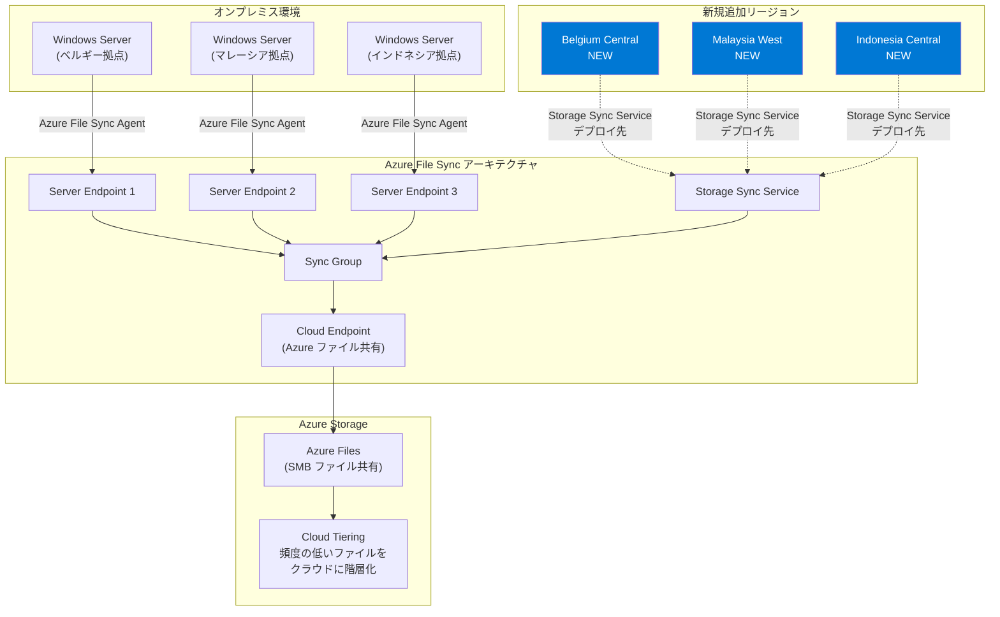

# Azure File Sync: Belgium Central, Malaysia West, Indonesia Central リージョンで一般提供開始

**リリース日**: 2026-04-13

**サービス**: Azure Files / Azure File Sync

**機能**: Azure File Sync の Belgium Central, Malaysia West, Indonesia Central リージョンへの拡張

**ステータス**: Launched (GA)

[このアップデートのインフォグラフィックを見る](https://takech9203.github.io/azure-news-summary/20260413-file-sync-belgium-malaysia-indonesia.html)

## 概要

Azure File Sync が新たに Belgium Central、Malaysia West、Indonesia Central の 3 リージョンで一般提供 (GA) を開始した。Azure File Sync は、オンプレミスの Windows Server から Azure Files へデータをシームレスに階層化（Cloud Tiering）するサービスであり、ハイブリッドファイル共有やクラウドへの移行を簡素化する。今回のリージョン拡張により、ベルギー、マレーシア、インドネシアの顧客が、より近接したリージョンで Storage Sync Service をデプロイできるようになる。

Azure File Sync は、Azure ファイル共有を中央ハブとして利用し、複数のオンプレミス Windows Server と双方向同期を行う。クラウド階層化を有効にすると、アクセス頻度の高いファイルはローカルにキャッシュされ、アクセス頻度の低いファイルは Azure Files に階層化される。これにより、オンプレミスのストレージコストを削減しつつ、SMB、NFS、FTPS などのプロトコルでローカルアクセスを維持できる。今回の 3 リージョン追加は、ヨーロッパと東南アジアにおける Azure File Sync のカバレッジを強化するものである。

**アップデート前の課題**

- ベルギー、マレーシア、インドネシアの顧客は Azure File Sync を利用するために地理的に離れたリージョンに Storage Sync Service をデプロイする必要があり、同期のレイテンシが高くなる場合があった
- 各国のデータレジデンシー要件やコンプライアンス規制（EU GDPR、インドネシアの個人データ保護法など）への対応が困難だった
- ハイブリッドファイルサーバーの構築において、同期先リージョンとの物理的距離がパフォーマンスに影響していた

**アップデート後の改善**

- 3 つの新リージョンでローカルに Storage Sync Service をデプロイ可能となり、同期レイテンシが大幅に低減される
- 各国・地域のデータレジデンシー要件に準拠したハイブリッドファイル共有環境の構築が可能になった
- ディザスタリカバリ構成やマルチサイト同期において、より柔軟なリージョン選択が可能になった

## アーキテクチャ図



この図は、Azure File Sync の全体アーキテクチャと、今回新たに追加された 3 リージョンの関係を示している。各オンプレミス拠点の Windows Server に Azure File Sync Agent をインストールし、Storage Sync Service と Sync Group を介して Azure Files と双方向同期を行う構成である。

## サービスアップデートの詳細

### 主要機能

1. **3 リージョンでの Azure File Sync 一般提供**
   - Belgium Central（ベルギー）: EU 圏内での新たな選択肢
   - Malaysia West（マレーシア）: 東南アジアにおけるカバレッジ強化
   - Indonesia Central（インドネシア）: インドネシア国内で初の Azure File Sync 提供

2. **クラウド階層化 (Cloud Tiering)**
   - アクセス頻度の高いファイルをローカルにキャッシュし、アクセス頻度の低いファイルを Azure Files に自動階層化
   - ボリュームの空き容量ポリシーと日付ポリシーに基づく階層化制御
   - ファイルの名前空間（フォルダ構造）は常にローカルに保持され、完全にブラウズ可能

3. **マルチサイトアクセスと同期**
   - 複数の登録済み Windows Server 間で Azure ファイル共有を介した双方向同期
   - 各拠点での変更が自動的に他の拠点に伝播
   - 拠点間の直接接続は不要

4. **ビジネス継続性とディザスタリカバリ**
   - Azure Files の冗長性オプション（LRS、ZRS、GRS、GZRS）による高可用性
   - 障害発生時のサーバー復旧を新規 Windows Server のプロビジョニングで迅速化
   - ファイル名前空間を先にダウンロードするため、短時間でサーバーを復旧可能

5. **クラウド移行**
   - オンプレミスのファイルデータを Azure Files にシームレスに移行
   - バックグラウンドでの同期により、ユーザーへの影響を最小化
   - ファイル構造と権限（ACL）を維持

## 技術仕様

| 項目 | 詳細 |
|------|------|
| サービス名 | Azure File Sync |
| リソースプロバイダー | Microsoft.StorageSync |
| 対応 OS | Windows Server 2016, 2019, 2022, 2025（Full / Core） |
| 最小システム要件 | 1 CPU 以上、2 GiB 以上のメモリ、NTFS フォーマットのローカルボリューム |
| サーバーあたりの同期可能共有数 | 最大 30 Azure ファイル共有 |
| 推奨アイテム数 | ファイル共有あたり 2,000 万 ~ 3,000 万（上限 1 億） |
| 通信プロトコル | HTTPS (ポート 443) |
| ローカルアクセスプロトコル | SMB, NFS, FTPS |
| 暗号化 | 転送中 (TLS 1.2)、保存時 (Azure Storage SSE) |
| 対応ファイルシステム | NTFS のみ（ReFS、FAT、FAT32 は非対応） |
| フェイルオーバークラスター | Windows Server フェイルオーバークラスター対応（クラスターディスクのみ） |
| Data Deduplication | Windows Server 2016 以降で Cloud Tiering と併用可能 |

## 設定方法

### 前提条件

- Azure サブスクリプション
- デプロイ先リージョン（Belgium Central、Malaysia West、または Indonesia Central）に Azure ファイル共有を作成済みであること
- Windows Server 2016 以降のサーバー（必要な Windows Update を適用済み）
- ストレージアカウントで SMB 3.1.1、NTLM v2 認証、AES-128-GCM 暗号化が有効であること
- ストレージアカウントのキーアクセスが有効であること

### Azure Portal

1. **Storage Sync Service の作成**
   - Azure Portal で「リソースの作成」を選択
   - 「Azure File Sync」を検索して選択
   - サブスクリプション、リソースグループ、リージョン（Belgium Central / Malaysia West / Indonesia Central）を指定して作成

2. **Azure File Sync Agent のインストール**
   - [Microsoft ダウンロードセンター](https://go.microsoft.com/fwlink/?linkid=858257) から最新のエージェントをダウンロード
   - Windows Server にインストールし、再起動

3. **サーバーの登録**
   - エージェントインストール後に自動起動するサーバー登録ウィザードに従い、Azure にサインイン
   - サブスクリプション、リソースグループ、Storage Sync Service を選択して登録

4. **同期グループの作成**
   - Storage Sync Service の「同期グループ」から新規作成
   - クラウドエンドポイント（Azure ファイル共有）を指定
   - サーバーエンドポイント（Windows Server 上のパス）を追加

5. **クラウド階層化の設定（任意）**
   - サーバーエンドポイントのプロパティでクラウド階層化を有効化
   - ボリュームの空き容量ポリシー（例: 20%）を設定

### Azure PowerShell

```powershell
# Storage Sync Service の作成
$region = "belgiumcentral"  # または "malaysiawest", "indonesiacentral"
$resourceGroup = "<リソースグループ名>"
$storageSyncName = "<Storage Sync Service 名>"

New-AzStorageSyncService `
    -ResourceGroupName $resourceGroup `
    -Name $storageSyncName `
    -Location $region

# 同期グループの作成
New-AzStorageSyncGroup `
    -ResourceGroupName $resourceGroup `
    -StorageSyncServiceName $storageSyncName `
    -SyncGroupName "<同期グループ名>"
```

## メリット

### ビジネス面

- **データレジデンシー要件への対応**: ベルギー（EU GDPR）、マレーシア（PDPA）、インドネシア（PDP Law）の各国データ保護規制に準拠したハイブリッドファイル共有環境を構築できる
- **レイテンシの低減**: 各国のオンプレミス環境と同一リージョンの Azure ファイル共有間で同期することで、同期パフォーマンスが向上する
- **オンプレミスストレージコストの削減**: クラウド階層化により、ローカルディスクに保存するデータ量を削減し、ストレージ投資を最適化できる
- **ビジネス継続性の強化**: Azure Files の冗長性を活用し、オンプレミスサーバーの障害からの迅速な復旧が可能

### 技術面

- **マルチサイト同期の拡充**: 新リージョンを活用して、ヨーロッパ内拠点間や東南アジア内拠点間でのファイル同期構成が容易になる
- **既存プロトコルの維持**: SMB、NFS、FTPS などの既存プロトコルでローカルアクセスを継続でき、アプリケーションの変更は不要
- **段階的なクラウド移行**: Azure File Sync をブリッジとして利用し、オンプレミスからクラウドへの段階的な移行が可能
- **Azure Backup との統合**: Azure ファイル共有のネイティブスナップショット機能と Azure Backup による集中バックアップが利用可能

## デメリット・制約事項

- Azure File Sync は NTFS ボリュームのみをサポートしており、ReFS、FAT、FAT32 ファイルシステムは非対応
- サーバーあたりの同期可能な Azure ファイル共有数は最大 30 に制限される
- クラウドエンドポイント（Azure ファイル共有）への直接変更の検出は 24 時間に 1 回のみ実行される
- Windows Server のみをサポートしており、Linux や macOS のファイルサーバーは Azure File Sync Agent を利用できない
- Azure File Sync はインターネットルーティングをサポートしておらず、Microsoft ルーティングが必要
- 新リージョンでは一部の VM サイズやストレージオプションが既存リージョンと異なる場合がある
- ハードリンク、シンボリックリンク、リパースポイントは同期対象外（スキップ）となる
- データベースファイルの同期は推奨されない（ログファイルとデータベースの同期タイミングの不整合による破損リスク）

## ユースケース

1. **ヨーロッパ拠点のハイブリッドファイルサーバー**: ベルギーに拠点を持つ企業が Belgium Central リージョンを利用し、EU GDPR に準拠しつつオンプレミス Windows Server と Azure Files 間でファイルを同期する
2. **東南アジアのマルチサイトファイル共有**: マレーシアとインドネシアに拠点を持つ企業が、Malaysia West と Indonesia Central を活用して複数拠点間でファイルを自動同期する
3. **オンプレミスストレージの最適化**: クラウド階層化を利用して、アクセス頻度の低いファイルを Azure Files に階層化し、オンプレミスのストレージコストを削減する
4. **段階的なクラウド移行**: オンプレミスのファイルサーバーから Azure Files への移行をバックグラウンドで実施し、ユーザーへの影響を最小化する
5. **ディザスタリカバリ**: Azure Files の geo 冗長ストレージを活用し、障害発生時に新規 Windows Server をプロビジョニングして迅速にファイルサービスを復旧する

## 料金

Azure File Sync の料金は以下の要素で構成される。

| 項目 | 説明 |
|------|------|
| 同期サーバー | Storage Sync Service に登録されたサーバーごとの月額料金 |
| Azure Files ストレージ | Azure ファイル共有のストレージ容量に基づく課金（Provisioned v2 または Pay-as-you-go モデル） |
| トランザクション | ファイルの読み書きや同期操作に伴うトランザクション料金 |
| データ転送 | Azure リージョンからのアウトバウンドデータ転送料金 |
| クラウド階層化 | 階層化されたファイルの呼び戻し（リコール）に伴うトランザクション料金 |

※ 料金はリージョンによって異なる場合がある。Belgium Central、Malaysia West、Indonesia Central の正確な料金は [Azure File Sync 料金ページ](https://azure.microsoft.com/pricing/details/storage/files/) を参照。

## 利用可能リージョン

今回のアップデートにより、以下の 3 リージョンが新たに追加された。

| リージョン | 地域 | ステータス |
|----------|------|----------|
| Belgium Central | ヨーロッパ | **新規追加** |
| Malaysia West | 東南アジア | **新規追加** |
| Indonesia Central | 東南アジア | **新規追加** |

Azure File Sync の利用可能リージョン一覧は [Azure リージョン別利用可能サービス](https://azure.microsoft.com/explore/global-infrastructure/products-by-region/table) で「Storage Accounts」を検索して確認できる。

なお、France South、South Africa West、UAE Central の 3 リージョンでは Azure Storage へのアクセスリクエストが事前に必要である。

## 関連サービス・機能

- **Azure Files**: Azure File Sync のクラウド側ストレージ基盤。SMB および NFS プロトコルによるフルマネージドのファイル共有サービス
- **Azure Backup**: Azure ファイル共有のネイティブスナップショットを活用した集中バックアップソリューション
- **Azure Virtual Network**: プライベートエンドポイントやサービスエンドポイントを利用した Azure File Sync のセキュアなネットワーク構成
- **Azure ExpressRoute / VPN Gateway**: オンプレミスと Azure 間のプライベート接続を提供し、Azure File Sync のトラフィックをセキュアにトンネリング
- **Azure Monitor**: Storage Sync Service の同期状態やクラウド階層化の状況を監視
- **Azure Migrate**: オンプレミスのファイルサーバーから Azure Files への移行を評価・計画するツール

## 参考リンク

- [インフォグラフィック](https://takech9203.github.io/azure-news-summary/20260413-file-sync-belgium-malaysia-indonesia.html)
- [公式アップデート情報](https://azure.microsoft.com/updates?id=557828)
- [Microsoft Learn - Azure File Sync の概要](https://learn.microsoft.com/azure/storage/file-sync/file-sync-introduction)
- [Microsoft Learn - Azure File Sync のデプロイ計画](https://learn.microsoft.com/azure/storage/file-sync/file-sync-planning)
- [Microsoft Learn - Azure File Sync のデプロイガイド](https://learn.microsoft.com/azure/storage/file-sync/file-sync-deployment-guide)
- [Azure Files 料金ページ](https://azure.microsoft.com/pricing/details/storage/files/)
- [リージョン別利用可能サービス](https://azure.microsoft.com/explore/global-infrastructure/products-by-region/table)

## まとめ

Azure File Sync の Belgium Central、Malaysia West、Indonesia Central への拡張は、ヨーロッパと東南アジアにおけるハイブリッドファイル共有のカバレッジを強化する重要なアップデートである。特に各国のデータレジデンシー要件への準拠が求められるシナリオや、オンプレミスとクラウド間の低レイテンシ同期が必要なユースケースにおいて、大きな価値を提供する。

Solutions Architect への推奨アクション:

1. **リージョン選定の見直し**: ベルギー、マレーシア、インドネシアに拠点を持つ顧客のハイブリッドファイル共有構成において、新リージョンの利用を検討する。特にデータレジデンシー要件がある場合は優先的に評価すること
2. **マルチサイト同期構成の評価**: 複数拠点間でのファイル共有が必要な場合、新リージョンを活用したマルチサイト同期構成を設計する。各拠点の Windows Server に Azure File Sync Agent をインストールし、共通の Azure ファイル共有を介して同期する構成を検討する
3. **クラウド階層化によるコスト最適化**: オンプレミスのストレージコスト削減が課題の場合、クラウド階層化を有効にし、ボリュームの空き容量ポリシーを適切に設定する
4. **移行計画の策定**: オンプレミスのファイルサーバーからクラウドへの段階的移行を計画している場合、Azure File Sync を移行ブリッジとして活用することを検討する
5. **料金の確認**: 新リージョンの料金体系を確認し、既存リージョンとのコスト比較を行った上でデプロイ先を決定する

---

**タグ**: #AzureFileSync #AzureFiles #Storage #HybridCloud #CloudTiering #RegionalExpansion #BelgiumCentral #MalaysiaWest #IndonesiaCentral #GA #FileServer #DataResidency
