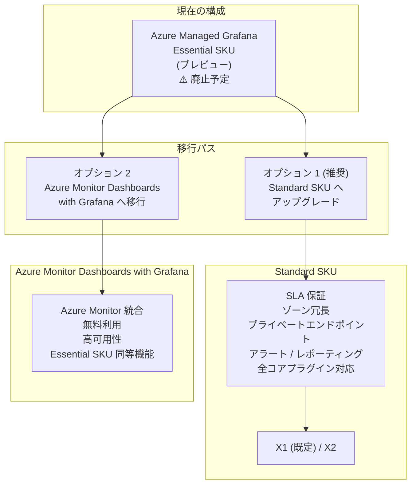

# Azure Managed Grafana: Essential SKU の廃止 (2027 年 3 月 30 日)

**リリース日**: 2026-04-13

**サービス**: Azure Managed Grafana

**機能**: Essential SKU の廃止と Standard SKU / Azure Monitor Dashboards with Grafana への移行

**ステータス**: Retirement notice

[このアップデートのインフォグラフィックを見る](https://takech9203.github.io/azure-news-summary/20260413-managed-grafana-essential-sku-retirement.html)

## 概要

Azure Managed Grafana の Essential (プレビュー) SKU が 2027 年 3 月 30 日に廃止されることが発表された。Essential SKU を利用中の顧客は、廃止日までに Azure Managed Grafana Standard SKU または Azure Monitor Dashboards with Grafana に移行する必要がある。移行を行わない場合、サービスの中断が発生する。

Essential SKU はもともと評価・テスト用途を想定したプレビュー段階のティアであり、SLA が提供されず、ゾーン冗長、プライベートエンドポイント、アラート機能、レポーティングなどの機能が利用できなかった。今回の廃止に伴い、Microsoft はより機能が充実した Standard SKU への移行、もしくは無料で利用可能な Azure Monitor Dashboards with Grafana への移行という 2 つの選択肢を提供している。

移行のタイムラインとして、以下の重要な日程が設定されている。まず 2026 年 3 月 31 日に Essential ティアが利用不可となり、既存の Essential ワークスペースが機能停止する。続いて 2026 年 8 月 1 日には、既存の Essential SKU ワークスペースがサポート対象外となり削除される。最終的に 2027 年 3 月 30 日をもって Essential SKU が完全に廃止される。

**移行のタイムライン**

- **2026 年 3 月 31 日**: Essential ティアが利用不可、既存の Essential ワークスペースが機能停止
- **2026 年 8 月 1 日**: 既存の Essential SKU ワークスペースが削除
- **2027 年 3 月 30 日**: Essential SKU の完全廃止

**移行オプション**

- **Standard SKU へのアップグレード (推奨)**: 既存のワークスペースをそのまま Standard SKU に変更でき、SLA、ゾーン冗長、アラートなどの追加機能が利用可能になる
- **Azure Monitor Dashboards with Grafana への移行**: 無料の Azure ネイティブな代替サービスで、Essential SKU と同等の機能を提供する

## アーキテクチャ図



Essential SKU から 2 つの移行パスが存在する。推奨はインプレースで Standard SKU にアップグレードする方法で、追加機能と SLA が提供される。もう一方は、ダッシュボードをエクスポートして Azure Monitor Dashboards with Grafana にインポートする方法で、無料で利用できる。

## サービスアップデートの詳細

### 主要ポイント

1. **Essential SKU の廃止**
   - Essential (プレビュー) SKU は評価・テスト用途のティアとして提供されていたが、Standard SKU および Azure Monitor Dashboards with Grafana への統合に伴い廃止される。新しい Essential ティアのワークスペース作成は既に無効化されている。

2. **Standard SKU へのインプレースアップグレード**
   - Azure Portal の設定画面から数ステップで Standard SKU にアップグレード可能。既存のダッシュボード、データソース構成、ユーザー設定がそのまま引き継がれる。ただし、Standard から Essential へのダウングレードはサポートされない。

3. **Azure Monitor Dashboards with Grafana (プレビュー)**
   - Azure Monitor に統合された無料の Grafana ダッシュボード機能で、Essential SKU と同等の機能を提供する。Azure Monitor のメトリクス、ログ、トレース、Prometheus との直接統合が可能。

## 技術仕様

| 項目 | Essential SKU (廃止予定) | Standard SKU (推奨移行先) |
|------|--------------------------|---------------------------|
| ステータス | プレビュー (廃止予定) | GA (推奨) |
| SLA | なし | あり |
| ゾーン冗長 | 非対応 | 対応 |
| 確定的送信 IP | 非対応 | 対応 |
| プライベートエンドポイント | 非対応 | 対応 |
| アラート機能 | 非対応 | 対応 |
| SMTP メール送信 | 非対応 | 対応 |
| レポーティング / 画像レンダリング | 非対応 | 対応 |
| API キー / サービスアカウント | 対応 | 対応 |
| データソースプラグイン | Azure Monitor, Prometheus, TestData | 全コアプラグイン (Azure Monitor, Prometheus, Azure Data Explorer, GitHub, JSON API 等) |
| Grafana Enterprise | 非対応 | オプション (追加ライセンスコスト) |
| インスタンスサイズ | - | X1 (既定) / X2 |
| アラートルール上限 | - | X1: 500 / X2: 1,000 (組織あたり) |

## 設定方法

### オプション 1: Standard SKU へのアップグレード (推奨)

#### 前提条件

1. Azure サブスクリプション
2. 既存の Azure Managed Grafana Essential ワークスペース
3. ワークスペースに対する所有者または共同作成者のロール

#### Azure Portal

1. Azure Portal で対象の Azure Managed Grafana ワークスペースに移動する
2. 左メニューの「設定」>「構成」>「価格プラン」を選択する
3. 「Standard SKU」を選択する。必要に応じてインスタンスサイズを X2 に変更する
4. 「保存」を選択して変更を適用する

> **注意**: Standard SKU から Essential SKU へのダウングレード、および大きいインスタンスサイズから小さいインスタンスサイズへの変更はサポートされない。

### オプション 2: Azure Monitor Dashboards with Grafana への移行

#### 手順 1: ダッシュボードのエクスポート

**Grafana UI を使用する場合:**

1. Grafana UI でエクスポートするダッシュボードを開く
2. ダッシュボード上部の「Share」を選択する
3. 表示されるダイアログで「Export」タブを選択する
4. 「Save to file」を選択してダッシュボード JSON ファイルをダウンロードする

**Azure CLI を使用する場合:**

```bash
# ダッシュボード、データソース、フォルダーのバックアップ
az grafana backup --name <grafana-workspace-name>

# 詳細オプション: 特定のコンポーネントを指定フォルダーにバックアップ
az grafana backup \
    --name MyGrafana \
    --resource-group MyResourceGroup \
    --directory "/tmp/grafana-backup" \
    --folders-to-exclude "General" "Azure Monitor" \
    --components datasources dashboards folders
```

#### 手順 2: Azure Monitor Dashboards with Grafana へのインポート

1. Azure Portal で Azure Monitor を開く
2. サービスメニューから「Dashboards with Grafana (プレビュー)」を選択し、「New」>「Import」を選択する
3. 「Import dashboard from File」で、エクスポートした JSON ファイルをアップロードする
4. 「Load」を選択する
5. ダッシュボード名を入力し、サブスクリプション、リソースグループ、リージョンを選択して作成する

## メリット

### Standard SKU へのアップグレードのメリット

#### ビジネス面

- SLA 保証により、ビジネスクリティカルな監視ダッシュボードの可用性が担保される
- ゾーン冗長により、データセンター障害時の耐障害性が向上する
- アラート機能により、閾値ベースの自動通知が可能になり、インシデント対応の迅速化が期待できる

#### 技術面

- プライベートエンドポイントにより、VNet 内からのセキュアなアクセスが可能になる
- 確定的送信 IP により、データソース側でのファイアウォール許可リスト設定が容易になる
- Azure Data Explorer、GitHub、JSON API など追加のデータソースプラグインが利用可能になる
- SMTP 設定によるメール送信機能で、アラート通知やレポート配信が可能になる
- Grafana Enterprise オプションにより、エンタープライズ向けの高度な機能を追加できる

### Azure Monitor Dashboards with Grafana への移行のメリット

- 追加コストなしで Grafana ダッシュボードを利用できる
- Azure Monitor (メトリクス、ログ、トレース、Prometheus) との直接統合が提供される
- スポット VM に依存しない高可用性が確保される

## デメリット・制約事項

- Standard SKU へのアップグレードは追加コストが発生する (Essential SKU は無料だったのに対し、Standard SKU は有料)
- Standard SKU から Essential SKU へのダウングレードはサポートされない
- Azure Monitor Dashboards with Grafana はプレビュー段階であり、SLA が提供されない
- Azure Monitor Dashboards with Grafana への移行はダッシュボードの手動エクスポート・インポートが必要であり、データソースの再構成が必要になる場合がある
- 2026 年 3 月 31 日以降は Essential ワークスペースが機能停止するため、移行の時間的猶予は限られている

## ユースケース

### ユースケース 1: 本番環境の監視ダッシュボード運用

**シナリオ**: Essential SKU で Azure Monitor のメトリクスを可視化する監視ダッシュボードを運用していた組織が、SLA とゾーン冗長が求められる本番環境で継続利用する。

**推奨移行先**: Standard SKU

**効果**: SLA 保証とゾーン冗長により、監視基盤の可用性が向上する。加えて、アラート機能により閾値超過時の自動通知が可能になり、インシデント検知から対応までの時間が短縮される。

### ユースケース 2: 開発・テスト環境での軽量な監視

**シナリオ**: 開発チームが Essential SKU を使って開発・テスト環境のメトリクスを確認していたが、コストを抑えつつ監視を継続したい。

**推奨移行先**: Azure Monitor Dashboards with Grafana

**効果**: 無料で Grafana ダッシュボードを継続利用でき、Azure Monitor との統合が維持される。開発・テスト環境ではプレビュー段階のサービスでも許容可能なケースが多い。

### ユースケース 3: セキュリティ要件の高い環境での監視

**シナリオ**: プライベートネットワーク内のリソースを監視するため、プライベートエンドポイント経由でのアクセスが必要な環境。

**推奨移行先**: Standard SKU

**効果**: プライベートエンドポイントと確定的送信 IP により、ネットワーク分離された環境でも Grafana ダッシュボードにセキュアにアクセスでき、データソースへの通信もファイアウォールで制御可能になる。

## 料金

Standard SKU の詳細な料金は [Azure Managed Grafana の料金ページ](https://azure.microsoft.com/pricing/details/managed-grafana/) を参照のこと。

| 項目 | 詳細 |
|------|------|
| Essential SKU | 無料 (廃止予定) |
| Standard SKU X1 | 有料 (既定のインスタンスサイズ) |
| Standard SKU X2 | X1 より高額 (メモリ増量、アラートルール上限 1,000) |
| Grafana Enterprise | Standard SKU + 追加ライセンスコスト |
| Azure Monitor Dashboards with Grafana | 無料 (プレビュー) |

## 関連サービス・機能

- **Azure Monitor**: Azure Managed Grafana のプライマリデータソースの一つ。メトリクス、ログ、トレース、Prometheus データを提供する。Azure Monitor Dashboards with Grafana は Azure Monitor に直接統合されたダッシュボード機能
- **Azure Monitor Dashboards with Grafana (プレビュー)**: Azure Monitor に統合された無料の Grafana ダッシュボード機能。Essential SKU の代替として位置付けられている
- **Azure Data Explorer**: Standard SKU で利用可能なデータソースプラグインの一つ。大規模なテレメトリデータの探索・分析に使用される
- **Grafana Enterprise**: Standard SKU のオプションとして利用可能。チームシンク、エンハンストレポーティングなどのエンタープライズ向け機能を提供する

## 参考リンク

- [インフォグラフィック](https://takech9203.github.io/azure-news-summary/20260413-managed-grafana-essential-sku-retirement.html)
- [公式アップデート情報](https://azure.microsoft.com/updates?id=559395)
- [Azure Managed Grafana の概要 - Microsoft Learn](https://learn.microsoft.com/azure/managed-grafana/overview)
- [Essential サービスティアからの移行ガイド - Microsoft Learn](https://learn.microsoft.com/azure/managed-grafana/how-to-migrate-essential-service-tier)
- [Azure Monitor Dashboards with Grafana - Microsoft Learn](https://learn.microsoft.com/azure/azure-monitor/visualize/visualize-use-grafana-dashboards)
- [料金ページ](https://azure.microsoft.com/pricing/details/managed-grafana/)

## まとめ

Azure Managed Grafana Essential (プレビュー) SKU は 2027 年 3 月 30 日に廃止されるが、実質的には 2026 年 3 月 31 日に既存ワークスペースが機能停止するため、早急な移行が求められる。移行先としては、SLA やゾーン冗長、アラートなど豊富な機能を備えた Standard SKU が推奨される。コストを抑えたい場合や開発・テスト用途であれば、無料で利用可能な Azure Monitor Dashboards with Grafana も有効な選択肢である。

Essential SKU を利用中の顧客は、まず現在のワークスペースの利用状況を確認し、本番環境であれば Standard SKU へのアップグレード、非本番環境であれば Azure Monitor Dashboards with Grafana への移行を検討すべきである。Standard SKU へのアップグレードは Azure Portal から数ステップで完了するが、ダウングレードは不可であるため、料金面の影響を事前に確認することが推奨される。

---

**タグ**: #Azure #ManagedGrafana #Essential #Standard #Retirement #廃止 #移行 #AzureMonitor #DevOps #Monitoring
