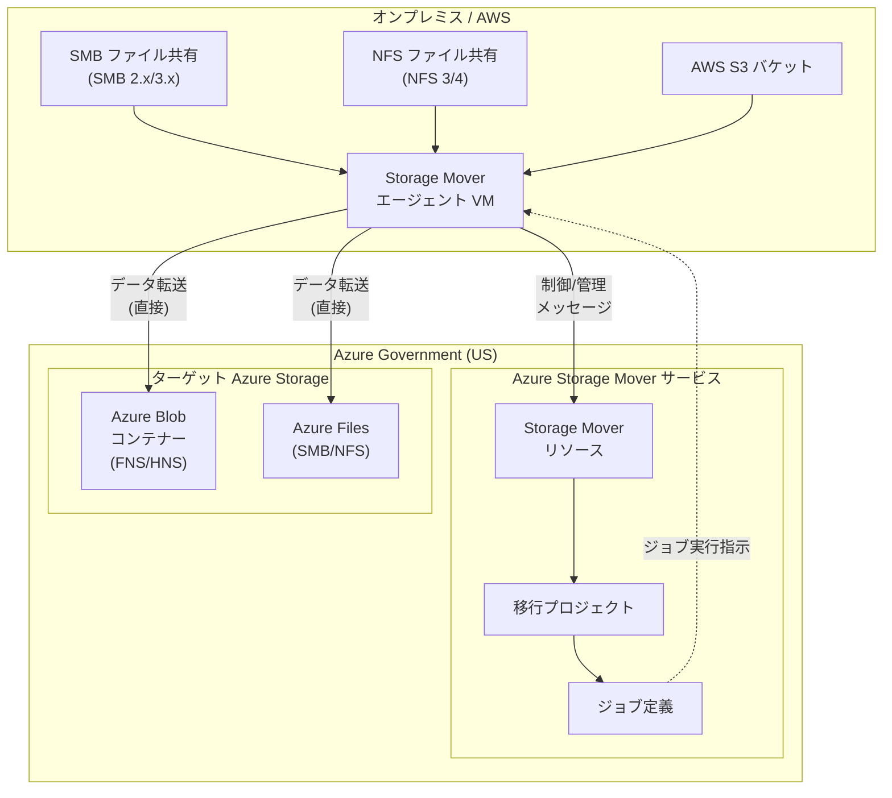

# Azure Storage Mover: Azure Government (US) リージョンで一般提供開始

**リリース日**: 2026-04-13

**サービス**: Azure Storage Mover

**機能**: Azure Government (US) リージョンでの Azure Storage Mover の一般提供

**ステータス**: Launched (GA)

[このアップデートのインフォグラフィックを見る](https://takech9203.github.io/azure-news-summary/20260413-storage-mover-azure-government.html)

## 概要

Azure Storage Mover が Azure Government (US) リージョンで一般提供 (GA) を開始した。これにより、米国政府機関の顧客およびパートナーは、フルマネージドの移行サービスを使用して、大規模なファイルデータをオンプレミスや AWS S3 バケットから Azure Government クラウド環境へ安全に移行できるようになった。

Azure Storage Mover は、オンプレミスのファイル共有や AWS S3 バケットから Azure Storage へのデータ移行を支援するフルマネージドのハイブリッド移行サービスである。移行エージェント VM をソースストレージの近くにデプロイし、SMB、NFS、AWS S3 といった複数のソースプロトコルから Azure Blob コンテナーや Azure ファイル共有へのフルフィデリティ移行をサポートする。クラウド側で移行プロジェクト、ジョブ定義、エンドポイントを一元管理し、移行の進捗と結果を可視化できる。

今回の Azure Government 対応により、FedRAMP High、DoD Impact Level 4/5 などの米国政府向けコンプライアンス要件を満たすクラウド環境で、Storage Mover のフルマネージド移行機能を活用できるようになった。これは、米国政府機関がオンプレミスのレガシーストレージから Azure Government への移行を加速するうえで重要なマイルストーンとなる。

**アップデート前の課題**

- 米国政府機関が Azure Government 環境へ大規模なファイルデータを移行する際、フルマネージドの移行サービスが利用できなかった
- AzCopy やカスタムスクリプトなど手動のツールに頼る必要があり、大規模移行の管理・監視が困難だった
- 政府向けコンプライアンス要件を満たしつつ、移行の進捗管理やリトライ処理を自動化する手段が限られていた
- 複数のソース共有を一元的に管理し、移行プロジェクト単位で進捗を追跡する仕組みがなかった

**アップデート後の改善**

- Azure Government (US) リージョンでフルマネージドの Storage Mover サービスが利用可能になり、政府向けコンプライアンス要件を満たした環境で移行を実行できる
- 移行プロジェクト、ジョブ定義、エンドポイントをクラウドから一元管理でき、大規模移行の可視性と制御性が向上した
- 複数のソースプロトコル (SMB、NFS、AWS S3) からの移行を単一のサービスで対応でき、移行ツールの統一が可能になった
- 差分コピーにより、ダウンタイムを最小化しながら段階的な移行を実行できるようになった

## アーキテクチャ図



Storage Mover エージェント VM がオンプレミスまたは AWS のソースストレージからデータを読み取り、Azure Government 内のターゲットストレージに直接転送する。移行データは Storage Mover サービスを経由せず、エージェントからターゲットに直接送信される。制御メッセージとメタデータのみが Storage Mover リソースとやり取りされる。

## サービスアップデートの詳細

### 主要機能

1. **Azure Government (US) での一般提供**
   - 米国政府機関向けの Azure Government クラウド環境で Azure Storage Mover が利用可能になった。FedRAMP High などの政府向けコンプライアンス基準に準拠した環境でフルマネージドの移行サービスを利用できる。

2. **複数ソースプロトコルのサポート**
   - SMB 2.x/3.x マウント、NFS 3/4 マウント、AWS S3 バケットからの移行に対応。オンプレミスの Windows/Linux ファイルサーバーおよびクラウドストレージからの移行を単一のサービスでカバーする。

3. **フルフィデリティ移行**
   - ファイルの内容だけでなく、フォルダー構造、タイムスタンプ、ACL、ファイル属性などのメタデータも保持した移行を実行する。SMB ソースから Azure ファイル共有への移行では、Azure ファイル共有がサポートするのと同等レベルのファイルフィデリティが維持される。

4. **差分コピーとダウンタイム最小化**
   - 初回のフルコピー後、後続のコピー実行ではソースとターゲット間の差分のみを転送する。メタデータのみが変更されたファイルについては、ファイル全体ではなくメタデータのみを更新する。これにより、ダウンタイムを最小化しながら段階的な移行が可能。

5. **一元的な移行管理**
   - 単一の Storage Mover リソースから複数のソース共有の移行を管理できる。移行プロジェクト、ジョブ定義、エージェントをリソース階層として構造化し、Azure Portal、Azure CLI、Azure PowerShell から一元管理する。

## 技術仕様

| 項目 | 詳細 |
|------|------|
| ステータス | 一般提供 (GA) |
| 対応ソースプロトコル | SMB 2.x/3.x、NFS 3/4、AWS S3 |
| 対応ターゲット | Azure Blob コンテナー (FNS/HNS)、Azure Files (SMB)、Azure Files (NFS 4.1) |
| エージェント VM 対応環境 | Windows Hyper-V、VMware |
| エージェント VM 最小リソース (100 万項目) | 8 GiB RAM、4 仮想コア (2 GHz 以上) |
| エージェント VM 推奨リソース (1 億項目) | 16 GiB RAM、8 仮想コア (2 GHz 以上) |
| エージェント VM ローカルストレージ | 最低 20 GiB |
| 必要なリソースプロバイダー | Microsoft.StorageMover、Microsoft.HybridCompute |
| 認証・認可 | RBAC (ロールベースアクセス制御)、マネージド ID |
| 監視 | Azure Monitor メトリクス、コピーログ (オプトイン) |

## 設定方法

### 前提条件

1. Azure Government サブスクリプション
2. ソースストレージの近くに Hyper-V または VMware のホストが利用可能であること
3. エージェント VM からインターネットへの送信 HTTPS (TCP 443) 接続が可能であること
4. サブスクリプションに `Microsoft.StorageMover` および `Microsoft.HybridCompute` リソースプロバイダーが登録されていること

### Azure CLI

```bash
# リソースプロバイダーの登録
az provider register --namespace Microsoft.StorageMover
az provider register --namespace Microsoft.HybridCompute

# Storage Mover リソースの作成
az storage-mover create \
  --name <storage-mover-name> \
  --resource-group <resource-group-name> \
  --location <azure-government-region>

# 移行プロジェクトの作成
az storage-mover project create \
  --name <project-name> \
  --storage-mover-name <storage-mover-name> \
  --resource-group <resource-group-name>
```

### Azure Portal

1. Azure Government Portal にサインインする
2. 「Storage Mover」を検索し、「+ 作成」を選択
3. サブスクリプション、リソースグループ、リージョンを指定して Storage Mover リソースを作成
4. エージェント VM イメージをダウンロード (https://aka.ms/StorageMover/agent) し、Hyper-V または VMware でデプロイ
5. エージェント VM に SSH 接続し、デフォルトパスワード (admin/admin) を変更
6. エージェントを Storage Mover リソースに登録
7. 移行プロジェクトを作成し、ソースエンドポイントとターゲットエンドポイントを定義
8. ジョブ定義を作成し、移行を開始

## メリット

### ビジネス面

- 米国政府機関が FedRAMP High などのコンプライアンス要件を満たしつつ、フルマネージドの移行サービスを利用できるようになった
- カスタムの移行スクリプトやツールの開発・保守コストを削減し、移行プロジェクトの期間を短縮できる
- Azure Data Box との組み合わせにより、初回バルク移行後のオンラインキャッチアップを効率的に実行でき、ダウンタイムを最小化できる

### 技術面

- フルマネージドサービスにより、移行のリトライ処理、進捗監視、差分コピーが自動化される
- 単一の Storage Mover インスタンスから複数のソース共有の移行を一元管理でき、グローバルに分散したファイル共有の移行にも対応可能
- SMB、NFS、AWS S3 の複数プロトコルに対応し、異種ストレージ環境からの統合的な移行を実現
- RBAC によるきめ細かいアクセス制御とマネージド ID による安全な認証により、セキュリティ要件の厳しい環境でも安心して利用可能

## デメリット・制約事項

- エージェント VM は Hyper-V または VMware 上でのみサポートされており、Azure VM としてのデプロイはサポートされていない
- SMB 1.x ソースおよび NFS Azure ファイル共有 (ターゲットとして NFS 4.1 のみ対応) には制限がある
- AWS S3 の Glacier および Glacier Deep Archive ストレージクラスからの移行はサポートされていない
- ジョブ定義作成後にソースおよびターゲットのエンドポイント情報を変更することはできない (新規ジョブ定義の作成が必要)
- 登録解除したエージェント VM の再登録はサポートされておらず、新しいエージェント VM をデプロイする必要がある
- ストレージトランザクション数の事前見積もりが困難であり、特に小さなファイルが多数ある場合はトランザクションコストが増加する可能性がある

## ユースケース

### ユースケース 1: 政府機関のオンプレミスファイルサーバー移行

**シナリオ**: 米国連邦政府機関が、オンプレミスの Windows ファイルサーバー (SMB) から Azure Government の Azure Files へ大規模なファイル共有を移行する。ACL やファイル属性を含むフルフィデリティ移行が求められ、業務への影響を最小限に抑える必要がある。

**効果**: Storage Mover の差分コピー機能により、初回フルコピー後は変更分のみを転送することでダウンタイムを最小化できる。移行プロジェクト単位で進捗を追跡し、Azure Portal から一元管理が可能。

### ユースケース 2: Azure Data Box との組み合わせによる大規模データ移行

**シナリオ**: 数百テラバイトのデータを持つ政府機関が、初回バルク移行に Azure Data Box を使用し、Data Box 輸送中にソース側で発生した変更を Storage Mover のオンラインキャッチアップで差分転送する。

**効果**: ネットワーク帯域幅を節約しつつ、Data Box 輸送中の変更差分のみを転送することで、最終カットオーバー時のダウンタイムを大幅に短縮できる。

### ユースケース 3: AWS から Azure Government への移行

**シナリオ**: AWS GovCloud の S3 バケットに保存されたデータを Azure Government の Blob Storage へ移行する。クロスクラウド移行においてもフルマネージドのサービスで移行の管理と監視を行いたい。

**効果**: AWS S3 ソースエンドポイントを定義し、Azure Government の Blob コンテナーをターゲットに設定することで、クロスクラウド移行を一元管理できる。

## 料金

Azure Storage Mover サービス自体の利用料金は現在無料である。ただし、以下のコンポーネントに関連するコストが発生する可能性がある。

| 項目 | 料金 |
|------|------|
| Storage Mover サービス利用 | 無料 (将来的に追加機能への課金の可能性あり) |
| ターゲット Azure Storage 利用 | ストレージトランザクションおよび使用容量に基づく課金 (ストレージ製品の料金体系による) |
| ネットワーク利用 | Azure への送信トラフィックに対する標準のネットワーク料金 |
| エージェント VM | オンプレミスの仮想化ホスト上で稼働するため、Azure の VM コストは発生しない |

## 利用可能リージョン

今回のアップデートにより、Azure Government (US) リージョンで Azure Storage Mover が利用可能になった。商用リージョンについては、Azure Storage Mover のドキュメントを参照のこと。

## 関連サービス・機能

- **Azure Blob Storage**: Storage Mover のターゲットとして利用可能。FNS (フラット名前空間) および HNS (階層的名前空間) の両方に対応
- **Azure Files**: SMB および NFS プロトコルの Azure ファイル共有を移行ターゲットとしてサポート
- **Azure Data Box**: 大規模データの初回バルク移行に使用し、Storage Mover と組み合わせてオンラインキャッチアップを実行可能
- **Azure Arc**: Storage Mover エージェントの管理に使用。エージェント VM は Azure Arc で接続されたサーバーとして管理される
- **Azure Monitor**: 移行のメトリクスとコピーログを Azure Monitor 経由で監視可能

## 参考リンク

- [インフォグラフィック](https://takech9203.github.io/azure-news-summary/20260413-storage-mover-azure-government.html)
- [公式アップデート情報](https://azure.microsoft.com/updates?id=560198)
- [Azure Storage Mover ドキュメント - Microsoft Learn](https://learn.microsoft.com/azure/storage-mover/)
- [Azure Storage Mover の概要 - Microsoft Learn](https://learn.microsoft.com/azure/storage-mover/service-overview)
- [Storage Mover の課金について - Microsoft Learn](https://learn.microsoft.com/azure/storage-mover/billing)
- [Storage Mover エージェントのデプロイ - Microsoft Learn](https://learn.microsoft.com/azure/storage-mover/agent-deploy)

## まとめ

Azure Storage Mover が Azure Government (US) リージョンで一般提供を開始したことにより、米国政府機関およびパートナーは、コンプライアンス要件を満たしたクラウド環境でフルマネージドのファイル移行サービスを利用できるようになった。SMB、NFS、AWS S3 からの移行に対応し、差分コピーによるダウンタイム最小化、Azure Portal からの一元管理、Azure Data Box との組み合わせによる大規模移行の最適化が可能である。

Azure Government 環境でオンプレミスストレージの移行を計画している組織は、Storage Mover の活用を検討すべきである。サービス自体は無料で提供されており、ターゲットストレージとネットワークの通常料金のみが適用される。まずは小規模なテスト移行から開始し、移行計画の精度を高めたうえで本番移行に進むことが推奨される。

---

**タグ**: #Azure #StorageMover #AzureGovernment #Migration #Storage #GA #HybridCloud #ファイル移行 #政府機関
