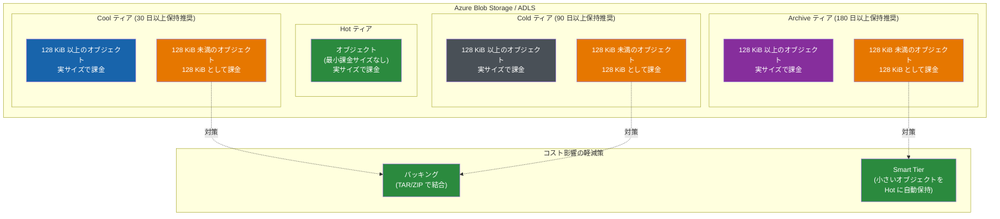

# Azure Blob Storage / Azure Data Lake Storage: クーラーティアにおける最小課金オブジェクトサイズの導入

**リリース日**: 2026-04-14

**サービス**: Azure Blob Storage / Azure Data Lake Storage

**機能**: Cool、Cold、Archive ティアの最小課金オブジェクトサイズ (128 KiB)

**ステータス**: Launched (GA)

[このアップデートのインフォグラフィックを見る](https://takech9203.github.io/azure-news-summary/20260414-blob-storage-minimum-billable-object-size.html)

## 概要

Azure Blob Storage および Azure Data Lake Storage (ADLS) を使用するストレージアカウントにおいて、Cool、Cold、Archive の各アクセスティアに **128 KiB の最小課金オブジェクトサイズ** が導入されることが発表された。これらのティアに格納された 128 KiB 未満のオブジェクトは、実際のサイズに関係なく 128 KiB のオブジェクトとして課金される。

この課金変更は 2 段階で導入される。第 1 段階として **2026 年 7 月 1 日** 以降に新規作成されたストレージアカウントに適用され、既存のストレージアカウントには変更がない。第 2 段階として **2027 年 7 月 1 日** からすべてのストレージアカウントに適用される。ストレージアカウントの作成日時 (アカウントレベルメタデータの一部) によって、どの段階が適用されるかが決定される。

Hot アクセスティアには最小課金オブジェクトサイズは適用されず、引き続きオブジェクトの実サイズで課金される。課金は既存の容量課金メーター (データ格納量) を使用し、トランザクション課金には変更はない。コスト影響を軽減するために、小さいオブジェクトをクーラーティアに移動する前にパッキング (TAR や ZIP 形式での結合) を行うか、Smart Tier を使用して小さいオブジェクトを自動的に Hot ティアに保持することが推奨されている。

**アップデート前の課題**

- クーラーティアに大量の小さなオブジェクトを格納する場合、ストレージコストは安価だがオブジェクト管理のオーバーヘッドが発生していた
- 小さなオブジェクトの格納に対するコスト最適化のインセンティブが不十分で、非効率なストレージ利用パターンが放置されがちだった
- ライフサイクル管理ポリシーで自動的にクーラーティアに移動された小さなオブジェクトのコスト影響が見えにくかった

**アップデート後の改善**

- 最小課金サイズの導入により、クーラーティアへの小さなオブジェクトの格納コストが明確化された
- パッキングや Smart Tier の活用など、小さなオブジェクトに対するコスト最適化手法の検討を促進
- BlockBlobSmall および Data Lake Storage Small の新しいメトリクスにより、影響を受けるオブジェクトの可視化が可能になった

## アーキテクチャ図



各クーラーティア (Cool/Cold/Archive) では 128 KiB 未満のオブジェクトが 128 KiB として課金される。Hot ティアには最小課金サイズが適用されないため、小さなオブジェクトのパッキングまたは Smart Tier の活用がコスト軽減策となる。

## サービスアップデートの詳細

### 主要機能

1. **最小課金オブジェクトサイズの導入**
   - Cool、Cold、Archive ティアに格納されたオブジェクトに 128 KiB の最小課金サイズが適用される
   - 128 KiB 未満のオブジェクトは、対応するティアの料金で 128 KiB として課金される
   - 課金は既存の容量課金メーター (データ格納量) を使用し、トランザクション課金には影響しない

2. **段階的な展開スケジュール**
   - 第 1 段階 (2026 年 7 月 1 日): 新規作成されたストレージアカウントにのみ適用。既存のストレージアカウントには影響なし
   - 第 2 段階 (2027 年 7 月 1 日): すべてのストレージアカウントに適用
   - ストレージアカウントの作成日時で適用段階が決定される

3. **新しい Blob Capacity メトリクス**
   - **BlockBlobSmall**: 128 KiB 未満のブロック Blob を識別するための新しい Blob タイプ
   - **Data Lake Storage Small**: 128 KiB 未満の ADLS オブジェクトを識別するための新しい Blob タイプ
   - Azure Portal の Blob Capacity メトリクスで確認可能

4. **Hot ティアは対象外**
   - Hot アクセスティアには最小課金オブジェクトサイズが適用されない
   - 引き続き実サイズで課金される

## 技術仕様

| 項目 | 詳細 |
|------|------|
| 最小課金オブジェクトサイズ | 128 KiB |
| 対象ティア | Cool、Cold、Archive |
| 対象外ティア | Hot (最小課金サイズなし) |
| 対象ストレージ | Azure Blob Storage、Azure Data Lake Storage (ADLS) |
| 課金メーター | 既存の容量課金メーター (データ格納量) を使用 |
| トランザクション課金 | 変更なし |
| 第 1 段階適用日 | 2026 年 7 月 1 日 (新規ストレージアカウントのみ) |
| 第 2 段階適用日 | 2027 年 7 月 1 日 (全ストレージアカウント) |
| 新規メトリクス | BlockBlobSmall、Data Lake Storage Small |

## 影響分析と推奨アクション

### 影響を受けるワークロード

以下のようなワークロードで、クーラーティアに 128 KiB 未満のオブジェクトを大量に格納している場合にコスト影響が発生する:

- **IoT デバイスからの小さなテレメトリファイル**: センサーデータや測定値を個別の小さなファイルとして格納しているケース
- **ログファイルの細かい分割**: アプリケーションログを短い期間ごとに個別ファイルとして保存し、ライフサイクルポリシーでクーラーティアに移動しているケース
- **メタデータや設定ファイル**: 小さな JSON/XML ファイルをクーラーティアに保存しているケース
- **サムネイル画像**: 小さな画像ファイルをアーカイブ目的でクーラーティアに移動しているケース

### 推奨アクション

1. **影響調査の実施**
   - Azure Monitor の Blob Capacity メトリクスで、クーラーティアに格納されている 128 KiB 未満のオブジェクト数を確認する
   - 新しい BlockBlobSmall / Data Lake Storage Small メトリクスが利用可能になった後、影響範囲を精査する

2. **小さなオブジェクトのパッキング**
   - TAR や ZIP 形式で小さなファイルを結合してからクーラーティアに移動する
   - パッキング済みファイルとオリジナルファイルのマッピングインデックスを Hot ティアに保持する

3. **Smart Tier の活用**
   - Smart Tier を有効にすると、128 KiB 未満のオブジェクトは自動的に Hot ティアに固定される
   - Smart Tier 内ではティア遷移料金や早期削除料金が発生しないため、コスト最適化に有効

4. **ライフサイクルポリシーの見直し**
   - 小さなオブジェクトをクーラーティアに移動するライフサイクルルールの妥当性を再評価する
   - 128 KiB 未満のオブジェクトについてはルールから除外するか、事前にパッキングする運用を検討する

### Azure Portal での影響確認

1. Azure Portal で対象のストレージアカウントに移動
2. 「監視」セクションから「メトリクス」を選択
3. メトリクス名前空間を「Blob」に設定
4. メトリクスを「Blob Capacity」に設定
5. 分割を適用し「Blob type」で分割して BlockBlobSmall の容量を確認

### Azure CLI での確認

```bash
# ストレージアカウントの Blob インベントリレポートを有効化して小さなオブジェクトを特定
az storage blob inventory-policy create \
  --account-name <storage-account-name> \
  --resource-group <resource-group> \
  --policy @inventory-policy.json
```

```json
{
  "enabled": true,
  "rules": [
    {
      "name": "small-objects-report",
      "enabled": true,
      "definition": {
        "filters": {
          "blobTypes": ["blockBlob"],
          "includeBlobVersions": false,
          "includeSnapshots": false
        },
        "format": "Csv",
        "schedule": "Weekly",
        "objectType": "Blob",
        "schemaFields": [
          "Name",
          "Content-Length",
          "AccessTier",
          "AccessTierChangeTime"
        ]
      },
      "destination": "<container-name>"
    }
  ]
}
```

## メリット

### ビジネス面

- **コスト意識の向上**: 最小課金サイズの導入により、ストレージ利用パターンの見直しを促し、全体的なコスト最適化を推進する
- **効率的なストレージ利用**: パッキングの促進により、オブジェクト数の削減とストレージ管理の効率化につながる
- **Smart Tier 採用の動機付け**: Smart Tier を導入することで、小さなオブジェクトの自動最適化とティア遷移料金の削減を同時に実現できる

### 技術面

- **メトリクスの充実**: BlockBlobSmall / Data Lake Storage Small の新メトリクスにより、小さなオブジェクトの分布を可視化できる
- **段階的な導入**: 2 段階の展開により、既存環境への影響を最小化しつつ対策の時間を確保できる
- **トランザクション課金への影響なし**: 容量課金のみの変更であり、操作 (読み取り/書き込み) の課金体系には変更がない

## デメリット・制約事項

- **小さなオブジェクトが多い環境でのコスト増加**: 128 KiB 未満のオブジェクトをクーラーティアに大量に格納している場合、課金対象容量が増加し、ストレージコストが上昇する
- **既存ワークロードの見直しが必要**: 2027 年 7 月 1 日までにすべてのストレージアカウントが対象となるため、影響を受けるワークロードの事前調査と対策が必須
- **パッキングの運用負荷**: 小さなファイルを結合するパッキング処理の実装と運用が新たに必要になる場合がある
- **パッキング後の個別アクセスの複雑化**: ファイルを TAR/ZIP にパッキングした場合、個別ファイルの取得にはアンパック処理が必要となり、読み取りの複雑さが増す
- **Smart Tier のゾーン冗長要件**: Smart Tier を軽減策として使用するには ZRS/GZRS/RA-GZRS のストレージアカウントが必要であり、LRS/GRS 構成では利用できない

## ユースケース

### ユースケース 1: IoT テレメトリデータの最適化

**シナリオ**: 数千台の IoT デバイスから 1 分ごとに小さな (数百バイト~数 KiB の) テレメトリファイルが Blob Storage にアップロードされ、ライフサイクルポリシーで 30 日後に Cool ティアに移動されている。

**対策例**:

```bash
# Azure Data Factory やカスタムスクリプトで小さなファイルを日次でパッキング
# 例: 1 日分のテレメトリを 1 つの Parquet ファイルに結合
azcopy copy "https://<account>.blob.core.windows.net/<container>/raw/2026-04-14/*" \
  "/tmp/telemetry-2026-04-14/" --recursive

# パッキング後のファイルをアップロード
az storage blob upload \
  --account-name <account> \
  --container-name <container> \
  --name "packed/telemetry-2026-04-14.parquet" \
  --file "/tmp/telemetry-2026-04-14.parquet" \
  --tier Cool
```

**効果**: 数千の小さなオブジェクトを 1 つの大きなオブジェクトに結合することで、最小課金サイズの影響を排除し、Cool ティアの低コストなストレージ料金の恩恵を最大限に受けることができる。

### ユースケース 2: Smart Tier の活用による自動最適化

**シナリオ**: さまざまなサイズのオブジェクトが混在するストレージアカウントで、手動でのティア管理やパッキングの運用負荷を避けたい。

**対策例**:

```bash
# ストレージアカウントのデフォルトアクセスティアを Smart に変更
az rest --method patch \
  --url "https://management.azure.com/subscriptions/<subscription-id>/resourceGroups/<resource-group>/providers/Microsoft.Storage/storageAccounts/<storage-account-name>?api-version=2025-08-01" \
  --body '{"properties":{"accessTier":"Smart"}}'
```

**効果**: Smart Tier は 128 KiB 未満のオブジェクトを自動的に Hot ティアに固定するため、最小課金サイズの影響を受けない。128 KiB 以上のオブジェクトはアクセスパターンに基づいて自動的に Cool/Cold ティアに移動され、手動管理なしでコスト最適化が実現される。

## 料金

この変更は容量課金の計算方法に関する変更であり、新しい料金メーターや料金体系の追加ではない。

| 項目 | 課金方法 |
|------|------|
| Cool ティア (128 KiB 以上) | 実サイズで課金 (変更なし) |
| Cool ティア (128 KiB 未満) | 128 KiB として課金 |
| Cold ティア (128 KiB 以上) | 実サイズで課金 (変更なし) |
| Cold ティア (128 KiB 未満) | 128 KiB として課金 |
| Archive ティア (128 KiB 以上) | 実サイズで課金 (変更なし) |
| Archive ティア (128 KiB 未満) | 128 KiB として課金 |
| Hot ティア | 実サイズで課金 (変更なし) |
| トランザクション | 変更なし |

**コスト影響の具体例**: 例えば、Cool ティアに 1 KiB のオブジェクトを 100 万個格納している場合:
- 変更前: 約 1 GiB (1 KiB x 1,000,000) の容量として課金
- 変更後: 約 128 GiB (128 KiB x 1,000,000) の容量として課金
- 課金対象容量が約 128 倍に増加する

**適用スケジュール**:
- 2026 年 7 月 1 日: 新規ストレージアカウントのみ
- 2027 年 7 月 1 日: 全ストレージアカウント

## 利用可能リージョン

この課金変更はすべての Azure リージョンの Azure Blob Storage および Azure Data Lake Storage に適用される。リージョンによる差異はない。

## 関連サービス・機能

- **[Smart Tier](https://learn.microsoft.com/azure/storage/blobs/access-tiers-smart)**: 2026 年 4 月 14 日に同時に GA となった自動ティアリング機能。128 KiB 未満のオブジェクトを Hot ティアに自動保持するため、最小課金サイズの影響を回避する手段として有効
- **[Azure Blob Storage ライフサイクル管理](https://learn.microsoft.com/azure/storage/blobs/lifecycle-management-overview)**: ルールベースでオブジェクトのティア移動を自動化する機能。小さなオブジェクトの移動ルールの見直しが推奨される
- **[Azure Blob Storage インベントリレポート](https://learn.microsoft.com/azure/storage/blobs/blob-inventory)**: ストレージアカウント内のオブジェクトの一覧とサイズを取得できる機能。影響を受けるオブジェクトの特定に活用可能
- **[Azure Storage Explorer](https://azure.microsoft.com/products/storage/storage-explorer/)**: ストレージアカウント内のオブジェクトを視覚的に確認・管理するツール

## 参考リンク

- [インフォグラフィック](https://takech9203.github.io/azure-news-summary/20260414-blob-storage-minimum-billable-object-size.html)
- [公式アップデート情報](https://azure.microsoft.com/updates?id=559756)
- [Azure Blog - Optimize object storage costs automatically with smart tier](https://azure.microsoft.com/en-us/blog/optimize-object-storage-costs-automatically-with-smart-tier-now-generally-available/)
- [Microsoft Learn - アクセスティアの概要](https://learn.microsoft.com/azure/storage/blobs/access-tiers-overview)
- [Microsoft Learn - アクセスティアのベストプラクティス](https://learn.microsoft.com/azure/storage/blobs/access-tiers-best-practices)
- [Microsoft Learn - Smart Tier](https://learn.microsoft.com/azure/storage/blobs/access-tiers-smart)
- [料金ページ - Azure Blob Storage](https://azure.microsoft.com/pricing/details/storage/blobs/)

## まとめ

Azure Blob Storage および Azure Data Lake Storage の Cool、Cold、Archive ティアに 128 KiB の最小課金オブジェクトサイズが導入される。これにより、クーラーティアに大量の小さなオブジェクトを格納しているワークロードではコスト増加が発生する可能性がある。

Solutions Architect としての推奨アクションは以下の通り:

1. **即時対応**: Azure Monitor のメトリクスやインベントリレポートを使用して、クーラーティアに格納されている 128 KiB 未満のオブジェクト数とコスト影響を調査する
2. **短期対策 (2026 年 7 月 1 日まで)**: 新規ストレージアカウントの作成時には最小課金サイズの影響を考慮した設計を行う
3. **中期対策 (2027 年 7 月 1 日まで)**: 既存のストレージアカウントについて、小さなオブジェクトのパッキング処理の導入、Smart Tier への移行、またはライフサイクルポリシーの見直しを実施する
4. **Smart Tier の検討**: ZRS/GZRS/RA-GZRS 構成のストレージアカウントでは、Smart Tier の有効化により小さなオブジェクトが自動的に Hot ティアに保持され、最小課金サイズの影響を回避できる

---

**タグ**: Azure Blob Storage, Azure Data Lake Storage, Storage, Pricing, GA, 最小課金オブジェクトサイズ, Cool ティア, Cold ティア, Archive ティア, コスト最適化, Smart Tier
