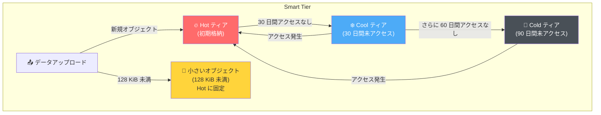

# Azure Blob Storage / Azure Data Lake Storage: Smart Tier の一般提供開始 (GA)

**リリース日**: 2026-04-14

**サービス**: Azure Blob Storage / Azure Data Lake Storage

**機能**: Smart Tier (スマートティア)

**ステータス**: Launched (GA)

[このアップデートのインフォグラフィックを見る](https://takech9203.github.io/azure-news-summary/20260414-blob-storage-smart-tier.html)

## 概要

Azure Blob Storage および Azure Data Lake Storage (ADLS) 向けの Smart Tier が一般提供 (GA) として発表された。Smart Tier は、データのアクセスパターンに基づいて、Hot、Cool、Cold の各アクセスティア間でオブジェクトを自動的に移動させ、ストレージコストを最適化する新しいアクセスティアである。ほぼすべてのゾーン冗長対応パブリッラウドリージョンで利用可能となった。

Smart Tier では、新しいデータはまず Hot ティアに格納される。30 日間アクセスがないオブジェクトは Cool ティアに、さらに 90 日間 (合計) アクセスがないオブジェクトは Cold ティアに自動的に移行される。再度アクセスされたオブジェクトは即座に Hot ティアに戻り、ティアリングサイクルがリセットされる。この仕組みにより、手動でのティア管理やライフサイクルポリシーの設定なしに、コスト最適化を実現できる。

従来のライフサイクル管理ポリシーと異なり、Smart Tier はルール定義が不要で、ティア間の遷移に対するトランザクション料金や早期削除料金が発生しない点が大きな特徴である。

**アップデート前の課題**

- アクセスパターンが不明確なデータに対して、最適なアクセスティアを事前に判断することが困難だった
- ライフサイクル管理ポリシーのルール設定・メンテナンスが必要で、運用負荷が発生していた
- ティア間の移行時にトランザクション料金や早期削除料金が発生し、コスト見積もりが複雑だった
- アクセスパターンの変化に手動で対応する必要があり、コスト最適化が後手に回ることがあった

**アップデート後の改善**

- アクセスパターンに基づく自動ティアリングにより、手動管理が不要になった
- Smart Tier 内のティア遷移ではトランザクション料金・早期削除料金が無料となった
- データ取得 (data retrieval) 操作が無料となり、コスト構造がシンプルになった
- すべてのアクセス操作が Hot ティアの料金で課金され、予測しやすい料金体系となった

## アーキテクチャ図



Smart Tier はアクセスパターンに基づいて Hot、Cool、Cold ティア間でオブジェクトを自動移動する。128 KiB 未満の小さなオブジェクトは効率性のため Hot ティアに固定される。

## サービスアップデートの詳細

### 主要機能

1. **自動ティアリング**
   - データのアクセスパターンを追跡し、Hot / Cool / Cold ティア間で自動的に移動
   - 30 日間未アクセスで Cool へ、90 日間未アクセスで Cold へ遷移
   - アクセスされたオブジェクトは即座に Hot ティアに復帰

2. **トランザクション・早期削除料金の免除**
   - Smart Tier 内でのティア遷移にトランザクション料金が発生しない
   - 早期削除料金 (early deletion fee) が課金されない
   - データ取得 (data retrieval) 操作も無料

3. **小さいオブジェクトの最適化**
   - 128 KiB 未満のオブジェクト (SmartHot-small) は Hot ティアに固定
   - 小さいオブジェクトに対してはモニタリング料金も免除

4. **アクセス操作の Hot ティア課金**
   - すべてのアクセス操作は Hot ティアの料金で課金
   - Cool/Cold ティアに格納されているオブジェクトへのアクセスも Hot ティアの料金

5. **監視メトリクス**
   - SmartHot、SmartCool、SmartCold、SmartHot-small の各ティア別メトリクスで分布を可視化
   - Azure Monitor のストレージアカウントメトリクスで確認可能

## 技術仕様

| 項目 | 詳細 |
|------|------|
| 対応ストレージアカウント | Standard 汎用 v2 (GPv2) |
| 対応冗長構成 | ZRS、GZRS、RA-GZRS |
| 対応 Blob タイプ | ブロック Blob のみ (ページ Blob、追加 Blob は非対応) |
| 初期格納ティア | Hot |
| Cool への遷移 | 30 日間未アクセス |
| Cold への遷移 | 90 日間未アクセス (Cool 移行後さらに 60 日) |
| 小さいオブジェクトの閾値 | 128 KiB |
| Archive ティア | 非対応 (Smart Tier のスコープ外) |
| REST API 最小バージョン | 2025-08-01 |
| アクセス操作 (ティアリング対象) | Get Blob、Put Blob |
| 非アクセス操作 (ティアリング対象外) | Get Blob Properties、Get Blob Metadata、Get Blob Tags |

## 設定方法

### 前提条件

1. Standard 汎用 v2 (GPv2) ストレージアカウント (レガシー GPv1 やプレミアムストレージアカウントは非対応)
2. ゾーン冗長ストレージ構成 (ZRS、GZRS、または RA-GZRS)

### Azure CLI

```bash
# 既存のストレージアカウントのデフォルトアクセスティアを Smart に変更
az rest --method patch \
  --url "https://management.azure.com/subscriptions/<subscription-id>/resourceGroups/<resource-group>/providers/Microsoft.Storage/storageAccounts/<storage-account-name>?api-version=2025-08-01" \
  --body '{"properties":{"accessTier":"Smart"}}'
```

### Azure PowerShell

```powershell
# 変数の設定
$SubscriptionId = "<subscription-id>"
$ResourceGroup = "<resource-group>"
$StorageAccountName = "<storage-account-name>"

# ストレージアカウントのアクセスティアを Smart に更新
$Path = "/subscriptions/$SubscriptionId/resourceGroups/$ResourceGroup/providers/Microsoft.Storage/storageAccounts/${StorageAccountName}?api-version=2025-08-01"
$Payload = @{ properties = @{ accessTier = "Smart" } } | ConvertTo-Json -Depth 3

Invoke-AzRestMethod -Method PATCH -Path $Path -Payload $Payload
```

### Azure Portal

**新規ストレージアカウント作成時:**

1. Azure Portal で「ストレージ アカウント」ページに移動し、「作成」を選択
2. 「基本」タブを入力
3. 「詳細設定」タブの「Blob storage」セクションで「アクセス層」を「Smart」に設定
4. 「確認および作成」を選択してストレージアカウントを作成

**既存のストレージアカウントの変更:**

1. Azure Portal で対象のストレージアカウントに移動
2. 「設定」から「構成」を選択
3. 「BLOB アクセス層 (既定)」を「Smart」に変更
4. 変更を保存

## メリット

### ビジネス面

- **コスト最適化の自動化**: アクセスパターンに応じた自動ティアリングにより、手動でのコスト最適化が不要になる
- **運用負荷の軽減**: ライフサイクル管理ポリシーの設計・設定・メンテナンスが不要
- **予測可能な課金**: ティア遷移料金と早期削除料金が無料のため、コスト見積もりがシンプル
- **即時導入**: 既存のストレージアカウントのデフォルトアクセスティアを変更するだけで有効化可能

### 技術面

- **レイテンシの維持**: すべてのオブジェクトはオンラインティア (Hot/Cool/Cold) に格納されるため、ミリ秒単位のアクセスレイテンシを維持
- **アクセス時の即座復帰**: Cool/Cold ティアのオブジェクトにアクセスすると即座に Hot ティアに移動
- **小さいオブジェクトの効率的な処理**: 128 KiB 未満のオブジェクトは Hot ティアに固定され、不要なティア遷移を回避
- **監視の容易さ**: SmartHot/SmartCool/SmartCold 別のメトリクスにより、データ分布を可視化

## デメリット・制約事項

- **ゾーン冗長ストレージ (ZRS/GZRS/RA-GZRS) が必須**: LRS や GRS のストレージアカウントでは利用不可。非ゾーン冗長 (LRS/GRS) への冗長変換もサポートされない
- **Standard GPv2 アカウントのみ対応**: レガシー GPv1 アカウントやプレミアムストレージアカウントでは利用不可
- **ブロック Blob のみ対応**: ページ Blob や追加 Blob はサポートされない
- **Archive ティアは非対応**: Smart Tier は Hot/Cool/Cold 間の自動移動のみで、Archive ティアへの移動は行わない
- **明示的にティアが設定された Blob は対象外**: 個別に Hot/Cool/Cold が設定されている Blob は Smart Tier の管理対象にならない
- **Smart Tier から移動したオブジェクトは戻せない**: 一度明示的なティアに移動すると、Smart Tier に戻すことはできない
- **GZRS アカウントのフェイルオーバー後**: LRS になったアカウントを 60 日以内にゾーン冗長に変換する必要がある
- **一部リージョンでは Public Preview**: Israel Central、Qatar Central、UAE North はまだ GA ではなく Public Preview の状態
- **Azure Government / 21Vianet 運用 Azure**: これらのクラウドでも Public Preview の段階

## ユースケース

### ユースケース 1: アクセスパターンが不明確なデータレイク

**シナリオ**: 大量のログデータや分析データをデータレイクに格納しているが、どのデータがどの程度頻繁にアクセスされるか事前に予測できない。

**実装例**:

```bash
# データレイクのストレージアカウントに Smart Tier を適用
az rest --method patch \
  --url "https://management.azure.com/subscriptions/<sub-id>/resourceGroups/<rg>/providers/Microsoft.Storage/storageAccounts/<account>?api-version=2025-08-01" \
  --body '{"properties":{"accessTier":"Smart"}}'
```

**効果**: 頻繁にアクセスされるデータは Hot ティアで高パフォーマンスを維持し、アクセス頻度が低いデータは自動的に Cool/Cold ティアに移行してコストを削減。ライフサイクルポリシーの設計・調整が不要。

### ユースケース 2: SaaS アプリケーションのユーザーデータ

**シナリオ**: SaaS アプリケーションで各ユーザーのファイルやドキュメントを Blob Storage に保存しているが、ユーザーごとにアクセス頻度が大きく異なる。

**効果**: アクティブユーザーのデータは Hot ティアで高速アクセスを維持し、非アクティブユーザーのデータは自動的にコスト効率の良いティアに移行。ユーザーがアクセスを再開すると即座に Hot ティアに復帰するため、ユーザー体験に影響しない。

### ユースケース 3: バックアップ・災害復旧データ

**シナリオ**: バックアップデータを Blob Storage に保存しているが、災害時以外はほとんどアクセスしない。ただし、アクセスが必要になった場合は即座にデータを取得したい。

**効果**: バックアップデータは自動的に Cold ティアに移行してストレージコストを削減しつつ、必要時にはミリ秒単位のレイテンシでアクセス可能。Archive ティアと異なりリハイドレーションの待ち時間が不要。

## 料金

Smart Tier には専用の容量メーターや料金は存在しない。オブジェクトは配置されている基盤のアクセスティア (Hot/Cool/Cold) の容量料金で課金される。すべて従量課金 (pay-as-you-go) が適用される。

| コストカテゴリ | 課金対象 | 無料 |
|------|------|------|
| 容量 (ストレージ) | 基盤ティアの料金 (Hot/Cool/Cold) | - |
| モニタリング | 128 KiB 超のオブジェクトに対し 10,000 オブジェクトあたりの料金 | 128 KiB 以下のオブジェクト |
| ティア遷移 | Smart Tier からの移動 (Cool write tx/object) | Smart Tier 内のすべての遷移 |
| 早期削除 | - | 無料 (課金なし) |
| データ取得 | - | 無料 (課金なし) |
| アクセス操作 | Hot ティアの料金で課金 | - |

**ポイント:**
- Smart Tier 内のティア遷移 (Hot -> Cool -> Cold、Cold -> Hot など) はトランザクション料金が無料
- 早期削除料金は発生しない
- すべてのアクセス操作は Hot ティアの料金で課金される
- 予約容量 (reserved capacity) は適用されない
- バージョンとスナップショットはフルコンテンツ長で課金される

詳細な料金は [Azure Blob Storage の料金ページ](https://azure.microsoft.com/pricing/details/storage/blobs/) を参照。

## 利用可能リージョン

Smart Tier は GA として、ほぼすべてのゾーン冗長対応パブリッククラウドリージョンで利用可能。

**GA 対象外 (Public Preview) のリージョン:**

- Israel Central
- Qatar Central
- UAE North

**Public Preview のクラウド環境:**

- Azure Government クラウドリージョン
- 21Vianet 運用 Azure (Azure in China)

## 関連サービス・機能

- **[Azure Blob Storage ライフサイクル管理](https://learn.microsoft.com/azure/storage/blobs/lifecycle-management-overview)**: ルールベースのティアリングポリシー。Smart Tier はライフサイクル管理のティアリング操作の影響を受けない (削除操作は適用される)。Smart Tier はライフサイクル管理の手動ルール設定が不要な代替手段として位置づけられる
- **[Azure Data Lake Storage Gen2](https://learn.microsoft.com/azure/storage/blobs/data-lake-storage-introduction)**: Smart Tier は ADLS Gen2 にも対応。データレイクのコスト最適化に活用可能
- **[Azure Storage Actions](https://learn.microsoft.com/azure/storage-actions/overview)**: 複数のストレージアカウントにまたがるデータ操作を大規模に実行するサーバーレスフレームワーク。ただし Smart Tier オブジェクトのティアリング操作には影響しない
- **[Azure Monitor](https://learn.microsoft.com/azure/storage/blobs/monitor-blob-storage)**: Smart Tier のオブジェクト分布 (SmartHot/SmartCool/SmartCold) をメトリクスで監視可能

## 参考リンク

- [インフォグラフィック](https://takech9203.github.io/azure-news-summary/20260414-blob-storage-smart-tier.html)
- [公式アップデート情報](https://azure.microsoft.com/updates?id=559746)
- [Microsoft Learn - Smart Tier ドキュメント](https://learn.microsoft.com/azure/storage/blobs/access-tiers-smart)
- [Microsoft Learn - アクセスティアの概要](https://learn.microsoft.com/azure/storage/blobs/access-tiers-overview)
- [Microsoft Learn - ライフサイクル管理の概要](https://learn.microsoft.com/azure/storage/blobs/lifecycle-management-overview)
- [料金ページ - Azure Blob Storage](https://azure.microsoft.com/pricing/details/storage/blobs/)

## まとめ

Azure Blob Storage および Azure Data Lake Storage の Smart Tier が GA となり、アクセスパターンに基づく自動ティアリングが本番環境で利用可能になった。Smart Tier はライフサイクル管理ポリシーの設計・運用が不要で、ティア遷移料金や早期削除料金も発生しないため、特にアクセスパターンが予測しにくいワークロードに対して大きなコスト最適化効果が期待できる。

Solutions Architect としての推奨アクションは以下の通り:

1. **ZRS/GZRS/RA-GZRS 構成の GPv2 ストレージアカウント**を使用している場合、Smart Tier の有効化を検討する
2. 既存のライフサイクル管理ポリシーとの比較を行い、Smart Tier への移行が適切かどうか評価する
3. アクセスパターンが不明確なデータレイクやバックアップストレージから段階的に導入を開始する
4. LRS/GRS 構成のストレージアカウントを利用中の場合、Smart Tier を利用するにはゾーン冗長構成への移行が前提条件となることに留意する

---

**タグ**: Azure Blob Storage, Azure Data Lake Storage, Smart Tier, Storage, GA, コスト最適化, アクセスティア, 自動ティアリング
