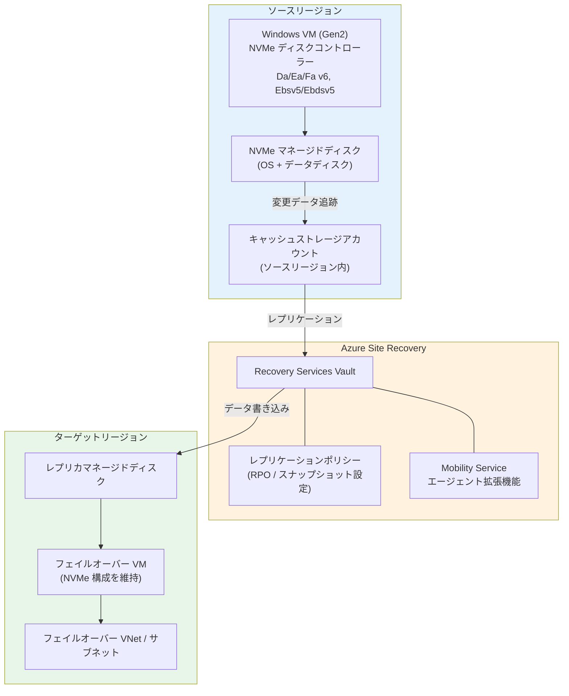

# Azure Site Recovery: Windows Azure VM における NVMe ディスクコントローラーサポート (パブリックプレビュー)

**リリース日**: 2026-04-14

**サービス**: Azure Site Recovery

**機能**: Windows Azure VM における NVMe ディスクコントローラーサポート

**ステータス**: In preview

[このアップデートのインフォグラフィックを見る](https://takech9203.github.io/azure-news-summary/20260414-site-recovery-nvme-windows-vms.html)

## 概要

Azure Site Recovery が、NVMe 対応の第 2 世代 (Gen2) VM ファミリー上で動作する Windows Azure Virtual Machines のレプリケーションおよびディザスタリカバリ (DR) をサポートするパブリックプレビューが発表された。対象となる VM ファミリーには Da/Ea/Fa v6 シリーズや Ebsv5/Ebdsv5 シリーズなど、NVMe インターフェースを使用する VM が含まれる。これは Azure-to-Azure シナリオにおけるサポートである。

NVMe (Non-Volatile Memory Express) ディスクコントローラーは、従来の SCSI コントローラーと比較して高いストレージ I/O パフォーマンスを提供する次世代のディスクインターフェースである。Azure では v6 シリーズなど新しい世代の VM ファミリーで NVMe がデフォルトのディスクコントローラーとして採用されており、これらの VM に対するディザスタリカバリ環境の構築が求められていた。

今回のアップデートにより、NVMe 対応 Windows VM のユーザーは Azure Site Recovery を使用してリージョン間のレプリケーションとディザスタリカバリを構成できるようになった。また、レプリケーション中にディスクコントローラーを SCSI から NVMe に移行した場合でも、Site Recovery が自動的に変更を検出し、中断なくレプリケーションを継続する機能も提供される。

**アップデート前の課題**

- NVMe ディスクコントローラーを使用する Windows Azure VM は Azure Site Recovery によるレプリケーションがサポートされていなかった
- Da/Ea/Fa v6 シリーズや Ebsv5/Ebdsv5 シリーズなどの新世代 NVMe 対応 VM では、Azure-to-Azure の DR 構成ができなかった
- NVMe 対応 VM への移行を検討する際、DR 要件がブロッカーとなることがあった

**アップデート後の改善**

- NVMe 対応 Gen2 Windows VM に対する Azure-to-Azure レプリケーションが可能になった
- レプリケーション中の SCSI から NVMe へのディスクコントローラー移行が自動検出され、中断なく継続される
- 新世代 VM ファミリーへの移行と DR 戦略を両立できるようになった

## アーキテクチャ図



ソースリージョンの NVMe 対応 Windows VM のディスク変更データがキャッシュストレージアカウント経由で追跡され、Recovery Services Vault を通じてターゲットリージョンのレプリカディスクにレプリケーションされる。フェイルオーバー時にはターゲットリージョンで NVMe 構成を維持した VM が起動される。

## サービスアップデートの詳細

### 主要機能

1. **NVMe 対応 Windows VM のレプリケーション**
   - NVMe ディスクコントローラーを使用する Gen2 Windows Azure VM の Azure-to-Azure レプリケーションをサポート
   - Da/Ea/Fa v6 シリーズ、Ebsv5/Ebdsv5 シリーズなどの NVMe 対応 VM ファミリーが対象

2. **SCSI から NVMe への移行時の自動検出**
   - レプリケーション有効化後にディスクコントローラーを SCSI から NVMe にインプレース移行した場合、Azure Site Recovery が自動的にコントローラーの変更を検出
   - レプリケーションは中断されることなく継続し、新しいリカバリポイントには更新された NVMe ディスクコントローラータイプが反映される

3. **ターゲットリージョンの NVMe 対応 SKU 検証**
   - ターゲットリージョンが NVMe 対応 VM SKU をサポートしていない場合、レプリケーション有効化時にバリデーションエラーが表示され、レプリケーション開始前にブロックされる

## 技術仕様

| 項目 | 詳細 |
|------|------|
| サポート対象 OS | Windows (Gen2 VM) |
| サポート対象 VM ファミリー | Da/Ea/Fa v6 シリーズ、Ebsv5/Ebdsv5 シリーズなど NVMe インターフェースを使用する VM |
| VM 世代 | 第 2 世代 (Gen2) のみ |
| サポート対象シナリオ | Azure-to-Azure |
| ステータス | パブリックプレビュー |
| エフェメラル OS ディスク | 非サポート |
| ローカル NVMe ディスク | 非サポート |
| 混合コントローラー VM (SCSI + NVMe) | 非サポート (Lsv3 などの混合 SKU は対象外) |

## 設定方法

### 前提条件

1. Recovery Services Vault が作成済みであること
2. NVMe 対応の Gen2 Windows VM が稼働していること (Da/Ea/Fa v6、Ebsv5/Ebdsv5 シリーズなど)
3. ターゲットリージョンが NVMe 対応 VM SKU をサポートしていること
4. ソースリージョンにキャッシュストレージアカウント (GPv2 推奨) が利用可能であること

### Azure Portal

1. Recovery Services Vault で **Site Recovery** ページに移動し、「Azure virtual machines」セクションの「**Enable replication**」を選択
2. **ソース**設定でソースリージョン、サブスクリプション、リソースグループを選択
3. **仮想マシン**選択画面で、レプリケーション対象の NVMe 対応 Windows VM を選択 (最大 10 台)
4. **レプリケーション設定**でターゲットリージョン、ターゲットサブスクリプション、ターゲットリソースグループを構成
   - ターゲットリージョンが NVMe 対応 VM SKU をサポートしていない場合、バリデーションエラーが表示される
5. ネットワーク設定でフェイルオーバー仮想ネットワークとサブネットを選択
6. ストレージ設定でレプリカディスクとキャッシュストレージを確認・構成
7. レプリケーションポリシーを選択し、「**Enable replication**」を選択

### Azure PowerShell

```powershell
# Recovery Services Vault の取得
$vault = Get-AzRecoveryServicesVault -ResourceGroupName "<resource-group>" -Name "<vault-name>"
Set-AzRecoveryServicesAsrVaultContext -Vault $vault

# レプリケーションの有効化 (Azure-to-Azure)
# 詳細な手順は Microsoft Learn のドキュメントを参照
# https://learn.microsoft.com/azure/site-recovery/azure-to-azure-powershell
```

## メリット

### ビジネス面

- **新世代 VM への移行促進**: NVMe 対応 VM への移行において DR 要件がブロッカーにならなくなり、最新の高性能 VM ファミリーの採用を推進できる
- **事業継続性の確保**: NVMe 対応 VM を使用するワークロードに対しても Azure-to-Azure のディザスタリカバリ戦略を適用できる
- **RTO/RPO の維持**: 既存の Site Recovery の RPO/RTO 目標を NVMe 環境でも維持できる

### 技術面

- **高パフォーマンス VM での DR サポート**: NVMe の高 I/O パフォーマンスの恩恵を受けつつ、DR 構成を維持できる
- **インプレース移行との統合**: SCSI から NVMe へのディスクコントローラー移行時にレプリケーションの再構成が不要
- **自動コントローラー検出**: ディスクコントローラーの変更が自動的に検出され、新しいリカバリポイントに反映される
- **バリデーション機能**: ターゲットリージョンの NVMe SKU 非対応を事前に検出し、構成ミスを防止

## デメリット・制約事項

- **パブリックプレビュー**: 本番環境での利用にはプレビュー段階であることを考慮する必要がある
- **Windows のみサポート**: 現時点では Windows VM のみが対象。Linux VM の NVMe サポートは含まれていない
- **Gen2 VM のみ**: 第 1 世代 (Gen1) VM は対象外
- **エフェメラル OS ディスク非サポート**: エフェメラル OS ディスクを使用する NVMe VM はレプリケーションできない
- **ローカル NVMe ディスク非サポート**: ローカル NVMe ディスクはレプリケーション対象外
- **混合コントローラー VM 非サポート**: Lsv3 シリーズのように SCSI と NVMe の混合コントローラーを持つ VM SKU はサポートされない
- **ターゲットリージョンの制約**: ターゲットリージョンが NVMe 対応 VM SKU をサポートしている必要がある
- **Azure CLI 非サポート**: Azure Site Recovery の DR 構成は現時点で Azure CLI をサポートしていない (Azure Portal または PowerShell を使用)

## ユースケース

### ユースケース 1: v6 シリーズ VM への移行と DR 構成

**シナリオ**: 企業が既存の v5 シリーズ VM から Da/Ea/Fa v6 シリーズへの移行を計画しているが、DR 要件が移行のブロッカーとなっていた。

**実装例**:

```powershell
# v6 シリーズ VM のレプリケーション有効化
# 1. Recovery Services Vault のコンテキスト設定
$vault = Get-AzRecoveryServicesVault -ResourceGroupName "prod-rg" -Name "prod-vault"
Set-AzRecoveryServicesAsrVaultContext -Vault $vault

# 2. Azure Portal から NVMe 対応 v6 VM のレプリケーションを有効化
# ターゲットリージョンで NVMe 対応 SKU が利用可能であることを事前に確認
```

**効果**: v6 シリーズの高パフォーマンス NVMe ディスク I/O を活用しつつ、Azure Site Recovery による Azure-to-Azure DR 構成を維持。移行と DR 戦略を両立できる。

### ユースケース 2: 既存レプリケーション環境での SCSI から NVMe への移行

**シナリオ**: 既に Azure Site Recovery でレプリケーションを構成している Windows VM について、VM のディスクコントローラーを SCSI から NVMe にインプレースで変更したい。

**効果**: ディスクコントローラーの移行後も Site Recovery が自動的に変更を検出し、レプリケーションが中断なく継続される。新しいリカバリポイントには NVMe コントローラータイプが反映されるため、フェイルオーバー後の VM も NVMe 構成で起動される。

## 料金

Azure Site Recovery の料金は、NVMe 対応 VM に対しても従来と同じ料金体系が適用される。

| 項目 | 料金 |
|------|------|
| Azure VM の保護 (Azure-to-Azure) | インスタンスあたり月額課金 |

最初の 31 日間は無料で利用可能。詳細な料金については [Azure Site Recovery の料金ページ](https://azure.microsoft.com/pricing/details/site-recovery/) を参照。

## 利用可能リージョン

Azure Site Recovery はグローバル DR をサポートしており、世界中の任意の 2 つの Azure リージョン間で VM をレプリケーションおよびリカバリできる。ただし、NVMe 対応 VM のレプリケーションにおいては、ターゲットリージョンが NVMe 対応 VM SKU をサポートしている必要がある。ターゲットリージョンが NVMe 対応 SKU をサポートしていない場合、レプリケーション有効化時にバリデーションエラーが表示される。

## 関連サービス・機能

- **[Azure Site Recovery](https://learn.microsoft.com/azure/site-recovery/)**: Azure VM、オンプレミス VM、物理サーバーのディザスタリカバリを提供するサービス。今回の NVMe サポートはこのサービスの機能拡張
- **[Azure Virtual Machines v6 シリーズ](https://learn.microsoft.com/azure/virtual-machines/)**: Da/Ea/Fa v6 シリーズなど NVMe をデフォルトのディスクコントローラーとして採用する最新世代の VM ファミリー
- **[Azure Managed Disks](https://learn.microsoft.com/azure/virtual-machines/managed-disks-overview)**: Site Recovery によるレプリケーション対象となるマネージドディスク。NVMe インターフェースのマネージドディスクがサポート対象

## 参考リンク

- [インフォグラフィック](https://takech9203.github.io/azure-news-summary/20260414-site-recovery-nvme-windows-vms.html)
- [公式アップデート情報](https://azure.microsoft.com/updates?id=560241)
- [Microsoft Learn - Azure VM ディザスタリカバリのサポートマトリクス](https://learn.microsoft.com/azure/site-recovery/azure-to-azure-support-matrix)
- [Microsoft Learn - Azure VM のレプリケーション構成](https://learn.microsoft.com/azure/site-recovery/azure-to-azure-how-to-enable-replication)
- [料金ページ - Azure Site Recovery](https://azure.microsoft.com/pricing/details/site-recovery/)

## まとめ

Azure Site Recovery が NVMe ディスクコントローラーを使用する Windows Gen2 VM のレプリケーションをパブリックプレビューとしてサポートした。Da/Ea/Fa v6 シリーズや Ebsv5/Ebdsv5 シリーズなどの新世代 NVMe 対応 VM に対して、Azure-to-Azure のディザスタリカバリが構成可能になった。

Solutions Architect としての推奨アクションは以下の通り:

1. **NVMe 対応 VM への移行を計画している場合**: 本プレビュー機能により DR 要件がブロッカーでなくなるため、v6 シリーズなどへの移行計画を推進できる
2. **既存の SCSI VM を NVMe に移行する場合**: Site Recovery が自動的にコントローラー変更を検出するため、レプリケーションの再構成は不要
3. **ターゲットリージョンの事前確認**: NVMe 対応 VM SKU がターゲットリージョンで利用可能かを事前に確認する
4. **プレビュー段階である点に留意**: 本番環境への適用にはプレビューのリスクを考慮し、テスト環境での検証を先行することを推奨
5. **混合コントローラー VM (Lsv3 など) は非サポート**: 対象外の VM SKU を把握しておく
6. **Linux VM は現時点で非対象**: Linux NVMe VM の DR が必要な場合は、今後のアップデートを待つ必要がある

---

**タグ**: Azure Site Recovery, NVMe, Windows, Gen2 VM, ディザスタリカバリ, Azure-to-Azure, パブリックプレビュー, Da/Ea/Fa v6, Ebsv5, Ebdsv5, レプリケーション
