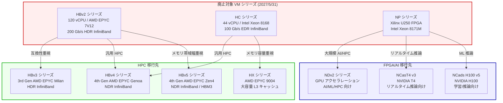

# Azure Batch: HBv2/HC/NP シリーズ VM サポート終了のお知らせ

**リリース日**: 2026-04-15

**サービス**: Azure Batch / Azure Virtual Machines

**機能**: HBv2-series、HC-series、NP-series VM の Azure Batch プールでのサポート終了

**ステータス**: Retirement

[このアップデートのインフォグラフィックを見る](https://takech9203.github.io/azure-news-summary/20260415-batch-hbv2-hc-np-series-retirement.html)

## 概要

Microsoft Azure は、Azure Batch プールにおける HBv2 シリーズ、HC シリーズ、NP シリーズの仮想マシンのサポートを **2027 年 5 月 31 日** に終了することを発表した。これらの VM シリーズは、HPC (High Performance Computing) や FPGA アクセラレーション用途に特化した旧世代のインスタンスであり、より高性能な新世代シリーズへの移行が求められる。

対象となる VM シリーズは以下の 3 種類である:
- **HBv2 シリーズ**: 120 AMD EPYC 7V12 vCPU、456 GB RAM、200 Gb/s HDR InfiniBand を搭載したメモリ帯域幅集約型 HPC ワークロード向け VM
- **HC シリーズ**: 44 Intel Xeon Platinum 8168 vCPU、352 GB RAM、100 Gb/s EDR InfiniBand を搭載した計算集約型 HPC ワークロード向け VM
- **NP シリーズ**: Xilinx (AMD Alveo) U250 FPGA を搭載した、機械学習推論・ビデオトランスコーディング・データベース検索などの FPGA アクセラレーション向け VM

退役日以降、これらの VM はすべて割り当て解除状態に設定され、動作が停止し、課金も停止する。SLA およびサポートの対象外となる。なお、1 年および 3 年のリザーブドインスタンス (RI) の新規購入は 2026 年 4 月 2 日に既に終了している。

**リタイア前の状況**

- HBv2/HC シリーズを使用した Azure Batch プールで HPC ワークロード (流体力学、有限要素解析、分子動力学シミュレーション等) を実行中
- NP シリーズを使用した Azure Batch プールで FPGA アクセラレーションワークロード (ML 推論、ビデオトランスコーディング等) を実行中
- 旧世代プロセッサ (AMD EPYC 7V12、Intel Xeon Platinum 8168、Intel Xeon 8171M) ベースのインスタンスを利用

**リタイア後に必要なアクション**

- HPC ワークロードを HBv5/HX/HBv4/HBv3 シリーズに移行し、性能向上とサポート継続を実現
- FPGA ワークロードを NDv2/NCads_H100_v5/NCasT4_v3 などの GPU VM シリーズに移行、またはワークロードの再設計を検討
- 2027 年 5 月 31 日までに Batch プールの VM サイズを変更し、サービス中断を回避

## マイグレーションパス



上図は廃止対象の 3 シリーズから推奨移行先への移行パスを示している。HPC ワークロードは新世代の HB/HX シリーズに、FPGA ワークロードは GPU ベースの VM シリーズへの移行が推奨される。

## サービスアップデートの詳細

### リタイアのタイムライン

| マイルストーン | 日付 | 内容 |
|------------|------|------|
| リタイア発表 | 2026 年 4 月 15 日 | Azure Batch プールでの HBv2/HC/NP シリーズのサポート終了を発表 |
| RI 新規購入終了 | 2026 年 4 月 2 日 | 1 年/3 年リザーブドインスタンスの新規購入終了 (既存 RI は有効期限まで有効) |
| 従量課金制の継続 | ~ 2027 年 5 月 31 日 | Pay-as-you-go での利用は退役日まで可能 |
| サポート終了日 | **2027 年 5 月 31 日** | VM が自動的に割り当て解除、課金停止、SLA/サポート対象外 |

### 影響を受けるワークロード

1. **HBv2 シリーズのワークロード**
   - 流体力学 (CFD) シミュレーション
   - 有限要素解析 (FEA)
   - 貯留層シミュレーション
   - メモリ帯域幅集約型の HPC アプリケーション

2. **HC シリーズのワークロード**
   - 暗黙的有限要素解析
   - 分子動力学シミュレーション
   - 計算化学
   - 計算集約型 HPC アプリケーション

3. **NP シリーズのワークロード**
   - FPGA ベースの機械学習推論
   - ビデオトランスコーディング
   - データベース検索・分析
   - カスタムハードウェアアクセラレーション

## 技術仕様

### 廃止対象 VM シリーズの比較

| 項目 | HBv2 シリーズ | HC シリーズ | NP シリーズ |
|------|-------------|-----------|-----------|
| プロセッサ | AMD EPYC 7V12 (Rome) | Intel Xeon Platinum 8168 (Skylake) | Intel Xeon 8171M (Skylake) |
| 最大 vCPU 数 | 120 | 44 | 40 |
| メモリ | 456 GB | 352 GB | 672 GB (NP40s) |
| メモリ帯域幅 | 350 GB/s | 191 GB/s | - |
| InfiniBand | 200 Gb/s HDR | 100 Gb/s EDR | なし |
| アクセラレータ | なし | なし | Xilinx U250 FPGA (最大 4 基) |
| ローカルストレージ | 480 GiB + 960 GiB NVMe | 700 GiB | 736 ~ 2948 GiB |
| 最大データディスク数 | 8 | 4 | 8 ~ 32 |

### HPC 移行先の推奨 VM シリーズ

| 項目 | HBv5 シリーズ | HX シリーズ | HBv4 シリーズ | HBv3 シリーズ |
|------|-------------|-----------|-------------|-------------|
| プロセッサ | 4th Gen AMD EPYC (Zen4) | AMD EPYC 9004 | 4th Gen AMD EPYC (Genoa) | 3rd Gen AMD EPYC (Milan) |
| 最大コア数 | 最大 368 | 最大 176 | 最大 176 | 最大 120 |
| メモリ | HBM3 対応 | 大容量 L3 キャッシュ | 標準 DDR | 標準 DDR |
| InfiniBand | NDR | - | NDR | HDR |
| 推奨用途 | メモリ帯域幅集約型 | メモリ容量集約型 | 汎用 HPC | HBv2 からの互換性重視 |

### FPGA/AI 移行先の推奨 VM シリーズ

| 項目 | NDv2 シリーズ | NCads H100 v5 | NCasT4 v3 |
|------|-------------|---------------|-----------|
| アクセラレータ | NVIDIA GPU | NVIDIA H100 | NVIDIA T4 |
| 推奨用途 | 大規模 AI/ML/HPC | 学習/バッチ推論 | リアルタイム推論/可視化 |
| NP からの移行適性 | ML 推論 (大規模) | ML 推論/学習 | 推論サービスデプロイ |

## マイグレーション手順

### 前提条件

1. 移行先 VM シリーズのクォータを確認し、必要に応じて引き上げをリクエスト
2. 移行先のリージョン可用性を [Azure リージョン別製品](https://azure.microsoft.com/explore/global-infrastructure/products-by-region/) で確認
3. MPI ライブラリおよび InfiniBand ファブリック (HDR vs. NDR) の互換性を検証

### Azure CLI

```bash
# 現在の Batch プール構成を確認
az batch pool show --pool-id <pool-id> --account-name <account-name>

# 利用可能な VM SKU を確認
az batch location list-skus --location <azure-region>

# Batch プールの VM サイズを変更するには、新しいプールを作成して移行
az batch pool create \
  --id <new-pool-id> \
  --vm-size Standard_HB120rs_v3 \
  --image "canonical:ubuntuserver:20_04-lts:latest" \
  --account-name <account-name>
```

### Azure Portal

1. Azure Portal で Batch アカウントに移動
2. 「プール」を選択し、対象プールの VM サイズを確認
3. 新しいプールを作成し、移行先の VM サイズ (例: Standard_HB120rs_v3) を選択
4. ジョブの割り当てを新しいプールに変更
5. 動作確認後、旧プールを削除

### 移行時の注意事項

- **MPI/RDMA 要件**: InfiniBand ファブリックの世代 (HDR vs. NDR) が移行先でサポートされていることを確認
- **メモリ帯域幅**: 移行先シリーズでワークロードのベンチマークを実施し、性能の同等性または向上を確認
- **FPGA ワークロードの再設計**: NP シリーズから GPU VM への移行では、FPGA ビットストリームを GPU カーネル (CUDA/OpenCL) に書き換える必要がある
- **ワークロード互換性**: 本番移行前に移行先シリーズでアプリケーションの正確性と性能をテスト

## デメリット・制約事項

- **FPGA ワークロードの移行コスト**: NP シリーズの FPGA ビットストリームは GPU に直接移植できないため、アプリケーションの再設計が必要になる場合がある
- **InfiniBand の世代差異**: HBv2 (HDR) から HBv5/HBv4 (NDR) への移行では、MPI ライブラリや RDMA 構成の調整が必要
- **リージョン可用性**: 新世代 VM シリーズが現在使用中のリージョンで利用可能とは限らない
- **リザーブドインスタンスの制約**: 新規 RI 購入は既に終了しており、退役日までは従量課金制のみ利用可能

## ユースケース

### ユースケース 1: 流体力学シミュレーションの移行 (HBv2 -> HBv4/HBv5)

**シナリオ**: Azure Batch プール上で HBv2 シリーズを使用して CFD (計算流体力学) シミュレーションを実行している組織が、退役前に移行する必要がある。

**推奨移行先**: メモリ帯域幅を重視する場合は HBv5 シリーズ、汎用 HPC として HBv4 シリーズが推奨される。HBv2 と同じ HDR InfiniBand を使用したい場合は HBv3 シリーズが互換性の観点で最適。

**効果**: 新世代プロセッサ (4th Gen AMD EPYC) による演算性能の向上と、NDR InfiniBand による高速なノード間通信を活用できる。

### ユースケース 2: FPGA ML 推論の GPU 移行 (NP -> NCads H100 v5)

**シナリオ**: NP シリーズの Xilinx U250 FPGA を使用して機械学習推論ワークロードを実行している組織が、GPU ベースの VM に移行する必要がある。

**推奨移行先**: リアルタイム推論には NCasT4_v3、バッチ推論および学習には NCads_H100_v5 が推奨される。

**効果**: GPU ベースの推論は豊富なソフトウェアエコシステム (CUDA、TensorRT、ONNX Runtime) を活用でき、FPGA 固有の開発環境 (Vitis/XRT) への依存を解消できる。

## 関連サービス・機能

- **[Azure Batch](https://learn.microsoft.com/azure/batch/)**: プール内の VM サイズ変更が直接影響を受ける。新しいプールを作成して移行する必要がある
- **[Azure CycleCloud](https://learn.microsoft.com/azure/cyclecloud/)**: HPC クラスターの管理ツール。Batch 以外の HPC 環境でも同様の移行が必要
- **[Azure HPC Workbench](https://learn.microsoft.com/azure/hpc/)**: HPC ワークロードの最適化に活用可能

## 参考リンク

- [インフォグラフィック](https://takech9203.github.io/azure-news-summary/20260415-batch-hbv2-hc-np-series-retirement.html)
- [公式アップデート情報](https://azure.microsoft.com/updates?id=559751)
- [HBv2 シリーズ VM ドキュメント](https://learn.microsoft.com/azure/virtual-machines/sizes/high-performance-compute/hbv2-series)
- [HC シリーズ VM ドキュメント](https://learn.microsoft.com/azure/virtual-machines/sizes/high-performance-compute/hc-series)
- [NP シリーズ VM ドキュメント](https://learn.microsoft.com/azure/virtual-machines/sizes/fpga-accelerated/np-series)
- [NP シリーズ移行ガイド](https://learn.microsoft.com/azure/virtual-machines/sizes/retirement/np-series-retirement)
- [Azure Batch プール VM サイズの選択](https://learn.microsoft.com/azure/batch/batch-pool-vm-sizes)
- [Azure リージョン別製品](https://azure.microsoft.com/explore/global-infrastructure/products-by-region/)
- [Azure VM 料金](https://azure.microsoft.com/pricing/details/virtual-machines/)

## まとめ

Azure Batch プールにおける HBv2 シリーズ、HC シリーズ、NP シリーズ VM のサポートが 2027 年 5 月 31 日に終了する。退役日以降、これらの VM は自動的に割り当て解除され、SLA およびサポートの対象外となる。リザーブドインスタンスの新規購入は既に 2026 年 4 月 2 日に終了している。

HPC ワークロードについては、HBv5/HX/HBv4/HBv3 シリーズへの移行が推奨される。特に HBv5 シリーズは HBM3 メモリと NDR InfiniBand を搭載し、メモリ帯域幅集約型ワークロードに最適な後継となる。FPGA ワークロードについては、NVIDIA GPU ベースの NDv2/NCads_H100_v5/NCasT4_v3 シリーズへの移行が推奨されるが、FPGA から GPU へのワークロード移植にはアプリケーションの再設計が伴う点に注意が必要である。

**推奨される次のアクション:**
1. 現在の Batch プールで使用中の VM シリーズを棚卸しし、影響範囲を特定する
2. 移行先 VM シリーズのリージョン可用性とクォータを確認する
3. 移行先でのベンチマークテストを実施し、性能を検証する
4. 2027 年 5 月 31 日までにプールの移行を完了する

---

**タグ**: #Azure #Batch #HPC #VirtualMachines #Retirement #HBv2 #HC #NP #FPGA #InfiniBand #Migration
