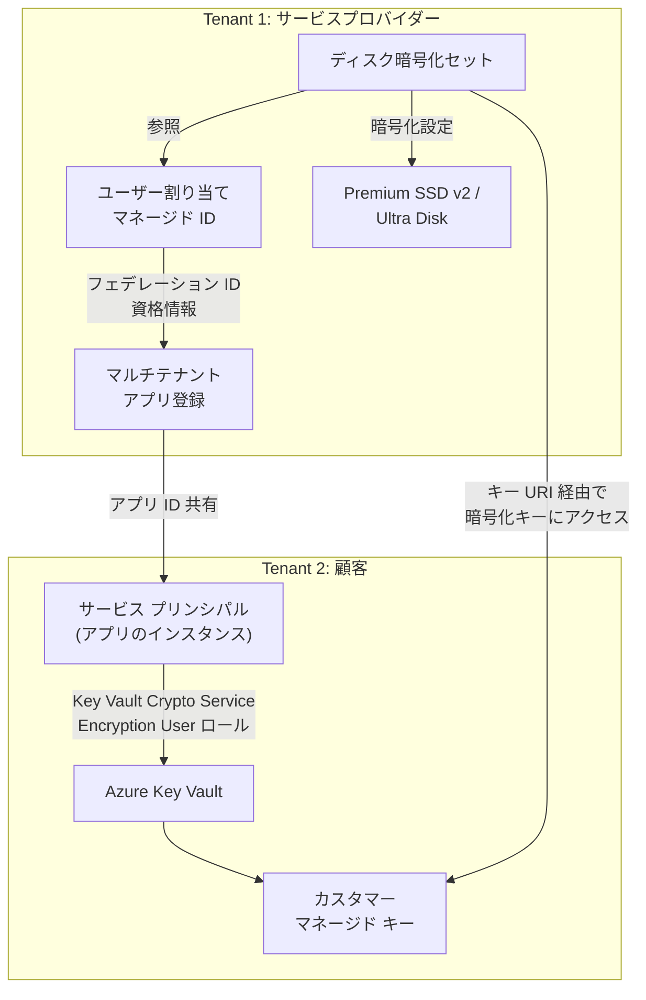

# Azure Disk Storage: Premium SSD v2 / Ultra Disk のクロステナント カスタマー マネージド キー暗号化が一般提供開始

**リリース日**: 2026-04-15

**サービス**: Azure Disk Storage

**機能**: Premium SSD v2 および Ultra Disk のクロステナント カスタマー マネージド キー (CMK) 暗号化

**ステータス**: Launched (GA)

[このアップデートのインフォグラフィックを見る](https://takech9203.github.io/azure-news-summary/20260415-disk-storage-cross-tenant-cmk.html)

## 概要

Microsoft Azure は、Premium SSD v2 および Ultra Disk に対するクロステナント カスタマー マネージド キー (CMK) 暗号化の一般提供 (GA) を発表した。この機能により、マネージド ディスクを別の Microsoft Entra テナントに配置された Azure Key Vault に格納されたカスタマー マネージド キーで暗号化できるようになる。

この機能は、特に SaaS プロバイダーやマネージド サービス プロバイダー (MSP) が顧客のテナントに格納された暗号化キーを使用して、自社テナント内のディスク リソースを暗号化する「Bring Your Own Key (BYOK)」シナリオを実現するために設計されている。サービス プロバイダーのテナント (Tenant 1) にあるディスク暗号化セットが、顧客のテナント (Tenant 2) にある Azure Key Vault 内のキーにフェデレーション ID を介してアクセスする仕組みとなっている。

従来は同一テナント内でのみ CMK 暗号化が利用可能であったが、本アップデートにより、テナント境界を越えたキー管理と暗号化が Premium SSD v2 および Ultra Disk でもサポートされるようになった。

**アップデート前の課題**

- Premium SSD v2 および Ultra Disk では、異なる Microsoft Entra テナント間でのカスタマー マネージド キー暗号化がサポートされておらず、マルチテナント環境での BYOK シナリオが困難であった
- SaaS プロバイダーが顧客のテナントに格納されたキーを使用して高性能ディスクを暗号化するには、同一テナント内にリソースを配置する必要があった
- コンプライアンス要件により暗号化キーの管理を顧客自身が行う必要がある場合、テナント分離の制約が障壁となっていた

**アップデート後の改善**

- Premium SSD v2 および Ultra Disk が異なる Microsoft Entra テナントの Azure Key Vault に格納されたキーで暗号化可能になった
- SaaS / MSP シナリオにおいて、サービス プロバイダーが顧客管理のキーを使用した暗号化を容易に実装可能になった
- フェデレーション ID 資格情報とマルチテナント アプリケーション登録を組み合わせた安全なクロステナント アクセスが実現された

## アーキテクチャ図



サービス プロバイダーのテナント (Tenant 1) にあるディスク暗号化セットが、フェデレーション ID を通じて顧客テナント (Tenant 2) の Azure Key Vault に格納されたカスタマー マネージド キーにアクセスし、Premium SSD v2 / Ultra Disk の暗号化を実行する構成を示している。

## サービスアップデートの詳細

### 主要機能

1. **クロステナント CMK 暗号化**
   - 異なる Microsoft Entra テナントにある Azure Key Vault のキーを使用して、Premium SSD v2 および Ultra Disk を暗号化できる
   - ディスク暗号化セットにフェデレーション クライアント ID とユーザー割り当てマネージド ID を関連付けることで、テナント間のアクセスを実現する

2. **フェデレーション ID 資格情報によるセキュアなアクセス**
   - マルチテナント アプリケーション登録とユーザー割り当てマネージド ID を組み合わせたフェデレーション ID 資格情報を使用する
   - サービス プロバイダーが顧客の Key Vault に直接アクセスするのではなく、顧客側で明示的に承認されたサービス プリンシパルを介してアクセスする

3. **3 フェーズの構成プロセス**
   - フェーズ 1: サービス プロバイダーが ID (マルチテナント アプリ、マネージド ID、フェデレーション資格情報) を構成する
   - フェーズ 2: 顧客がサービス プロバイダーのアプリに Key Vault へのアクセスを許可する
   - フェーズ 3: サービス プロバイダーがディスク暗号化セットを作成し、CMK で暗号化する

## 技術仕様

| 項目 | 詳細 |
|------|------|
| 対象ディスク タイプ | Premium SSD v2、Ultra Disk |
| 暗号化タイプ | EncryptionAtRestWithCustomerKey |
| ID タイプ | ユーザー割り当てマネージド ID (UserAssigned) |
| Key Vault 要件 | Azure RBAC 認可、論理削除保護 (Purge Protection) の有効化 |
| リージョン制約 | マネージド ディスクと顧客の Key Vault は同一 Azure リージョンに配置する必要あり (サブスクリプションは異なって良い) |
| フェデレーション ID 資格情報の上限 | アプリケーションあたり最大 20 個 |
| 必要な RBAC ロール (顧客側) | Key Vault Crypto Service Encryption User |
| 必要な RBAC ロール (サービスプロバイダー側) | Managed Identity Contributor |
| Microsoft Entra ロール (アプリ登録) | Application Developer |

## 設定方法

### 前提条件

1. サービス プロバイダー テナントに Microsoft Entra のマルチテナント アプリケーション登録を作成済みであること
2. サービス プロバイダー テナントにユーザー割り当てマネージド ID を作成済みであること
3. 顧客テナントに Azure Key Vault (Purge Protection 有効、Azure RBAC 認可有効) を作成済みであること
4. 顧客テナントで暗号化キーを作成済みであること

### Azure CLI

```bash
# フェーズ 1: サービスプロバイダー側 - マルチテナントアプリ登録の作成
multiTenantAppName="<multi-tenant-app>"
multiTenantAppObjectId=$(az ad app create --display-name $multiTenantAppName \
    --sign-in-audience AzureADMultipleOrgs \
    --query id \
    --output tsv)

multiTenantAppId=$(az ad app show --id $multiTenantAppObjectId --query appId --output tsv)

# ユーザー割り当てマネージド ID の作成
isvSubscriptionId="<isv-subscription-id>"
isvRgName="<isv-resource-group>"
isvLocation="<location>"
userIdentityName="<user-assigned-managed-identity>"

az identity create --name $userIdentityName \
    --resource-group $isvRgName \
    --location $isvLocation \
    --subscription $isvSubscriptionId

# フェデレーション ID 資格情報の構成 (credential.json を事前に作成)
az ad app federated-credential create --id $multiTenantAppObjectId --parameters credential.json
```

```bash
# フェーズ 2: 顧客側 - サービスプリンシパルの作成と Key Vault アクセス許可
multiTenantAppId="<multi-tenant-app-id>"
az ad sp create --id $multiTenantAppId

# Key Vault の作成
kvName="<key-vault>"
az keyvault create --name $kvName \
    --location $customerLocation \
    --resource-group $customerRgName \
    --enable-purge-protection true \
    --enable-rbac-authorization true

# 暗号化キーの作成
keyName="<key-name>"
az keyvault key create --name $keyName --vault-name $kvName

# サービスプリンシパルに Key Vault へのアクセス権限を付与
servicePrincipalId=$(az ad sp show --id $multiTenantAppId --query id --output tsv)
kvResourceId=$(az keyvault show --resource-group $customerRgName --name $kvName --query id --output tsv)

az role assignment create --role "Key Vault Crypto Service Encryption User" \
    --scope $kvResourceId \
    --assignee-object-id $servicePrincipalId
```

```bash
# フェーズ 3: サービスプロバイダー側 - ディスク暗号化セットの作成
az disk-encryption-set create \
    --resource-group MyResourceGroup \
    --name MyDiskEncryptionSet \
    --key-url "<customer-key-url>" \
    --mi-user-assigned "<user-assigned-identity-resource-id>" \
    --federated-client-id "<multi-tenant-app-client-id>" \
    --location "<location>"
```

### Azure Portal

1. Azure Portal にサインインし、**Microsoft Entra ID** > **アプリの登録** > **+ 新しい登録** からマルチテナント アプリケーションを作成する
2. **マネージド ID** から新しいユーザー割り当てマネージド ID を作成する
3. アプリ登録の **証明書とシークレット** > **フェデレーション資格情報** でマネージド ID をフェデレーション ID 資格情報として構成する
4. 顧客テナントでサービス プリンシパルを作成し、Key Vault に **Key Vault Crypto Service Encryption User** ロールを割り当てる
5. **ディスク暗号化セット** を作成し、暗号化タイプに **カスタマー マネージド キーによる保存時の暗号化** を選択する
6. キー URI に顧客テナントの Key Vault のキー URL を入力し、ユーザー割り当て ID とマルチテナント アプリケーションを関連付ける

## メリット

### ビジネス面

- SaaS プロバイダーが顧客の暗号化キー管理ポリシーに準拠しつつ、高性能ディスクを提供できるようになる
- 金融機関や医療機関など、厳格なコンプライアンス要件を持つ顧客に対して BYOK を提案可能になる
- マルチテナント アーキテクチャでの顧客データの暗号化分離が容易になる

### 技術面

- Premium SSD v2 および Ultra Disk の高い I/O パフォーマンスを維持しながら、クロステナント暗号化を実現できる
- フェデレーション ID 資格情報により、シークレットやパスワードを共有することなくテナント間アクセスを安全に構成できる
- 1 つのマルチテナント アプリケーションで複数の顧客テナントの Key Vault にアクセスできるため、管理が効率化される

## デメリット・制約事項

- マネージド ディスクと顧客の Key Vault は同一 Azure リージョンに配置する必要がある (サブスクリプションは異なって良い)
- フェデレーション ID 資格情報はアプリケーションあたり最大 20 個の制限があるため、顧客数が多い場合は複数のフェデレーション ID を共有する設計が必要になる
- 以下のリージョンでは Ultra Disk および Premium SSD v2 のクロステナント CMK は利用できない: US Gov Virginia、US Gov Arizona、US Gov Texas、China North 3
- 構成が 3 フェーズにわたるため、サービス プロバイダーと顧客の双方で複数のステップを実行する必要がある
- ARM テンプレートによる Microsoft Entra アプリケーションの作成は推奨されていない

## ユースケース

### ユースケース 1: SaaS プロバイダーの BYOK 対応

**シナリオ**: SaaS プロバイダーが金融業界の顧客向けに高性能データベースを Premium SSD v2 上で運用しており、顧客がコンプライアンス要件により自社テナントで暗号化キーを管理する必要がある。

**実装例**:

```bash
# サービスプロバイダー側: ディスク暗号化セットを作成し、顧客の Key Vault のキーで暗号化
az disk-encryption-set create \
    --resource-group saas-provider-rg \
    --name customer-a-des \
    --key-url "https://customer-a-kv.vault.azure.net/keys/cmk-key/abc123" \
    --mi-user-assigned "/subscriptions/<sub-id>/resourceGroups/saas-provider-rg/providers/Microsoft.ManagedIdentity/userAssignedIdentities/saas-cmk-identity" \
    --federated-client-id "<multi-tenant-app-client-id>" \
    --location eastus

# 暗号化セットを使用してディスクを作成
az disk create \
    --resource-group saas-provider-rg \
    --name customer-a-data-disk \
    --size-gb 256 \
    --sku PremiumV2_LRS \
    --disk-encryption-set customer-a-des \
    --location eastus
```

**効果**: 顧客が自社テナントで暗号化キーのライフサイクルを完全に管理しつつ、SaaS プロバイダー側では高性能な Premium SSD v2 ディスクを暗号化して利用できるようになる。

### ユースケース 2: MSP による Ultra Disk のセキュアなホスティング

**シナリオ**: マネージド サービス プロバイダーが、医療機関の顧客向けに Ultra Disk を使用した低レイテンシのストレージ環境を提供し、HIPAA 準拠のためにキー管理を顧客側で行う必要がある。

**効果**: Ultra Disk の高 IOPS・低レイテンシ性能を活用しながら、暗号化キーの管理責任を顧客に委任でき、規制要件への準拠が容易になる。

## 料金

クロステナント CMK 暗号化機能自体に追加料金は発生しない。ただし、以下の関連サービスの料金が適用される。

| 項目 | 料金 |
|------|------|
| Premium SSD v2 | プロビジョニングされた容量・IOPS・スループットに基づく従量課金 |
| Ultra Disk | プロビジョニングされた容量・IOPS・スループットに基づく従量課金 |
| Azure Key Vault | キー操作 (暗号化/復号) の回数に基づく従量課金 |
| ユーザー割り当てマネージド ID | 無料 |

## 利用可能リージョン

Premium SSD v2 および Ultra Disk のクロステナント CMK は、以下を除く全リージョンで利用可能。

**除外リージョン**:
- US Gov Virginia
- US Gov Arizona
- US Gov Texas
- China North 3

## 関連サービス・機能

- **Azure Key Vault**: 顧客テナント側で暗号化キーを格納・管理するサービス。Purge Protection と Azure RBAC 認可の有効化が必須
- **Microsoft Entra ID**: マルチテナント アプリケーション登録とフェデレーション ID 資格情報による、テナント間の安全な認証基盤
- **ディスク暗号化セット (Disk Encryption Set)**: マネージド ディスクに CMK 暗号化を適用するためのリソース。クロステナント CMK では federated-client-id パラメーターを使用する
- **ユーザー割り当てマネージド ID**: フェデレーション ID 資格情報としてマルチテナント アプリケーションに関連付けられ、Key Vault へのアクセスに使用される

## 参考リンク

- [インフォグラフィック](https://takech9203.github.io/azure-news-summary/20260415-disk-storage-cross-tenant-cmk.html)
- [公式アップデート情報](https://azure.microsoft.com/updates?id=559761)
- [Microsoft Learn ドキュメント - クロステナント CMK でのディスク暗号化セットの使用](https://learn.microsoft.com/azure/virtual-machines/disks-cross-tenant-customer-managed-keys)
- [料金ページ - Managed Disks](https://azure.microsoft.com/pricing/details/managed-disks/)

## まとめ

Premium SSD v2 および Ultra Disk でのクロステナント カスタマー マネージド キー暗号化が一般提供 (GA) となった。この機能は、SaaS プロバイダーや MSP がマルチテナント環境において、顧客自身が管理する暗号化キーで高性能ディスクを暗号化する「Bring Your Own Key」シナリオを実現する。フェデレーション ID 資格情報を活用した安全なテナント間アクセス機構により、シークレットの共有なしにクロステナント暗号化を構成できる。金融・医療など厳格なコンプライアンス要件のある顧客を持つサービス プロバイダーは、この機能の採用を検討すべきである。構成は 3 フェーズにわたるが、一度セットアップすれば複数の顧客テナントに対してスケーラブルに展開できる。

---

**タグ**: #Azure #AzureDiskStorage #PremiumSSDv2 #UltraDisk #CMK #カスタマーマネージドキー #クロステナント #暗号化 #KeyVault #セキュリティ #コンプライアンス #GA
