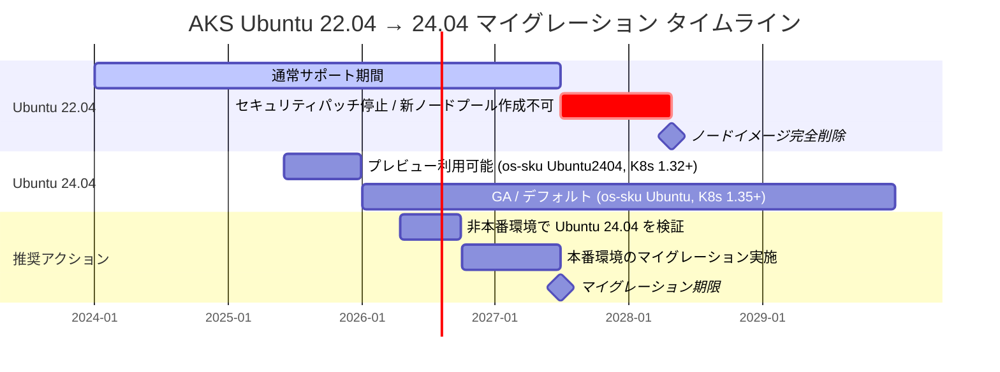
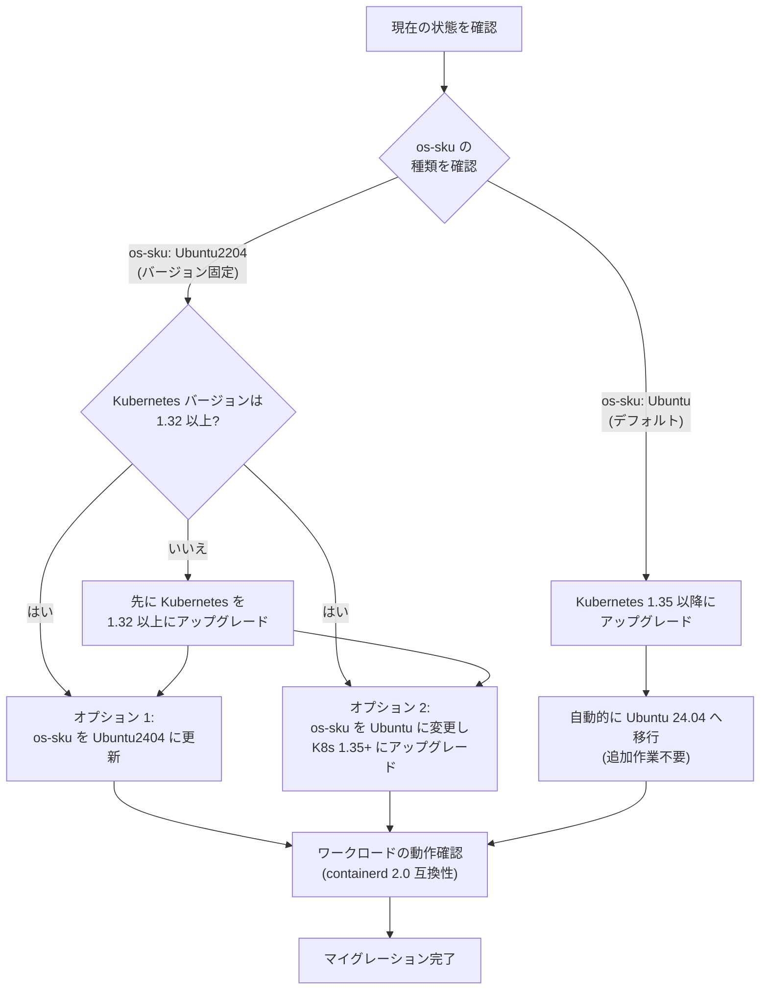

# Azure Kubernetes Service (AKS): Ubuntu 22.04 サポート終了

**リリース日**: 2026-04-16

**サービス**: Azure Kubernetes Service (AKS)

**機能**: Ubuntu 22.04 サポート終了 (Retirement of Ubuntu 22.04)

**ステータス**: Retirement

[このアップデートのインフォグラフィックを見る](https://takech9203.github.io/azure-news-summary/20260416-aks-ubuntu-2204-retirement.html)

## 概要

Microsoft は、Azure Kubernetes Service (AKS) における Ubuntu 22.04 のサポートを 2027 年 6 月 30 日に終了することを発表した。現在 Ubuntu 22.04 ベースのノード イメージを使用している AKS クラスターは、サービス中断を回避するために、この期日までに Ubuntu 24.04 以降へ移行する必要がある。

Ubuntu 22.04 は Kubernetes バージョン 1.25 から 1.36 までのノード プールでサポートされているが、2027 年 6 月 30 日以降は新しいノード イメージの提供およびセキュリティ パッチの配信が停止される。さらに、2028 年 4 月 30 日には Ubuntu 22.04 のノード イメージと既存コードが AKS から完全に削除され、スケーリング操作やノードの修復操作が失敗するようになる。

移行先となる Ubuntu 24.04 では、カーネルの更新やセキュリティの改善が含まれており、containerd 2.0 がデフォルトで使用される。Kubernetes バージョン 1.35 以降では `--os-sku Ubuntu` を指定した場合のデフォルト OS が自動的に Ubuntu 24.04 となるため、Kubernetes のアップグレードと合わせて自然に移行することも可能である。

**移行前の状態 (Ubuntu 22.04)**

- Kubernetes バージョン 1.25 ~ 1.34 で `--os-sku Ubuntu` を指定した場合のデフォルト OS
- containerd 1.7.x がデフォルトのコンテナ ランタイム
- 2027 年 6 月 30 日以降はセキュリティ パッチの提供が停止される
- `--os-sku Ubuntu2204` としてバージョン固定での利用も可能だが、Kubernetes 1.36 までのサポート

**移行後の状態 (Ubuntu 24.04)**

- Kubernetes バージョン 1.35 以降で `--os-sku Ubuntu` を指定した場合のデフォルト OS
- containerd 2.0 がデフォルトのコンテナ ランタイム (ワークロードの互換性検証が推奨される)
- カーネル更新およびセキュリティ改善を含む最新の OS 基盤
- `--os-sku Ubuntu2404` として Kubernetes 1.32 以降で明示的に利用可能

## マイグレーション タイムライン



このタイムラインは、Ubuntu 22.04 のサポート終了に向けた主要なマイルストーンと推奨される移行スケジュールを示している。2027 年 6 月 30 日のセキュリティ パッチ停止までに移行を完了し、2028 年 4 月 30 日のノード イメージ完全削除による影響を回避することが重要である。

## マイグレーション フロー



現在使用している OS SKU の種類 (デフォルトの `Ubuntu` またはバージョン固定の `Ubuntu2204`) に応じて、移行パスが異なる。デフォルトの `Ubuntu` を使用している場合は、Kubernetes のバージョン アップグレードに伴い自動的に Ubuntu 24.04 へ移行される。

## サービスアップデートの詳細

### 主要な日程

1. **2027 年 6 月 30 日 - セキュリティ パッチ停止**
   - Ubuntu 22.04 の新しいノード イメージの提供が停止される
   - 新しいノード プールの作成ができなくなる
   - セキュリティ パッチが配信されなくなる
   - LTS (Long Term Support) を Kubernetes 1.33 以降で有効にする場合、事前に Ubuntu 24.04 への移行が必要

2. **2028 年 4 月 30 日 - ノード イメージ完全削除**
   - AKS から Ubuntu 22.04 のノード イメージおよび関連コードが完全に削除される
   - スケーリング操作 (スケール アウト/スケール イン) が失敗する
   - ノードの修復 (remediation) 操作が失敗する
   - ノード イメージのアップグレードが失敗する

### 影響を受ける構成

| 条件 | 影響の有無 |
|------|-----------|
| `--os-sku Ubuntu` + Kubernetes 1.25 ~ 1.34 | 影響あり (デフォルトが Ubuntu 22.04) |
| `--os-sku Ubuntu` + Kubernetes 1.35+ | 影響なし (デフォルトが Ubuntu 24.04) |
| `--os-sku Ubuntu2204` (全 Kubernetes バージョン) | 影響あり (バージョン固定で Ubuntu 22.04) |
| `--os-sku Ubuntu2404` | 影響なし (Ubuntu 24.04) |
| `--os-sku AzureLinux` / `AzureLinux3` | 影響なし (別 OS) |

## 技術仕様

| 項目 | Ubuntu 22.04 (現行) | Ubuntu 24.04 (移行先) |
|------|---------------------|----------------------|
| サポート状態 | 2027/6/30 まで | サポート中 |
| コンテナ ランタイム | containerd 1.7.x | containerd 2.0 |
| 対応 Kubernetes バージョン | 1.25 ~ 1.36 | 1.32 ~ 1.38 |
| デフォルト OS SKU | K8s 1.25 ~ 1.34 | K8s 1.35+ |
| FIPS サポート | サポート | 非サポート (Ubuntu2404 の場合) |
| CVM (Confidential VM) サポート | サポート | 確認が必要 |
| LTS 利用 (K8s 1.33+) | 事前に 24.04 への移行が必要 | サポート |

## 移行手順

### 前提条件

1. Azure CLI がインストールされていること (バージョン 2.82.0 以降を推奨)
2. 対象の AKS クラスターへのアクセス権限があること
3. containerd 2.0 との互換性についてワークロードの検証が完了していること

### 現在の OS SKU とノード イメージの確認

```bash
# クラスターのノード プール情報を確認
az aks nodepool show \
    --resource-group $RESOURCE_GROUP \
    --cluster-name $CLUSTER_NAME \
    --name $NODE_POOL_NAME \
    --query "{osSku:osSku, nodeImageVersion:nodeImageVersion, kubernetesVersion:kubernetesVersion}"
```

### 方法 1: Kubernetes アップグレードによる自動移行 (os-sku が Ubuntu の場合)

```bash
# Kubernetes バージョン 1.35 以降にアップグレード
# os-sku が Ubuntu の場合、自動的に Ubuntu 24.04 がデフォルトになる
az aks upgrade \
    --resource-group $RESOURCE_GROUP \
    --name $CLUSTER_NAME \
    --kubernetes-version 1.35.0
```

### 方法 2: OS SKU の直接更新 (Kubernetes 1.32 以降の場合)

```bash
# ノード プールの OS SKU を Ubuntu2404 に更新
az aks nodepool update \
    --resource-group $RESOURCE_GROUP \
    --cluster-name $CLUSTER_NAME \
    --os-sku Ubuntu2404 \
    --kubernetes-version 1.32.0 \
    --name $NODE_POOL_NAME \
    --node-count 1
```

### 方法 3: OS SKU をデフォルト (Ubuntu) に変更

```bash
# OS SKU を Ubuntu (デフォルト) に変更
# Kubernetes バージョンに応じたデフォルト OS バージョンが適用される
az aks nodepool update \
    --resource-group $RESOURCE_GROUP \
    --cluster-name $CLUSTER_NAME \
    --os-sku Ubuntu \
    --name $NODE_POOL_NAME \
    --node-count 1
```

### 移行後の確認

```bash
# ノード イメージ バージョンの確認
kubectl get nodes -o jsonpath='{range .items[*]}{.metadata.name}{"\t"}{.metadata.labels.kubernetes\.azure\.com\/node-image-version}{"\n"}{end}'

# ノード プールの詳細確認
az aks show \
    --resource-group $RESOURCE_GROUP \
    --name $CLUSTER_NAME \
    --query "agentPoolProfiles[].{Name:name, OsSku:osSku, NodeImageVersion:nodeImageVersion}"
```

## メリット

### ビジネス面

- Ubuntu 24.04 への移行により、最新のセキュリティ パッチが継続的に提供され、コンプライアンス要件を満たし続けることができる
- 計画的な移行により、サポート終了後の緊急対応コストを回避できる
- 最新の OS 基盤を利用することで、将来の Kubernetes バージョン アップグレードがスムーズになる

### 技術面

- containerd 2.0 への移行により、コンテナ ランタイムの最新機能とパフォーマンス改善を享受できる
- カーネル更新による安定性とセキュリティの向上が期待できる
- Kubernetes 1.35 以降の最新機能を利用するための前提条件が整う

## デメリット・制約事項

- Ubuntu 24.04 では containerd 2.0 がデフォルトとなるため、コンテナ ランタイムの動作に依存するワークロードは事前の互換性検証が必要
- `--os-sku Ubuntu2404` を使用する場合、FIPS (Federal Information Processing Standards) がサポートされない
- ノード イメージのダウングレード (Ubuntu 24.04 から Ubuntu 22.04 への戻し) は `--os-sku Ubuntu2204` を指定することで可能だが、Ubuntu 22.04 自体のサポート終了後はロールバック先としても利用できなくなる
- 移行に伴いノードの再イメージ (reimage) が発生するため、ワークロードの一時的な中断が発生する可能性がある

## ユースケース

### ユースケース 1: デフォルト OS SKU を使用している標準的な AKS クラスター

**シナリオ**: `--os-sku Ubuntu` でノード プールを作成し、Kubernetes 1.33 を実行している AKS クラスターを運用している。

**移行方法**: Kubernetes バージョンを 1.35 以降にアップグレードする。`--os-sku Ubuntu` を使用しているため、Kubernetes アップグレード時に自動的に Ubuntu 24.04 がデフォルトとして適用される。

**効果**: Kubernetes のバージョン アップグレードの一環として OS 移行が完了するため、追加の移行作業が不要。

### ユースケース 2: バージョン固定 OS SKU を使用しているクラスター

**シナリオ**: 特定のアプリケーション要件により `--os-sku Ubuntu2204` を明示的に指定してノード プールを運用している。

**移行方法**: Kubernetes バージョンが 1.32 以上であることを確認し、`az aks nodepool update --os-sku Ubuntu2404` コマンドで OS SKU を直接更新する。

**効果**: Kubernetes バージョンを変更せずに OS のみを移行できるため、アプリケーションへの影響を最小限に抑えられる。

### ユースケース 3: LTS を利用予定のクラスター

**シナリオ**: Kubernetes 1.33 以降で Long Term Support (LTS) を有効にして長期運用を計画している。

**移行方法**: LTS を有効にする前に、ノード プールを Ubuntu 24.04 に移行する必要がある。`--os-sku Ubuntu2404` または `--os-sku Ubuntu` (K8s 1.35+) に更新してから LTS を有効化する。

**効果**: LTS による長期サポートと最新 OS の組み合わせにより、安定した長期運用基盤を確保できる。

## 関連サービス・機能

- **AKS ノード イメージ アップグレード**: ノード プールの OS イメージを最新バージョンに更新する機能。OS SKU の移行後も定期的なノード イメージ アップグレードが推奨される
- **AKS 自動アップグレード**: クラスターの Kubernetes バージョンやノード イメージを自動的にアップグレードする機能。自動アップグレード チャネルの設定により、OS 移行後の継続的な更新を自動化できる
- **AKS Long Term Support (LTS)**: 通常の 1 年間のコミュニティ サポートに加え、さらに 1 年間の延長サポートを提供する機能。Kubernetes 1.33 以降で LTS を利用する場合は Ubuntu 24.04 への移行が前提条件となる
- **Azure Linux (AzureLinux)**: AKS で利用可能な別の Linux ディストリビューション。Ubuntu からの移行先として Azure Linux 3.0 も選択肢の一つとなる

## 参考リンク

- [インフォグラフィック](https://takech9203.github.io/azure-news-summary/20260416-aks-ubuntu-2204-retirement.html)
- [公式アップデート情報](https://azure.microsoft.com/updates?id=557928)
- [Microsoft Learn - AKS OS バージョンのアップグレード](https://learn.microsoft.com/azure/aks/upgrade-os-version)
- [Microsoft Learn - AKS ノード イメージのアップグレード](https://learn.microsoft.com/azure/aks/node-image-upgrade)
- [Microsoft Learn - AKS サポート対象 Kubernetes バージョン](https://learn.microsoft.com/azure/aks/supported-kubernetes-versions)
- [GitHub - Ubuntu 22.04 リタイアメント Issue](https://aka.ms/aks/ubuntu2204-retirement-github)
- [AKS リリース ノート](https://github.com/Azure/AKS/releases)

## まとめ

AKS における Ubuntu 22.04 のサポートが 2027 年 6 月 30 日に終了する。この日以降、セキュリティ パッチの提供と新規ノード プールの作成が停止され、2028 年 4 月 30 日にはノード イメージが完全に削除される。移行先は Ubuntu 24.04 であり、移行方法は現在の OS SKU 設定に応じて異なる。デフォルトの `Ubuntu` OS SKU を使用している場合は Kubernetes 1.35 以降へのアップグレードで自動移行され、バージョン固定の `Ubuntu2204` を使用している場合は `Ubuntu2404` または `Ubuntu` への OS SKU 変更が必要である。Ubuntu 24.04 では containerd 2.0 がデフォルトとなるため、移行前にワークロードの互換性検証を実施することを強く推奨する。移行期限まで約 1 年 2 か月の猶予があるが、非本番環境での検証を早期に開始し、計画的な移行を進めることが望ましい。

---

**タグ**: #Azure #AKS #AzureKubernetesService #Ubuntu #Ubuntu2204 #Ubuntu2404 #Retirement #サポート終了 #マイグレーション #コンテナ #Kubernetes
