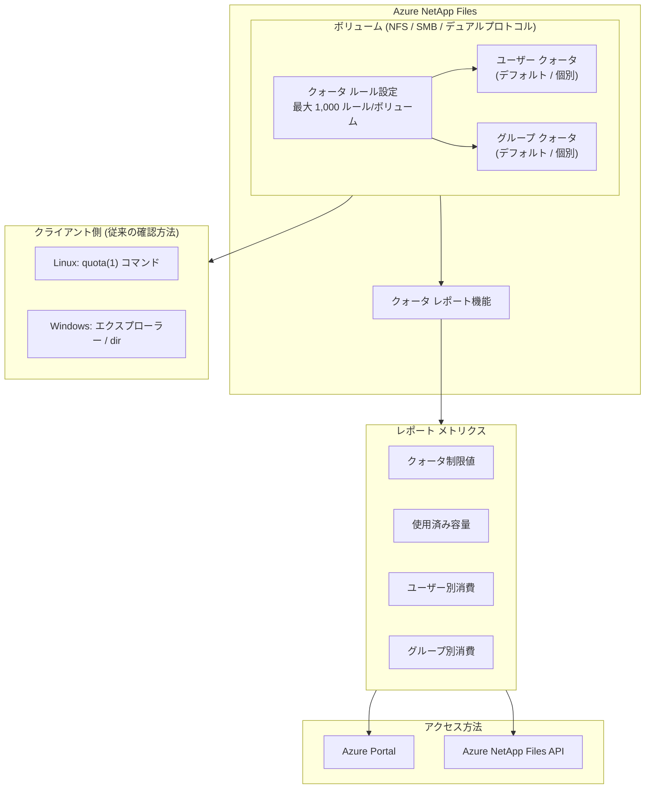

# Azure NetApp Files: ユーザーおよびグループ クォータ レポート

**リリース日**: 2026-04-16

**サービス**: Azure NetApp Files

**機能**: ユーザーおよびグループ クォータ レポート (User and group quota reports)

**ステータス**: In preview

[このアップデートのインフォグラフィックを見る](https://takech9203.github.io/azure-news-summary/20260416-netapp-files-user-group-quota-reports.html)

## 概要

Microsoft Azure は、Azure NetApp Files におけるユーザーおよびグループ クォータ レポート機能のプレビュー提供を発表した。この機能は、NFS、SMB、デュアルプロトコル ボリュームで個別のユーザーおよびグループ クォータを活用している組織に対して、クォータ制限値、使用済み容量などの主要メトリクスに関する明確な可視性を提供する。

従来、Azure NetApp Files のユーザーおよびグループ クォータの使用状況を確認するには、クライアント側のコマンド (Linux の `quota(1)` コマンドや Windows エクスプローラー) を使用する必要があった。特にグループ クォータについては、Azure NetApp Files 側でのレポート機能がサポートされておらず、グループ クォータ上限に達したことを知る手段は `Disk quota exceeded` エラーのみであった。本アップデートにより、Azure Portal や API を通じてクォータの設定状況と消費状況を一元的に確認できるようになる。

この機能は、ストレージ管理者がボリューム内の容量消費をユーザーおよびグループ単位で監視し、容量の計画やガバナンスを効率化するために設計されている。

**アップデート前の課題**

- ユーザー クォータの使用状況の確認がクライアント側のコマンド (Linux `quota(1)` や Windows エクスプローラー) に依存しており、一元的な管理が困難であった
- グループ クォータのレポート機能が Azure NetApp Files 側でサポートされておらず、`Disk quota exceeded` エラーが発生して初めて上限到達が判明する状態であった
- 複数のボリュームやユーザーにまたがるクォータ消費状況を俯瞰的に把握する手段がなかった

**アップデート後の改善**

- クォータ制限値と使用済み容量を Azure 側のレポートとして一元的に確認可能になった
- グループ クォータの設定状況と消費状況も可視化されるようになった
- NFS、SMB、デュアルプロトコル ボリュームのすべてでクォータ レポートが利用可能になった

## アーキテクチャ図

Azure NetApp Files のボリュームに設定されたユーザー クォータおよびグループ クォータの情報が、新しいクォータ レポート機能を通じて Azure Portal や API から確認できる構成を示している。従来のクライアント側での確認方法に加え、Azure 側での一元管理が可能になった。

## サービスアップデートの詳細

### 主要機能

1. **クォータ メトリクスの可視化**
   - クォータ制限値、使用済み容量などの主要メトリクスを Azure 側のレポートとして提供する
   - ユーザー単位およびグループ単位での容量消費状況を確認できる

2. **マルチプロトコル対応**
   - NFS ボリューム、SMB ボリューム、デュアルプロトコル ボリュームのすべてでクォータ レポートを利用できる
   - ただし、グループ クォータ自体は SMB およびデュアルプロトコル ボリュームでは設定不可のため、グループ クォータ レポートは NFS ボリュームのみが対象となる

3. **デフォルトおよび個別クォータへの対応**
   - デフォルト ユーザー クォータ (全ユーザーに一律適用)
   - 個別ユーザー クォータ (UID または SID で指定した特定ユーザー)
   - デフォルト グループ クォータ (全グループに一律適用)
   - 個別グループ クォータ (GID で指定した特定グループ)

## 技術仕様

| 項目 | 詳細 |
|------|------|
| 対象サービス | Azure NetApp Files |
| ステータス | パブリック プレビュー |
| 対象プロトコル | NFS、SMB、デュアルプロトコル |
| ユーザー クォータ ターゲット (NFS) | UNIX UID (0 ~ 4294967295) |
| ユーザー クォータ ターゲット (SMB) | Windows SID |
| グループ クォータ ターゲット | UNIX GID (NFS ボリュームのみ) |
| クォータ ルール上限 | ボリュームあたり最大 1,000 ルール |
| クォータ制限値の範囲 | 1 ~ 1,125,899,906,842,620 (KiB / MiB / GiB / TiB 単位で指定) |
| 最小クォータ制限値 | 4 KiB |
| クォータ レポート ポート | クライアントからのレポート取得にはポート 4049/UDP へのアクセスが必要 |
| ラージ ボリュームの注意点 | クォータ制限のハードリミット超過が最大 5% または 1 GB (いずれか小さい方) まで発生し得る |
| CRR/CZR レプリケーション | クォータ ルールはソースからデスティネーションに自動同期される |

## 設定方法

### 前提条件

1. Azure NetApp Files アカウントおよび容量プールが作成済みであること
2. 対象ボリュームが作成済みであること
3. NSG (ネットワーク セキュリティ グループ) を使用している場合、Standard ネットワーク機能の委任サブネットでポート 4049/UDP へのアクセスが許可されていること

### Azure Portal

1. Azure Portal にサインインし、対象のボリュームに移動する
2. ナビゲーション ペインで **User and group quotas** を選択する
3. **Add** をクリックして新しいクォータ ルールを作成する
4. 以下の項目を設定する:
   - **Quota rule name**: ボリューム内で一意の名前
   - **Quota type**: `Default user quota`、`Default group quota`、`Individual user quota`、`Individual group quota` のいずれかを選択
   - **Quota target**: 個別クォータの場合、UID (NFS) または SID (SMB) を指定。デフォルト クォータの場合は空欄
   - **Quota limit**: 制限値を KiB / MiB / GiB / TiB 単位で指定
5. **Create** をクリックして作成する
6. 作成後、クォータ レポートで各ユーザーおよびグループの使用状況を確認できる

## メリット

### ビジネス面

- ストレージ管理者が各ユーザーおよびグループの容量消費を Azure Portal から一元的に監視でき、管理工数が削減される
- クォータの使用状況を定量的に把握できるため、容量計画やコスト最適化の判断材料として活用できる
- 特定のユーザーやグループによる過剰な容量消費を早期に検知し、対策を講じることが可能になる

### 技術面

- 従来クライアント側でしか確認できなかったクォータ情報を API 経由で取得できるため、監視やアラートの自動化が容易になる
- グループ クォータの消費状況が明示的にレポートされるようになり、`Disk quota exceeded` エラー発生前に対策を取ることが可能になる
- NFS、SMB、デュアルプロトコルのすべてのボリューム タイプで統一されたレポート体験が提供される

## デメリット・制約事項

- 本機能は現時点ではパブリック プレビューであり、一般提供 (GA) ではない
- グループ クォータ自体が SMB およびデュアルプロトコル ボリュームではサポートされていないため、これらのボリュームではグループ クォータ レポートは利用できない
- ラージ ボリュームでは、クォータ制限のハードリミットに対して最大 5% または 1 GB まで超過が発生し得る
- ラージ ボリュームでクォータ使用量がリミットを下回った場合でも、クォータ消費型のファイル操作再開に最大 5 秒の遅延が生じる場合がある
- クライアント側でのレポート取得にはポート 4049/UDP へのアクセスが必要であり、NSG 設定の確認が必要
- CRR/CZR デスティネーション ボリュームではレプリケーション関係を削除するまでクォータ ルールの作成・更新・削除ができない

## ユースケース

### ユースケース 1: エンタープライズ ファイル サーバーの容量管理

**シナリオ**: 大企業で数百名のユーザーが Azure NetApp Files 上の NFS ボリュームを共有ファイル ストレージとして使用しており、各部門やユーザーに容量制限を設ける必要がある。

**効果**: クォータ レポートにより、各ユーザーのクォータ制限値と実際の使用量を Azure Portal から一覧で確認できる。容量不足が発生する前に、使用量の多いユーザーを特定し、クォータ調整やボリューム拡張の判断を迅速に行うことが可能になる。

### ユースケース 2: マルチテナント環境でのリソース分離

**シナリオ**: ISV がデュアルプロトコル ボリュームを使用して複数の顧客向けにストレージを提供しており、各テナント (ユーザー) の使用量を制限・監視する必要がある。

**効果**: ユーザー クォータ レポートを活用して、各テナントの容量消費状況を定期的に確認し、容量超過による他テナントへの影響を防止できる。

### ユースケース 3: HPC / データ分析環境のクォータ監視

**シナリオ**: HPC ワークロードでは大量のデータを一時的に書き込むジョブが実行されるため、ユーザー単位でのクォータ制御と使用状況の監視が必要である。

**効果**: グループ クォータ レポートにより、プロジェクト チーム単位での容量消費を把握し、チーム間の公平なリソース配分を実現できる。

## 料金

クォータ レポート機能自体の追加料金に関する情報は現時点で公開されていない。Azure NetApp Files の利用料金は、容量プールのサービス レベル (Standard / Premium / Ultra / Flexible) とプロビジョニングされた容量に基づく。

## 関連サービス・機能

- **Azure NetApp Files ボリューム クォータ**: ボリューム全体のストレージ容量の上限を設定する機能。ユーザー/グループ クォータと組み合わせることで、ボリューム レベルとユーザー/グループ レベルの両方で容量制御が可能
- **Azure NetApp Files クロスリージョン レプリケーション (CRR)**: クォータ ルールがソースからデスティネーション ボリュームに自動同期される
- **Azure NetApp Files クロスゾーン レプリケーション (CZR)**: CRR と同様にクォータ ルールの自動同期がサポートされる
- **Azure NetApp Files ラージ ボリューム**: 最大 1 PiB のボリュームをサポートするが、クォータ制限の超過挙動に特有の注意点がある

## 参考リンク

- [インフォグラフィック](https://takech9203.github.io/azure-news-summary/20260416-netapp-files-user-group-quota-reports.html)
- [公式アップデート情報](https://azure.microsoft.com/updates?id=558483)
- [Microsoft Learn ドキュメント - ユーザーおよびグループ クォータの概要](https://learn.microsoft.com/azure/azure-netapp-files/default-individual-user-group-quotas-introduction)
- [Microsoft Learn ドキュメント - クォータの管理](https://learn.microsoft.com/azure/azure-netapp-files/manage-default-individual-user-group-quotas)
- [Microsoft Learn ドキュメント - リソース制限](https://learn.microsoft.com/azure/azure-netapp-files/azure-netapp-files-resource-limits)
- [料金ページ](https://azure.microsoft.com/pricing/details/netapp/)

## まとめ

Azure NetApp Files のユーザーおよびグループ クォータ レポート機能がパブリック プレビューとして提供開始された。この機能により、NFS、SMB、デュアルプロトコル ボリュームにおけるクォータ制限値と使用済み容量を Azure Portal や API から一元的に確認できるようになる。従来はクライアント側のコマンドに依存していたクォータ消費状況の把握が Azure 側で可能になったことで、ストレージ管理者の運用効率が向上する。特にグループ クォータについては、これまで明示的なレポートがなかったため、容量管理の可視性が大幅に改善される。エンタープライズ ファイル サーバー、マルチテナント環境、HPC ワークロードなど、クォータ管理が重要な環境での活用が推奨される。現時点ではプレビュー段階のため、本番運用での利用は GA 後を待つことが望ましい。

---

**タグ**: #Azure #AzureNetAppFiles #Storage #QuotaManagement #NFS #SMB #クォータレポート #容量管理 #プレビュー
