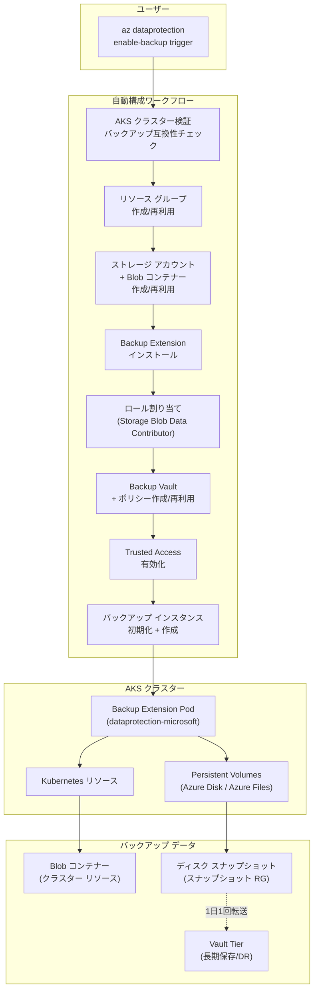

# Azure Backup: AKS バックアップを単一の Azure CLI コマンドで構成

**リリース日**: 2026-04-17

**サービス**: Azure Backup / Azure Kubernetes Service (AKS)

**機能**: AKS バックアップの単一コマンド構成 (Configure AKS backup using a single Azure CLI command)

**ステータス**: Launched (GA)

[このアップデートのインフォグラフィックを見る](https://takech9203.github.io/azure-news-summary/20260417-aks-backup-single-cli-command.html)

## 概要

Microsoft は、Azure Kubernetes Service (AKS) クラスターのバックアップ構成を単一の Azure CLI コマンドで完了できる簡素化されたエクスペリエンスの一般提供 (GA) を発表した。従来、CLI を使用して AKS クラスターのバックアップを有効化するには、ストレージ アカウントの作成、Backup Extension のインストール、Backup Vault の作成、バックアップ ポリシーの作成、Trusted Access の設定、ロール割り当て、バックアップ インスタンスの初期化など、多数の手動ステップを順番に実行する必要があった。

本アップデートにより、`az dataprotection enable-backup trigger` コマンドを実行するだけで、これらすべての前提条件の構成とバックアップの有効化が自動的に実行されるようになった。さらに、定義済みのバックアップ戦略 (Week / Month / DisasterRecovery / Custom) を選択でき、構成ファイルによる既存リソースの再利用やカスタム設定の適用も可能である。

この機能は、AKS クラスターのデータ保護を迅速に導入したい運用チームや、IaC (Infrastructure as Code) パイプラインにバックアップ構成を組み込みたいプラットフォーム エンジニアにとって、大幅な効率化をもたらす。

**アップデート前の課題**

- AKS バックアップの CLI 構成に 7 つ以上の手動ステップ (ストレージ アカウント作成、Blob コンテナー作成、Backup Extension インストール、ロール割り当て、Trusted Access 設定、Backup Vault/ポリシー作成、バックアップ インスタンス初期化・検証・作成) が必要であった
- 各ステップで異なるコマンドとパラメーターを使用する必要があり、構成ミスのリスクが高かった
- ロール割り当てや Trusted Access の設定漏れにより、バックアップの検証が失敗するケースが多かった
- 自動化スクリプトの作成・保守に工数がかかっていた

**アップデート後の改善**

- 単一コマンド (`az dataprotection enable-backup trigger`) でバックアップ構成のすべてのステップが自動実行される
- AKS クラスターの検証、リソースの作成または再利用、Extension のインストール、Trusted Access の設定、バックアップ インスタンスの作成がワンステップで完了する
- 定義済みバックアップ戦略 (Week / Month / DisasterRecovery) を選択するだけで、適切なポリシーが自動適用される
- 構成ファイルにより既存のリソース (Backup Vault、ポリシー、ストレージ アカウント) の再利用やタグ付けが可能

## アーキテクチャ図



単一コマンドの実行により、AKS クラスターの検証からバックアップ インスタンスの作成まで全ステップが自動的に実行される。Backup Extension がクラスター内のリソースと Persistent Volume を定期的にバックアップし、Blob コンテナーとスナップショットとして保存する。

## サービスアップデートの詳細

### 主要機能

1. **単一コマンドによるエンドツーエンド構成**
   - `az dataprotection enable-backup trigger` コマンド 1 つで、バックアップに必要なすべてのリソース (ストレージ アカウント、Backup Vault、バックアップ ポリシー、Backup Extension、Trusted Access) の作成・設定が自動的に実行される
   - 既存リソースがある場合はそれを再利用し、不足しているものだけ新規作成される

2. **定義済みバックアップ戦略**
   - `Week` (デフォルト): Operational Store に 7 日間保持
   - `Month`: Operational Store に 30 日間保持
   - `DisasterRecovery`: Operational Store に 7 日間 + Vault Store に 90 日間保持
   - `Custom`: 既存の Backup Vault とポリシーを使用

3. **構成ファイルによるカスタマイズ**
   - JSON 形式の構成ファイルで既存リソースの指定やタグ付けが可能
   - `backupVaultId`、`backupPolicyId`、`storageAccountResourceId`、`blobContainerName`、`backupResourceGroupId`、`tags` を指定できる

4. **従来の手動構成との互換性**
   - 既存の `az dataprotection backup-instance initialize-backupconfig` を使用する従来のアプローチも引き続き利用可能
   - 本機能はあくまで代替アプローチとして提供される

## 技術仕様

| 項目 | 詳細 |
|------|------|
| コマンド | `az dataprotection enable-backup trigger` |
| 必須 CLI 拡張機能 | `dataprotection` バージョン 1.9.0 以上 |
| 対象データソース タイプ | `AzureKubernetesService` |
| サポートされる PV タイプ | CSI ドライバー ベースの Azure Disk、Azure Files (SMB) |
| バックアップ頻度 | 4 時間 / 6 時間 / 8 時間 / 12 時間 / 24 時間 |
| Operational Tier 最大保持期間 | Azure Disk: 360 日、Azure Files: 30 日 |
| Vault Tier 対象 | Azure Disk ベースのみ (最大 100 ディスク、1 TB/ディスク) |
| Backup Vault と AKS クラスターの関係 | 同一リージョン内 (サブスクリプションは異なっていても可、同一テナント内) |
| Azure CLI バージョン | 2.41.0 以上 |
| Terraform バージョン | 3.99.0 以上 (Terraform を使用する場合) |

## 設定方法

### 前提条件

1. Azure CLI がインストール済みで、`dataprotection` 拡張機能のバージョンが 1.9.0 以上であること
2. サブスクリプションで `Microsoft.KubernetesConfiguration`、`Microsoft.DataProtection`、`Microsoft.ContainerService` リソース プロバイダーが登録済みであること
3. AKS クラスターがシステム割り当てまたはユーザー割り当てのマネージド ID を使用していること (サービス プリンシパルは非対応)
4. AKS クラスターで CSI ドライバーとスナップショットが有効であること

### Azure CLI

```bash
# dataprotection 拡張機能のインストール (初回)
az extension add -n dataprotection

# dataprotection 拡張機能のアップグレード (既存の場合)
az extension add -n dataprotection --upgrade

# バージョン確認 (1.9.0 以上が必要)
az extension show -n dataprotection --query version -o tsv
```

```bash
# 基本的な使用方法: 単一コマンドでバックアップを構成
az dataprotection enable-backup trigger \
  --datasource-type AzureKubernetesService \
  --datasource-id /subscriptions/<subscription-id>/resourceGroups/<resource-group>/providers/Microsoft.ContainerService/managedClusters/<aks-cluster-name>
```

```bash
# バックアップ戦略を指定して構成 (例: DisasterRecovery)
az dataprotection enable-backup trigger \
  --datasource-type AzureKubernetesService \
  --datasource-id /subscriptions/<subscription-id>/resourceGroups/<resource-group>/providers/Microsoft.ContainerService/managedClusters/<aks-cluster-name> \
  --backup-strategy DisasterRecovery
```

```bash
# 構成ファイルを使用してカスタマイズ
az dataprotection enable-backup trigger \
  --datasource-type AzureKubernetesService \
  --datasource-id /subscriptions/<subscription-id>/resourceGroups/<resource-group>/providers/Microsoft.ContainerService/managedClusters/<aks-cluster-name> \
  --backup-strategy Custom \
  --backup-configuration-file @config.json
```

構成ファイルの例 (`config.json`):

```json
{
  "tags": {
    "Owner": "azure@microsoft.com",
    "Environment": "Production"
  }
}
```

### 従来の手動構成 (参考)

従来の手動構成では、以下のステップを順番に実行する必要があった:

```bash
# 1. ストレージ アカウントの作成
az storage account create --name $storageaccount --resource-group $rg --location $region --sku Standard_LRS

# 2. Blob コンテナーの作成
az storage container create --name $blobcontainer --account-name $storageaccount --auth-mode login

# 3. Backup Extension のインストール
az k8s-extension create --name azure-aks-backup --extension-type microsoft.dataprotection.kubernetes \
  --scope cluster --cluster-type managedClusters --cluster-name $akscluster \
  --resource-group $rg --release-train stable \
  --configuration-settings blobContainer=$blobcontainer storageAccount=$storageaccount \
  storageAccountResourceGroup=$rg storageAccountSubscriptionId=$subscriptionId

# 4. ロール割り当て (Storage Blob Data Contributor)
az role assignment create --assignee-object-id $(az k8s-extension show ...) \
  --role 'Storage Blob Data Contributor' --scope /subscriptions/.../storageAccounts/$storageaccount

# 5. Trusted Access の有効化
az aks trustedaccess rolebinding create --cluster-name $akscluster --name backuprolebinding \
  --resource-group $rg --roles Microsoft.DataProtection/backupVaults/backup-operator \
  --source-resource-id /subscriptions/.../BackupVaults/$backupvault

# 6. Backup Vault の作成
az dataprotection backup-vault create --resource-group $rg --vault-name $vault --location $region \
  --type SystemAssigned --storage-settings datastore-type="VaultStore" type="LocallyRedundant"

# 7. バックアップ ポリシーの作成
az dataprotection backup-policy create -g $rg --vault-name $vault -n $policy --policy policy.json

# 8. バックアップ構成の初期化
az dataprotection backup-instance initialize-backupconfig --datasource-type AzureKubernetesService > aksbackupconfig.json

# 9. バックアップ インスタンスの初期化
az dataprotection backup-instance initialize --datasource-id ... --datasource-type AzureKubernetesService \
  --policy-id ... --backup-configuration ./aksbackupconfig.json > backupinstance.json

# 10. 検証とバックアップ インスタンスの作成
az dataprotection backup-instance validate-for-backup --backup-instance ./backupinstance.json --ids ...
az dataprotection backup-instance create --backup-instance backupinstance.json --resource-group $rg --vault-name $vault
```

## メリット

### ビジネス面

- バックアップ構成にかかる時間が大幅に短縮され (10 以上のステップから 1 コマンドへ)、運用チームの工数が削減される
- 構成ミスのリスクが低減し、バックアップの信頼性が向上する
- 定義済み戦略により、組織のデータ保護ポリシーに沿った構成を容易に適用できる
- CI/CD パイプラインへのバックアップ構成の組み込みが容易になり、プラットフォーム エンジニアリングの自動化が促進される

### 技術面

- 単一コマンドで Backup Extension のインストール、Trusted Access の設定、ロール割り当てなどの複雑な依存関係が自動的に解決される
- 既存リソースの検出と再利用が自動化されるため、冪等性のある構成が実現できる
- 定義済み戦略 (Week / Month / DisasterRecovery) により、ベストプラクティスに基づいたバックアップ ポリシーが適用される
- 構成ファイルによるカスタマイズが可能で、既存の Backup Vault やストレージ アカウントの再利用に柔軟に対応できる

## デメリット・制約事項

- `dataprotection` CLI 拡張機能のバージョン 1.9.0 以上が必要であり、古い環境ではアップグレードが必要
- Azure Files (SMB) ベースの Persistent Volume のバックアップは現時点で Azure Portal のみの対応であり、CLI での構成はサポートされていない
- Vault Tier へのバックアップは Azure Disk ベースの PV のみが対象で、1 ディスクあたり 1 TB 以下、バックアップ インスタンスあたり 100 ディスク以下の制限がある
- プライベート仮想ネットワーク内の AKS クラスターでは、ストレージ アカウントへのプライベート エンドポイントの追加構成が別途必要となる場合がある
- ネットワーク分離された AKS クラスターはサポートされていない
- Backup Extension は x86 ベースのプロセッサで Ubuntu または Azure Linux を使用するノード プールにのみインストール可能 (Windows ノードプール、ARM64 ノードプールは非対応)
- Velero ベースのバックアップ ソリューションとの併用は推奨されない

## ユースケース

### ユースケース 1: 新規 AKS クラスターのバックアップ迅速導入

**シナリオ**: 開発チームが新しい AKS クラスターをデプロイし、すぐにバックアップ保護を有効化したい。

**実装例**:

```bash
# クラスター作成直後にバックアップを有効化
az dataprotection enable-backup trigger \
  --datasource-type AzureKubernetesService \
  --datasource-id /subscriptions/00000000-0000-0000-0000-000000000000/resourceGroups/myapp-rg/providers/Microsoft.ContainerService/managedClusters/myapp-aks \
  --backup-strategy Week
```

**効果**: バックアップ構成に数十分かかっていた作業が、単一コマンドの実行で完了する。ストレージ アカウント、Backup Vault、Backup Extension などの必要リソースがすべて自動作成される。

### ユースケース 2: DR 対応のバックアップ構成

**シナリオ**: エンタープライズ環境で、リージョン障害に備えた災害復旧 (DR) 対応のバックアップを構成する必要がある。

**実装例**:

```bash
# DisasterRecovery 戦略でバックアップを構成
az dataprotection enable-backup trigger \
  --datasource-type AzureKubernetesService \
  --datasource-id /subscriptions/00000000-0000-0000-0000-000000000000/resourceGroups/prod-rg/providers/Microsoft.ContainerService/managedClusters/prod-aks \
  --backup-strategy DisasterRecovery
```

**効果**: Operational Store への 7 日間保持に加え、Vault Store への 90 日間保持が自動的に構成され、Geo 冗長バックアップによるクロス リージョン リストアが可能になる。

### ユースケース 3: CI/CD パイプラインへの統合

**シナリオ**: プラットフォーム チームが Terraform や GitHub Actions で AKS クラスターのプロビジョニングを自動化しており、バックアップ構成もパイプラインに組み込みたい。

**実装例**:

```bash
# 構成ファイルで既存リソースを指定し、タグを適用
az dataprotection enable-backup trigger \
  --datasource-type AzureKubernetesService \
  --datasource-id /subscriptions/00000000-0000-0000-0000-000000000000/resourceGroups/platform-rg/providers/Microsoft.ContainerService/managedClusters/platform-aks \
  --backup-strategy Custom \
  --backup-configuration-file @backup-config.json
```

**効果**: 既存の Backup Vault やストレージ アカウントを再利用しつつ、組織のタグ付けポリシーに準拠した構成を自動化パイプラインから一貫して適用できる。

## 料金

AKS バックアップの料金体系は以下の 3 つの要素で構成される。単一コマンド機能自体に追加料金はない。

| 項目 | 説明 |
|------|------|
| Protected Instance 料金 | Namespace 単位の月額課金。バックアップ構成で保護された Namespace ごとに課金される |
| スナップショット料金 | Azure Disk スナップショットと Azure Files スナップショットの標準ストレージ料金 |
| Backup Storage 料金 | Vault Tier に保存されたデータの容量 (GB) と冗長性タイプに基づく料金 |

詳細な料金については [Azure Backup 料金ページ](https://azure.microsoft.com/pricing/details/backup/) を参照。

## 利用可能リージョン

AKS バックアップは多数の Azure リージョンで利用可能である。Operational Tier と Vault Tier の両方をサポートするリージョンには、Australia East、Canada Central、East US、East US 2、West US 2、West US 3、West Europe、North Europe、Japan East、Southeast Asia、UK South などの主要リージョンが含まれる。Operational Tier のみをサポートするリージョン (China East 2/3、US Gov など) もある。

詳細なリージョン一覧は [AKS バックアップ サポート マトリックス](https://learn.microsoft.com/azure/backup/azure-kubernetes-service-cluster-backup-support-matrix) を参照。

## 関連サービス・機能

- **Azure Backup**: AKS バックアップの基盤となるサービス。Backup Vault、バックアップ ポリシー、リカバリー ポイントの管理を提供する
- **Azure Kubernetes Service (AKS)**: バックアップ対象のコンテナー オーケストレーション サービス。Trusted Access 機能により Backup Vault との安全な通信を実現する
- **Backup Extension**: AKS クラスター内にインストールされる拡張機能。バックアップとリストア操作を実行する。`dataprotection-microsoft` Namespace に展開される
- **Azure Disk / Azure Files**: バックアップ対象の Persistent Volume を提供するストレージ サービス。CSI ドライバーベースのボリュームが対象
- **Azure Resiliency**: バックアップ インスタンスの一元的な監視・管理・ガバナンスを提供するダッシュボード

## 参考リンク

- [インフォグラフィック](https://takech9203.github.io/azure-news-summary/20260417-aks-backup-single-cli-command.html)
- [公式アップデート情報](https://azure.microsoft.com/updates?id=560521)
- [Microsoft Learn - AKS バックアップの概要](https://learn.microsoft.com/azure/backup/azure-kubernetes-service-backup-overview)
- [Microsoft Learn - Azure CLI を使用した AKS バックアップの構成](https://learn.microsoft.com/azure/backup/azure-kubernetes-service-cluster-backup-using-cli)
- [Microsoft Learn - AKS バックアップの構成 (Azure Portal)](https://learn.microsoft.com/azure/backup/azure-kubernetes-service-cluster-backup)
- [Microsoft Learn - AKS バックアップ サポート マトリックス](https://learn.microsoft.com/azure/backup/azure-kubernetes-service-cluster-backup-support-matrix)
- [Azure CLI リファレンス - az dataprotection enable-backup](https://learn.microsoft.com/cli/azure/dataprotection/enable-backup?view=azure-cli-latest)
- [料金ページ](https://azure.microsoft.com/pricing/details/backup/)

## まとめ

AKS バックアップの単一 CLI コマンド構成が一般提供 (GA) となった。従来 10 以上の手動ステップが必要であった AKS クラスターのバックアップ構成が、`az dataprotection enable-backup trigger` コマンド 1 つで完了するようになった。ストレージ アカウントの作成、Backup Extension のインストール、Trusted Access の設定、Backup Vault/ポリシーの作成、バックアップ インスタンスの初期化といったすべてのステップが自動化される。定義済みバックアップ戦略 (Week / Month / DisasterRecovery / Custom) の選択と構成ファイルによるカスタマイズにも対応しており、運用チームの初期構成工数を大幅に削減する。AKS クラスターのデータ保護をまだ導入していない環境では、この簡素化されたアプローチによる迅速な導入を推奨する。既に手動構成を使用している環境でも、新規クラスターや CI/CD パイプラインでは本機能の活用を検討するとよい。利用には `dataprotection` CLI 拡張機能バージョン 1.9.0 以上が必要であるため、事前のアップグレードを確認すること。

---

**タグ**: #Azure #AzureBackup #AKS #AzureKubernetesService #CLI #Kubernetes #コンテナー #バックアップ #データ保護 #GA
