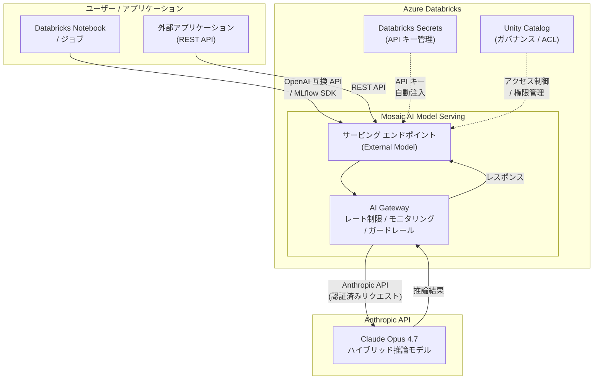

# Azure Databricks: Anthropic Claude Opus 4.7 の一般提供開始

**リリース日**: 2026-04-17

**サービス**: Azure Databricks

**機能**: Anthropic Claude Opus 4.7 on Azure Databricks (Generally Available)

**ステータス**: Launched (GA)

[このアップデートのインフォグラフィックを見る](https://takech9203.github.io/azure-news-summary/20260417-databricks-claude-opus-4-7.html)

## 概要

Microsoft は、Azure Databricks の Mosaic AI Model Serving を通じて Anthropic Claude Opus 4.7 が一般提供 (GA) されたことを発表した。Claude Opus 4.7 は Anthropic が提供する最も高性能なハイブリッド推論モデルであり、複雑な情報抽出やエージェント型推論タスクにおいて優れたパフォーマンスを発揮する。

Azure Databricks の Mosaic AI Model Serving は、外部モデル (External Models) 機能を通じて、OpenAI、Anthropic、Cohere などのサードパーティ LLM プロバイダーのモデルを統一的なインターフェースで提供・管理できるサービスである。今回のアップデートにより、Claude Opus 4.7 が外部モデルとしてサポート対象に追加され、Azure Databricks 上のワークロードから直接利用可能となった。

これにより、Azure Databricks ユーザーは、既存のデータパイプラインやアナリティクス ワークフロー内から Claude Opus 4.7 の高度な推論能力を活用でき、API キーの一元管理、アクセス制御、使用量モニタリングなどのガバナンス機能も併せて利用できる。

**アップデート前の課題**

- Azure Databricks 環境から Anthropic Claude Opus 4.7 を利用するには、別途 Anthropic API への接続を独自に構築・管理する必要があった
- API キーの管理がアプリケーションやユーザーごとに分散し、セキュリティリスクが高まっていた
- LLM の使用量やコストのモニタリングを個別に実装する必要があった
- 複数の LLM プロバイダーを利用する際、それぞれ異なる API 仕様に対応する必要があった

**アップデート後の改善**

- Mosaic AI Model Serving の統一インターフェースを通じて Claude Opus 4.7 に直接アクセスできるようになった
- Databricks Secrets による API キーの一元的かつ安全な管理が可能になった
- AI Gateway によるレート制限、使用量トラッキング、ガードレールの適用が可能になった
- OpenAI 互換の REST API で統一されたエンドポイントから Claude Opus 4.7 を呼び出せるようになった

## アーキテクチャ図



Azure Databricks の Mosaic AI Model Serving が統一的なプロキシとして機能し、ユーザーからのリクエストを AI Gateway を経由して Anthropic の Claude Opus 4.7 に転送する。API キーは Databricks Secrets で安全に管理され、Unity Catalog によるアクセス制御が適用される。

## サービスアップデートの詳細

### 主要機能

1. **Claude Opus 4.7 のハイブリッド推論**
   - Anthropic の最上位モデルである Claude Opus 4.7 は、通常の応答と深い推論 (extended thinking) を組み合わせたハイブリッド推論モデルである
   - 複雑な情報抽出、多段階のエージェント型推論、高度な分析タスクにおいて優れた精度を実現する

2. **Mosaic AI Model Serving による統一的なモデル提供**
   - External Models 機能を通じて、Claude Opus 4.7 を Databricks のサービング エンドポイントとして公開できる
   - OpenAI 互換の REST API を通じてアクセスでき、既存の OpenAI SDK やクライアント ライブラリをそのまま使用可能

3. **AI Gateway によるガバナンス**
   - レート制限: エンドポイントごとの呼び出し回数やトークン数の制限を設定可能
   - 使用量トラッキング: モデルの利用状況をリアルタイムで監視
   - ガードレール: 入力・出力に対する安全性フィルタリングの適用が可能

4. **一元的な資格情報管理**
   - Anthropic API キーを Databricks Secrets に安全に格納し、エンドポイント設定で参照する方式
   - ユーザーやアプリケーション側に API キーを直接公開する必要がない

## 技術仕様

| 項目 | 詳細 |
|------|------|
| モデル名 | Claude Opus 4.7 (claude-opus-4-7) |
| プロバイダー | Anthropic |
| モデルタイプ | ハイブリッド推論 (Hybrid Reasoning) モデル |
| サポートタスク | `llm/v1/chat`、`llm/v1/completions` |
| API 形式 | OpenAI 互換 REST API |
| 認証方式 | Databricks Secrets 経由の Anthropic API キー |
| ストリーミング | 対応 (chat / completions) |
| Function Calling | 対応 (tools パラメーター) |
| データ暗号化 | 保存時 AES-256、転送時 TLS 1.2+ |

## 設定方法

### 前提条件

1. Azure Databricks ワークスペースが利用可能であること
2. Anthropic の API キーを取得済みであること
3. Databricks Secrets にシークレット スコープが作成済みであること
4. エンドポイントの作成・管理に必要な権限 (Serving endpoint ACL) を持っていること

### Python SDK (MLflow Deployments)

```python
import mlflow.deployments

# Databricks デプロイメント クライアントの取得
client = mlflow.deployments.get_deploy_client("databricks")

# Claude Opus 4.7 のサービング エンドポイントを作成
client.create_endpoint(
    name="claude-opus-4-7-chat-endpoint",
    config={
        "served_entities": [
            {
                "name": "claude-opus-4-7",
                "external_model": {
                    "name": "claude-opus-4-7",
                    "provider": "anthropic",
                    "task": "llm/v1/chat",
                    "anthropic_config": {
                        "anthropic_api_key": "{{secrets/my_anthropic_scope/anthropic_api_key}}"
                    }
                }
            }
        ]
    }
)
```

### エンドポイントへのクエリ (OpenAI SDK)

```python
from openai import OpenAI

client = OpenAI(
    api_key="dapi-your-databricks-token",
    base_url="https://<workspace-url>/serving-endpoints"
)

response = client.chat.completions.create(
    model="claude-opus-4-7-chat-endpoint",
    messages=[
        {"role": "user", "content": "Azure Databricks のアーキテクチャについて説明してください。"}
    ],
    temperature=0.7
)
print(response.choices[0].message.content)
```

### Azure Databricks UI

1. Azure Databricks ワークスペースにログイン
2. 左サイドバーの「Serving」を選択
3. 「Create serving endpoint」をクリック
4. エンドポイント名を入力し、「Served entities」で「External model」を選択
5. Provider に「Anthropic」を選択し、Model に「claude-opus-4-7」を指定
6. Anthropic API キーを Databricks Secrets の参照形式で設定
7. 「Create」をクリックしてエンドポイントを作成

## メリット

### ビジネス面

- Azure Databricks のデータ基盤上で最先端の Anthropic モデルを直接利用でき、データとAI の統合活用が促進される
- 複数の LLM プロバイダーを統一的に管理できるため、ベンダーロックインのリスクが低減される
- AI Gateway によるガバナンス機能により、コスト管理やコンプライアンス対応が容易になる
- 複雑な情報抽出やエージェント型推論タスクの自動化により、業務プロセスの効率化が期待できる

### 技術面

- OpenAI 互換 API により、既存のコードベースやツールチェーンを変更せずに Claude Opus 4.7 を導入できる
- Databricks Secrets による資格情報管理で、API キーの漏洩リスクを最小限に抑えられる
- Unity Catalog と統合されたアクセス制御により、きめ細かい権限管理が可能
- AI Playground を通じた対話的なモデル評価・プロンプト調整が可能

## デメリット・制約事項

- Anthropic API の利用料金が別途発生する (Databricks の Model Serving 利用料に加えて)
- 外部モデルであるため、データが Anthropic のインフラストラクチャに送信される点に留意が必要
- External Models がサポートされるリージョンに制限がある
- ネットワーク レイテンシーが Databricks ホスト型モデルと比較して大きくなる可能性がある
- Anthropic API の可用性に依存するため、Anthropic 側の障害が Databricks ワークフローに影響する可能性がある

## ユースケース

### ユースケース 1: 大規模データからの複雑な情報抽出

**シナリオ**: 企業の法務部門が、大量の契約書 PDF から特定の条項やリスク要因を自動的に抽出・分類したい。

**実装例**:

```python
from openai import OpenAI

client = OpenAI(
    api_key="dapi-your-databricks-token",
    base_url="https://<workspace-url>/serving-endpoints"
)

def extract_contract_risks(contract_text: str) -> str:
    response = client.chat.completions.create(
        model="claude-opus-4-7-chat-endpoint",
        messages=[
            {
                "role": "system",
                "content": "あなたは法務の専門家です。契約書の内容からリスク要因を抽出し、JSON形式で分類してください。"
            },
            {"role": "user", "content": contract_text}
        ],
        temperature=0.2
    )
    return response.choices[0].message.content
```

**効果**: Claude Opus 4.7 のハイブリッド推論により、複雑な法的文書の文脈を理解した上での高精度な情報抽出が実現できる。

### ユースケース 2: エージェント型推論による自動分析

**シナリオ**: データ サイエンティストが、Databricks 上のデータレイクに蓄積されたビジネス データに対して、自然言語による質問に基づく多段階の分析を自動実行したい。

**実装例**:

```python
from openai import OpenAI

client = OpenAI(
    api_key="dapi-your-databricks-token",
    base_url="https://<workspace-url>/serving-endpoints"
)

# Function Calling を活用したエージェント型推論
response = client.chat.completions.create(
    model="claude-opus-4-7-chat-endpoint",
    messages=[
        {"role": "user", "content": "過去3ヶ月の売上データから、地域別のトレンドと異常値を分析してください。"}
    ],
    tools=[
        {
            "type": "function",
            "function": {
                "name": "query_sales_data",
                "description": "売上データを SQL で検索する",
                "parameters": {
                    "type": "object",
                    "properties": {
                        "sql_query": {"type": "string", "description": "実行する SQL クエリ"}
                    },
                    "required": ["sql_query"]
                }
            }
        }
    ]
)
```

**効果**: Claude Opus 4.7 のエージェント型推論能力により、複数のツール呼び出しを自律的に連鎖させ、データの取得・分析・可視化を自動化できる。

## 料金

Azure Databricks で Claude Opus 4.7 を利用する場合の料金は、以下の要素で構成される。

| 項目 | 説明 |
|------|------|
| Anthropic API 利用料 | Claude Opus 4.7 のトークン消費量に基づく従量課金 (Anthropic の料金体系に準拠) |
| Databricks Model Serving | サービング エンドポイントの稼働に伴う DBU 消費 (外部モデルの場合はプロキシとしての処理) |
| AI Gateway | AI Gateway の機能利用に対する追加課金 (利用する機能による) |

詳細な料金については [Databricks Model Serving 料金ページ](https://www.databricks.com/product/pricing/model-serving) および [Anthropic 料金ページ](https://www.anthropic.com/pricing) を参照。

## 関連サービス・機能

- **Mosaic AI Model Serving**: Azure Databricks の AI/ML モデル デプロイメント基盤。外部モデルの統一的な管理・提供を実現する
- **AI Gateway**: Model Serving エンドポイントに対するレート制限、使用量モニタリング、ガードレールなどのガバナンス機能を提供する
- **Unity Catalog**: データおよびモデルの統合ガバナンス レイヤー。サービング エンドポイントへのアクセス制御を管理する
- **AI Playground**: Azure Databricks ワークスペース内でのチャット形式による LLM のテスト・プロンプト調整環境
- **AI Functions**: SQL ワークフロー内から LLM を呼び出すための関数群。バッチ推論パイプラインでの活用に適する
- **Azure OpenAI Service**: Azure 上の別の LLM 提供サービス。Databricks External Models では OpenAI プロバイダーとしても利用可能

## 参考リンク

- [インフォグラフィック](https://takech9203.github.io/azure-news-summary/20260417-databricks-claude-opus-4-7.html)
- [公式アップデート情報](https://azure.microsoft.com/updates?id=560590)
- [Microsoft Learn - Mosaic AI Model Serving](https://learn.microsoft.com/azure/databricks/machine-learning/model-serving/)
- [Microsoft Learn - External Models](https://learn.microsoft.com/azure/databricks/generative-ai/external-models/)
- [Microsoft Learn - AI Gateway](https://learn.microsoft.com/azure/databricks/ai-gateway/)
- [Databricks Model Serving 料金](https://www.databricks.com/product/pricing/model-serving)

## まとめ

Azure Databricks の Mosaic AI Model Serving で Anthropic Claude Opus 4.7 が一般提供 (GA) となった。Claude Opus 4.7 は Anthropic の最も高性能なハイブリッド推論モデルであり、複雑な情報抽出やエージェント型推論タスクにおいて特に優れた能力を発揮する。Azure Databricks の External Models 機能を通じて、OpenAI 互換の統一 API で利用でき、Databricks Secrets による安全な API キー管理、AI Gateway によるレート制限・モニタリング・ガードレール、Unity Catalog によるアクセス制御といったガバナンス機能も活用できる。Azure Databricks 上で高度な AI 推論を必要とするワークロード、特にドキュメントからの複雑な情報抽出や多段階のエージェント型分析タスクを検討している場合、Claude Opus 4.7 の導入を推奨する。導入にあたっては、Anthropic API キーの取得と Databricks Secrets への登録、エンドポイントの作成を行うことで、迅速に利用を開始できる。

---

**タグ**: #Azure #AzureDatabricks #Anthropic #ClaudeOpus #AI #MachineLearning #LLM #ModelServing #ExternalModels #GA
