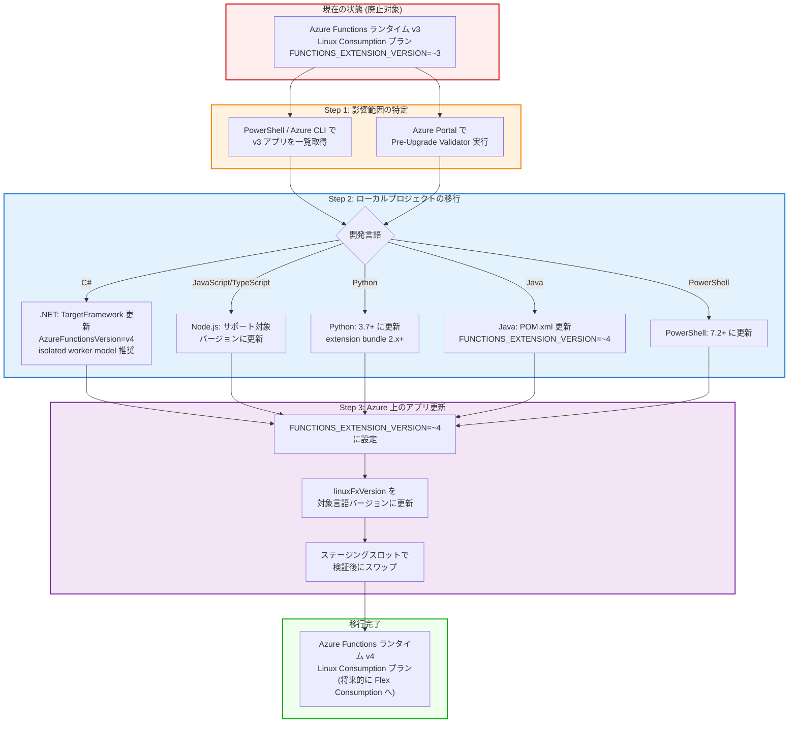

# Azure Functions: ランタイム v3 (Linux Consumption) の実行停止のお知らせ

**リリース日**: 2026-04-17

**サービス**: Azure Functions

**機能**: Azure Functions ランタイム v3 (Linux Consumption プラン) のサポート終了に伴う実行停止

**ステータス**: Retirement

[このアップデートのインフォグラフィックを見る](https://takech9203.github.io/azure-news-summary/20260417-functions-runtime-v3-linux-retirement.html)

## 概要

Microsoft Azure は、Linux Consumption プラン上で動作する Azure Functions ランタイム v3 のアプリケーションが **2026 年 9 月 30 日** 以降に実行を停止することを発表した。Azure Functions ランタイム v3 は 2022 年 12 月 13 日に既に正式に廃止 (End of Life) となっているが、今回のアナウンスでは、レガシーインフラストラクチャへの依存を削減しサポート対象のプラットフォームへの投資を集中する取り組みの一環として、Linux Consumption プランでの v3 ランタイムの強制的な廃止が実施される。

この措置は、サポート終了後もランタイム v3 で動作し続けている Function App に対して適用される。期限後はアプリケーションの実行が完全に停止するため、サービスの中断を避けるには v4 ランタイムへの移行が必須となる。Azure Functions v4 は v3 との後方互換性が高く、多くのアプリケーションでは大きなコード変更なしに移行が可能である。

なお、Linux Consumption プラン自体も 2028 年 9 月 30 日に廃止が予定されており、長期的には Flex Consumption プランへの移行が推奨されている。Windows Consumption プランで動作するアプリケーションは現時点では影響を受けない。

**リタイア前の状況**

- Azure Functions ランタイム v3 は 2022 年 12 月 13 日に正式に廃止済みだが、Linux Consumption プラン上のアプリは引き続き動作していた
- v3 ランタイムはセキュリティパッチやバグ修正を受けておらず、サポート対象外の状態で運用が継続されていた
- レガシーインフラストラクチャへの依存が残存し、プラットフォーム全体の最新化の妨げとなっていた

**リタイア後に必要なアクション**

- Linux Consumption プラン上の Function App を v4 ランタイムに移行し、サービスの継続を確保する
- 使用している言語ランタイムバージョンを v4 がサポートするバージョンに更新する
- 長期的には Linux Consumption プランから Flex Consumption プランへの移行も計画する

## マイグレーションパス



上図は Azure Functions ランタイム v3 から v4 への移行パスを示している。影響範囲の特定、ローカルプロジェクトの移行、Azure 上のアプリ更新の 3 つのステップで構成される。

## サービスアップデートの詳細

### リタイアのタイムライン

| マイルストーン | 日付 | 内容 |
|------------|------|------|
| ランタイム v3 正式廃止 | 2022 年 12 月 13 日 | Azure Functions ランタイム v2.x/v3.x の延長サポート終了 |
| 強制廃止の発表 | 2026 年 4 月 17 日 | Linux Consumption プランでの v3 実行停止を発表 |
| **実行停止日** | **2026 年 9 月 30 日** | Linux Consumption プラン上の v3 アプリが実行停止 |
| Linux Consumption プラン廃止 | 2028 年 9 月 30 日 | Linux Consumption プラン自体の廃止 (Flex Consumption へ移行) |

### 影響を受けるアプリケーション

1. **Linux Consumption プラン上のランタイム v3 Function App**
   - `FUNCTIONS_EXTENSION_VERSION` が `~3` に設定されているアプリ
   - 2026 年 9 月 30 日以降、実行が完全に停止する
   - HTTP トリガー、Timer トリガー、Queue トリガーなど、すべてのトリガータイプが影響を受ける

2. **サポート対象外の言語バージョンを使用しているアプリ**
   - .NET Core 3.1 / .NET 5 (v3 ランタイムのみ対応)
   - Node.js 10 / 12 (v4 ランタイムでは非サポート)
   - Python 3.6 (v4 ランタイムでは非サポート)

### v3 から v4 への主要な破壊的変更

| 項目 | 詳細 |
|------|------|
| Azure Functions Proxies | v4 では非サポート。API Management への移行が必要 |
| AzureWebJobsDashboard | v4 では非サポート。Application Insights を使用 |
| 拡張機能の最小バージョン | v4 では最小バージョン要件が強制される |
| Linux Consumption のタイムアウト | v4 ではデフォルトおよび最大タイムアウトが強制される |
| Key Vault プロバイダー | `Azure.Identity` / `Azure.Security.KeyVault.Secrets` に変更 |
| ホスト ID の一意性 | ストレージアカウントを共有するアプリはホスト ID が一意である必要がある |

## 技術仕様

### 言語バージョン対応表 (v4 ランタイム)

| 言語 | サポート対象バージョン | v3 からの移行時の注意 |
|------|---------------------|---------------------|
| C# (.NET) | .NET 8 (LTS), .NET 9 (STS), .NET 10 (LTS), .NET Framework 4.8 | isolated worker model への移行を推奨。in-process model は .NET 8 まで (2026/11/10 サポート終了) |
| Java | Java 8, 11, 17, 21 | POM.xml の FUNCTIONS_EXTENSION_VERSION を ~4 に更新 |
| Node.js | Node.js 18, 20, 22 | Node.js 10/12 は非サポート。extension bundle 2.x 以上が必要 |
| Python | Python 3.7, 3.8, 3.9, 3.10, 3.11, 3.12 | Python 3.6 は非サポート。extension bundle 2.x 以上が必要 |
| PowerShell | PowerShell 7.2, 7.4 | Linux 上の PowerShell は v4 からサポート |

### アプリケーション設定の変更

| 設定項目 | v3 の値 | v4 の値 |
|---------|--------|--------|
| FUNCTIONS_EXTENSION_VERSION | ~3 | ~4 |
| FUNCTIONS_WORKER_RUNTIME (C# isolated) | dotnet | dotnet-isolated |
| FUNCTIONS_INPROC_NET8_ENABLED (C# in-process) | - | 1 (in-process model で .NET 8 を使用する場合) |
| linuxFxVersion | 言語/バージョンに依存 | 対象言語の最新サポートバージョンに更新 |

## マイグレーション手順

### 前提条件

1. [Azure Functions Core Tools](https://learn.microsoft.com/azure/azure-functions/functions-run-local) v4 をローカルにインストール
2. 使用言語の v4 対応バージョンの開発環境を準備
3. Azure サブスクリプション内の影響を受けるアプリを特定

### 影響を受けるアプリの特定 (PowerShell)

```powershell
$Subscription = '<YOUR SUBSCRIPTION ID>'

Set-AzContext -Subscription $Subscription | Out-Null

$FunctionApps = Get-AzFunctionApp

$AppInfo = @{}

foreach ($App in $FunctionApps)
{
     if ($App.ApplicationSettings["FUNCTIONS_EXTENSION_VERSION"] -like '*3*')
     {
          $AppInfo.Add($App.Name, $App.ApplicationSettings["FUNCTIONS_EXTENSION_VERSION"])
     }
}

$AppInfo
```

### Azure CLI によるランタイムバージョンの更新

```bash
# 現在のランタイムバージョンを確認
az functionapp config appsettings list \
  --name <APP_NAME> \
  --resource-group <RESOURCE_GROUP_NAME> \
  --query "[?name=='FUNCTIONS_EXTENSION_VERSION']"

# ランタイムバージョンを v4 に更新
az functionapp config appsettings set \
  --settings FUNCTIONS_EXTENSION_VERSION=~4 \
  -g <RESOURCE_GROUP_NAME> \
  -n <APP_NAME>

# linuxFxVersion を更新 (例: Python 3.10)
az functionapp config set \
  --name <APP_NAME> \
  --resource-group <RESOURCE_GROUP_NAME> \
  --linux-fx-version "Python|3.10"
```

### Azure Portal による移行手順

1. Azure Portal で対象の Function App に移動
2. 「構成」>「全般設定」で現在のランタイムバージョンを確認
3. 「問題の診断と解決」で「Functions 4.x Pre-Upgrade Validator」を実行し、潜在的な問題を特定
4. ローカル環境でプロジェクトを v4 対応に更新してテスト
5. (推奨) ステージングスロットを作成し、v4 ランタイムで動作確認
6. 「構成」>「アプリケーション設定」で `FUNCTIONS_EXTENSION_VERSION` を `~4` に更新
7. 更新したプロジェクトをデプロイ

### ステージングスロットを使用した安全な移行

```bash
# ステージングスロットで WEBSITE_OVERRIDE_STICKY_EXTENSION_VERSIONS を設定
az functionapp config appsettings set \
  --settings WEBSITE_OVERRIDE_STICKY_EXTENSION_VERSIONS=0 \
  -g <RESOURCE_GROUP_NAME> \
  -n <APP_NAME> \
  --slot staging

# ステージングスロットのランタイムバージョンを更新
az functionapp config appsettings set \
  --settings FUNCTIONS_EXTENSION_VERSION=~4 \
  -g <RESOURCE_GROUP_NAME> \
  -n <APP_NAME> \
  --slot staging

# 動作確認後にプロダクションスロットとスワップ
az functionapp deployment slot swap \
  -g <RESOURCE_GROUP_NAME> \
  -n <APP_NAME> \
  --slot staging \
  --target-slot production
```

## メリット

### ビジネス面

- ランタイム v4 への移行により、サポート対象のプラットフォーム上でサービスを継続でき、SLA の適用を維持できる
- セキュリティパッチやバグ修正が提供される最新のランタイム上で運用することで、コンプライアンスリスクを低減できる

### 技術面

- .NET 8/10、Node.js 20/22、Python 3.12 などの最新言語バージョンが利用可能になる
- C# の isolated worker model への移行により、将来の .NET バージョンへの対応が容易になる
- extension bundle の最新バージョンにより、新しいバインディング機能やパフォーマンス改善を活用できる
- Azure Functions v4 で導入されたプラットフォーム機能 (強化されたモニタリング、Key Vault 統合の改善等) を利用できる

## デメリット・制約事項

- **Azure Functions Proxies の廃止**: v3 で使用していた Proxies 機能は v4 では利用不可。API Management への移行が必要
- **破壊的変更への対応**: 一部のバインディングのパッケージ名やクラス名が変更されており、コード修正が必要になる場合がある
- **in-process model の期限**: C# の in-process model は .NET 8 までのサポートで、2026 年 11 月 10 日にサポート終了。isolated worker model への二段階移行が必要になる可能性がある
- **テスト工数**: 移行後のアプリケーションの動作検証に一定のテスト工数が必要

## ユースケース

### ユースケース 1: IoT データ処理パイプラインの移行

**シナリオ**: Linux Consumption プラン上で Azure Functions v3 (Python 3.8) を使用して IoT Hub からのイベントを処理し、Cosmos DB に格納するパイプラインを運用している組織が、v4 ランタイムへ移行する必要がある。

**移行手順**:
1. extension bundle を 2.x 以上に更新
2. Python バージョンを 3.10 以上に更新
3. `FUNCTIONS_EXTENSION_VERSION` を `~4` に変更
4. `linuxFxVersion` を `Python|3.10` に更新

**効果**: 最新の Python ランタイムとバインディングにより、パフォーマンスの向上とセキュリティの強化が期待できる。

### ユースケース 2: .NET Web API の modernization

**シナリオ**: Linux Consumption プラン上で Azure Functions v3 (C# / .NET Core 3.1 in-process) を使用して REST API を提供している組織が、v4 ランタイムおよび .NET 8 isolated worker model へ移行する。

**移行手順**:
1. `.csproj` の TargetFramework を `net8.0`、AzureFunctionsVersion を `v4` に変更
2. `Microsoft.NET.Sdk.Functions` パッケージを `Microsoft.Azure.Functions.Worker` 系パッケージに置換
3. `Program.cs` を追加し、`ConfigureFunctionsWebApplication()` で ASP.NET Core 統合を構成
4. `FUNCTIONS_WORKER_RUNTIME` を `dotnet-isolated` に変更

**効果**: ASP.NET Core 統合によるパフォーマンス向上と、isolated worker model による将来の .NET バージョンへのスムーズな対応が可能になる。

## 関連サービス・機能

- **[Azure Functions Flex Consumption プラン](https://learn.microsoft.com/azure/azure-functions/flex-consumption-plan)**: Linux Consumption プラン (2028/9/30 廃止予定) の後継。長期的な移行先として推奨
- **[Azure Functions Core Tools v4](https://learn.microsoft.com/azure/azure-functions/functions-run-local)**: ローカル開発・テスト環境。v4 ランタイムへの移行後のローカルテストに必須
- **[Azure API Management](https://learn.microsoft.com/azure/api-management/)**: Azure Functions Proxies の代替。v3 で Proxies を使用していた場合の移行先
- **[Application Insights](https://learn.microsoft.com/azure/azure-monitor/app/app-insights-overview)**: v4 では AzureWebJobsDashboard に代わりモニタリングの標準ソリューション

## 参考リンク

- [インフォグラフィック](https://takech9203.github.io/azure-news-summary/20260417-functions-runtime-v3-linux-retirement.html)
- [公式アップデート情報](https://azure.microsoft.com/updates?id=559311)
- [Azure Functions ランタイム v3 から v4 への移行ガイド](https://learn.microsoft.com/azure/azure-functions/migrate-version-3-version-4)
- [Azure Functions ランタイムバージョンの概要](https://learn.microsoft.com/azure/azure-functions/functions-versions)
- [Azure Functions のサポート対象言語](https://learn.microsoft.com/azure/azure-functions/supported-languages)
- [Flex Consumption プランへの移行](https://learn.microsoft.com/azure/azure-functions/migration/migrate-plan-consumption-to-flex)
- [Azure Functions の料金](https://azure.microsoft.com/pricing/details/functions/)

## まとめ

Azure Functions ランタイム v3 は 2022 年 12 月 13 日に既に正式廃止されているが、Linux Consumption プラン上で動作し続けていたアプリケーションに対して、**2026 年 9 月 30 日** をもって実行が完全に停止される。この期限を過ぎると、対象の Function App はリクエストを処理できなくなり、サービスの中断が発生する。

Azure Functions v4 は v3 との後方互換性が高いため、多くのアプリケーションでは比較的少ないコード変更で移行が可能である。ただし、Azure Functions Proxies の廃止、一部バインディングのパッケージ変更、言語バージョン要件の変更などの破壊的変更があるため、事前に Pre-Upgrade Validator を実行し、影響範囲を確認することが重要である。

**推奨される次のアクション:**
1. Azure サブスクリプション内で `FUNCTIONS_EXTENSION_VERSION=~3` が設定された Linux Consumption プランの Function App を特定する
2. Azure Portal の「Functions 4.x Pre-Upgrade Validator」で潜在的な問題を確認する
3. ローカル環境で v4 ランタイムへの移行を実施し、Azure Functions Core Tools v4 でテストする
4. ステージングスロットを使用して Azure 上で検証した後、プロダクションに適用する
5. **2026 年 9 月 30 日までに移行を完了する**
6. 長期的には Linux Consumption プランから Flex Consumption プランへの移行も計画する

---

**タグ**: #Azure #AzureFunctions #Retirement #Runtime #LinuxConsumption #Migration #Serverless #Compute #Containers #IoT
