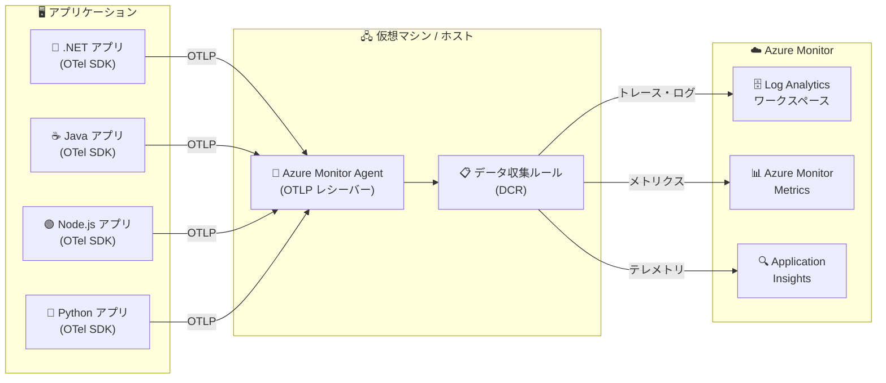

# Azure Monitor: Azure Monitor Agent によるネイティブ OTLP インジェストのサポート

**リリース日**: 2026-04-20

**サービス**: Azure Monitor

**機能**: Azure Monitor Agent (AMA) を使用したネイティブ OpenTelemetry Protocol (OTLP) インジェスト

**ステータス**: In preview

[このアップデートのインフォグラフィックを見る](https://takech9203.github.io/azure-news-summary/20260420-azure-monitor-otlp-ama-ingestion.html)

## 概要

Azure Monitor が OpenTelemetry Protocol (OTLP) シグナルのネイティブインジェストをサポートするようになった。OpenTelemetry で計装されたアプリケーションから、Azure Monitor Agent (AMA) を使用してテレメトリを直接送信し、Azure Monitor にエクスポートすることが可能になる。

これまで OpenTelemetry ベースのテレメトリを Azure Monitor に送信するには、Azure Monitor OpenTelemetry Distro や Azure Monitor Exporter を使用して Application Insights に直接エクスポートする方法が主流であった。今回のアップデートにより、Azure Monitor Agent が OTLP レシーバーとして機能し、アプリケーションから OTLP プロトコルでテレメトリを受信して Azure Monitor に転送する新しいデータ収集パスが追加された。

**アップデート前の課題**

- OpenTelemetry で計装されたアプリケーションから Azure Monitor にテレメトリを送信するには、言語ごとの Azure Monitor OpenTelemetry Distro や Exporter の組み込みが必要であった
- Azure Monitor Agent はゲスト OS のログやパフォーマンスデータの収集が主な役割であり、アプリケーションレベルの OTLP テレメトリを直接受信する機能がなかった
- OTLP プロトコルを使用する標準的な OpenTelemetry SDK からのテレメトリ送信に、Azure 固有のエクスポーターの設定が必要であった

**アップデート後の改善**

- Azure Monitor Agent が OTLP レシーバーとして機能し、アプリケーションから OTLP シグナルを直接受信可能になった
- OpenTelemetry の標準 OTLP エクスポーターを使用して Azure Monitor にテレメトリを送信できるようになった
- インフラストラクチャ監視 (AMA) とアプリケーション監視 (OTLP) を統一的なエージェントで管理できるようになった

## アーキテクチャ図

OpenTelemetry SDK で計装されたアプリケーションが OTLP プロトコルでテレメトリを Azure Monitor Agent に送信し、データ収集ルール (DCR) を通じて Azure Monitor の各宛先に配信されるデータフローを示している。

## サービスアップデートの詳細

### 主要機能

1. **ネイティブ OTLP インジェスト**
   - Azure Monitor Agent が OTLP プロトコルのシグナルを直接受信可能
   - OpenTelemetry 標準の OTLP エクスポーターからのテレメトリ送信に対応

2. **Azure Monitor Agent の OTLP レシーバー機能**
   - AMA がローカルの OTLP エンドポイントとして動作
   - アプリケーションからのトレース、メトリクス、ログの受信をサポート

3. **データ収集ルール (DCR) との統合**
   - 受信した OTLP データは DCR を通じて処理され、変換やフィルタリングが適用可能
   - 宛先の指定 (Log Analytics ワークスペース、Azure Monitor Metrics など) を DCR で一元管理

## 技術仕様

| 項目 | 詳細 |
|------|------|
| プロトコル | OpenTelemetry Protocol (OTLP) |
| シグナルタイプ | トレース、メトリクス、ログ |
| エージェント | Azure Monitor Agent (AMA) |
| データ処理 | データ収集ルール (DCR) による ETL 処理 |
| ステータス | パブリックプレビュー |
| 対応言語 (OTel SDK) | .NET、Java、Node.js、Python 等 |

## メリット

### ビジネス面

- **運用の統合**: インフラストラクチャ監視とアプリケーション監視のエージェントを一元化でき、運用管理コストの削減が期待できる
- **ベンダーロックインの軽減**: OpenTelemetry 標準プロトコルの採用により、特定ベンダーに依存しない計装が可能

### 技術面

- **標準プロトコル対応**: OTLP はベンダーニュートラルな OpenTelemetry 標準プロトコルであり、多様な言語やフレームワークの SDK から利用可能
- **データ収集ルールによる柔軟な処理**: DCR を活用したデータ変換・フィルタリングにより、不要なデータの排除やスキーマ変換が可能
- **既存 AMA インフラの活用**: 既に AMA を導入済みの環境では、追加のエージェント導入なしにアプリケーションテレメトリの収集が可能
- **マルチシグナル対応**: トレース、メトリクス、ログの 3 つのシグナルタイプを統一的に処理

## デメリット・制約事項

- パブリックプレビュー段階のため、SLA の適用外であり、本番環境での利用は慎重な検討が必要
- プレビュー期間中は機能の変更や制限事項の追加がある可能性がある
- Azure Monitor Agent 自体の利用は無料だが、インジェストされたデータの保存・分析には Azure Monitor の料金が発生する

## ユースケース

### ユースケース 1: マルチ言語マイクロサービス環境の統合監視

**シナリオ**: .NET、Java、Node.js、Python で構成されるマイクロサービスアーキテクチャにおいて、各サービスの OpenTelemetry SDK から統一的にテレメトリを Azure Monitor に集約する。

**効果**: 各言語固有の Azure Monitor エクスポーターの設定を個別に管理する必要がなくなり、AMA の OTLP レシーバーに統一することで設定の一貫性が向上する。

### ユースケース 2: VM 上のアプリケーション監視とインフラ監視の統合

**シナリオ**: Azure 仮想マシン上で稼働するアプリケーションにおいて、既に AMA でインフラメトリクスやログを収集している環境に、アプリケーションレベルの OTLP テレメトリ収集を追加する。

**効果**: 単一のエージェントでインフラストラクチャとアプリケーションの両方の監視データを収集でき、エージェント管理の複雑さが軽減される。

### ユースケース 3: OpenTelemetry 標準に準拠した可観測性基盤の構築

**シナリオ**: ベンダーニュートラルな OpenTelemetry 標準に準拠した可観測性基盤を構築し、将来的な監視バックエンドの変更にも柔軟に対応したい場合。

**効果**: アプリケーション側は OTLP 標準エクスポーターのみに依存し、Azure 固有の実装への依存を最小限に抑えることができる。

## 料金

Azure Monitor Agent 自体の利用は無料である。ただし、AMA を通じてインジェストされたデータに対しては、以下の Azure Monitor の標準料金が適用される。

- **Log Analytics ワークスペース**: データインジェスト量に応じた従量課金、またはコミットメントティアによる割引
- **Azure Monitor Metrics**: カスタムメトリクスの取り込みに対する課金

詳細な料金については、[Azure Monitor 料金ページ](https://azure.microsoft.com/pricing/details/monitor/) を参照。

## 利用可能リージョン

Azure Monitor Agent は、すべてのグローバル Azure リージョン、Azure Government、および 21Vianet が運営する Azure で GA 機能として利用可能である。エアギャップクラウドではサポートされていない。本プレビュー機能の利用可能リージョンの詳細については、公式ドキュメントを参照。

## 関連サービス・機能

- **[Application Insights](https://learn.microsoft.com/azure/azure-monitor/app/app-insights-overview)**: OpenTelemetry ベースのアプリケーションパフォーマンス監視 (APM)。Azure Monitor OpenTelemetry Distro を通じた直接的なテレメトリ送信も引き続きサポート
- **[データ収集ルール (DCR)](https://learn.microsoft.com/azure/azure-monitor/essentials/data-collection-rule-overview)**: Azure Monitor のデータ収集における ETL 処理を定義。OTLP データの変換・フィルタリング・ルーティングに使用
- **[Log Analytics ワークスペース](https://learn.microsoft.com/azure/azure-monitor/logs/log-analytics-overview)**: OTLP トレースやログの保存先となるデータストア
- **[Azure Monitor Metrics](https://learn.microsoft.com/azure/azure-monitor/essentials/data-platform-metrics)**: OTLP メトリクスの保存先
- **[OpenTelemetry](https://opentelemetry.io/)**: ベンダーニュートラルな可観測性フレームワーク。トレース、メトリクス、ログの計装・収集・エクスポートの標準を定義
- **[Microsoft Sentinel](https://learn.microsoft.com/azure/sentinel/overview)**: AMA 経由で収集されたデータを活用したセキュリティ分析

## 参考リンク

- [インフォグラフィック](https://takech9203.github.io/azure-news-summary/20260420-azure-monitor-otlp-ama-ingestion.html)
- [公式アップデート情報](https://azure.microsoft.com/updates?id=560530)
- [Microsoft Learn - Azure Monitor Agent 概要](https://learn.microsoft.com/azure/azure-monitor/agents/azure-monitor-agent-overview)
- [Microsoft Learn - Application Insights OpenTelemetry 概要](https://learn.microsoft.com/azure/azure-monitor/app/app-insights-overview)
- [Microsoft Learn - OpenTelemetry の有効化](https://learn.microsoft.com/azure/azure-monitor/app/opentelemetry-enable)
- [Microsoft Learn - OpenTelemetry の構成](https://learn.microsoft.com/azure/azure-monitor/app/opentelemetry-configuration)
- [Microsoft Learn - データ収集ルール (DCR)](https://learn.microsoft.com/azure/azure-monitor/essentials/data-collection-rule-overview)
- [料金ページ - Azure Monitor](https://azure.microsoft.com/pricing/details/monitor/)

## まとめ

今回のパブリックプレビューにより、Azure Monitor Agent が OpenTelemetry Protocol (OTLP) のネイティブインジェストをサポートするようになった。これにより、OpenTelemetry で計装されたアプリケーションから AMA を経由して直接テレメトリを Azure Monitor に送信する新しいデータ収集パスが利用可能になる。

Solutions Architect として注目すべきポイントは、インフラストラクチャ監視とアプリケーション監視のエージェントが統合される方向性と、OpenTelemetry 標準プロトコルへのネイティブ対応によるベンダーニュートラルな可観測性基盤の構築が容易になる点である。

パブリックプレビュー段階のため、まずは開発・検証環境での評価を推奨する。既に AMA を導入済みの環境では、OTLP レシーバー機能の追加による監視統合の可能性を検討することが望ましい。

---

**タグ**: #Azure #AzureMonitor #OpenTelemetry #OTLP #AzureMonitorAgent #Observability #ApplicationInsights #DataCollectionRules
