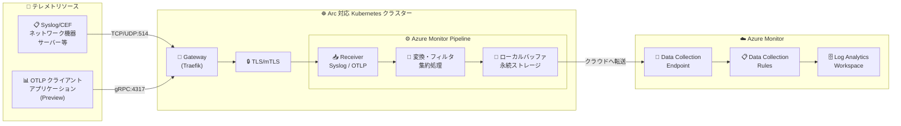

# Azure Monitor Pipeline: 一般提供開始 (GA)

**リリース日**: 2026-04-21

**サービス**: Azure Monitor

**機能**: Azure Monitor pipeline

**ステータス**: Launched (GA)

[このアップデートのインフォグラフィックを見る](https://takech9203.github.io/azure-news-summary/20260421-azure-monitor-pipeline-ga.html)

## 概要

Azure Monitor pipeline が一般提供 (GA) として正式リリースされた。Azure Monitor pipeline は、テレメトリの取り込みと変換のための一元的な制御ポイントを提供し、セキュアかつ高スループットなエンタープライズ規模のシナリオに特化して設計されたソリューションである。オープンソースの OpenTelemetry Collector を基盤として構築されている。

Azure Monitor pipeline は、オンプレミスのデータセンター、エッジロケーション、マルチクラウド環境において、テレメトリデータをクラウドに送信する前にフィルタリング、変換、バッファリング、ルーティングを行うコンテナ化ソリューションである。Arc 対応 Kubernetes クラスター上にデプロイされ、データソースの近くで動作することで、インジェストコストの削減、接続断時の信頼性向上、ハイブリッドおよびマルチクラウド環境全体での一貫したデータ処理を実現する。

2026 年 2 月にパブリックプレビューとしてセキュアインジェスト (TLS/mTLS) やポッド配置制御などの機能が発表されていたが、今回の GA リリースにより本番環境での利用が正式にサポートされ、SLA の対象となった。

**アップデート前の課題**

- 大量のテレメトリデータをクラウドに直接送信する場合、インジェストコストの増大、接続断時のデータ損失リスク、収集データに対する制御の欠如が課題だった
- オンプレミスやエッジ環境からのテレメトリ収集において、一元的なフィルタリングや変換処理を行う公式のソリューションが不足していた
- ネットワーク帯域幅の制約がある環境では、クラウドへの直接送信がボトルネックとなっていた
- 断続的な接続環境において、データ損失を防ぐためのバッファリング機構が限定的だった
- Preview 段階では SLA が提供されず、本番環境での採用に慎重な判断が必要だった

**アップデート後の改善**

- GA リリースにより本番環境での利用が正式にサポートされ、SLA の対象となった
- データソースの近くでフィルタリング・集約を行うことで、クラウドへのインジェスト量とコストを削減可能になった
- 永続ストレージへのローカルバッファリングにより、接続断時のデータ損失を防止し、接続回復時に自動的にバックフィルが実行される
- Syslog および CEF データの自動スキーマ化により、Azure Monitor テーブルへの取り込みが効率化された
- TLS/mTLS によるセキュアなインジェスト、ポッド配置制御、Private Link サポートなど、エンタープライズ向け機能が GA として利用可能になった

## アーキテクチャ図



この図は、Azure Monitor pipeline のデータフローの全体像を示している。オンプレミスやエッジ環境のテレメトリソース (Syslog/CEF、OTLP) から Gateway 経由で TLS/mTLS で暗号化されたデータが Pipeline に到達し、フィルタリング・変換・バッファリングを経て、Azure Monitor の Data Collection Endpoint と Data Collection Rules を通じて Log Analytics Workspace に格納される。

## サービスアップデートの詳細

### 主要機能

1. **一元的なテレメトリ制御ポイント**
   - データソースの近くで稼働し、テレメトリのフィルタリング、集約、変換、ルーティングを一元的に管理
   - クラウドへの送信前にデータを処理することで、インジェスト量とコストを削減

2. **セキュアインジェスト (TLS/mTLS)**
   - TLS およびオプションの mutual TLS (mTLS) によるインジェストエンドポイントの暗号化
   - 信頼されたクライアントのみにインジェストを制限可能
   - Bring Your Own Certificates (BYOC) による企業独自の PKI 証明書の使用をサポート

3. **ローカルバッファリングと耐障害性**
   - 永続ストレージへのローカルバッファリングにより、接続断時のデータ損失を防止
   - 接続回復時に自動的にデータをバックフィル

4. **自動スキーマ化**
   - Syslog および CEF データを Azure Monitor テーブル (`Syslog`、`CommonSecurityLog`) 向けに自動的にスキーマ化
   - ダウンストリームのパース処理の負荷を軽減

5. **ビルトインモニタリング**
   - パイプライン自体の正常性とパフォーマンスのシグナルを公開
   - テレメトリの受信、処理、転送の状態を可視化

6. **ポッド配置制御**
   - Kubernetes ノードへのスケジューリング制御 (constraints、distribution)
   - 特定のノードラベル、アベイラビリティゾーン、インスタンスタイプに基づく配置制約
   - `maxInstancesPerHost` によるノードあたりのインスタンス数制限

7. **Private Link サポート**
   - Azure Monitor Private Link Scope (AMPLS) を介したプライベートエンドポイント接続
   - Data Collection Endpoint (DCE) のパブリックネットワークアクセスを無効化可能

## 技術仕様

| 項目 | 詳細 |
|------|------|
| 対象リソース | Microsoft.Monitor/pipelineGroups |
| デプロイ基盤 | Arc 対応 Kubernetes クラスター |
| 基盤技術 | OpenTelemetry Collector (オープンソース) |
| インジェストモデル | Gateway ベース (集中型) |
| サポートデータソース (GA) | Syslog (RFC 3164 / RFC 5424、TCP/UDP) |
| サポートデータソース (Preview) | OpenTelemetry Protocol (OTLP) |
| Syslog デフォルトポート | TCP/UDP 514 |
| OTLP デフォルトポート | TCP 4317 (gRPC) |
| TLS モード | mutualTls、serverOnly、disabled |
| 証明書管理 | 自動 (cert-manager) または BYOC |
| バッファリング | 永続ストレージへのローカルバッファ |
| 必須拡張機能 | cert-manager (microsoft.certmanagement) |
| 構成方法 | Azure Portal / CLI / ARM テンプレート |

## 設定方法

### 前提条件

1. Azure サブスクリプションで `Microsoft.Insights` および `Microsoft.Monitor` リソースプロバイダーが登録されていること
2. Arc 対応 Kubernetes クラスターが外部 IP アドレスを持ち、カスタムロケーション機能が有効化されていること
3. Log Analytics ワークスペースが作成済みであること

### セットアップフロー

1. **cert-manager 拡張機能のインストール**

```bash
export RESOURCE_GROUP="<resource-group-name>"
export CLUSTER_NAME="<arc-enabled-cluster-name>"
export LOCATION="<arc-enabled-cluster-location>"

az k8s-extension create \
  --resource-group ${RESOURCE_GROUP} \
  --cluster-name ${CLUSTER_NAME} \
  --cluster-type connectedClusters \
  --name "azure-cert-management" \
  --extension-type "microsoft.certmanagement" \
  --release-train stable \
  --config subcharts.zdtrcontroller.enabled=true
```

2. **パイプラインのデプロイ** - Azure Portal (ガイド付き UI) または CLI/ARM テンプレート (高度なシナリオ向け) を使用

3. **オプション構成** - 必要に応じて以下を追加設定:
   - パイプライン変換 (フィルタリング、集約、データ整形)
   - Gateway 構成 (クラスター外部クライアントからのアクセス)
   - TLS/mTLS 構成 (暗号化インジェスト)
   - ポッド配置制御 (パフォーマンス分離、コンプライアンス)
   - Private Link 構成 (プライベートエンドポイント経由の接続)

### 構成方法の選択

| 方法 | 推奨シナリオ | 特徴 |
|------|-------------|------|
| **Azure Portal** | 初期導入、シンプルな構成 | ガイド付き UI、自動コンポーネント作成、ビルトイン検証 |
| **CLI/ARM テンプレート** | 高度なシナリオ、自動化 | 完全な構成制御、永続ボリュームバッファリング、カスタムテーブル、IaC |

### デプロイ検証

パイプラインのデプロイ後、以下の方法で正常稼働を確認できる:

- Azure Portal の Kubernetes サービスメニューで `<pipeline-name>-external-service` と `<pipeline-name>-service` が表示されることを確認
- Log Analytics Workspace の `Heartbeat` テーブルで、パイプラインインスタンスから毎分送信されるハートビートレコードを確認

## メリット

### ビジネス面

- **インジェストコストの削減**: データソースの近くでフィルタリングと集約を行うことで、クラウドへの送信データ量を削減し、Azure Monitor のインジェストコストを最適化
- **本番環境での正式サポート**: GA リリースにより SLA の対象となり、ミッションクリティカルな本番ワークロードでの採用が可能
- **コンプライアンス対応**: TLS/mTLS、BYOC、ポッド配置制御、Private Link により、規制要件やデータ主権要件への対応が容易
- **運用コストの最適化**: 一元的な管理ポイントにより、分散するテレメトリ収集の運用負荷を軽減

### 技術面

- **高スループット処理**: コンテナ化アーキテクチャにより、大量のテレメトリデータを効率的に処理
- **耐障害性の向上**: 永続ストレージへのローカルバッファリングと自動バックフィルにより、ネットワーク障害時のデータ損失を防止
- **OpenTelemetry 互換**: OpenTelemetry エコシステムの技術を基盤としており、ポータビリティとインターオペラビリティを確保
- **柔軟なデプロイモデル**: Arc 対応 Kubernetes クラスターにデプロイされるため、オンプレミス、エッジ、マルチクラウド環境に対応
- **Azure Monitor Agent との補完関係**: AMA はエージェントベースのリソース単位収集、Pipeline は集中型 Gateway ベースの収集と、異なるモデルで相互補完

## デメリット・制約事項

- Arc 対応 Kubernetes クラスターが必須であり、Kubernetes 環境の運用・保守は利用者の責任となる (共有責任モデル)
- サポートされる Kubernetes ディストリビューションが限定的 (VMware Tanzu Kubernetes Grid multicloud v1.28.11、SUSE Rancher K3s v1.33.3+k3s1、AKS Arc v1.32.7)
- OTLP データソースはまだ Preview 段階であり、GA は Syslog/CEF のみ
- 利用可能リージョンが現時点で 6 リージョンに限定されている
- cert-manager 拡張機能のインストールが必須であり、既存の cert-manager インスタンスがある場合は事前にアンインストールが必要 (一時的に証明書ローテーションが停止するリスク)
- BYOC 証明書管理を選択した場合、証明書の更新・ローテーションは利用者側で管理する必要がある

## ユースケース

### ユースケース 1: 帯域幅制約のあるエッジ環境でのテレメトリ収集

**シナリオ**: 帯域幅が限られたリモートサイトやエッジロケーションで、大量のネットワーク機器から Syslog データを収集する必要がある。

**実装例**:

1. エッジロケーションの Arc 対応 Kubernetes クラスターに Azure Monitor pipeline をデプロイ
2. パイプラインの変換機能でデータをフィルタリング・集約し、送信データ量を削減
3. ローカルバッファリングにより接続断時のデータ損失を防止

**効果**: ネットワーク帯域幅の消費を大幅に削減しつつ、高価値なテレメトリデータをクラウドに確実に配信。

### ユースケース 2: セキュリティ要件の高い環境でのログ集約

**シナリオ**: 金融機関や政府機関で、厳格なセキュリティポリシーに準拠した形でオンプレミスのログデータを Azure Monitor に取り込む。

**実装例**:

1. BYOC mTLS 構成で企業 PKI 証明書を使用したセキュアインジェストを設定
2. Private Link を構成し、プライベートエンドポイント経由で Azure Monitor に接続
3. ポッド配置制御でセキュリティゾーン内の専用ノードにパイプラインを配置

**効果**: エンドツーエンドの暗号化とプライベート接続により、規制要件を満たしたセキュアなログ収集パイプラインを実現。

### ユースケース 3: マルチクラウド環境の統合監視

**シナリオ**: Azure、AWS、オンプレミスにまたがるハイブリッド環境で、統一的なテレメトリ収集と分析基盤を構築する。

**実装例**:

1. 各環境の Arc 対応 Kubernetes クラスターに Azure Monitor pipeline をデプロイ
2. OpenTelemetry 対応アプリケーションからの OTLP データと Syslog データを一元的に収集
3. パイプラインで統一的なフォーマットに変換後、Azure Monitor に送信

**効果**: 環境をまたいだ一元的な監視基盤を実現し、運用の可視性とインシデント対応の効率を向上。

## 料金

Azure Monitor pipeline 自体の追加料金は発表されていない。Azure Monitor の標準的な料金体系に従い、主に以下の項目で課金される。

| 項目 | 説明 |
|------|------|
| データインジェスト | Log Analytics Workspace へのデータ取り込み量 (GB 単位) に応じた課金 |
| データ保持 | Analytics Logs: 31/90 日の保持を含む (最大 12 年まで延長可能) |
| ログ処理 | 基本/分析ログテーブルでのフィルタリングに応じた課金 |
| クエリ | Basic/Auxiliary Logs はスキャンデータ量に応じた課金 |

無料枠: 最初の 5 GB/月 (Analytics ティア、課金アカウントあたり) は無料。

最新の料金は [Azure Monitor 料金ページ](https://azure.microsoft.com/pricing/details/monitor/) を参照。

## 利用可能リージョン

| リージョン |
|------------|
| Canada Central |
| East US |
| East US 2 |
| Italy North |
| West US 2 |
| West Europe |

最新のリージョン対応状況は [Azure リージョン別利用可能サービス](https://azure.microsoft.com/explore/global-infrastructure/products-by-region/table) を参照。

## 関連サービス・機能

- **Azure Monitor Agent (AMA)**: エージェントベースのリソース単位テレメトリ収集。Pipeline と補完関係にあり、AMA はリソースごとの収集、Pipeline は集中型 Gateway ベースの収集を担当
- **Azure Arc 対応 Kubernetes**: パイプラインのデプロイ基盤。オンプレミスやマルチクラウドの Kubernetes クラスターを Azure と統合管理
- **Data Collection Rules (DCR)**: Azure Monitor のデータ収集構成ルール。パイプラインから送信されたデータの処理方法と保存先を定義
- **Data Collection Endpoint (DCE)**: パイプラインからのデータ取り込みエンドポイント。Private Link との連携によるプライベート接続をサポート
- **Log Analytics Workspace**: パイプラインから収集されたデータの最終的な保存先。KQL によるクエリ分析が可能
- **OpenTelemetry**: パイプラインの基盤技術。OTLP プロトコルによるテレメトリデータの標準化された収集と転送
- **cert-manager (Azure Arc 拡張機能)**: パイプラインの TLS 証明書管理基盤。自動証明書ライフサイクル管理を提供
- **Azure Key Vault**: BYOC 構成における証明書の安全な保管場所。Secret Store Extension 経由で Kubernetes Secret と自動同期
- **Azure Private Link / AMPLS**: パイプラインから Azure Monitor へのプライベートネットワーク接続を実現

## 参考リンク

- [インフォグラフィック](https://takech9203.github.io/azure-news-summary/20260421-azure-monitor-pipeline-ga.html)
- [公式アップデート情報](https://azure.microsoft.com/updates?id=559886)
- [Microsoft Learn - Azure Monitor pipeline overview](https://learn.microsoft.com/en-us/azure/azure-monitor/data-collection/pipeline-overview)
- [Microsoft Learn - Configure Azure Monitor pipeline](https://learn.microsoft.com/en-us/azure/azure-monitor/data-collection/pipeline-configure)
- [Microsoft Learn - Azure Monitor pipeline TLS configuration](https://learn.microsoft.com/en-us/azure/azure-monitor/data-collection/pipeline-tls)
- [Microsoft Learn - Azure Monitor pipeline pod placement](https://learn.microsoft.com/en-us/azure/azure-monitor/data-collection/pipeline-pod-placement)
- [Microsoft Learn - Gateway for Kubernetes deployment](https://learn.microsoft.com/en-us/azure/azure-monitor/data-collection/pipeline-kubernetes-gateway)
- [Microsoft Learn - Data Collection Rules overview](https://learn.microsoft.com/en-us/azure/azure-monitor/data-collection/data-collection-rule-overview)
- [料金ページ](https://azure.microsoft.com/pricing/details/monitor/)
- [Preview 時のレポート (セキュアインジェストとポッド配置)](reports/2026/2026-02-26-azure-monitor-pipeline-secure-ingestion.md)

## まとめ

Azure Monitor pipeline の GA リリースは、エンタープライズ環境におけるハイブリッドおよびマルチクラウドのテレメトリ収集に対する本格的なソリューションの到来を意味する。OpenTelemetry Collector を基盤とした Gateway ベースのアーキテクチャにより、データソースの近くでフィルタリング・変換・バッファリングを行い、インジェストコストの削減、接続断時の耐障害性、セキュアなデータ転送を実現する。

Preview 段階から強化されてきた TLS/mTLS、BYOC、ポッド配置制御、Private Link サポートが GA として正式に利用可能となり、ミッションクリティカルな本番環境での採用が可能になった。

Solutions Architect への推奨アクション:

1. **GA 移行の評価**: Preview 環境で検証済みの場合は、GA への移行計画を策定する。新規の場合は Azure Portal のガイド付き UI から開始することを推奨
2. **コスト最適化の検討**: 現在のテレメトリインジェスト量とコストを評価し、パイプラインによるフィルタリング・集約でどの程度削減可能かを試算する
3. **セキュリティ要件の確認**: TLS/mTLS、BYOC、Private Link の要否を判断し、適切なセキュリティ構成を設計する
4. **リージョンの確認**: 現在サポートされている 6 リージョンを確認し、デプロイ先の選定を行う
5. **Kubernetes 環境の準備**: サポートされる Kubernetes ディストリビューション (VMware TKGm、K3s、AKS Arc) と Arc 接続の準備状況を確認する

---

**タグ**: #AzureMonitor #AzureMonitorPipeline #GA #OpenTelemetry #Syslog #Kubernetes #AzureArc #テレメトリ #ハイブリッドクラウド #マルチクラウド #DevOps #管理とガバナンス
