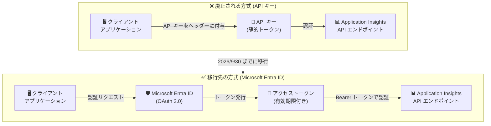

# Azure Monitor: Application Insights API キーの廃止と Microsoft Entra ID への移行

**リリース日**: 2026-04-21

**サービス**: Azure Monitor / Application Insights

**機能**: Application Insights データクエリ用 API キーの廃止と Microsoft Entra ID (旧 Azure AD) 認証への移行

**ステータス**: Retirement (廃止予定: 2026 年 9 月 30 日)

[このアップデートのインフォグラフィックを見る](https://takech9203.github.io/azure-news-summary/20260421-monitor-application-insights-entra-id-retirement.html)

## 概要

Application Insights のデータクエリに使用される API キーが 2026 年 9 月 30 日に廃止される。当初は 2026 年 3 月 31 日に廃止予定であったが、廃止日が 2026 年 9 月 30 日まで延長された。廃止後は、Application Insights のデータをクエリするために Microsoft Entra ID (旧 Azure Active Directory) による認証が必要となる。

API キーはシンプルな認証メカニズムとして広く利用されてきたが、キーの漏洩リスクやきめ細かなアクセス制御の困難さなどのセキュリティ上の課題があった。Microsoft Entra ID 認証への移行により、マネージド ID やサービスプリンシパルを活用したよりセキュアな認証モデルが標準となる。

**アップデート前の課題**

- API キーは静的な資格情報であり、キーの漏洩や不正利用のリスクが存在した
- API キーではきめ細かなアクセス制御 (RBAC) が困難であった
- API キーのローテーション管理が運用上の負担となっていた
- 複数の認証メカニズム (API キーと Entra ID) が混在し、セキュリティポリシーの統一が困難であった

**アップデート後の改善**

- Microsoft Entra ID による統一的な認証・認可基盤の利用が標準化される
- マネージド ID を使用することで、資格情報の管理が不要になる
- Azure RBAC による詳細なアクセス制御が可能になる
- 条件付きアクセスポリシーなど、Entra ID の高度なセキュリティ機能を活用できる

## アーキテクチャ図



上図は、API キーによる認証方式 (廃止予定) から Microsoft Entra ID による OAuth 2.0 認証方式への移行を示している。Entra ID 方式では、有効期限付きのアクセストークンを使用し、RBAC によるきめ細かなアクセス制御が可能になる。

## サービスアップデートの詳細

### 主要な変更点

1. **API キーの廃止**
   - 2026 年 9 月 30 日以降、Application Insights のデータクエリに API キーを使用することができなくなる
   - 当初の廃止日 (2026 年 3 月 31 日) から半年間延長された

2. **Microsoft Entra ID 認証への移行**
   - Application Insights API (`https://api.applicationinsights.io`) へのクエリリクエストに Microsoft Entra ID による OAuth 2.0 認証が必須となる
   - クライアント資格情報フロー、認可コードフロー、暗黙的フローの 3 つの OAuth 2.0 フローがサポートされる

3. **サポートされる認証方式**
   - マネージド ID (システム割り当て / ユーザー割り当て): 推奨
   - サービスプリンシパル: カスタムアプリケーション向け
   - Azure ユーザーアカウント: 対話型アクセス向け

## 技術仕様

| 項目 | 詳細 |
|------|------|
| 廃止対象 | Application Insights データクエリ用 API キー |
| 廃止日 | 2026 年 9 月 30 日 (当初 2026 年 3 月 31 日から延長) |
| 移行先 | Microsoft Entra ID (旧 Azure AD) 認証 |
| API エンドポイント | `https://api.applicationinsights.io` |
| 認証プロトコル | OAuth 2.0 |
| サポートされるフロー | クライアント資格情報、認可コード、暗黙的フロー |
| 必要な RBAC ロール | Reader ロール (Application Insights リソーススコープ) |
| API アクセス許可 | Application Insights API - Data.Read (委任されたアクセス許可) |

## 設定方法

### 前提条件

1. Microsoft Entra ID テナントへのアクセス
2. Application Insights リソースの所有者または共同作成者ロール
3. アプリケーション登録の権限 (Microsoft Entra ID)

### Microsoft Entra ID 認証の設定手順

**手順 1: アプリケーションの登録**

Microsoft Entra ID にクライアントアプリケーションを登録し、Application Insights API へのアクセス許可を構成する。

1. Microsoft Entra ID でアプリを登録する
2. API のアクセス許可で「Application Insights API」を追加する
3. 委任されたアクセス許可「Data.Read」を選択する

**手順 2: RBAC ロールの割り当て**

Application Insights リソースの「アクセス制御 (IAM)」から、登録したアプリケーションに「Reader」ロールを割り当てる。

**手順 3: アクセストークンの取得 (クライアント資格情報フロー)**

```bash
# Microsoft Entra ID からアクセストークンを取得
curl -X POST "https://login.microsoftonline.com/<テナントID>/oauth2/token" \
  -H "Content-Type: application/x-www-form-urlencoded" \
  -d "grant_type=client_credentials" \
  -d "client_id=<クライアントID>" \
  -d "client_secret=<クライアントシークレット>" \
  -d "resource=https://api.applicationinsights.io"
```

**手順 4: Application Insights API の呼び出し**

```bash
# Bearer トークンを使用して Application Insights にクエリを実行
curl -X POST "https://api.applicationinsights.io/v1/apps/<アプリID>/query?timespan=P1D" \
  -H "Content-Type: application/json" \
  -H "Authorization: Bearer <アクセストークン>" \
  -d '{"query": "requests | take 10"}'
```

### テレメトリインジェストでの Entra ID 認証

テレメトリの送信 (インジェスト) においても、Entra ID 認証を利用することが推奨される。環境変数による設定が可能である。

```bash
# システム割り当てマネージド ID の場合
export APPLICATIONINSIGHTS_AUTHENTICATION_STRING="Authorization=AAD"

# ユーザー割り当てマネージド ID の場合
export APPLICATIONINSIGHTS_AUTHENTICATION_STRING="Authorization=AAD;ClientId=<マネージドIDのクライアントID>"
```

### Azure Portal

1. Application Insights リソースを開く
2. 「構成」セクションの「プロパティ」を選択
3. 「ローカル認証」のステータスを確認
4. Entra ID 認証への移行完了後、ローカル認証を「無効」に設定することを推奨

## メリット

### ビジネス面

- **コンプライアンス向上**: Microsoft Entra ID による一元的な認証管理により、組織のセキュリティポリシーへの準拠が容易になる
- **運用負荷軽減**: マネージド ID を使用することで、API キーのローテーション管理が不要になる
- **監査証跡**: Entra ID のサインインログにより、API アクセスの詳細な監査が可能になる

### 技術面

- **RBAC 統合**: Azure の標準的なロールベースアクセス制御と統合され、詳細なアクセス制御が可能になる
- **トークンの有効期限**: 静的な API キーと異なり、アクセストークンに有効期限があるためセキュリティが向上する
- **条件付きアクセス**: Entra ID の条件付きアクセスポリシーを適用し、IP 制限や多要素認証などの追加セキュリティ制御が可能
- **マネージド ID サポート**: Azure リソースからのアクセスにマネージド ID を使用することで、資格情報のハードコーディングが不要になる

## デメリット・制約事項

- 移行作業が必要であり、特に API キーを多数使用している環境では影響範囲の調査と移行計画の策定に時間がかかる
- Application Insights JavaScript Web SDK は Microsoft Entra ID 認証をサポートしていない
- Application Insights Java 2.x SDK は Entra ID 認証をサポートしておらず、Java Agent 3.2.0 以上が必要
- GraalVM ネイティブアプリケーションでは Entra ID 認証が利用できない
- Python の Azure App Service 自動インストルメンテーションでは Entra ID 認証がサポートされていない

## ユースケース

### ユースケース 1: 自動化パイプラインでの API クエリ移行

**シナリオ**: CI/CD パイプラインや運用自動化スクリプトで Application Insights API キーを使用してデータをクエリしている場合。

**対応方法**: サービスプリンシパルを作成し、クライアント資格情報フローでアクセストークンを取得する方式に移行する。Azure DevOps や GitHub Actions のシークレットにクライアント ID とシークレットを格納する。

**効果**: API キーの静的な資格情報管理から、OAuth 2.0 ベースの動的なトークン管理に移行でき、セキュリティが向上する。

### ユースケース 2: Azure 上のアプリケーションからのクエリ

**シナリオ**: Azure VM、App Service、Functions などで稼働するアプリケーションから Application Insights のデータをクエリしている場合。

**対応方法**: マネージド ID (システム割り当て) を有効化し、`DefaultAzureCredential` を使用して認証する。資格情報の明示的な管理が不要になる。

**効果**: マネージド ID により資格情報の管理が完全に不要になり、最もセキュアな構成が実現できる。

## 関連サービス・機能

- **[Microsoft Entra ID](https://learn.microsoft.com/azure/active-directory/)**: Azure のクラウドベースの ID およびアクセス管理サービス。移行先の認証基盤
- **[Azure Monitor](https://learn.microsoft.com/azure/azure-monitor/)**: Application Insights の親サービス。可観測性プラットフォーム全体
- **[Application Insights](https://learn.microsoft.com/azure/azure-monitor/app/app-insights-overview)**: アプリケーションパフォーマンス監視 (APM) サービス。本廃止の直接的な対象
- **[Azure RBAC](https://learn.microsoft.com/azure/role-based-access-control/)**: ロールベースのアクセス制御。Entra ID 認証と組み合わせて利用
- **[マネージド ID](https://learn.microsoft.com/azure/active-directory/managed-identities-azure-resources/)**: Azure リソースに自動的にマネージド ID を提供するサービス。推奨される認証方式

## 参考リンク

- [インフォグラフィック](https://takech9203.github.io/azure-news-summary/20260421-monitor-application-insights-entra-id-retirement.html)
- [公式アップデート情報](https://azure.microsoft.com/updates?id=transition-to-azure-ad-to-query-data-from-azure-monitor-application-insights-by-31-march-2026)
- [Microsoft Learn - Application Insights の Microsoft Entra 認証](https://learn.microsoft.com/azure/azure-monitor/app/azure-ad-authentication)
- [Microsoft Learn - Application Insights 概要](https://learn.microsoft.com/azure/azure-monitor/app/app-insights-overview)
- [Microsoft Learn - Azure Monitor ログ API のアプリ登録](https://learn.microsoft.com/azure/azure-monitor/logs/api/register-app-for-token)
- [Microsoft Learn - マネージド ID の概要](https://learn.microsoft.com/azure/active-directory/managed-identities-azure-resources/overview)

## まとめ

Application Insights のデータクエリ用 API キーが 2026 年 9 月 30 日に廃止される。当初の廃止日 (2026 年 3 月 31 日) から半年間の延長が行われたが、早期の移行が推奨される。

Solutions Architect として推奨されるアクションは以下の通りである。

1. **影響範囲の調査**: 自組織で Application Insights API キーを使用しているアプリケーション、スクリプト、自動化パイプラインを洗い出す
2. **移行計画の策定**: 各利用箇所について、マネージド ID (Azure 上のリソースの場合) またはサービスプリンシパル (外部アプリケーションの場合) への移行計画を策定する
3. **段階的移行の実施**: 開発/検証環境から順次 Entra ID 認証への移行を実施し、動作確認を行う
4. **ローカル認証の無効化**: 移行完了後、Application Insights リソースのローカル認証を無効化し、Entra ID 認証のみに制限する

廃止日まで約 5 か月の猶予があるが、影響範囲が広い場合は早期着手が望ましい。

---

**タグ**: #Azure #AzureMonitor #ApplicationInsights #EntraID #APIKey #Retirement #Security #Authentication #RBAC #ManagedIdentity
